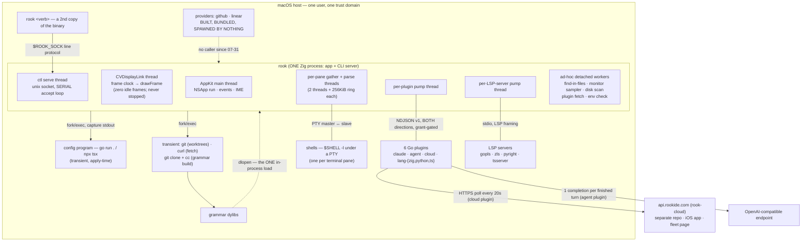

# 00 — Executive Summary

**Rook deep analysis.** Repository: `/Users/sethlowie/go/src/github.com/incantery/rook`, branch
`main`, baseline **HEAD `9ad05f3`** ("session: the pty is drained while the parser parses",
2026-08-07 21:49), working tree clean. Written 2026-08-07/08 from nine detailed documents in this
directory, each of which was itself verified against source. Every headline number in this summary
was re-checked at the baseline commit.

Evidence labels used throughout the package, and here: **Implemented**, **Partially implemented**,
**Scaffolded/prototyped**, **Documented only (not implemented)**, **Obsolete/dead**, **Unclear**,
**Inference**.

**Read this warning before anything else.** The repository's own documentation — `README.md`,
`STATUS.md`, `app/README.md`, `app/PARITY.md`, `docs/agent/*`, `docs/environments/*`,
`docs/plugins/*` — is extensive, articulate, and substantially **aspirational or stale**. It
describes deleted subsystems in the present tense and omits shipped ones. Nothing in this package
took a repo doc as evidence of behavior. Neither should you.

---

## 1. What Rook actually is, today

**Rook is a single native macOS binary — one Zig process, ~50,353 lines in `app/src/` — that is at
the same time a GPU-rendered terminal emulator, a tmux-shaped multiplexer, a vim editor with an
LSP client, and its own command-line interface.** There is no daemon, no server, no detach, and no
persistence of any kind. You launch it, you get a window with a login shell in a pane; you split
and tab and switch "spaces"; you `rook edit foo.go` (or `:e`) and the pane becomes a vim buffer
with tree-sitter highlighting, diagnostics, `gd`/`K`/`gr`/`gR`, completion, and format-on-save;
you press ⌘Q and every shell in every space dies with it.

The four things a user can actually do with it that they cannot do with any other program:

1. **Run a terminal that is measurably fast, and prove it in-app.** Key→photon latency is
   instrumented end to end (kernel `NSEvent` timestamp → `CAMetalDrawable.presentedTime`) and
   readable live. Self-reported on the author's M3 Max: 15.5/26.4 ms p50/p95 windowed, 8.5/14.4 ms
   fullscreen (direct scan-out), zero frames drawn at idle, and `cat` of a 150 MB file in
   0.517–0.557 s after the `9ad05f3` pipeline (−45 %). All numbers are the repo's own instrument
   on one machine; none are third-party verified (provenance table in **02 §16**).
2. **Drive the entire application blind, over a unix socket.** `~52` text verbs on `$ROOK_SOCK` —
   `dump` (emulator grid as text), `shot` (a PNG read back from rook's *own* Metal drawable — no
   screen-recording permission, works occluded), `type`/`key`/`press`/`nskey`/`click`, `split`,
   `run <command-id>`, `activity`, `env apply`. The CLI carries **no verb table**: `rook <anything>`
   is a second copy of the same binary shipping argv as one line to the socket (**01 §4.1**).
3. **Let agents watch and be watched.** Per-pane kernel-truth telemetry — output *byte rate*,
   human-keystroke recency (physical `NSEvent`s only; an agent typing does not count), foreground
   process name **and exec path**, cwd from `proc_pidinfo` — is exported to out-of-process plugins,
   which fuse it with Claude Code's own transcript files to derive a four-state agent model
   (`needs you` / `blocked?` / `working` / `idle`). Answers can arrive from a phone and be typed
   into a Claude pane, gated by policy the plugin cannot bypass (**04 §2–§6**).
4. **Configure it by writing a program.** `~/.config/rook/main.go` (or `config.ts`) is compiled and
   run by rook, its emitted environment-graph JSON diffed by node id against the applied graph, and
   **nothing lands until a human confirms in a preview panel** (**03 §8.4**). A TOML front end
   survives for the no-SDK case but is frozen at the pre-graph option set.

What it is **not**, and this is the single most important correction to any impression formed from
the repo's docs: it is **not a session manager**. Sessions, layout, scrollback, editor undo, and
open-buffer lists all die with the process. `STATUS.md` calls this an accepted regression and the
code agrees: the last space closing calls `_exit(0)` (`macos.zig:5170`). "Run everything from your
phone" is capped at "while the Mac app is open" (**02 §10**, **06 Thesis A/F**).

Scale and provenance, for calibration: **668 commits, all between 2026-07-11 and 2026-08-07 — the
entire project is 27 days old.** One primary author (665 commits) plus one contributor (3);
**618 of 668 commits carry a `Co-Authored-By: Claude` trailer**. Three complete architecture
generations have already shipped and been deleted (Wails/Go/Svelte webview → Go host + Zig frontend
→ one Zig binary). Latest tag v0.43.0 (08-04); the last three days of work are untagged on main.

---

## 2. The architecture in one page

One process owns everything on screen. Everything extensible is a **subprocess** — plugins, LSP
servers, the config emitter, even the HTTPS fetch (a forked `curl`, "not an HTTP client compiled
into rook"). The single exception is tree-sitter grammar tables, which are `dlopen`ed because
parsing runs on the frame budget — and that exception is where the security asymmetry lives (§6).

**Four IPC surfaces, two versioning philosophies** (**01 §4**, **03 §4**). The ctl socket is
*unversioned text* ("the server answers or it doesn't"). Plugin and provider frames are NDJSON v1
that **refuse on version mismatch**. The environment graph **fails open** — unknown kinds, keys and
types are silently skipped. The asymmetry is doctrine, written at three sites with the same
rationale: an old app must survive a new config graph, but "acting on a misread frame would ACT."

**Render loop.** A CVDisplayLink tick drives `drawFrame`; a frame with no dirty pane returns before
touching Metal. All panes — terminal, editor, and the monitor — fill one shared GPU cell buffer
(16 bytes/cell) drawn by three pipeline states; chrome, completion cards and the palette are "just
more instanced cells and rects," which is why the e2e harness can see pop-ups as text. Keystroke
echo bypasses the frame clock: the *parse thread* draws immediately when the focused pane has a
pending typed key. Firehose output stays coalesced to display pace (**02 §11–§14**).

**Concurrency.** One global `draw_lock` (`os_unfair_lock`) serializes the scene; per-session
terminal state has its own lock; order is `draw_lock` → session mutex. The pervasive pattern is
"queue under lock, drain after release." Zig 0.16 retired `std.Thread`'s Mutex/Condition, so the
app hand-rolls three sync vocabularies (an unfair-lock wrapper with a measured starvation fix, GCD
semaphores, bare atomics + self-pipes), each correct-by-comment (**05 §3.3**).

Full treatments: processes/threads/IPC/ownership in **01**; terminal, renderer and editor in **02**;
extension seams and threat model in **03**; the agent and cloud layer in **04**; file-by-file
navigation in **08**.

---

## 3. The most important findings

1. **The strip is the story.** On 2026-07-31, in 3.5 hours and 15 commits, the author deleted the Go
   core, the review/threads stack (*ported to Zig 48 hours earlier*), the signed "edge" cloud
   protocol, the mailbox/relay ask system, and 940,964 lines of generated grammar C. The deletion
   commit for the daemon records that it was found **already unused** — "spawned, health-checked,
   and killed, without one call in between." Everything built since (agent membrane, phone bridge,
   the entire language catalog) landed as **plugin ops rather than core code**, in about six days.
   The plugin protocol is the strip's payoff (**05 §5.1**, **03 §1**).
2. **"Agent" is deliberately not a type.** There is no `Agent` struct anywhere in `app/src`. The
   core provides an agent-*legible* substrate — three atomic counters and two syscalls per pane —
   and everything agent-shaped is assembled out-of-process from files Claude Code writes for its own
   purposes. There is **no integration API with Claude Code at all**: no MCP, no ACP, no
   stream-json. Even `/compact` and `--resume` from the phone are delivered as *typed keystrokes*
   (**04 §1, §2d**).
3. **`session.send` is the sharpest piece of security reasoning in the codebase, and it is a
   hardcoded product policy.** Before typing into a pane, rook reads that pane's foreground process
   from the kernel and refuses unless it is literally `claude` by basename or path — `node` is
   deliberately insufficient, "a REPL eats typed text as code too" — and refuses again if a human
   typed there within 5 seconds. Verified at `macos.zig:7505`. Consequence: **supporting a second
   agent TUI requires an app release, not a config change** (**04 §4**, **07 Fork 3**).
4. **Persistence is absent at every layer simultaneously, and it is the load-bearing gap.** No
   session restore, no detach, no layout save, no persistent undo, no buffer-list restore, no crash
   capture. This is the missing tmux primitive, the cap on the phone story, the precondition for any
   "runtime not IDE" future, and the difference between agent work surviving and dying with the
   window. Every thesis in **06** converges on it; it is Fork 1 in **07**.
5. **The grant model is consent bookkeeping, not a sandbox — and the code says so out loud.** Plugin
   children inherit rook's full environment including `ROOK_SOCK`, so a plugin denied
   `session.spawn` can simply connect to the ctl socket and type. `session.spawn`'s own comment
   concedes the point. Coherent at six first-party plugins; the single biggest gap the day a
   third-party plugin ships (**03 §8.3**).
6. **The measurement culture is real and has teeth.** Two "obvious wins" were implemented,
   A/B-measured, and **reverted against their own data** (a ProMotion continuous-present hold at
   +8.6 ms p50; an earlier faster parser that slowed the app via wake-per-KB). The bench harness
   detects its own invalidity — macOS throttles occluded windows to 10 Hz, so each latency phase
   flags itself invalid if its numbers quantize to the throttle clock (**02 §15–§16**, **05 §4.7**).
7. **The one guard designed as automation is the one that failed.** `scripts/gen-cmds.sh` generates
   typed command constants from `registry.zig` so that a config naming a dead command fails to
   compile. Both `Makefile:97` and the script header advertise a CI check; **`ci.yml` never runs
   it**, and it has drifted: 29 canonical registry ids vs 27 SDK constants — `editor.format` and
   `monitor.open` cannot be named from a Go config. Verified live. This is the exact failure the
   generator exists to prevent, inverted (**05 §1.5**, **07 Fork 9**, **09 §2.1**).
8. **A whole protocol tier is orphaned.** `sdk/provider` is a published, versioned, zero-dependency
   Go module; `providers/{github,linear}` build, are tested, have an import boundary enforced by a
   `go list -deps` test, and are staged into the shipped app bundle — and **nothing in `app/src`
   spawns them** (verified: zero references). Their caller died with `rookctl` on 07-31.
   `docs/OWED.md` §1 defers the fix as "a decision, not a port" (**03 §3**, **07 Fork 2**).
9. **Docs lag code in the conservative direction.** `STATUS.md` says v0.40.0 and "no grammars" while
   tags reach v0.43.0 and `grammar.zig` ships a full dlopen loader with ABI gating; `VOCABULARY.md`
   says "design, nothing implemented" above its own dated landing notes; `app/README.md` documents
   five deleted files in the present tense. Understating is the safe polarity — but no status page
   in this repo can be trusted without reading code (**05 §3.5**, **08 §12**).
10. **The live roadmap is gitignored and is being executed within hours.** `TODO.md` (untracked)
    drove both of the two most recent commits: the security-motivated ghostty-vt pin bump landed
    within the hour of being written, and the IO pipeline the same evening (**09 §1.1**, **05 §6**).

---

## 4. The strongest architectural decisions

Named specifically, with credit where the design is unusually good.

- **The CLI with no verb table** (`main.zig:390–450`). `rook <anything>` ships argv as one text line
  to the socket; the client cannot drift from the server because it knows nothing. Combined with
  `--config=DIR` — which makes config, applied graph, socket, and plugin cache one deletable
  directory, with `ROOK_SOCK` inherited by child shells — this is a complete multi-instance story
  that cost one flag (**01 §9**, **06 emergent #3**).
- **Teardown correctness as a studied problem** (`pty.zig`). Two process groups are captured per pty
  while the master is open — the shell's, *and* `tcgetpgrp(master)`, because a foreground job under
  job control lives in its own group and never sees a signal to the shell's. Then SIGHUP → 100 ms →
  SIGTERM → SIGKILL. The comments cite Zed shipping this orphan **twice** (zed#47412, #61467). The
  tests spawn real `trap '' HUP` shells on real ptys with a vacuity guard, because "no mock can fail
  the way the kernel does" (**02 §3**).
- **The three-way trust model, rendered and never reconciled away.** Config says a plugin *exists*;
  config grants say what it *may* do; `describe.capabilities` says what it *wants*. `ctl plugins`
  prints all three as separate facts. Grants are enforced in both directions in one file — outbound
  refusals happen *before the plugin is told*, inbound refusals *name the missing grant*, and the
  raw ctl passthrough door duplicates the check. Attention provenance is **server-assigned from the
  declaration, never accepted from params** — "a plugin that could name someone else as the source
  of an interruption is a plugin that can blame someone else for it" (**03 §2.1, §2.5**).
- **Binary provenance with ergonomics.** Scheme allowlist (`https://`/`file://` only) enforced
  *before* curl runs; download to `.part` then atomic rename; sha256 pin **or** trust-on-first-use
  sidecar re-verified on *every* launch; a mismatch refuses and **never re-downloads**. And the part
  nobody else does: the plugin panel's `y` key copies a ready-to-paste *pinned declaration in
  whichever language your config is written in* — "'here is the information, you do the rest' …
  means nobody does the rest" (**03 §2.6**).
- **Zoom as a zero rect, and `under`-parking.** Zoom sets a flag and gives every other pane a
  zero-size rect; draw, hit-test, and resize already read zero as "nothing here," so unzoom is exact
  *by construction* rather than by restoration code. `Pane.under` parks a running shell while an
  editor takes the pane over; `:q` restores it. Both mechanisms were reused unchanged by a third
  content kind (the monitor) at **zero new render code** (**02 §7**).
- **Dot-repeat recorded by result, not by key table.** Keys accumulate and are promoted to `.` only
  if `buf.version` moved when the machine goes quiescent — which eliminates the "which keys are
  changes" list every vim emulator maintains and gets wrong (**02 §19**).
- **Files as interfaces, with one idiom.** Three jsonl logs (transcripts in, digests through,
  deliveries through), all last-line-per-id-wins, tombstoned, torn-tail-tolerant, compacted by
  rename. No sockets between plugins. And the delivery invariant that makes it safe: **journal
  before ack** — "a lost ack must re-ack, never re-type" (**04 §3d, §6f**).
- **The ask rail is content-addressed, so staleness is structural.** `askID = sessionID + hash(last
  assistant text)`; delivery re-derives it from the current scan. If you answered at the desk, the
  ask text changed, and the phone's answer is invalidated *by construction* with zero coordination
  state (**04 §6e**).
- **Two kinds of truth in verification.** `dump` (what the emulator grid holds) and `shot` (a PNG of
  rook's own drawable, decoded with ImageIO and asserted pixel-wise). The harness header records why
  both exist: "the atlas-flip bug was invisible to the first and obvious in the second." The
  standing convention since the socket's birth commit — "eyes for the agent" — is that no feature is
  done until it is assertable blind (**05 §1.2**).
- **Failure-carrying comments at the code that would regress them.** The CoreVideo deadlock
  (diagnosed from a `sample` of a hung instance), the CTLine text-matrix leak, the MSL/Zig alignment
  trap, the GCD semaphore that traps if released below its creation value, the reverted ProMotion
  verdict kept inline at the skip branch. This is the repo's most transferable habit.
- **Competitor bug-mining as a hardening method.** Reading Zed's tracker produced eight live rook
  fixes in one commit (`9467cc3`); ghostty's PR #13209 supplied the read-pipeline constants, carried
  with attribution rather than re-derived (**02 §24**, **05 §5.1**).

---

## 5. The biggest weaknesses

- **`macos.zig`: 9,566 lines, one `App` struct with ~90 fields, 133 commits, zero tests.** It is
  view *and* controller for every feature, owns ~10 hand-rolled detached-thread job patterns, and
  every new feature lands as another `plug_*`/`env_*` field family. Churn and coverage are exactly
  inverted against `editor.zig` (14,159 lines, 71 commits, **306 tests**, 41 % of the file). The
  editor's monolith is defended by test density; this one is not, and failures inside it attribute
  worst of anything in the repo (**05 §3.1**, **09 §12.2**).
- **No persistence anywhere** — sessions, layout, scrollback, undo, buffer lists. For a
  daily-driven tool with a `make install` + relaunch loop, this is a recurring real cost, and it
  contradicts the product direction rather than merely lagging it (**02 §10, §23**).
- **The frame loop is becoming the app's event loop, under one lock.** `drawFrame` opens with
  `reapExitedLocked → drainClipboard → drainSearch → reconcileViews → drainLsp → lspTick`, all under
  `draw_lock` at up to 120 Hz — and the ~1 Hz HUD tick does **file IO on the frame path** (a `stat`
  per open editor pane, config hashing). A hung network filesystem stalls all rendering *and* input
  routing. The display link never stops, so idle costs 120 wakeups/s of lock-take (idle *frames* are
  zero and measured; idle *power* is unmeasured) (**02 §17**, **07 Fork 5**).
- **Two hand-kept config decoders.** `loadToml` and `applyEnvOption` are parallel switches over the
  same option vocabulary, with the graph *replacing* TOML wholesale when present — so a key missing
  from one is silently ignored, not defaulted. Three same-class silent-failure incidents in one
  week, including one mistyped field type that disabled the entire config graph for any config
  containing a plugin (**07 Fork 4**, **09 §8.1**).
- **The verification story stops at the machine's edge.** e2e cannot run in CI (needs a window
  server, Metal, real shells) — CI compiles it only. TS SDK tests run nowhere automatically and
  their documented invocation is broken on current Node. Benchmarks are manual by explicit choice,
  so a perf regression merges silently. The differential VT conformance oracle was deleted with the
  Go core and nothing replaced it; rook's *integration* with ghostty-vt (wrap, reflow, scrollback,
  modes) has ~3 e2e scenarios and no oracle (**05 §1.3, §1.8, §3.4**).
- **Flagship-feature coverage inversion.** The 08-06 flagship — runtime tree-sitter grammars — is
  `syntax.zig` 324 lines / **0 tests**, `grammar.zig` 637 lines / 5 tests, and **no e2e scenario at
  all**. The fetch/build/dlopen/ABI-gate path is unexercised by the suite (**05 §2.2**).
- **Plugin operability.** A plugin that fails once **stays failed until rook relaunches** — no
  restart verb, no apply-clears-failure. For the eager cloud bridge that means one transient crash
  silently drops the machine off the fleet. Plugin stderr goes to `/dev/null` — a regression from
  the provider generation's tagged forwarding, acknowledged in-code as "until there is somewhere to
  put it." The SDK hardcodes `/Applications/rook.app/Contents/MacOS/` in emitted argv, so a `make
  dev` install gets "could not spawn" (**03 §2.3**, **09 §7.3**).
- **Latent, confirmed defects.** `Editor.noServer` (`editor.zig:2663–2667`) recurses into itself
  when `lsp_explain` is null — infinite recursion, unreachable in the wired app, reachable from a
  bare Editor. `queueVerdictLocked` (`macos.zig:4589–4602`) is uncalled and reads six `App` fields
  that **do not exist**; it compiles only because Zig does not semantically analyze an unreferenced
  private function — i.e. the compiler is not a debris detector for anything private in a 9.6k-line
  file (**02 §21**, **05 §3.9**).
- **Memory discipline is documented and unmeasured.** Arena-per-parsed-structure and no-allocation-
  on-the-draw-path are genuinely good patterns with ownership comments naming who frees what — but
  the shipped ReleaseFast binary has no leak detection, no allocation counter, and no `ctl` verb
  reporting bytes owned; `stats.zig` prints `maxrss` and nothing about rook's own heap. The files
  with no test root are precisely the ones allocating across thread boundaries (**05 §3.8**).

---

## 6. The highest-impact risks

Ordered by expected damage, not by likelihood.

1. **A third-party plugin arrives before the wire is fixed.** Plugin v1 has three known soft spots
   that are cheap to change today and breaking to change later: request-vs-reply demux is a
   **substring scan for `"op"`** (a reply whose payload contains that key gets mis-routed and the
   real reply lost to timeout); the render caps (128 items, 6 fields, 6 actions, fixed text sizes)
   **silently truncate** and are negotiated nowhere; one in-flight call per plugin. The fetch/pin
   machinery makes third-party distribution *easy*, which makes the window short (**03 §6**,
   **07 Fork 2**).
2. **Grants read as security and are not.** The gap is documented in-code, which protects the
   author and nobody else. The day rook has users who did not write their own plugins, "a carefully
   engineered grant model a plugin walks around via the inherited ctl socket" reads as a
   vulnerability regardless of intent. Env scrubbing, socket scoping, and sandbox profiles are all
   buildable; none exist (**03 §8.3**).
3. **Grammars are the privileged path, and the default ergonomic route is unverified.** Every other
   extension class is out-of-process. A grammar is `dlopen`ed into rook's address space, where it
   inherits the ctl socket fd, every pty master, and any secret already read — with no verb to ask
   for and no gate to be refused by. The prebuilt-dylib path inherits the full pin/TOFU regime; the
   **build-from-repo path has no content verification of any kind** (`git clone --depth 1` of a
   default branch, then `cc`), and the SDK's convenience table is unpinned on purpose. The
   package's own praise for the pin regime does not cover the path most users will take
   (**03 §8.7**, **09 §7.3**).
4. **The ctl text surface is a frozen API nobody declared frozen.** Two external consumer classes
   parse its output byte-by-byte: the 51-scenario e2e suite and — more consequentially — the Claude
   Code skill that is **embedded in every shipped binary** and installed by `rook install claude`.
   The implicit rule (append fields last) is habit, not doctrine, and there is no version marker.
   Every installed rook teaches an agent a parse of today's formats (**07 Fork 7**, **09 §11.1**).
5. **The competitive latency claim is currently unresolved at HEAD.** The valid 08-07 on-glass
   quiet-key run measured 23.0 ms p50 against July's 15.5 ms, with the entire +7.5 ms sitting in
   `present_lag` — but the run was confounded (a 60 Hz second display, loaded machine). `app/PERF.md`
   itself prescribes the discriminating single-display rerun and flags the row unresolved; at HEAD
   it had not run. The headline number that justifies the whole rewrite is, right now, un-re-earned
   (**02 §16**, **09 §4.1**).
6. **A compromised relay can drive your coding agent.** The cloud rail is genuinely careful — three
   enumerated command kinds, no generic executor, wire data never reaches a shell, resume ids taken
   from local filenames and charset-checked, at-most-once journaling — but a malicious
   `api.rookide.com` could still spawn `claude` panes in any workspace it has seen in status pushes
   and feed them arbitrary prompts. For an agentic setup with file-editing tools that is close to
   code execution by persuasion. There is **no command expiry**: a command executes whenever the
   bridge next polls, however old. The token is a plaintext file, observed 0644 beside a 0600
   `openai_key` (**03 §8.6**, **07 Fork 8**).
7. **Bus-factor by construction.** 27 days, one author, ~50k lines of manually-memory-managed Zig,
   two monolith files, ownership invariants in comments, e2e that only runs on one machine, and the
   most current planning artifact deliberately untracked. Nothing here is wrong for a solo project;
   all of it is expensive for a second contributor, human or agent (**05 §3**, **09 §12.2**).
8. **Per-pane cost is growing exactly as the product wants more panes.** The read pipeline doubled
   per-session threads and added 256 KiB of ring buffers per pane, unpooled — landing the same week
   the direction (agent decks, phone-driven `session.spawn`) points toward many more panes
   (**02 §4**, **07 Fork 1**).

---

## 7. The most important opportunities

### 7.1 Emergent capabilities worth naming

Things built for one reason whose strategic value plausibly exceeds it (**06 "Emergent
architectural capabilities"**):

- **The ctl socket is Playwright for a native app, from the inside.** Built as "eyes for the agent"
  for the e2e suite, it is now a complete blind-driving API: input through the *real* key path
  (`press` reports consumed-vs-typed; `nskey` synthesizes real NSEvents with deliberately wrong
  characters to prove the encoder works from keycodes), click coordinates embedded in every chrome
  dump, and renderer-truth screenshots that need **no OS permission and work occluded**. This is the
  exact capability every "agent uses your computer" product is bolting onto apps from the outside
  via accessibility APIs. Rook has it natively, and the discipline that produced it — every feature
  ships its assertable-blind verb — is itself the product idea.
- **`last_in_ms` from physical events only is a human-presence oracle.** Built to suppress banners
  while you watch. It is the primitive every autonomy policy needs: "is a human at this keyboard
  right now," per pane, as one atomic.
- **Foreground-process identity as an authorization input.** Two syscalls written for ⌃HJKL
  nav-yield became the security gate on synthetic input. This generalizes far past its current
  expression — per-program paste policy, per-agent actuation allowlists — and the hardcoded
  `"claude"` string is the primitive's *least* general form, not its ceiling.
- **The binary as its own registry.** The TS SDK and the Claude skill are `@embedFile`d into the
  executable. Built to dodge npm and offline drift; the emergent property is that rook's agent-facing
  and config-facing contracts are **versioned with the binary** — an agent talking to rook vN
  provably has vN's manual.
- **Content-agnostic pane tenancy.** The monitor proved a third content kind costs no render code.
  This is the seam by which any future surface — review pane, agent deck, plugin-rendered document —
  becomes a first-class tile rather than a floating panel.
- **Canonical bytes + stable node ids in the environment graph.** Built so a reordered emit reads as
  "no changes." They are also exactly the substrate that multi-writer provenance needs: an agent
  proposing a config change and a human's own edit land on the same consent surface with the same
  identity semantics — and config attention already rides the same door plugins use.

### 7.2 The decisions worth making next

From **07**, which ranks nine forks by urgency × cost-of-wrong × difficulty-later:

1. **Mint durable session identity before session-restore ships.** A per-session UUID at
   `Session.start`, carried in `panes.activity` / `ctl activity` / `session.send` and keyed into the
   restore file. Additive today with one cloud consumer the author also owns; a breaking wire change
   once third-party plugins hold pane ids. It also fixes a live race (a phone answer targeting a
   pane id across a relaunch). Then commit to snapshot-restore and write the detach deferral down
   with criteria — do **not** rebuild the daemon speculatively; `e502bd4` is decisive that a daemon
   without a proven consumer decays into ceremony.
2. **Collapse the extension tiers and spend one pre-freeze pass on the wire.** Convert
   github/linear to plugins; import the provider generation's better ideas (tagged stderr,
   restartable lifecycle); replace the substring demux with an explicit direction marker; surface
   the render caps in `describe`; write the shared Go wire package the in-repo plugins have asked
   for twice (three hand-rolled `conn` copies already drift).
3. **Make agent identity a declaration.** Move `"claude"` behind an `agent` node in the environment
   graph — the third run of a play this repo has executed twice already (languages `dc4fcec`,
   grammars). Costs a day, preserves the security reasoning verbatim, and turns "support a second
   agent TUI" from an app release into a config apply. Sequence ACP *after* per-prompt git
   checkpoints, per the repo's own ordering.
4. **One config loader.** Lower TOML into the same node list the graph loader consumes and delete
   the twin switch. Three silent-failure incidents in one week is the evidence base; this removes
   the failure class rather than adding a fourth guard.
5. **Ratify the contracts before the review surface lands.** Wire the two guards that already exist
   into CI (two lines, one live drift); move the two file-IO polls off the frame path and write the
   drain contract down; declare the ctl append-only rule in `rook-ctl.7` and add `fchmod(fd, 0600)`
   plus a `sun_path`-overflow message. The review surface is the largest planned UI tenant; it will
   either land inside rules or set precedent by accident.

---

## 8. Trajectory: what works this way today vs. what recent commits show it moving toward

**Works this way today (Implemented, verified):** one Zig binary with no daemon; ghostty-vt as the
pinned VT engine (upstream `2602886`, the fork retired 08-07 **for security** — the previous pin
force-compiled kitty graphics and executed its file reads / shm / PNG decode from any program's
stdout, while rook's renderer has no image path at all: all of the attack surface, none of the
feature); a two-stage gather/parse read pipeline with GCD-semaphore SPSC ring and triple fallback to
the old serial loop; zero-idle-frame Metal rendering with a parse-thread echo kick; a near-complete
vim core with real vim as the frozen oracle; a from-scratch sans-io LSP client with lazy servers and
resolver plugins; runtime tree-sitter grammars, dlopen'd and ABI-gated; the plugin protocol v1 with
grants both directions and pin/TOFU fetch; config-as-a-program with preview-gated apply; the
Claude-watcher, summarizer-membrane, and phone bridge as three Go plugins; ~52 ctl verbs and a
51-scenario e2e suite that asserts on text *and* pixels.

**Recent commits show it moving toward** (labeled by strength of evidence):

- *Strong — landing within hours of being written:* terminal-latency depth. The last three days are
  bench self-invalidation, a security-motivated VT bump, and a −45 % `cat` pipeline ported from
  ghostty with attribution. The immediate competitive frame is Ghostty and Zed, not IDEs.
- *Strong — three migrations already executed:* everything new becomes a declaration or a plugin op.
  Languages stopped being a compiled-in catalog; grammars stopped being linked C; the agent layer
  came back as plugins. Expect the next subsystem to arrive as a graph node kind with no TOML
  spelling.
- *Documented only, ordered, and credible:* crash capture v1; LSP `didChangeWatchedFiles`;
  incremental `didChange` + a tree-sitter read-callback over rope leaves (killing the flatten tax);
  an automated vim oracle in CI; **session restore riding upstream's `vt.snapshot`** (explicitly not
  a homegrown format); markdown rendering in the terminal; then per-prompt git checkpoints, a
  `plugins/acp` client, and **the review surface returning for a third life** as "the wedge";
  finally notarization, called a "funnel-killer before the thesis is ever seen."
- *Documented only, unverifiable here:* the autonomy ladder's upper rungs. Rungs 1–2 ship (attention
  on transition edges; STE digests with drafting and clipboard hand-off). Rung 3's substrate exists
  but is used only by the cloud rail — the agent plugin deliberately holds no `session.send` grant.
  **Rung 4, the verdict ledger — called "the most valuable and most personal data rook will ever
  hold" — has no code: no ledger line is written anywhere in this repo.** Rung 5 is claimed for
  rook-cloud, which is outside this repository (**04 §5**, **09 §9.2**).

**The meta-pattern, which is the most predictive thing in this package.** The 27-day history runs
one loop: *measure → build → dogfood → delete what isn't used → write down the shape it returns in.*
Three architecture generations were each replaced within days of a measurement, and every
replacement's motivating measurement is preserved in a commit body or a `docs/` file. The review
stack was ported from Go to Zig on 07-29 and deleted on 07-31 anyway, with the sunk cost explicitly
overridden in the commit message. `docs/OWED.md` is a debt ledger whose "Paid" stamps verify against
code, and the returns so far — worktrees, grammars-as-declared-nodes, agents-as-plugins — followed
the written shape.

Treat nothing here as sacred except the loop itself and the substrate thesis (native performance
plus agent legibility). Any specific subsystem, including ones ported last week, is fair game for
deletion the moment dogfooding shows it unused — and any deleted subsystem may return in a different
shape if the ledger says it is owed.

**The overall assessment.** Rook is a terminal-substrate project wearing an IDE's clothes. The
genuinely novel and defensible work is at the bottom — pty telemetry, gated actuation, blind
verifiability, ownership of the render path to the photon — and in the trust plumbing: grants,
pins, consent diffs, provenance stamping. The one primitive it combines that no compared system does
is **the terminal as an authorization-bearing sensor/actuator bus, exposed as one automation
surface**. tmux has the actuation without the gates or the telemetry; Neovim has the RPC without the
substrate; VS Code has APIs without kernel truth; Zed and Ghostty have neither the mux nor the bus.
Nobody else asks "who is this pane's foreground process, and did a human touch the keyboard in the
last five seconds?" before typing.

The uncomfortable half of that conclusion: **everything that would make the combination decisive —
persistence, the verdict ledger, the review surface, per-prompt checkpoints, ACP — is Documented
only.** The moat at HEAD is a foundation, not a product; the engineering quality of that foundation
is genuinely high, and unusually well evidenced by its own commit log; and the project's demonstrated
ability to delete its own recent work is the strongest reason to believe the foundation will be
built on rather than accumulated around.

---

## 9. Reading order for the rest of the package

| you want | read |
|---|---|
| processes, threads, IPC surfaces, startup, ownership | **01-system-architecture.md** |
| the emulator, mux model, Metal renderer, the vim editor, LSP, syntax | **02-terminal-renderer-editor.md** |
| plugin/provider protocols, config SDKs, grants, the full threat model | **03-plugins-providers-security.md** |
| how "agent" is detected, the three plugins, cloud/phone/multi-device scenarios | **04-agents-cloud-remote.md** |
| the testing system, subsystem maturity, ranked debt, the 27-day history | **05-codebase-quality-and-evolution.md** |
| the six product theses tested against code; competitive comparison; emergent capabilities | **06-product-architecture-analysis.md** |
| nine ranked forks with lock-in points, alternatives, and recommendations | **07-architectural-forks-and-recommendations.md** |
| file-by-file navigation, `macos.zig` landmarks, import graph, oddities index | **08-codebase-map.md** |
| what the code cannot answer — grouped questions for the author, with a priority shortlist | **09-open-questions.md** |

Confidence: high on everything carrying a `file:line` citation — those were opened and read, not
grepped. Lower, and labeled as such throughout, on anything resting on the sibling `rook-cloud`
repository, the external `incantery/rook-demos` plugin SDK, or the author's intent.
