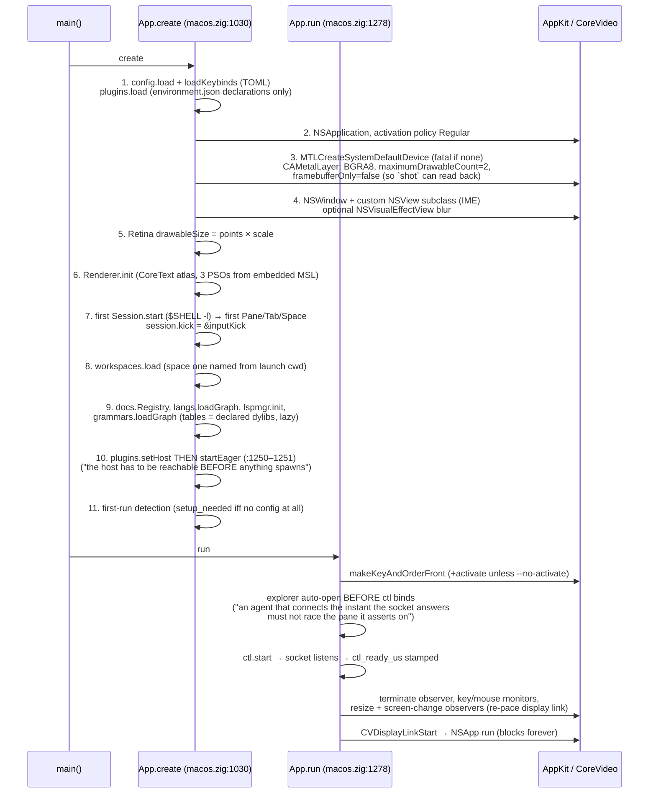

# Rook — System Architecture: Processes, Threads, IPC, and Ownership

Research document, 2026-08-07. Repository: `/Users/sethlowie/go/src/github.com/incantery/rook`,
branch `main`. The underlying research pass ran against HEAD `291f6d0`; during final
verification the author committed `9ad05f3` ("session: the pty is drained while the parser
parses"), which lands the gather/parse read pipeline that was uncommitted during research. This
document describes the tree at `9ad05f3` (working tree clean at time of writing). Every
load-bearing claim was verified against source; line numbers are from this snapshot and may
drift by a few lines in files touched by `9ad05f3` (`pty.zig`, `session.zig`).

Audience note: this is written for a reader **without** repo access. Paths and symbols are cited
liberally so claims can be independently re-verified later.

---

## 1. Executive shape: one binary, many children, zero daemons

**Implemented:** Rook is a **single Zig executable** (`app/src/main.zig`) that is simultaneously:

- the macOS application (AppKit window + Metal renderer + CVDisplayLink frame clock),
- a terminal emulator (ghostty's `ghostty-vt` library, pinned by commit hash in
  `app/build.zig.zon`),
- a tmux-style multiplexer (spaces → tabs → binary split trees of panes, all in-process data
  structures in `app/src/panes.zig` + `app/src/macos.zig`),
- a vim-shaped editor and an LSP client (`app/src/editor.zig`, `app/src/lsp.zig`),
- **its own CLI**: any `rook <verb>` invocation that isn't one of four local subcommands is a
  short-lived second copy of the same binary that writes the argv as one text line to a unix
  socket and streams the reply to stdout (`ctlPass`, `app/src/main.zig:390–450`).

There is **no daemon, no server process, no detach/reattach, and no session persistence**. The
Go core (`internal/`, `cmd/rookctl`, the `rook-host` daemon) was deleted on 2026-07-31 in commit
`e502bd4` ("strip: the Go core leaves — rook is one Zig binary") and a ~15-commit "strip" series.
Around the one binary sit **Go subprocess binaries** built into the same app bundle: six plugins
(`rook-plugin-{claude,agent,cloud,lang-zig,lang-python,lang-typescript}`) and two providers
(`rook-provider-{github,linear}` — built and bundled but, at HEAD, **spawned by nothing**; see
§4.4).

The architectural doctrine, stated in code comments and consistently executed:

1. **The CLI carries no verb table.** `rook <anything>` is bytes shipped to the socket; the
   server answers or it doesn't (`app/src/main.zig:9–16` header comment). Zero client/server
   drift surface.
2. **Everything extensible is out-of-process** (plugins, providers, LSP servers, config
   programs, even the HTTPS fetch of plugin binaries goes through a forked `curl` —
   `app/src/plugins.zig:979–1028` — "not an HTTP client compiled into rook"). The single
   exception is tree-sitter grammar tables, which are `dlopen`ed dylibs because parsing happens
   on the frame budget (`app/src/grammar.zig`).
3. **Crash-only shutdown.** `ctl quit` replies `ok` then `_exit(0)`; the last space closing
   calls `_exit(0)` (`app/src/macos.zig:5170`); the only graceful work at ⌘Q is signalling
   child process groups (`hangupAllSessions`, macos.zig:2464).

---

## 2. Executables and build artifacts

| artifact | source | built by | ships where |
|---|---|---|---|
| `rook` (Zig, one Mach-O; also invoked as `re` via symlink) | `app/src/main.zig` root module | `zig build` (`app/build.zig`) | `/Applications/rook.app/Contents/MacOS/rook`; symlinks `~/.local/bin/{rook,re}` |
| `rook-plugin-{claude,agent,cloud,lang-zig,lang-python,lang-typescript}` | `plugins/*/main.go` | `make plugins` (Makefile; dirs discovered by `plugins/*/main.go` glob) | `Contents/MacOS/rook-plugin-*` |
| `rook-provider-{github,linear}` | `providers/*/main.go` | `make providers` | `Contents/MacOS/rook-provider-*` (bundled, **uncalled** — see §4.4) |
| `e2e` harness | `app/e2e/main.zig` (51 scenarios: 50 assertion + 1 bench-only — `startup`, `.bench = true` at app/e2e/main.zig:80, run only when named) + `harness.zig` | `zig build e2e` (local only; CI runs `e2e-check` compile-only) | not shipped |

Embedded **inside** the `rook` binary (via `addAnonymousImport`, `app/build.zig:79–82`): the
entire TypeScript config SDK (`sdk/ts/rook.ts`, written out by first-run setup — "@incantery/rook
is not on npm; the SDK a config was written against cannot drift from the rook that wrote it")
and the Claude Code skill (`docs/claude/rook-skill.md`, written to
`~/.claude/skills/rook/SKILL.md` by `rook install claude`, main.zig:294).

Distribution: `make install` hand-assembles the `.app` bundle (sed-templated Info.plist, man
pages into `Contents/Resources/man`, ad-hoc `codesign -s -`, `lsregister`/`mdimport`);
`install.sh` is a curl-pipe installer with sha256 verification and a **transactional same-
filesystem rename swap** (install.sh:44–69). There is no release CI and no notarization —
releases are `make release` on the dev machine, arm64-only.

**Obsolete/dead debris worth knowing about** (all untracked, all gitignored): a 13MB `rookctl`
at repo root (a local build of the *deleted* Go CLI), an 8.4MB `cloud` (stray `go build
./plugins/cloud` output), `bin/rook` and `bin/rook-host` (pre-strip daemon-era builds). None are
part of HEAD; they are easy to misread as live artifacts.

---

## 3. Runtime process topology

Everything below is a child (or a transient child) of the single `rook` app process. There is
no process rook talks to that it did not fork, with one exception: the cloud service, which the
**cloud plugin** (not rook itself) polls over HTTPS.

```mermaid
flowchart TD
    subgraph host["macOS host"]
        subgraph rookproc["rook (one Zig process — app + ctl server)"]
            MAIN["AppKit main thread\n(NSApp run, events, IME)"]
            DL["CVDisplayLink thread\n(frame clock → drawFrame)"]
            CTL["ctl serve thread\n(unix socket accept loop)"]
            RD["per-session parse thread\n+ gather thread (×N panes)"]
            LP["per-LSP-server pump thread"]
            PP["per-plugin pump thread"]
            WK["ad-hoc workers\n(find-in-files, monitor sampler,\ndisk scan, plugin fetch, env check…)"]
        end

        SH["shells — $SHELL -l\n(one per pane, under a PTY)"]
        LSPS["LSP servers\n(gopls, zls, pyright, tsserver…)"]
        PLG["plugins ×6\nrook-plugin-claude / agent / cloud / lang-*"]
        CFG["config program\n(go run . / TS toolchain)\ntransient, apply-time"]
        GIT["git — transient\n(worktree add/remove, rev-list, branch -d)"]
        CURL["curl — transient\n(plugin/grammar binary fetch)"]
        GRAM["git clone/checkout + cc — transient\n(grammar build-from-repo → dylib)"]
        CLI["rook <verb>\n(second copy of the same binary)"]
    end

    CLOUD["api.rookide.com\n(rook-cloud, separate repo;\nMongoDB, fleet web, iOS app)"]
    OAI["OpenAI-compatible API\n(agent plugin summarizer)"]

    RD ---|"PTY master ↔ slave"| SH
    LP ---|"stdin/stdout pipes, LSP framing"| LSPS
    PP ---|"stdin/stdout pipes, NDJSON v1"| PLG
    rookproc -->|fork/exec, capture stdout| CFG
    rookproc -->|fork/exec| GIT
    rookproc -->|fork/exec| CURL
    rookproc -->|"fork/execvp, output to /dev/null"| GRAM
    GRAM -.->|"dlopen — the ONE in-process load"| rookproc
    CLI -->|"unix socket $ROOK_SOCK\n(line protocol)"| CTL
    PLG -->|"HTTPS poll, 20s\n(cloud plugin only)"| CLOUD
    PLG -->|"HTTPS per finished turn\n(agent plugin only)"| OAI
```

### 3.1 Subprocess inventory, with owners

1. **Shells** — one per terminal pane. `Session.start` (`app/src/session.zig:~468`):
   `openpty` + fork/exec `$SHELL -l` (or `$SHELL -l -c <cmd>` for plugin-spawned command
   panes), `TERM=xterm-256color`, `COLORTERM=truecolor`, cwd inherited from the focused pane's
   shell cwd read from the **kernel** via `proc_pidinfo(PROC_PIDVNODEPATHINFO)` (macos.zig:2020
   area), not from OSC 7. The PTY layer is libc-direct (`app/src/pty.zig` — openpty, fork,
   setsid, `TIOCSCTTY`, dup2, close-all-fds-≥3, execvp; child `_exit(127)` on failure).
   **Owner:** the `Session`; the App's display-link reap (`reapExitedLocked`, macos.zig:5075)
   collapses a pane when its session's `exited` atomic flips.
2. **LSP servers** — one per (language, root). `lsp.zig:2217` (fork/execvp inside
   `Server.spawn`), lazily: nothing spawns until a file of a *declared* language opens
   ("a language server costs ~1s and ~100MB, and launch owes it nothing"). There is **no
   built-in language catalog** — languages are `language` nodes in the environment graph
   (`app/src/language.zig`), optionally resolved by a `lang-*` resolver plugin (§4.3).
   **Owner:** `lspmgr.Manager` (catalog, routing, per-file diagnostics).
3. **Plugins** — declared as `plugin` nodes in `environment.json`; lazy by default, `eager`
   spawned in `App.create` (`macos.zig:1250–1251`: `setHost` then `startEager` — host wired
   **before** anything spawns). fork/execvp with four pipe pairs (stdin, stdout, wake pipe,
   reply pipe — `plugins.zig:539–616`), stderr → `/dev/null`. **Owner:** `plugins.Registry`;
   lifecycle `declared → up | failed`, and **failed stays failed** until app relaunch (no
   respawn loop, by design — plugins.zig:366–374).
4. **Config programs** — "config is a program, and rook runs it." `envapply.zig` fork/execs the
   user's emitter (`go run .` or the TS toolchain) from the config directory (execvp at
   envapply.zig:548), captures the emitted IR JSON as a CANDIDATE, diffs by node id against the
   APPLIED `environment.json`, and holds the diff for explicit human apply. Transient,
   apply-time only. **Owner:** the App's env-check worker thread (`startEnvCheck`,
   macos.zig:7281), triggered off a source-digest poll (§7).
5. **git** — transient, and only for worktree operations, all through `envapply.runArgv`:
   `git worktree add <dest> -b <name>` with a fallback to `worktree add <dest> <name>` for an
   existing branch (`workspaces.zig:298,303`), `git rev-list --count HEAD..<name>` for the
   unmerged-commits refusal (:342), `git worktree remove` (:351), `git branch -d` (:354).
   Deliberately **not** forked for the hot paths: branch display parses `.git/HEAD` directly
   (following a worktree's `gitdir:` pointer) and worktree listing is derived from
   `.git/worktrees/<name>/gitdir` files on every read (nothing stored → nothing stale).
   `app/src/git.zig:1` reads verbatim "git, read from the filesystem — never spawned.", and
   :3–8 records that the file *used* to run git behind a watchdog for `diff --no-index` (the
   diff viewer) and `rev-parse --show-toplevel`, and that "all three callers left in the
   strip". There is therefore **no `git diff --no-index` at HEAD and no git gutter** — the
   editor surface that consumed it died with the review stack (doc 02 §22). Retiring the
   subprocess also retired the watchdog and everything it guarded (a wedged child, a
   grandchild holding the stdout pipe, a kill racing a reap after pid reuse); the header warns
   that anyone who needs git-as-a-subprocess again should recover the machinery from git
   history rather than rewrite it, because the ordering rule that made it safe (read to EOF →
   signal → JOIN → wait) is easy to get wrong.
6. **curl** — transient, for sourced plugin/grammar binaries: `curl -fsSL --max-time 60` to
   `<dest>.part` then atomic rename, verified against a config `sha256` pin or a
   trust-on-first-use `.sha256` sidecar **on every launch**, mismatch = refusal, never
   re-download (`plugins.zig:977–1056, 658–695`; reused by `grammar.zig` for dylibs).
7. **`git clone`/`git checkout` + `cc`** — the grammar build-from-repo path, and the one
   subprocess class whose *product* is loaded in-process. `buildFromRepo`
   (`grammar.zig:463–520`): `git clone --quiet <repo> <tmp>` + `git checkout --quiet <rev>`
   when a rev is pinned (a pinned rev "cannot be a depth-1 clone of the default branch"), else
   `git clone --quiet --depth 1 <repo> <tmp>`; then `cc -shared -fPIC -O2 -I <src> -o <dylib>
   parser.c [scanner.c]` (:506–508 — the external scanner is not optional where it exists,
   because Python's INDENT/DEDENT lives there and a parser.c alone links fine and then fails on
   the first indented block). All of it goes through grammar.zig's **own** fork/execvp helper
   (:538–550), which chdirs, redirects stdout/stderr to `/dev/null`, closes every fd ≥3, and is
   "deliberately not a shell: every argument here is a path or a URL out of config, and a shell
   would give a semicolon in one of them a meaning." **Owner:** `grammar.Registry`. This is the
   only extension path whose output is `dlopen`ed into rook's address space, and the only fetch
   path with no sha256 verification (doc 03 §8.7).
8. **`sh -c` cleanup commands** — the disk-reclaim monitor runs compiled-in category commands
   ("go clean -modcache", "brew cleanup --prune=all") through `/bin/sh` (`runTool`,
   macos.zig:9543); scanned user paths never touch a shell (deleted directly via `deleteTree`
   instead). See doc 02 §7.1.
9. **The login-shell PATH probe** at Dock launch (`adoptLoginPath`, main.zig:206): if PATH is
   launchd's exact skeleton, fork `$SHELL -l -i` and read the real PATH over **fd 3** (rc-file
   banners would corrupt stdout), with an ~8s *quiet-time* deadline. Exists because LSP
   servers, config programs, and plugins inherit the *app's* env (panes get login shells and
   don't need it).
10. **`rook` as ctl client** — every `rook <verb>` from any shell is a short-lived second copy
    of the binary connecting to `$ROOK_SOCK`.

**Not rook's processes:** `api.rookide.com` (rook-cloud, a separate repo/service — reached only
by the cloud *plugin*); the deleted `rookctl`/`rook-host` daemons.

---

## 4. IPC surfaces (four, each with a different versioning philosophy)

| surface | transport | framing | versioning | producer ↔ consumer |
|---|---|---|---|---|
| **ctl socket** | `AF_UNIX SOCK_STREAM` at `$ROOK_SOCK` (default `/tmp/rook.sock`) | newline text lines, verb-first; reply streams until close | **unversioned** ("the server answers or it doesn't") | app serves ← CLI, e2e harness, Claude skill, humans with `nc -U` |
| **plugin protocol v1** | plugin child's stdin/stdout | NDJSON `{"v":1,"id":N,…}`, max frame 1 MiB | `v:1`; mismatch = refusal at handshake | app (`plugins.zig`) ↔ plugin process, **both directions** |
| **provider protocol v1** | stdin/stdout | NDJSON, same envelope | `Version=1`, refusal | **orphaned**: `sdk/provider` client is Go, imported by nothing in `app/` |
| **environment IR v1** | a file: `environment.json` | one JSON doc `{"rookEnvironment":1,"nodes":[…]}` | **fail-open** — unknown kind/key/type silently skipped | config SDK program → app (`config.zig` loadEnv, `plugins.zig` reads the same file, `envapply.zig` diffs it) |

The versioning asymmetry is doctrine, written at three sites: **config fails open** (a misread
knob leaves a default; old apps must survive new graphs — config.zig:744–748) while
**plugin/provider frames refuse on mismatch** ("acting on a misread frame would ACT" —
plugins.zig:113–116, `sdk/provider/provider.go:48–51`).

### 4.1 The ctl socket (`app/src/ctl.zig`, ~1,400 lines)

**Implemented.** A detached thread (`ctl.start` → `serve`, ctl.zig:46–111) binds the socket and
runs a **fully serial** accept loop — one connection handled to completion at a time; a slow
verb (`worktree add` runs git inline) head-of-line-blocks all other ctl clients, an acknowledged
trade. ~52 top-level verbs (`dump`, `panes`, `type`/`enter`/`key`/`press`/`nskey`/`paste`,
`click`/`drag`/`wheel`, `shot` (PNG read back from rook's **own** CAMetalLayer drawable — no
screen-recording permission, works occluded), `split`/`focus`/`zoom`/`tab`, `run <command-id>`
(dispatches the compiled-in command registry by name), `env`/`env apply`, `plugins`/`plugin`,
`worktree add|remove`, `activity`, `stats`, `boottime`, `quit`, …). `@<paneid>` suffix targets a
pane. Error convention: reply starting `err ` → the CLI exits 1.

Notable mechanics, each verified:

- **Never steal a live socket** (`socketIsLive()`, ctl.zig:57–66; the refusal it guards is the
  NEVER-STEAL comment plus `if (socketIsLive(path))` block at ctl.zig:71–85, inside `serve`
  which opens at :68): before binding, `socketIsLive()` connect-probes;
  a live listener means this instance refuses to serve ctl at all (the unlink-then-bind hijack
  was "seen in the wild within an hour of the cutover" — the comment records the full failure
  anatomy). A stale file from a crashed instance is unlinked.
- The moment `listen()` succeeds stamps `boot_times.ctl_ready_us` (ctl.zig:100–102) — the
  socket doubles as the startup bench's "app is up" line.
- **Silent trap:** `sockaddr_un.sun_path` is 104 bytes; a longer socket path makes `serve`
  bare-`return` and the client `_exit(1)`, both without a message (ctl.zig:92; main.zig:415).
  The e2e harness dodges it by naming its socket `{dir}/s`.
- Input verbs drive the **identical** key path real keystrokes use (`writeFocused` →
  `routeChromeKeyLocked` → `paneInput`) and `press` reports `consumed` vs `typed` — the reply
  is itself an assertion about routing. Ctl-driven input deliberately does **not** stamp the
  pane's `last_in_ms` human-activity timestamp ("an agent typing into a pane is not a human
  looking at it").
- The CLI's one special case: `err unknown` on a lone argument that names an existing file →
  re-run as `edit` (`rook main.go` opens the file; verb-first, file-second is a stated
  contract, main.zig:387–443).

The ctl socket was **day-one infrastructure** of the native app (commit `568ba77`, 07-28:
"native: eyes for the agent — ctl socket + own-pixel shots"). The convention since: no feature
is done until it has a read-side dump verb ("a headless assertion cannot pass while the visible
pane is wrong"). The 51-scenario e2e suite and the shipped Claude skill both drive this surface,
which makes the (unversioned, append-only-by-habit) text output formats a de-facto frozen API —
a real, unmarked contract risk.

### 4.2 Plugin protocol v1 (`app/src/plugins.zig`, host end)

**Implemented, both directions.** NDJSON frames; request
`{"v":1,"id":N,"op":"…","deadlineMs":…,"params":{…}}`, reply `{"v":1,"id":N,"ok":…}`.
Direction is distinguished solely by presence of a top-level `"op"` (substring scan, a
documented deliberate non-parse — worst case a mis-routed frame is refused by name). One
**pump thread per up plugin** (`pumpLoop`, plugins.zig:412) owns the child's stdout — the
mechanism that makes *unsolicited* plugin→host frames deliverable; the header comment names the
lesson: the deleted protobuf "edge" protocol "could not become a provider" because providers had
no pump. Deadlines: caller waits 10s, the plugin is told 250ms less (`grace_ms` — the same value
with the same war story as the dead Go provider client; institutional memory surviving a
rewrite).

**Grants** are the trust model, and it is unusually coherent: the config declares a plugin
EXISTS, config `grants` say what it MAY do, `describe.capabilities` say what it WANTS — three
facts kept visible end-to-end (`ctl plugins` prints all three). One grant list covers both
directions; outbound refusals happen **before the plugin is told**, inbound refusals **name the
missing grant** (plugins.zig:495–501, 702–712).

Inbound verbs a plugin may ask of rook (`pluginInbound`, macos.zig:7341–7591):
`attention.raise` (provenance server-assigned from the declaration, never from params),
`session.spawn` (opens a pane running a command, **never steals focus**), `session.send` (types
into a pane — hard-gated: the pane's foreground process must *be* claude by name or path
(`node` deliberately insufficient — "a REPL eats typed text as code too"), refused if a human
typed in that pane within 5s, ≤8KiB, delivered as bracketed paste), `clipboard.set`,
`panes.activity` (per-pane out/in timestamps + byte counters + kernel-read fg name/path/cwd —
the substrate observability agents fuse with transcript state).

### 4.3 The plugin processes themselves (the agent layer, as it exists)

All six first-party plugins are Go, each hand-rolling the protocol (the author SDK lives in the
external `incantery/rook-demos` repo; the in-repo existence proof that no SDK is required is a
9-line POSIX `sh` plugin in the e2e suite):

- **`plugins/claude`** — the Claude Code watcher: tails `~/.claude/projects/**/*.jsonl`
  transcripts via the shared `plugins/internal/transcript` scanner (states `needs you` /
  `blocked?` / `working` / `idle`), fuses with `panes.activity` byte-rates (a spinner-rate pane
  keeps a quiet transcript "working"), raises attention on state *transitions*.
- **`plugins/agent`** — the summarizer/membrane: one OpenAI-compatible completion per finished
  turn → digest (headline + bullets), journaled to `~/.local/state/rook/digests.jsonl`
  (`plugins/internal/digestlog` — "the file is the interface"; no socket between plugins).
- **`plugins/cloud`** — the phone bridge (§6).
- **`plugins/lang-{zig,python,typescript}`** — single-op `lsp.resolve` resolvers: "which server
  binary + settings go with THIS project root", installing servers into rook's own prefix
  (`$XDG_DATA_HOME/rook/servers/<lang>` — a directory rook names but never writes). Cached per
  (language, root) by lspmgr, with a test literally titled against the resolver-as-fork-bomb
  failure mode.

**Inference (well-supported):** the plugin system is the strip's payoff — every post-strip
feature (agent membrane, cloud bridge, language catalog) landed as plugin ops rather than core
code, in about six days of commits (07-31 → 08-06).

### 4.4 Providers — a published protocol with zero callers

**Scaffolded/prototyped (orphaned).** `sdk/provider` is its own zero-dependency Go module with
typed Request/Response and a `Serve` loop; `providers/github` (delegates auth to the `gh` CLI)
and `providers/linear` build, are tested, are copied into the app bundle — and **nothing at
HEAD spawns them** (grep of `app/src/` confirms; the only caller, `rookctl issues`, died with
the Go core). `docs/OWED.md` §1 defers the decision ("either the two grow a shim or a provider
becomes a plugin. That is a decision, not a port"). The plugin protocol is visibly the provider
protocol plus a pump, inbound verbs, grants, and distribution — the envelopes are identical.

---

## 5. Threads and event loops inside the one process

Verified spawn sites; this is the complete inventory at HEAD.

| thread | created at | owns | lifetime |
|---|---|---|---|
| AppKit main thread | `NSApp run` (macos.zig:1363) | window, event monitors (keyDown :1314, mouse :1321), NSNotificationCenter observers (resize :1333, screen change :1349, terminate :1303), IME (runtime-built ObjC NSView subclass, NSTextInputClient) | process |
| CVDisplayLink thread | macos.zig:1357–1360 | frame clock → `drawFrame`; never stopped (idle = a wake that returns without touching Metal) | process |
| ctl serve thread | `ctl.start` (ctl.zig:47), detached | the unix socket accept loop, serial | process |
| per-session **parse** thread | `Session.start` (session.zig:504) | the `TerminalStream` parse under the session mutex; runs the input kick | pane |
| per-session **gather** thread | `readLoop` (session.zig:594), since `9ad05f3` | draining the ~1KiB-capped kernel pty queue into a 4×64KiB SPSC ring | pane |
| per-LSP-server pump | lsp.zig:2230 | the server's stdout pipe → sans-io `Session.feed` | server |
| per-plugin pump | plugins.zig:401 | the plugin's stdout pipe → FrameReader → route (replies + unsolicited requests) | plugin |
| session hangup escalation | session.zig:523, detached, by-value | SIGTERM→SIGKILL ladder after pane close (carries pgids, never `self` — reap frees the Session) | ~200ms |
| ad-hoc workers (all `std.Thread.spawn`, mostly detached, from macos.zig) | find-in-files :3315, LSP explain :3693, LSP references :4533, monitor sampler :6753 (runs **only** while a monitor pane is visible), disk scan :6847, reclaim :6935, plugin fetch :7058, setup writer :7166, env check :7281, plugin action :7688 | one job each | job |

### 5.1 The render loop (the heart of the process)

- **CVDisplayLink** ticks at panel rate; `displayLinkCallback` (macos.zig:9493) reads the
  refresh period **before** taking the lock (a documented deadlock: querying CoreVideo under
  `draw_lock` inverts against the link's own IO thread — diagnosed from a `sample` of a hung
  instance, macos.zig:843–860), then `drawNow` → take `draw_lock` → `drawFrame`
  (macos.zig:5207) → release → drain queued work.
- **Zero idle frames by design**: a frame with no dirty pane and no `scene_dirty` returns before
  touching Metal. This is also the latency strategy — Zed's "keep presenting for 1s" ProMotion
  hold was implemented, A/B-measured (+8.6ms quiet-key p50 with 2 drawables), and **reverted**
  (commit `27c1fe9`, `app/PERF.md`).
- **Input kick**: after each parsed batch, the session's parse thread calls `inputKick`
  (macos.zig:9562) which draws immediately *only if* this is the focused session AND a typed key
  is pending (`input_mark > 0`) — key-to-photon fast path, while firehose output stays
  coalesced to display pace ("the wake-per-KB lesson": a faster parser once *slowed* the app).
- Frame sequence: reap exited panes → drain clipboard/search/LSP → 2Hz HUD tick → snapshot
  each visible active-tab pane (`lockForSnapshot` → damage-tracked `RenderState.update` →
  unlock) → bump-fill one shared GPU cell buffer (a 3-deep ring since `9467cc3`, sized so no
  completion-handler handshake is needed with `maximumDrawableCount=2`) → 2 draw calls per
  pane. Hidden panes (background tabs/spaces, zoom-zeroed rects) are parsed but never
  snapshotted.

### 5.2 The PTY read pipeline (committed at `9ad05f3`)

**Implemented (newly).** macOS caps every pty master read at ~1KiB (kernel tty queue) regardless
of buffer size — ghostty instrumented it (#13209: 6,337 reads, each exactly 1024 bytes). The old
serial loop paid every lock/wake/kick per KiB, and the child sat blocked on a full queue while
rook parsed. The new pipeline is an explicit port of ghostty's termio pipeline (PR #13209 + the
bb0ac4c72 idle-wake fix, cited by number in doc comments; "the constants are theirs, each one
measured"):

- Two threads per session: **gather** (non-blocking `readMasterNb` draining the kernel queue
  into a 4×64KiB ring) and **parse** (locks the terminal, `stream.nextSlice` per 64KiB batch).
- Synchronization: SPSC ring indices + two **GCD `dispatch_semaphore_t`s** (`sem_free` =
  backpressure that lets the kernel queue push back on the child; `sem_ready` = published
  batches) — chosen because Zig 0.16's std retired Mutex/Condition; plus one atomic
  `outstanding` and a non-blocking **self-pipe** so the parser going idle can wake the gather
  out of its 1ms bridge poll (every µs a batch is held past parser-idle is added straight to
  output latency).
- Bridging heuristics: `bridge_threshold=1024` (a full kernel queue = saturated writer worth
  waiting on; less = interactive trickle, deliver now), spin ≤16 non-blocking re-reads, 1ms
  poll, 3ms total budget ("well under a display frame").
- **Triple fallback** to the old serial loop (`readLoopSerial`, session.zig:655): fd refuses
  O_NONBLOCK, semaphore create fails, or thread spawn fails — degraded, never dead
  (session.zig:580–599).
- Cost: 2 threads + 256KiB of ring buffers per live pane; nothing pools across sessions.

### 5.3 Lock discipline

One big `draw_lock` (`os_unfair_lock`) serializes the scene across the display link, input kick,
AppKit events, resize, and ctl (App.draw_lock, macos.zig:~883). Per-session terminal state has
its own `os_unfair_lock` wrapper; **lock order is `draw_lock` → session mutex**, established in
the commit that introduced the mux. Because unfair locks have no fairness, a firehose reader can
starve the renderer "for hundreds of ms (measured)" — solved cooperatively: the renderer sets an
atomic `snapshot_wanted` before locking and the reader spins/yields on it (session.zig:~203).
The pervasive pattern is **"queue under lock, drain after release"** (pending_cmd,
plug_refetch, env_check_wanted, pending_open, pending_quit_all — all documented on App fields).
Two recorded wedge rules: never encode a frame from a caller's thread (nextDrawable contention,
measured), and cross-thread AppKit work is marshaled via `dispatch_async_f` to the main queue
(macos.zig:66–68).

---

## 6. The cloud link (the only network path out, and it lives in a plugin)

**Implemented and in daily use** (the author's live config declares `plugin:cloud` eager with a
token at `~/.config/rook/cloud_token`). `plugins/cloud/main.go` (~1,100 lines + the best test
suite of the Go code) is the **entire** remote story at HEAD:

- **Stateless HTTPS polling** of `https://api.rookide.com`, six endpoints, every 20s:
  `GET /v1/whoami` (bearer-token identity), `POST /v1/status` (a last-write-wins snapshot:
  workspace basenames — never full paths — branches, Claude session states/titles/context %,
  the ask text ≤2000 bytes when a session needs input, digest headlines), `GET /v1/answers` +
  ack, `GET /v1/commands` + ack (kinds: `compact`, `resume`, `spawn`).
- **No push channel into the machine, no WebSocket, no daemon.** Zero idle traffic beyond the
  20s status beat. Push notifications to the phone are **not implemented anywhere** (the iOS
  app in the separate rook-cloud repo polls foreground-only; its comment says APNs waits on a
  paid developer account).
- Delivery discipline: **at-least-once from the cloud, at-most-once at the keyboard** —
  `plugins/internal/cmdjournal` writes the effect to disk *before* the ack, so a crash between
  typing and acking re-acks, never re-types.
- Every remote effect lands through the granted plugin verbs, never a shell: answers and
  prompts go in as typed text through `session.send`'s claude-only + 5s-human-presence gates
  ("cloud words never touch a shell"); `resume` builds its command from **local** transcript
  ids charset-checked by `shellSafeID`; `spawn`'s workspace resolution goes through the
  machine's own recently-seen sessions ("the phone can only name what the machine showed it").
- History: this is the *second* remote build. The first (relay/mailbox asks, a signed protobuf
  "edge" command protocol with keychain device keys, fencing eras, an MCP server) landed 07-24→
  07-27 and was deleted wholesale by 07-31 ("a mailbox is an integration, not a primitive" —
  commit `ab475e1`). The security model went from cryptographic to capability-scoped.

The **agent plugin** is the only other network client: one HTTPS completion call per finished
Claude turn to an OpenAI-compatible endpoint (key at `~/.config/rook/openai_key`; full turn text
leaves the machine to that endpoint — a boundary the cloud plugin deliberately does *not* cross,
exporting only headline+bullets).

---

## 7. File watchers — there are none; everything polls or derives

There is no kqueue/FSEvents usage anywhere in `app/src/`. The change-detection strategy is
digests-on-a-timer and derive-on-read:

- **config.toml live reload**: `pollConfigLocked` (macos.zig:5607), wyhash digest at ~1Hz off
  the display-link tick; theme/keybinds apply live, font/opacity/scrollback need relaunch.
- **Config source staleness**: `env_src_digest` (macos.zig:553) — a poll over the config
  program's source; a change queues an env check whose subprocess run is drained **outside**
  draw_lock.
- **Buffer/disk conflict**: `Buffer.DiskState` (mtime/size identity) checked at `:w` — refusal
  on clobber, not a watcher.
- **Git branch / worktrees**: read `.git/HEAD` and `.git/worktrees/*/gitdir` on the 2Hz HUD
  tick / on demand — derived, never cached-and-watched.
- **Claude transcripts**: the claude/agent/cloud *plugins* scan `~/.claude/projects` tails on
  their own timers (bounded tail reads — "transcripts average megabytes").
- Known gap (named in the untracked TODO.md roadmap): no LSP `didChangeWatchedFiles` — a
  `go get` in the next pane silently desyncs gopls.

---

## 8. State stores and persistence surfaces

**The in-memory truth** (dies with the process): the whole mux scene (spaces → tabs → split
trees → panes), every terminal's grid + scrollback (in-process inside ghostty-vt's PageList,
bytes-capped per pane, default 10MB, launch-time-only knob), editor buffers (one file = one
`Buffer` shared by N panes via `docs.zig` refcounts), LSP sessions, plugin handles, the
attention ring (16 entries), stats rings.

**On disk** (everything that survives a relaunch):

| path | writer | reader | format |
|---|---|---|---|
| `~/.config/rook/config.toml` | human | app (TOML subset parser, `config.zig`) | TOML |
| `~/.config/rook/environment.json` | the config program via apply (`envapply.zig`) | app ×3 (config.zig options, plugins.zig plugin nodes, workspaces.zig workspace nodes) — "one file, two consumers, and neither should own the other's parse" | IR v1 JSON, canonical bytes |
| `~/.config/rook/{main.go,config.ts}` | human | envapply (runs it) | config-as-program source |
| `$XDG_DATA_HOME/rook/plugins/<name>` (+ `.sha256` sidecar) | curl fetch | plugin spawn; verify on every ensure | Mach-O + TOFU hash |
| `~/.local/share/rook/grammars/<name>.dylib` | grammar fetch/`cc` build | dlopen (ABI-gated 13–15 before `ts_parser_set_language`) | dylib |
| `$XDG_DATA_HOME/rook/servers/<lang>` | lang-* resolver plugins | LSP spawn | server installs |
| `$XDG_DATA_HOME/rook/worktrees/<ws>/<name>` | `worktree add` (git subprocess) | shells/editors | git checkouts (derived state → data dir, not beside the repo) |
| `~/.local/state/rook/digests.jsonl` | agent plugin | cloud plugin (headlines only leave) | append-only jsonl (`digestlog`) |
| `~/.local/state/rook/cloud-deliveries.jsonl` | cloud plugin | itself, across crashes | at-most-once ledger (`cmdjournal`) |
| `~/.config/rook/{cloud_token,openai_key}` | human | cloud / agent plugins | bearer secrets (note: token is 0644 while the key is 0600 — inconsistent) |
| `~/.claude/skills/rook/SKILL.md` | `rook install claude` | Claude Code | embedded skill |

**Not implemented, by explicit current design:** session persistence, layout save/restore,
detach/reattach. A pane dies with its shell; the last shell exits the app; quitting rook kills
every shell in every space (`STATUS.md` "Accepted regressions" matches the code here). The old
"host-backed reverse-paginated scrollback" and daemon-survival stories in project memory
describe the **deleted** pre-07-29 Go/webview architecture — the Zig app never had them. On a
hard crash, the kernel's SIGHUP to foreground groups is all that happens; SIGHUP-trapping jobs
can orphan (the escalation ladder only runs on orderly teardown), and crash capture is a named
roadmap item, not code.

---

## 9. Startup sequence

Boot is instrumented end-to-end: `BootTimes` (macos.zig:101) stamps `config_us`, `keybinds_us`,
`appkit_us`, `renderer_us`, `session_us`, `create_us`, and `ctl_ready_us` (stamped when the
socket listens — ctl.zig:100), readable via `ctl boottime`; measured config cost is ~90µs of a
~70–75ms `create()`.

`main()` (main.zig:94) first: `re` basename → edit; `--version`; `--config=DIR` →
`useConfigDir()` (mkdir + realpath + `setenv("ROOK_SOCK", DIR/rook.sock, 0)` +
`setenv("XDG_DATA_HOME", DIR, 0)` — overwrite=0 so an explicit ROOK_SOCK wins, and so **shells
inside the instance inherit the right socket**; a throwaway rook is one deletable directory).
`demo`/`exec`/`install claude` are headless paths; any unknown verb → `ctlPass`.

**Implemented — the two windowless VT paths.** `rook exec <cmd...>` (main.zig:540, dispatched at
:156) is a headless terminal: `Pty.open` at a fixed 80×24, `pty.spawn(cmd_argv)` with
`TERM=xterm-256color`/`COLORTERM=truecolor`, then a 64KB read pump from the master into an
in-process `vt.Terminal` until EOF/EIO, `Pty.wait(pid)`, and `t.plainString()` printed on exit —
no AppKit, no Metal, no window server, no ctl socket. `rook demo` (main.zig:524, dispatched at
:154) is the same VT-only shape without the pty: it feeds three literal escape-sequence strings
(truecolor, reverse, wide CJK, emoji) into an 80×24 `vt.Terminal` and prints the grid. These are
the *only* entry points that exercise the VT stack — and, for `exec`, the pty stack — without a
window server, which is directly relevant to §4.1's note that e2e verification cannot run in CI
(doc 07's Fork 9 recommendation about a headless e2e subset would build on exactly these).

The default (`win`, including Dock launches, which hand `-psn_…` and start at `/`): chdir to `$HOME`,
`adoptLoginPath()`, then:

Ordering subtleties that are deliberate (each carries its rationale in a comment): plugin host
wiring before eager spawn; explorer pane before the ctl socket answers; the screen-change
observer re-paces the display link (citing Zed bug #38269 — display swap without frame change
leaves a stale scale).

**Quit path:** AppKit terminate → `terminateCallback` (macos.zig:9515) → `hangupAllSessions`
(macos.zig:2464): walks all spaces × tabs × panes **including `pane.under` parked shells**,
captures **two process groups per pty** (the shell's, and `tcgetpgrp(master)` — a foreground
job under job control is in its own group; Zed shipped that orphan twice, zed#47412/#61467,
cited in `pty.zig`), signals SIGHUP+SIGTERM outside the lock, 100ms grace, SIGKILL survivors —
**blocking on the main thread** because "quit is past the last frame". Per-pane close (⌘W)
uses the same ladder on a detached by-value thread. Real-kernel tests spawn SIGHUP-trapping
shells to prove SIGKILL is what ends them, with a vacuity guard (pty.zig test block).

---

## 10. Ownership map ("who owns what")

| concern | owner | notes |
|---|---|---|
| pane/tab/space **layout** | `panes.zig` (pure tree math) | tree is layout only; zoom = zero-rect display state, never tree mutation |
| pane/session **lifetime & focus** | `App` (macos.zig) under `draw_lock` | reap runs on the display-link thread, never a reader thread (deinit joins the reader) |
| terminal **cell truth** | ghostty-vt `Terminal` per session, under the session mutex | rook writes no escape parser; Effects vtable answers DA1/DSR/XTWINOPS so query-and-wait programs don't stall |
| **keystroke encoding** | `keyenc.zig` (pure, test-pinned transcription of ghostty's tables) | rook advertises the kitty keyboard protocol *involuntarily* (ghostty-vt answers `CSI ? u` on its behalf); key-release events structurally impossible (KeyDown-only monitor) |
| **frame clock** | CVDisplayLink thread | main thread never encodes; ctl thread never draws synchronously |
| **command vocabulary** | `registry.zig` (compiled-in; ~30 commands) | palette, ctl `run`, keybinds, `:Ex` bridge all dispatch through it; `scripts/gen-cmds.sh` generates typed Go SDK constants from it (the advertised CI drift check is **documented only** — absent from ci.yml) |
| **config truth** | `environment.json` if present, else config.toml ("the no-SDK front end, forever") | three separate parsers read the same file (options / plugins / workspaces) — a deliberate no-owner seam, but also the site of the repo's sharpest recorded wire bug (a mistyped field type silently disabled the whole graph, config.zig:757–767) |
| **plugin trust** | config grants, enforced in `plugins.zig` both directions | provenance for attention is taken from the declaration, never accepted from params |
| **LSP document sync** | the editor's rope + version counter, in-process | the stated reason LSP is in the app: a process boundary forces full-text-per-request; "diagnostics-as-you-type is unreachable from either" (lsp.zig header) |
| **remote effects** | the cloud plugin proposes; `macos.zig` gates dispose | the machine-side gates (claude-only target, 5s human lockout) are app code the plugin cannot bypass |
| **socket identity** | `$ROOK_SOCK` env var, inherited by every child shell | the entire multi-instance story is this one variable |

---

## 11. Evidence-labeled findings

**Implemented (and actively used):**
- Single-binary app+CLI with socket-verb dispatch and no client verb table (main.zig:390–450).
- ctl unix socket, ~52 verbs, live-socket-stealing guard, `dump`/`shot` dual truth, serial
  accept loop (ctl.zig).
- Per-pane PTY with two-pgroup SIGHUP→SIGTERM→SIGKILL escalation and real-kernel tests
  (pty.zig; session.zig hangup; macos.zig:2464).
- The gather/parse read pipeline with GCD-semaphore SPSC ring, idle self-pipe, and triple
  serial fallback — **committed at `9ad05f3`** (it was in-flight during the research pass;
  this document reflects the committed state).
- CVDisplayLink-driven zero-idle-frame render loop; input-kick key→photon fast path; 3-deep
  cell-buffer ring; double-buffered CAMetalLayer with readable drawable (macos.zig, render.zig).
- Plugin protocol v1 both directions with pumps, grants, curl fetch + sha256 pin/TOFU
  (plugins.zig); six first-party Go plugins in the bundle.
- Lazy LSP servers with per-server pumps over a sans-io protocol core (lsp.zig, lspmgr.zig);
  declared languages + resolver plugins, no built-in catalog (language.zig).
- Config-as-program apply loop with diff-by-node-id preview (envapply.zig); environment IR v1
  fail-open loader (config.zig).
- The cloud bridge plugin: 20s HTTPS polling, six endpoints, cmdjournal at-most-once delivery,
  gated remote effects (plugins/cloud).
- Hand-rolled .app bundle, ad-hoc codesign, transactional curl installer; embedded TS SDK and
  Claude skill in the binary.

**Partially implemented:**
- OSC 9;4 progress reporting: parsed by the current ghostty pin, handler explicitly `null`
  "until the chrome has somewhere to put it" (session.zig readLoop effects).
- Paste `isSafe()` helper exists; the confirmation gate it was built for does not (paste.zig).
- Plugin failure recovery: failed-stays-failed with no manual clear short of app relaunch
  (plugins.zig:366–374) — if the cloud plugin alone crashes, the fleet goes dark until relaunch.
- The phone experience: rails and payloads exist; push notifications do not (iOS app polls
  foreground-only; out-of-repo evidence).

**Scaffolded/prototyped:**
- Providers: published versioned protocol, two implementations, boundary-enforced imports,
  bundled binaries — zero callers (sdk/provider, providers/; OWED.md §1 defers the decision).

**Documented only (not implemented):**
- The gen-cmds SDK drift check the Makefile calls a "CI check" (absent from ci.yml).
- Self-update, keychain writer, issues caller (docs/OWED.md, explicitly owed).
- `docs/plugins/VOCABULARY.md`'s surfaces beyond List; the `notify` inbound verb; the
  autonomy-ladder / supervisor machinery in docs/agent/VISION.md (cloud-side, not this repo).

**Obsolete/dead:**
- Untracked root binaries `rookctl` (deleted Go CLI build) and `cloud`; `bin/{rook,rook-host}`
  pre-strip builds; the `make ghostty-lib` target referencing deleted `internal/host`.
- `app/README.md` sections documenting deleted files (`src/review.zig`, `src/threads.zig`,
  `src/agents.zig`, `src/asks.zig`, `src/transcript.zig`) — the header disclaims it only
  obliquely; a skimming reader would believe rook has a review pane today.
- `.claude/skills/verify/SKILL.md` teaches the deleted three-binary daemon architecture.

**Docs-vs-code disagreements found (repo is source of truth):**
- STATUS.md says v0.40.0 / "no grammars"; tags reach v0.43.0 and `grammar.zig` implements the
  full dlopen loader with ABI gating — **the docs lag the code**, not the reverse.
- VOCABULARY.md's header says "design, nothing implemented" while its own body records dated
  landings that match the code.
- `docs/man/rook-ctl.7` misses the `syntax` verb; `rook-plugin.7`'s id example contradicts the
  canonical bytes both SDKs pin.

**Unclear:**
- Whether ctl text output formats are considered a frozen contract (two external consumer
  classes — e2e + the shipped agent skill — parse them; no version marker exists).
- Provider↔plugin unification plan; whether pane ids (the addressing scheme for ctl and
  `session.send`, process-lifetime only) will ever need to survive relaunch.
- `app/zig-pkg/` (untracked local Zig package cache with two ghostty pins and unrelated
  packages) — kept deliberately or residue.

---

## 12. Judgments

**Unusually good design, evidence-backed:**
- The **no-verb-table CLI** and the **fail-open-config / refuse-on-frames** versioning
  asymmetry, each stated as doctrine at multiple sites with matching code.
- The **socket-stealing guard** and the **104-byte sun_path** handling show opposite ends of
  the same team's discipline: one has a precise post-mortem and a fix; the other is a known
  trap that remains silent on both ends.
- **Boot instrumentation as a first-class feature** (ctl `boottime`) and the e2e convention
  that no feature is done until it is assertable blind (`dump` text + own-pixel `shot`s).
- **Teardown correctness as a studied problem**: two-pgroup capture, by-value escalation
  threads, real-kernel vacuity-guarded tests, Zed's bug tracker mined for the orphan cases.
- The build file (`app/build.zig`) reads as a catalog of failure-mode reasoning — **23** test
  roots (`grep -c addTest app/build.zig` = 23 at `9ad05f3`) each annotated with the silent
  failure it exists to catch. Note the drift chain around this number, which doc 05 §1.1
  traces: `ci.yml:41`'s Test-step comment still says "four test roots", and an intermediate
  build.zig comment era said nine.

**Concrete architectural tensions to name (not vague "opportunities"):**
- **macos.zig (445KB) owns lifecycle, drawing, and every integration seam** while the pure
  subsystems live in headless-tested modules. This is a deliberate AppKit/draw_lock boundary,
  not an accident — but it means every new feature lands as another `plug_*`/`env_*` field
  family on one ~90-field App struct, and the file grew to this size in ~12 days.
- **Three parsers over one file**: config.zig, plugins.zig, and workspaces.zig each parse
  `environment.json` independently ("neither should own the other's parse"). The recorded
  `WireNode.command` type bug — one mistyped field silently disabling the entire config
  system — is the cost of that flat-node/no-owner design already paid once.
- **The ctl thread is serial and blocking verbs run inline** (git under `worktree add`) — fine
  at today's scale, but this socket is also the agent door; a slow verb head-of-line-blocks
  every agent and test.
- **Per-pane thread cost doubled** with the read pipeline (2 threads + 256KiB per pane, no
  pooling) at the same time the product direction (agent decks, `session.spawn`) points toward
  more panes.
- **Two hand-maintained option key lists** (TOML parser vs `applyEnvOption`) with a fail-open
  failure mode and a recorded silent-gap incident (`editor-format-on-save`) — the config
  analogue of the gen-cmds drift problem, unsolved and un-CI'd.
