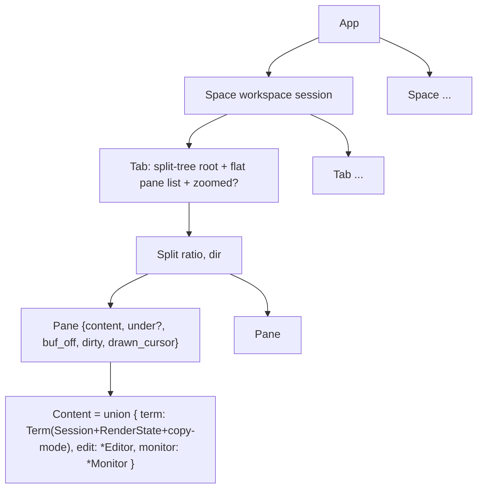

# 02 — Terminal, Multiplexer, Renderer, and Editor: Deep Analysis

Analysis pass: 2026-08-07/08. Repo: `/Users/sethlowie/go/src/github.com/incantery/rook`, branch `main`.
**HEAD at time of writing: `9ad05f3` ("session: the pty is drained while the parser parses", 2026-08-07 21:49)** — one commit past the
`291f6d0` snapshot the underlying research notes were taken at. This matters: the two-stage PTY read pipeline that was an
uncommitted work-in-progress during the research pass **landed as a clean commit between the notes and this document**, with its
own A/B measurements in the commit message. Everything below is labeled against the committed HEAD.

Evidence labels used throughout: **Implemented**, **Partially implemented**, **Scaffolded/prototyped**, **Documented only**,
**Obsolete/dead**, **Unclear**, **Inference**. Line numbers were verified at `291f6d0` (notes pass) and re-spot-checked at
`9ad05f3` for the load-bearing ones; `session.zig`/`pty.zig` line numbers cited here are from the post-pipeline HEAD.

---

## Part I — The terminal + multiplexer

### 1. Architecture verdict up front

Rook's terminal half is a **single-process, native macOS terminal emulator with a tmux-style multiplexer folded into the same
process**: one AppKit window, one Metal layer, N PTY sessions, a binary split tree per tab, tabs per "space" (workspace session),
all rendered as one scene out of one shared GPU cell buffer. There is **no daemon, no server/client split, no detach/reattach,
and no persistence of any kind**. The VT engine is not rook's — it is **upstream ghostty's extracted `ghostty-vt` library**,
pinned by commit hash.

**Similarity verdict** (evidence-driven, expanded in §10):

| Compared to | Verdict |
|---|---|
| Traditional emulator (xterm/Alacritty) | Same single-process fd→parser→grid→GPU shape, but N PTYs in one scene + a control socket |
| tmux | Borrows the *vocabulary and model* (session/window/pane, zoom, copy mode, prefix chords), **rejects the architecture** (no server, no detach, no wire protocol) |
| Ghostty | Closest relative: literally the same VT core, transcribed key tables, same scrollback default, and (since `9ad05f3`) the same termio read pipeline ported by PR number. "Ghostty's engine, rook's app" — but **no image protocols on screen and no OSC 8 hyperlinks**: kitty graphics/sixel are parsed and executed by the shared engine and then dropped, because rook's renderer has no image path (§5). The divergence is in the app, not the engine |
| IDE terminal (VS Code/Zed) | Comparable embedding but **inverted priority**: the terminal is the substrate, the editor is a tenant pane |
| Novel | Content-agnostic pane tenants with `under`-parking; per-pane kernel-truth observability for agents; always-on key→photon instrument; ctl-socket e2e as primary verification |

### 2. The VT engine: ghostty-vt, pinned upstream, no fork

**Implemented.** Rook writes **no escape-sequence parser of its own**. The emulator is ghostty's `lib_vt.zig` module, consumed
as a Zig package:

- Pin (verified at HEAD): `app/build.zig.zon:47–49` —
  `.ghostty = { .url = ".../ghostty-org/ghostty/archive/2602886144c7e95099c9e2ba07f181c69e7276f3.tar.gz", .hash = "ghostty-1.3.2-dev-5UdBC0gi..." }`
  — **upstream `ghostty-org/ghostty` main @ 2602886 (2026-08-07)**. The surrounding comment references a quarterly bump
  checklist in `docs/ghostty-analysis.md`.
- Commit `291f6d0` (08-07) retired the previous `incantery/ghostty` fork. The fork existed for exactly one patch (an OSC 9/777
  desktop-notification effect, added in `808841d`); upstream absorbed it, so the fork's only diff became a deletion. The bump was
  pulled forward off the quarterly schedule **for security**: the pin force-compiles kitty graphics and executes its commands
  (file reads, shm, PNG decode) from any program's stdout, and upstream hardened that surface on 08-05 (commits ec04900ab,
  af2faa311, f766f303a, 727b8a02f per the rook commit message). "rook shipped the attack surface pre-hardening; now it doesn't."
- Adaptation costs recorded in `session.zig`: scrollback split into bytes/lines upstream (rook keeps bytes:
  `.max_scrollback_bytes = scrollback`, session.zig:481); unexported ghostty types recovered by **compile-time reflection over
  the Effects callback signatures** — `EffectRet(name)`/`EffectArg(name, i)` via `@FieldType` + `@typeInfo`
  (session.zig:~51–71, used at e.g. `effectNotify(h, n: EffectArg("desktop_notification", 1))`, session.zig:811). The comment
  says "worth reporting upstream". A new `progress_report` effect (OSC 9;4, ConEmu progress — what Claude Code emits) arrived
  with the bump and is **declared `null` — Documented only / unwired** (session.zig:572).

**Inference:** rook is likely one of the earliest external consumers of libghostty-vt as a package; the codebase repeatedly
treats ghostty as "the oracle rook already trusts" (keyenc.zig header, session comments).

### 3. PTY layer and shell lifecycle (`app/src/pty.zig`, 448 lines)

**Implemented.** Libc addressed directly (`extern "c"` openpty/fork/setsid/dup2/execvp/waitpid/tcgetpgrp/killpg…) because
Zig 0.16's `std.posix` no longer wraps process control (file header). Key mechanics:

- `Pty.open(Winsize)`: openpty; `FD_CLOEXEC` on the **master only** (the slave must be inheritable).
- `Pty.spawnIn(argv, cwd)`: fork; child does `setsid()` → `ioctl(slave, TIOCSCTTY)` → dup2 slave onto stdio → **closes every
  fd ≥ 3 up to `getdtablesize()`** (an inherited ctl-socket connection once kept `nc` from seeing EOF — the comment records the
  bug) → optional `chdir(cwd)` → `execvp` → `_exit(127)`.
- Shell: `$SHELL` else `/bin/zsh`, spawned as `{shell, "-l"}` (login shell — a Dock-launched app has a skeleton env) or
  `{shell, "-l", "-c", cmd}` for plugin `session.spawn` panes. `TERM=xterm-256color`, `COLORTERM=truecolor` set per spawn;
  `$ROOK_SOCK` exported (overwrite=0) so child shells inherit the instance's ctl socket path.
- Splits/tabs inherit the focused pane's **kernel-truth cwd** via libproc `PROC_PIDVNODEPATHINFO` — not OSC 7.

#### Teardown escalation — unusually good design

Committed in `9467cc3` ("eight live bugs from the zed deep-dive", 08-06):

- `ProcessGroups` (pty.zig:152) captures **two** process-group ids while the master is still open: the shell's pgroup and
  `tcgetpgrp(master)` (the current foreground job's pgroup). Rationale in comments: under job control the foreground job runs
  in its own pgroup, which a signal to the shell's group never reaches; a job trapping SIGHUP shrugs off the kernel hangup when
  the master closes. The comment cites zed shipping this orphan **twice** (zed#47412, #61467).
- `escalate()` (pty.zig:187): 100 ms grace (`grace_us`, pty.zig:139) → SIGTERM survivors → grace → SIGKILL. Runs **by value on a
  detached thread** for pane close (⌘W → SIGHUP immediately, then escalate; the Session may already be freed by the display-link
  reap) and **blocking on the main thread** for app quit ("quit is past the last frame; a detached thread would not outlive the
  process exit that follows").
- `terminateAll(groups)`: quit path — SIGHUP+SIGTERM together to every captured group, one grace, SIGKILL survivors. Wired from
  `App.hangupAllSessions` (macos.zig:2464), which walks all spaces × tabs × panes **including `pane.under` parked shells**,
  captures groups under `draw_lock`, signals outside the lock; invoked from AppKit's terminate callback (macos.zig:~9516).
- Tests spawn **real shells on a real pty** ("no mock can fail the way the kernel does"): one proves SIGHUP alone does NOT kill
  a `trap '' HUP TERM` shell (a vacuity guard) and that escalation ends it with SIGKILL specifically; another builds the real
  job-control topology (`set -m`, inner sh with its own pgroup) and asserts both groups go dark.

#### Non-blocking additions (landed with `9ad05f3`)

`readMasterNb` returning `union(enum){got: usize, dry, gone}` — distinguishes EAGAIN ("queue momentarily dry, bridgeable") from
EOF/EIO ("child gone"). Because **O_NONBLOCK is a property of the file description**, making the read side non-blocking makes
writes non-blocking too; `writeMaster` therefore grew an EAGAIN branch that polls POLLOUT (1 s timeout) so a large paste into a
slow reader is never truncated ("dropping the rest of the paste on the floor is not an option"). `setQosUserInitiated()` raises
both pipeline threads to `QOS_CLASS_USER_INITIATED` — the commit message notes that at default QoS the scheduler parks them on
efficiency cores "whose wakeup latency dwarfs the ~10µs producer/consumer cadence" (ghostty measured 15% throughput from QoS
alone).

### 4. The read path: from serial loop to two-stage pipeline

This is the single most consequential recent change, and its status changed during the research window.

**Problem statement** (from the `9ad05f3` commit message, corroborated by code comments): macOS hands a pty master **at most
~1 KiB per read regardless of buffer size** — ghostty instrumented it (their PR #13209): 6,337 reads, every one exactly 1024
bytes. Rook's old read→lock→parse loop therefore paid every per-cycle cost (lock, wake, kick) *per kilobyte*, and the child sat
blocked on a full kernel tty queue whenever rook was parsing instead of reading. "cat was never parser-bound here; it was
architecture-bound, since the parser IS ghostty's."

**Implemented (HEAD `9ad05f3`)** — an explicit port of ghostty's termio pipeline (PR #13209 plus their bb0ac4c72 idle-wake
fix, both cited by number in doc comments; "the constants are theirs, each one measured"):

```mermaid
flowchart LR
    subgraph child ["child process"]
        SH[shell / program stdout]
    end
    SH -->|"kernel pty queue (~1KiB reads)"| G

    subgraph pipeline ["Pipeline (per session, on gather thread's stack)"]
        G[gather thread<br/>readMasterNb + bridge] -->|"4 × 64KiB SPSC ring<br/>2 GCD semaphores"| P[parse thread<br/>stream.nextSlice under session mutex]
        P -.->|"idle self-pipe<br/>(interrupt bridge poll)"| G
    end

    P -->|"kick (only if focused + input pending)"| R[drawNow → drawFrame]
    R -->|"lockForSnapshot / snapshot_wanted"| RS[RenderState.update<br/>damage-tracked snapshot]
    RS --> FILL[fillPane → CellData<br/>shared GPU cell buffer]
    FILL --> GPU[Metal: 2 draw calls/pane<br/>present, maxDrawables=2]
```

Mechanics (`Pipeline`, session.zig:91–; `gatherLoop`; parser half of `readLoop`; verified present at HEAD):

- **Ring**: `buffer_count = 4` × 64 KiB fixed in-struct buffers ("ghostty measured: below 4 minor slowdowns, above 4 nothing").
- **Bridging constants**: `bridge_threshold = 1024` (a full kernel queue = a saturated writer worth waiting on; less = an
  interactive trickle, deliver immediately, session.zig:103); 16 non-blocking spin retries → 1 ms poll → 3 ms total budget
  ("well under a display frame, so batching is invisible on screen").
- **Synchronization**: ghostty used mutex + 2 condvars; **Zig 0.16 retired std.Thread's condvars**, so rook re-derived the shape
  for SPSC: each stage owns its own ring index; two **GCD `dispatch_semaphore_t`s** (`sem_free` = backpressure that lets the
  kernel queue push back on the child; `sem_ready` = published batches + a final done signal); one atomic `outstanding` counter
  answering the only cross-stage question ("is the parser out of work?").
- **Idle self-pipe**: when the parser empties the ring while the gather is mid-bridge, one byte through a non-blocking self-pipe
  interrupts the 1 ms poll — the bb0ac4c72 lesson ("bridging is only free while the parser is busy"); without it a frame-synced
  writer (frame, then cursor query, then block) pays the full poll timeout every round trip. If pipe creation fails, polls ride
  out their timeout — degraded, not broken.
- **Delivery-to-idle-parser rule**: if `outstanding == 0` the gather delivers immediately rather than bridging, because a
  request/response writer may be *blocked on a reply to data sitting in this very buffer*.
- **Fallback**: `readLoopSerial` (session.zig:584–598, three separate fallback sites verified) is kept for a pty that refuses
  O_NONBLOCK, a failed semaphore create, or a failed thread spawn — the pipeline degrades to the old serial behavior, never dies.
- **GCD trap documented**: a semaphore released below its creation value **traps**, so `close()` tops `sem_free` back up before
  `dispatch_release` (session.zig:166–173).

**Measured result (commit message, same-day A/B, same conditions)**: `cat` 150 MB **0.971 s → 0.517–0.557 s (−45%, ~280 MB/s)**,
"past nightly Ghostty's published M4 Max number on this M3 Max"; quiet-key `key_commit` p50 948–1048 µs → 758–847 µs; idle
unchanged. Tests: the ring's contract (order, backpressure, done) exercised bare, plus a real shell streaming 2 MB with a
mid-stream parser stall. Note the ~280 MB/s claim is the author's own arithmetic against the repo's own instrument; the Ghostty
comparison is against *their published number on different hardware* — flagged here as provenance, not verified externally.

**Cost accounting**: two threads per session (was one) + 256 KiB of ring buffers per session; nothing pools threads across
sessions. With agent workloads spawning many panes (`session.spawn`), this scales linearly — an open question flagged to the
author.

Around the parse sits the concurrency discipline that predates the pipeline (all **Implemented**):

- `Lock` is a hand-rolled wrapper over macOS `os_unfair_lock` (zero-init, any-thread, no std.Io handle).
- **`snapshot_wanted`** (session.zig:217, 451/457, 626/669): os_unfair_lock has no fairness; under a firehose the parser
  re-acquires back-to-back and starved the render thread for **hundreds of ms (measured; frame_update p95 hit 533 ms per
  PERF.md)**. The renderer sets the flag before locking; the parser spins `usleep(50)` between batches while it's up.
- **Gated kick**: after each parsed batch, a callback wakes the renderer **only if** this session is focused AND `input_mark > 0`
  (a typed key is awaiting its echo). This is "the wake-per-KB lesson": firehose output stays coalesced to display-link pace;
  keystroke echoes render within microseconds instead of waiting up to one vsync. (History: an earlier *faster parser* once
  slowed the real app via wake-per-KB — trust interleaved A/B over micro-benchmarks.)

### 5. Effects wiring, queries, and the OSC surface

**Implemented** (`session.zig` Effects vtable): DA1/DA2/DSR answered by writing straight back to the master (no lock on the
write path → no deadlock inside a held parse) — without these, "programs that query-and-wait (nvim does on exit) stall on their
response timeout". XTWINOPS answers rows/cols + cell pixels; XTVERSION answers `"rook <version>"`; ENQ answers empty;
`color_scheme` is **hardcoded `.dark`** (does not track the theme engine — Unclear whether intentional).

- **OSC 52 clipboard**: write-only (the library never forwards clipboard *read* requests — nothing on this path can leak the
  user's clipboard to a program); 8 MB cap — with a sharp in-code note that the OSC parser's own capture buffer **upstream is
  allocating and unbounded**, so this cap is "the only cap in the path". Drained every frame via an atomic `clip_pending`
  outside the lock ("a yank followed straight away by ⌘V is rare but real").
- **OSC 9/777 notifications**: fixed buffers (96-byte title, 256-byte body) under the session mutex; AppKit delivery on the main
  thread. **Bell** is an atomic flag, not a count ("ten bells in a burst are one 'something wants you'").
- **OSC 9;4 progress** (Claude Code's progress reporting): effect exists, wired to `null` — **Documented only**; a status-row
  slice is named in comments.

#### What the emulator surface does and does not do

The Effects table above is what rook *handles*; a reader comparing rook to Ghostty needs the complement as well, because the
two share a VT core and diverge entirely in the app.

**Answered / handled.** DA1/DA2/DSR, XTWINOPS, XTVERSION, ENQ; **OSC 0/1/2 window and icon titles** — note these *do* work
despite `title_changed = null` (session.zig:565): the library stores the title itself, and rook reads it back out on demand at
`tabTitle` (macos.zig:6400–6421, `tm.session.term.getTitle()`) to name tab chips and the status bar's `tabs` segment. A null
effect here means "rook does not need a callback", not "rook ignores OSC 2". OSC 52 clipboard **write-only** with an 8 MB cap;
OSC 9/777 desktop notifications; bell; bracketed paste; mouse modes 9/1000/1002/1003 with SGR 1006 encoding; and the kitty
keyboard protocol, which rook advertises **involuntarily** (ghostty-vt answers `CSI ? u` on its behalf — see §8).

**Parsed and executed, but never displayed: kitty graphics and sixel.** This is the sharpest gap and it is a security fact
before it is a feature gap. The vendored pin compiles the kitty graphics protocol and *acts on its commands* — the `291f6d0`
commit message states it directly: "the pin force-compiles kitty graphics and EXECUTES its commands — file-path reads, shared
memory, PNG decode — from any program's stdout". Meanwhile the renderer has **no image path at all**: `render.zig` creates
exactly two textures, an R8 glyph atlas and a BGRA colour-emoji atlas (render.zig:338–351), and there is no placement,
z-ordering, or image-cell code anywhere in the file. So a program that emits an image gets its file reads and PNG decodes
performed and its output silently invisible — all of the attack surface, none of the feature. That asymmetry is exactly why the
08-07 pin bump was pulled forward from the roadmap: upstream hardened that surface on 08-05 (four commits cited by hash in the
bump message) and "rook shipped the attack surface pre-hardening; now it doesn't."

**Absent.** OSC 8 hyperlinks — no handler anywhere in `app/src/` (grep for `hyperlink`: zero hits), so a `ls --hyperlink` or a
CI log's clickable URLs render as plain text. OSC 9;4 progress (declared null, session.zig:572). `color_scheme` is hardcoded
`.dark` and does not track the theme engine (session.zig `effectColorScheme`), so a `light` theme still reports dark to
programs that ask.

### 6. Resize, foreground identity, activity observability

- **Resize** (`Session.resize`): under mutex — geometry fields, `term.resize` (**reflow included** — ghostty does it), then
  `pty.setSize` (TIOCSWINSZ) outside the lock. Driven by `relayoutLocked`: per-pane cols/rows from rect minus padding (min 2×2),
  skip if unchanged, and **also resize `pane.under`'s parked session** (or a resize during editor takeover restores a mis-sized
  grid). Zoom-hidden panes (zero rect) deliberately keep their grid — resizing them to 2×2 would reflow scrollback on every
  zoom/unzoom. Background tabs relayout on activation, not eagerly.
- **Foreground identity** (`fgName`/`fgPath`): `tcgetpgrp(master)` + `proc_pidpath` — two syscalls, no cache, per-keystroke
  cheap. This feeds the ⌃HJKL nav-yield decision **by program name** (config `nav-yield`) — the third design iteration (a 3 s
  `fg` poll was wrong for 3 s after every vim; alt-screen state was exact but the wrong question — Claude Code uses the alt
  screen). `fgPath` exists because Claude Code's versioned install runs as a binary literally named `2.1.220`.
- **Activity stamps**: `last_out_ms`/`last_in_ms` atomics + an `out_bytes` counter ("a timestamp alone cannot tell a spinner
  from a cursor blink — their RATES differ by an order of magnitude"). Keyboard input stamps **only from the physical NSEvent
  monitor** — "an agent typing into a pane is not a human looking at it." Exposed via ctl `activity` and plugin op
  `panes.activity`. This per-pane, kernel-truth substrate observability for agents is one of rook's genuinely novel features.

### 7. Pane / tab / space model (`app/src/panes.zig`, 353 lines)

**Implemented.** Pure layout math + types; "the tree is layout only — session lifetime and focus live in App. All tree mutation
and layout happens under App.draw_lock" (header).

- `Content = union(enum){ term, edit: *Editor, monitor: *Monitor }` — panes are **content-agnostic tenants**; an editor is "a
  pane whose fill pass comes from a text buffer instead of an emulator"; the monitor fills via the same `fillGrid(cols, rows)`
  contract → zero new render code for the third pane kind (the monitor itself is §7.1).
- **`Pane.under: ?Term`** — the takeover mechanism: `rook edit`/`:e` on a terminal pane overlays an editor and *parks* the
  running Term; editor `:q` restores it via a reap handshake. The monitor gets the identical handshake.
- **Zoom is display state, not layout mutation**: `Tab.zoomed` set, tree untouched; `layoutTab` gives every other pane a **zero
  rect**, and zero is load-bearing — draw, hit test, and resize all already read it as "nothing here", so unzoom is exact by
  construction (panes.zig:181–192).
- `Space` = tmux's session: own tab set + active tab; switching spaces swaps the whole window's tab set; background spaces'
  shells keep running at **zero render cost** (never snapshotted). Spaces are created lazily by the palette and collapse when
  their last tab closes; **the last space closing calls `_exit(0)`** (macos.zig:5170) — "the terminal's work is done."
- `navigate`: geometric ⌃HJKL — nearest pane in direction with greatest cross-axis overlap.

**Good design worth naming**: zoom-as-zero-rect, the universal "hidden" encoding, and `under`-parking are single-mechanism
solutions reused by three content kinds.

### 7.1 The third pane kind: the monitor

**Implemented.** `Content.monitor` is the third tenant, and at 2,708 lines across three files (`procmon.zig` 787,
`monitor.zig` 1,010, `diskscan.zig` 911 — ~5% of `app/src/`) it is the largest subsystem the rest of this package passes over.
It also contains the only code in rook that **deletes user files**, which is why the actuation path is described here and
cross-referenced from the threat model (doc 03 §8.1) and the maturity table (doc 05 §2.2).

**Sampling — `procmon.zig`.** libproc and mach FFI directly, no fork: extern structs `ProcTaskInfo`, `RUsageInfoV4`,
`VmStatistics64`, `XswUsage` over `proc_pidinfo` / `host_statistics64`. The header states the rationale — `ps` "would be a
subprocess per sample at 1Hz forever, and it cannot answer the question this module exists for: which of MY panes is
responsible", which needs the parent chain and therefore a walk of every process anyway. `Sampler.attribute` charges each
process to a pane by walking parents to a pane's shell pgid. Two measured traps are documented at the top of the file and are
worth reading as a method exhibit: CPU times are **mach absolute units**, and the error *cancels* if the wall interval is
measured with the same unconverted clock — "which is how this survives review" — so the rule is never-mix, with the interval
taken from `std.time.Instant`, a genuinely independent clock; and **RSS is not memory** (`pti_resident_size` double-counts
shared pages — 32.3 GB summed on a 38.7 GB machine that was nowhere near full), so ranking is by `ri_phys_footprint`, the
number Activity Monitor shows, with RSS kept beside it only because it is what `top` prints.

**Rendering — `monitor.zig`.** "A view model and nothing else. It owns no threads, takes no locks and calls no syscalls" — it
is handed a `procmon.Snapshot` and a `diskscan.Scan` and returns styled cells. Two sections (`Section = enum { live, disk }`,
monitor.zig:43) tabbed at row zero. Crucially it renders through **`fillGrid(cols, rows)` — the same contract
`editor.fillGrid` has** (monitor.zig header, "the app's existing editor fill path draws this pane with no new render code"),
and it borrows the *editor's* `Style` enum rather than inventing a palette, "because a monitor that invented its own palette
would need every theme to be updated before it looked right in any of them". That is why §14's "one GPU path, three CPU fills"
costs three fills and not three renderers. The choice of pane over side panel is argued in the header too: both halves are
tables whose numeric columns only mean anything side by side, and a 30-column side pane "turns those into a list of truncated
titles, which is the one shape that throws away the reason to look."

**Scanning — `diskscan.zig`.** A du-style walk (`max_nodes = 200_000`, diskscan.zig:373; `truncated` set rather than silently
capped) with four APFS-specific corrections stated as measured mistakes: blocks not apparent size (`st_blocks * 512`, with
`apparent` kept beside it "so the gap is visible rather than silently picked"), hardlinks deduped by `(dev, ino)`, never cross
a device (the root's `st_dev` is the fence), never follow a symlink. The design centre is the classifier: **the axis that
matters is regenerable, not big.** Every node carries a `Reclaim` class (diskscan.zig:77) and the view groups by class before
size, because "on a working agent box the biggest directories are a mix of things that rebuild in thirty seconds and things
that are the only copy in existence, and size does not tell them apart: `node_modules` and a folder of agent transcripts look
identical to a sorter." The `categories` table (:119) is deliberately conservative — `node_modules`, `.zig-cache`,
`DerivedData`, the Go module cache, brew, docker, uv are `regenerable`; `build`/`dist`/`out` stay `unknown` and are reported
without an opinion, "because a classifier that is wrong in the safe direction costs you a manual `rm`; wrong in the other
direction it costs you work you cannot get back." `agent-transcripts` (:122) is explicitly `keep`, with its own test asserting
that nothing may offer to delete it (diskscan.zig:704) and a second test asserting no `keep` class is ever `deletable()`
(:726).

**Lifecycle.** One sampler for the whole app, not one per pane ("the process table is a property of the MACHINE, and two panes
sampling it independently would differ by their phase and disagree", macos.zig:721–724), and it **runs only while a monitor
pane is visible**: `startSampler` (macos.zig:6687) spawns at most one thread on the `sampling` atomic, the loop re-checks
`monitorVisibleLocked` (:6673) under the draw lock every tick and `break`s when no visible pane is a monitor. The stated reason
is the product's own pitch — "an always-on 1Hz walk of 1800 processes is 0.3% of a core spent on a screen nobody is looking
at, and rook's whole pitch is that it costs nothing when idle" (macos.zig:727–731). One sample is ~4 ms for 1,800 processes,
which is why the pane→pid map is collected under the lock and the syscalls are made outside it. Disk scans single-flight on a
`scanning` atomic and say so rather than queueing.

**The ctl surface is read-only**: `monitor` opens the pane and `monitor live|disk` also selects a section (ctl.zig:987–1003),
`disk` dumps the disk half. There is no `reclaim` verb.

**Actuation — the only path in rook that deletes user files.** `startReclaim` (macos.zig:6860) is reached from the pane's
confirm (`Monitor.Act.reclaim`, monitor.zig:626) and nowhere else; its doc comment says "everything destructive in this
feature funnels through here, and it re-checks every guarantee rather than trusting that the view already did… `monitor.zig`
cannot delete anything, so this function is the entire blast radius." In order: it **re-derives the category from the path**
via `diskscan.classify` rather than trusting what the view staged (:6866–6876 — "a stale category on a re-scanned tree is
exactly how a `keep` directory would end up deleted"), refuses anything whose class is not `deletable()`, single-flights on the
`reclaiming` atomic (:6878), then on a detached worker either `std.Io.Dir.cwd().deleteTree(path)` or — where the category
names one — `runTool` (macos.zig:9543–9560), which forks and `execl("/bin/sh", "sh", "-c", cmd)`. That shell branch is safe by
construction and says why: the commands come from `diskscan.categories`, "a compiled-in table, not user input and not anything
a plugin can reach", written the way their own documentation writes them (`go clean -modcache` handles the read-only bits a
recursive unlink trips over halfway), and "nothing here interpolates a scanned path into the string; a reclaim that needs a
path uses the delete branch instead, which never goes near a shell."

**Coverage** (see doc 05 §2.2): 24 inline unit tests combined — monitor 10, diskscan 9, procmon 5 — each with its own
`build.zig` test root (:255, :261, :273), plus the e2e `monitor` scenario (app/e2e/main.zig:50, "live rows, disk classifies,
**keep refuses deletion**"). The destructive path itself has guards but no direct test.

### 8. Input paths

#### Keyboard (`app/src/keyenc.zig`, 729 lines) — **Implemented**

Born from a real bug (commit `44630c8`): shift+Tab reached Claude Code as macOS's 0x19 (NSBackTabCharacter) instead of
`ESC [ Z`, so its mode cycle never fired. Now a **pure function** of four NSEvent facts + terminal modes — zero AppKit imports,
headless-testable, ~30 tests. Tables **transcribed** (not imported — lib_vt publishes the emulator, not ghostty's input side)
from ghostty's `key_encode.zig`/`function_keys.zig`/`kitty.zig`, cross-checked against xterm ctlseqs and the kitty spec.

Two deliberate macOS divergences from ghostty, stated in the header:
1. **Option is a compose key, not Alt, for text-producing keys** (IME gets first refusal; Option IS Alt on named keys —
   arrows/backspace/tab — where alt+backspace is a load-bearing shell motion).
2. **macOS pre-cooks ctrl combos** (ctrl+C arrives as 0x03), so `ctrlSeq` is a fallback, not the primary path.

Notable: **rook advertises the kitty keyboard protocol whether it means to or not** — ghostty-vt answers `CSI ? u` and honors
mode pushes on rook's behalf; before keyenc "the answer was a promise rook did not keep". Now disambiguate/report_all/
report_associated are honored; **key-release events are structurally impossible** (the NSEvent monitor subscribes
`NSEventMaskKeyDown` only) — stated plainly in the header rather than discovered later. Modes are read per keystroke from the
emulator without the session mutex; worst race cost = one key encoded against a frame-old mode.

Event flow (macos.zig:~9163+): NSEvent monitor → stamp activity → ⌘ chord table (through the keybinding registry — "a chord
that bypassed it would be a capability the palette and ctl `run` could not reach") → ⌃HJKL nav (yield by fg-program name) → IME
first refusal → `keyenc.encode` → leader chord check → `writeFocused(bytes, kernel_timestamp)`. `writeFocused` routes through
**one** chrome-priority function (welcome → palette → side panel → pane) shared by real keys and ctl `press` — "keeping the
priority in both is how they drift."

#### Paste (`app/src/paste.zig`, 137 lines) — **Implemented**, with one scaffolded gate

Pure data-in/data-out; "the rules are xterm's, by way of ghostty; they are not ours to invent." A `STRIP` table (paste.zig:21;
NUL, ⌃C, EOT, ENQ, BS, kill chars, ⌃Z, **ESC**, DEL…) replaces control bytes with spaces on ANY insertion. ESC (paste.zig:35)
is the load-bearing entry: an injected `\x1b[201~ rm -rf /` end-fence **can never survive the strip**, so pasted text cannot
close its own bracket — a test proves the only `201~` fence in output is the one rook wrote (paste.zig:~50, 63). Bracketed
paste is asked of the emulator per paste (DECSET 2004). Unbracketed: `\n`→`\r` ("looks wrong and is exactly what xterm does").
`isSafe()` (newline / embedded-fence detection) **exists but nothing gates on it** — the confirmation modal is
**Documented only**; the in-code comment says so.

#### Mouse — **Implemented**

`Session.mouseMode()` reads DECSET 9/1000/1002/1003 + SGR 1006 from emulator modes ("emulator truth, no heuristic"). SGR and
legacy X10 encodings; shift forces local selection (the terminal convention); local drags drive `Screen.select`; wheel → SGR
buttons 64/65 when app-owned, → **arrow keys on the alt screen without mouse mode** (vim/less convention), → history scroll on
the primary screen.

### 9. Scrollback, copy mode, search

**Implemented; scrollback is in-process (ghostty's PageList), NOT host-backed.** Historical memories of "host-backed
reverse-paginated scrollback" describe the *deleted* pre-07-29 Go/webview architecture and do not describe this code.

- Cap: `max_scrollback_bytes` per session; config `scrollback` default **10 MB** (config.zig:346). Commit `6225f12` found
  ghostty-vt's embedded default was 10,000 **bytes** (~930 rows — "the right floor for an embedded widget"); rook sets 10 MB
  like ghostty-the-app. kb/mb/gb suffixes; `scrollback-limit` accepted as ghostty spells it; 0 is a real answer; >1 GB warned
  and clamped. **Launch-time only, on purpose**: a pane's limit is fixed when its PageList is built, and live-reload would
  silently give new panes different history depth than open ones — an unusual anti-inconsistency argument for *not* supporting
  live reload.
- Copy mode (tmux `<leader>[`): j/k/d/u/f/b, gg/G, `/` prompt, n/N; "a viewport, not an input mode" — pasting or typing exits.
- Search: ghostty-vt's `vt.search.Screen` does the searching; "all rook adds is a lifetime and a viewport move."
  **Known freeze risk, flagged in-code**: rook uses the **blocking** `searchAll()` under the session mutex (the library also
  offers the incremental tick/feed API ghostty itself uses off-thread) — "worth revisiting the moment someone feels it on a big
  buffer." Alt-screen swap invalidation: results built against a screen pointer; if `search_of != screens.active`, drop results
  rather than lie. Matches ordered newest-first so the first `n` lands nearest where you were looking.
- A documented invalid-free bug in selection→clipboard (`copyFocused` keeps the sentinel in the type): slicing `[:0]` to `[]`
  once handed the allocator a mismatched length that "only aborts when len and len+1 land in different size classes."

### 10. Persistence, detach, crash — **Not implemented, by current design**

- **No session persistence**: no layout save/restore anywhere in `app/src` (searched persist/restore/reattach/detach). Tabs,
  spaces, splits exist only in App memory.
- **No detach/reattach**: sessions are child processes of the app holding the only master fd. UI exit = session death. The last
  shell exiting exits the app (`_exit(0)`).
- **Clean quit** (⌘Q): `hangupAllSessions` → SIGHUP+SIGTERM to every captured pgroup pair (including parked `under` shells),
  100 ms grace, SIGKILL survivors — blocking on the main thread.
- **Hard crash**: the kernel closes the masters → SIGHUP to each pty's *foreground group only*; a SIGHUP-trapping job or a
  background job in another pgroup survives as an orphan. The escalation ladder only runs on orderly teardown. Scrollback,
  layout, everything is gone.
- The one "remote-control" surface is the ctl socket (`/tmp/rook.sock`, `$ROOK_SOCK`) — a line protocol driving the UI process
  (`dump`, `shot`, `type`, `key`, `split`, `activity`, `stats`, plugin ops). It is observability/automation ("Playwright-grade
  visibility for a native app"), **not** a session server.

This is the deepest divergence from tmux, and it sits in tension with the project's own agent direction ("run everything from
your phone" implies *something* survives the UI). The code is silent; roadmap docs may promise otherwise but were not treated
as evidence.

---

## Part II — The render stack

### 11. Shape

**Implemented.** A **single Metal cell-grid pipeline** (`app/src/render.zig`, 866 lines) driven by an AppKit + CVDisplayLink
shell in `app/src/macos.zig` (9,566 lines; drawFrame ~5207–5517, fills ~8660–9124). No scene graph, no retained UI framework,
no webview (the JS frontend was deleted 07-29). **Caution on docs**: `docs/PERF.md` and `docs/render-latency.md` are the *dead
webview app's* scoreboard and diagnosis — both say so in their headers (verified: "This is the webview app's scoreboard…
superseded… no number here should be quoted as rook's"). The live scoreboard is `app/PERF.md`.

Design center (stated in comments, verified in code):
1. **Zero idle frames** — the display link ticks forever, but a frame with no dirty pane returns before touching Metal.
2. **Key→photon is the metric**, measured end-to-end in-app (NSEvent kernel timestamp → `CAMetalDrawable.presentedTime`, same
   clock), consumed only by frames carrying the focused pane's echo.
3. **Latency over throughput pacing**: `maximumDrawableCount = 2`; no continuous presenting — the ProMotion "hold" was
   implemented, A/B-measured at **+8.6 ms p50**, and reverted (commit `27c1fe9`, verdict comment kept inline at the skip branch
   so it "does not come back without a pacing design that leaves a drawable free").

### 12. Graphics pipeline detail

Three PSOs compiled at init from one embedded MSL string via `newLibraryWithSource:` (no offline shader compilation):

- **bg**: instanced background quads, one per cell, no blending.
- **fg**: instanced glyph quads, premultiplied-alpha; fragment samples two atlases — R8 monochrome and BGRA color/emoji —
  selected per cell by a flag bit via `mix()`.
- **rr**: a **signed-distance-field rounded-rect** shader doing fills, inside borders, and soft shadows from one uniform struct;
  `soften > 0` turns the shape into pure falloff (shadow).

Per-cell GPU data: `CellData` = `bg[4]u8, fg[4]u8, uvx:u16, uvy:u16, flags:u16, pad` — **16 bytes/cell**, `extern` layout with
comptime asserts against the MSL struct. `flag_no_bg` (bit 2) degenerates the bg quad so a cell can sit ON a rounded card
without squaring its corners — the completion-menu mechanism, and an unusually elegant way to keep floating UI inside the cell
grid (and therefore visible to `ctl dump` and the e2e harness). A recorded MSL/Zig alignment gotcha (Metal aligns float4 to 16,
Zig aligns [4]f32 to 4 — the first uniforms version silently drew nothing) is now pinned by `@sizeOf(RRUniforms)==80` asserts.

**Cell buffer ring** (`cells_bufs: [3]objc.Object`, render.zig:274; ring rationale at 253): 3 shared-storage MTLBuffers of
`max_cells * 16` bytes (`max_cells = 64 * 1024` → 1 MiB × 3). Correctness by arithmetic instead of completion handlers: with
`maximumDrawableCount=2` at most two frames are in flight, so the slot being filled was last read three frames ago. History:
single shared buffer until `9467cc3` — **zed shipped the identical CPU-fill-races-GPU-read bug**; the A/B showed the ring is
latency-free. `beginFrame()` advances the ring **only on drawn frames** — idle costs nothing.

**Glyph atlas**: two 2048×2048 textures (R8 mono, BGRA color). Lazy rasterization on first sight via CoreText into a CPU
scratch bitmap, `replaceRegion:` upload of just that slot; shelf packing; wide glyphs take 2-cell slots with spacer-tail UV
sampling. Font resolution: base font (default FiraCode Nerd Font Mono, so PUA icons resolve directly) then `CTFontCreateForString`
system cascade; color fonts detected by trait; emoji resized to ¾ cell height (Apple Color Emoji's em square overflows text
metrics). **Grapheme clusters get real CTLine shaping** (attributed string + `CTLineDraw`) because per-codepoint mapping can't
ligate ZWJ sequences or position combining marks; the cluster cache is keyed by **Wyhash64 of the cluster bytes** — a
collision-tolerant choice so the cache never owns byte buffers across atlas resets (**Inference**: a 64-bit collision would draw
the wrong glyph; accepted trade, not documented as such). Box-drawing and block elements are **procedurally drawn edge-to-edge**
(a font glyph centered in a ceil'd cell leaves hairline seams — "the nvim-logo bug"). **Atlas-full policy**: drop the whole
cache and restart at (0,0) — "one flashed frame is acceptable for now"; cells already filled this frame keep stale UVs, so the
flash is real.

Two documented war-story fixes live at the code that would regress them: the `CTLineDraw` text-matrix leak (a cluster drawn once
made neighboring plain glyphs vanish) and the CoreVideo deadlock (below).

### 13. Frame scheduling, threading, invalidation

**Threads that render**: (1) the CVDisplayLink thread — the frame clock (`displayLinkCallback` → `drawNow` → `draw_lock` →
`drawFrame`); (2) **per-session parse threads** via the input kick — the echo frame is drawn *on the parser thread* within
microseconds of the echo, not at the next vsync; (3) the main thread never encodes frames (resize observer retargets
`drawableSize` in pixels — "or CoreAnimation scales the framebuffer — the squished-glyph bug"); (4) the ctl thread mutates
scene state under `draw_lock` and never draws synchronously ("encoding from the calling thread contends on nextDrawable —
measured wedge").

**Dirty model**: `scene_dirty` (layout/focus/chrome, ~50 set sites) + per-pane dirty computed each tick: terminal panes via
ghostty `RenderState.update()` under the session lock **plus a cursor diff** (ghostty's dirty tracking is row-content only, so
cursor-only moves — backspace, arrows, DECTCEM — are caught by comparing a packed cursor key against `drawn_cursor`, focused
pane only); editor panes via a `render_dirty` flag set synchronously by the key machine; monitor panes via a sampler-set flag.
**Hidden panes and background tabs/spaces are never snapshotted** — PERF.md measured `yes` firehosing in a hidden tab for 4 s =
1 frame drawn, 480 skipped. `focused_dirty` is tracked separately because **only a frame carrying the focused pane's echo may
consume the key→photon mark** — a 2 Hz HUD refresh once stole marks and skewed quiet-key p50 by ~4 ms.

**The skip branch is the latency strategy**: nothing dirty → `frames_skipped++`, return. With 2 drawables, continuous presenting
saturates the swapchain and echo frames queue behind hold frames — quiet-key p50 23.1 → 31.7 ms, drawable_wait 60 µs → 5.3 ms
(the reverted ProMotion experiment's numbers, kept inline).

**Frame body** (drawn frames): drains under draw_lock (reap, clipboard, search, view reconcile, LSP drain/tick) → 2 Hz HUD +
config live-reload poll + buffer disk poll → cursor blink (the one continuous animation, gated to frontmost + cursor visible)
→ snapshot pass → fill pass (each visible pane bump-allocates a slot in the shared cell buffer; chrome appends after pane
cells — "a widget is never a draw call of its own kind, just more instanced cells and rects", ui.zig header) → `nextDrawable`
(failure **re-arms scene_dirty and retries next tick** — the emulator's dirty state was already consumed; losing the frame
would freeze the change) → one render pass in strict order (pane bg rects → completion cards → grids → separators → status/tab
bars → side pane → IME preedit → which-key → palette) → present + commit with completed/presented handlers feeding the stats
rings. A pending ctl `shot` reads back rook's own drawable (`framebufferOnly=false` exists for this) and writes a PNG — no
screen-recording permission needed, works occluded.

**The CVDisplayLink deadlock (fixed, documented)**: `CVDisplayLinkGetActualOutputVideoRefreshPeriod` must never be called under
`draw_lock` — the query blocks inside CoreVideo waiting on the link's own thread, which is waiting on draw_lock. Diagnosed via
`sample` of a hung instance. Now the link thread answers before taking the lock, caching into an atomic.

**Latency-relevant layer config**: `maximumDrawableCount=2`; `framebufferOnly=false` — **a knowingly-accepted marginal cost,
not a measured-free one**: macos.zig:1063–1065 reads "false so the ctl `shot` command can read our own drawable back —
dev-tool visibility outranks the marginal framebufferOnly win", and no measurement of this setting appears in `app/PERF.md`.
The trade is agent-legible screenshots for a small GPU concession. `setOpaque` when
`background_opacity >= 1.0` — **opaque is a hard requirement for direct-to-display scan-out** (~4 ms present_lag vs ~12 ms
composited); glass mode knowingly trades scan-out away and the launch log says so. `present_lag` (presentedTime − commit) is
used as a **compositor detector** because no macOS API reports the mode — a genuinely clever instrument.

### 14. Terminal vs editor fills: one GPU path, three CPU fills

- **Terminal** — `fillPane`: walks ghostty `RenderState.row_data`; resolves bg/fg from Style + palette; selection tint, faint,
  inverse video (renderer-side, matching upstream), cursor as one more inversion, pane-dim (unfocused panes slide toward their
  own background); grapheme clusters re-encoded to UTF-8 → cluster cache; wide glyphs + spacer tails.
- **Editor** — `Editor.fillGrid(cols, rows)` produces a styled `RCell` grid (pure text, headless-testable), then `fillCellGrid`
  maps ~45 semantic style enums to theme colors and atlas slots.
- **Monitor** — reuses the editor's RCell/fillGrid contract *by design*: "a new pane kind should not mean a new render path…
  and a second place for a wide-glyph bug to live."

The editor's syntax highlighting runs inside the fill; see §20 for the incremental-parse story (42 ms/keystroke → sub-ms).

### 15. Instrumentation and bench harness

**Implemented, always-on, zero-alloc** (`app/src/stats.zig`, 177 lines): 1024-sample u32 µs rings with exact percentiles
computed by copy+sort at cold query time. Rings: `key_present` (THE number), `key_commit`, `frame_update/fill/encode`,
`hl_reparse`, `cpl_build`, `drawable_wait`, `frame_gpu`, `present_interval`, `present_lag`; counters for bytes_in,
frames drawn/skipped, glyphs rasterized. Key latency is **true key→photon**: kernel NSEvent timestamp → drawable presentedTime,
same clock, consumed only by echo-carrying frames. The HUD's fps figure is capability, not cadence — it shows the display rate
and dips only when p50 frame cost exceeds the vsync budget ("demand pacing must never read as lag").

**Bench harness** (`app/bench.sh`): ReleaseFast build, pinned config (the live config's theme/opacity must not skew runs),
poisoned `XDG_STATE_HOME`; four phases over the ctl socket: idle 5 s, 60 quiet keys @80 ms, firehose 5 s, `time cat` of a
150 MB base64 corpus. **Occlusion tripwires**: macOS throttles a fully-occluded window's presents to a hard 10 Hz — each latency
phase now flags itself invalid if its numbers quantize to the throttle clock. A bench that refuses to produce garbage numbers
is rarer than it should be. Honest caveat recorded: bench key timestamps are ctl-receipt, not kernel keystrokes.

### 16. Current benchmark claims, with provenance

All numbers are **self-reported by rook's own in-app instrument** on the author's M3 Max, 120 Hz panel, recorded in `app/PERF.md`
and commit messages. None are third-party verified. The instrument's failure modes (mark-stealing, occlusion, >500 ms gaps) are
themselves documented and guarded.

| Claim | Number | Provenance |
|---|---|---|
| Key→photon p50/p95, windowed | 15.5 / 26.4 ms | app/PERF.md:23, July 27 baseline, on-glass unobstructed |
| Key→photon, fullscreen (direct scan-out) | 8.5 / 14.4 ms | app/PERF.md:24 |
| Key→photon, 08-07 valid on-glass run | 23.0 / 29.0 ms | app/PERF.md — **explicitly flagged unresolved**: +7.5 ms sits entirely in present_lag (13.8→21.6 ms) with a second display attached + loaded machine; the doc prescribes a single-display rerun before calling it a regression |
| `time cat` 150 MB (serial loop era) | 0.884–0.923 s band; 0.971–0.980 s in the 08-07 environment | app/PERF.md:30 + history rows |
| `time cat` 150 MB (pipeline, HEAD) | **0.517–0.557 s (−45%, ~280 MB/s)** | commit `9ad05f3` message, same-day A/B, same conditions |
| vs installed Ghostty 1.3.1, same machine | rook 0.911 s vs Ghostty 1.610 s | app/PERF.md:85, July 27, with the caveat in the doc that Ghostty nightly is much faster and rook did less per cell then |
| Firehose pacing | present_interval p50=p95=p99 = 8333 µs (120 fps, zero wobble) | app/PERF.md |
| Idle | 0 frames, 0 GPU work; RSS ~88 MB | app/PERF.md |
| Startup | exec→ctl ~81 ms; exec→live shell ~118 ms; config parse 53–90 µs | e2e `startup` bench + `boottime` ctl verb |
| Editor incremental highlight | 42 ms full reparse/keystroke → sub-ms | commit `6d154bd` message + `hl_reparse` ring |
| Occlusion ladder | 15.5 ms unobstructed / ~23 ms behind windows / 26–30 ms at 10 Hz-throttled | app/PERF.md 08-06/07 series; display rate now a mandatory scoreboard axis |

The measurement culture is a call-out-worthy strength: every perf-affecting change is bracketed by the same instrument, and two
"obvious wins" (ProMotion hold; an earlier faster parser) were **reverted against their own measurements**, with the data kept.

### 17. Performance threats (opinionated, evidence-cited)

1. **The frame loop is becoming the app's event loop, and it holds one lock.** File IO runs under `draw_lock` on the frame
   path: the ~1 Hz buffer disk poll does a `stat` per open editor pane; config polling hashes files; LSP/clipboard/search drains
   run at the top of every tick. On a hung network filesystem this stalls *all* rendering and input routing.
2. **Editor echo waits for the tick.** Terminals get the parser-thread kick; editor keystrokes wait for the next display-link
   tick (≤8.3 ms at 120 Hz, ≤16.7 ms at 60 Hz). `drawNow` has exactly two callers (link callback, input kick) — there is no
   post-`writeFocused` kick for editor/chrome input. On 60 Hz glass, editor typing pays up to a full extra frame vs terminals.
3. **Never-stopping display link**: no `CVDisplayLinkStop` anywhere — an idle rook wakes a thread at panel rate forever, takes
   draw_lock, runs drains + a row-dirty scan, and returns. "Idle = 0 frames" is true but is a *frames* metric; wakeups/CPU/power
   during idle are unmeasured (**Inference**). Ghostty and zed both pause their frame clocks. CVDisplayLink is also deprecated
   API (acknowledged; CAMetalDisplayLink named as successor).
4. **Atlas reset flash** recurs pathologically if a workload cycles more distinct glyphs per frame than the atlas holds
   (~4,200 narrow slots at 18 pt retina); stale UVs in already-filled cells make the flash real.
5. **64 Ki cell cap silently truncates**: `off + cols*rows > cells_cap` clamps rows; a 5K display at small font with several
   panes could hit it; the bottom of later panes would just not draw, and no stat counts it.
6. **Highlight flatten scales with file size, not edit size**: incremental parsing still `dupeRange`s the entire rope (≤4 MiB)
   per version change — an alloc+copy per keystroke in big files; tree-sitter's streaming input API is unused.
7. **RenderState memory retention**: upstream docs recommend periodic deinit (high-water retention); rook never deinits a live
   pane's `rs` — a one-off giant scrollback viewport pins that memory for the pane's life.
8. **Wyhash cluster-key collision** draws the wrong glyph; astronomically unlikely per pair, but the cache is only aged by
   atlas resets.
9. **Blocking `searchAll` under the session mutex** (§9) — a big-scrollback search can freeze the pane's parse and the frame
   that wants its snapshot; flagged in-code as revisit-when-felt.
10. **Two threads + 256 KiB per session** post-pipeline, unpooled — linear with pane count, relevant to agent decks.

---

## Part III — The editor

### 18. Text model

**Rope** (`app/src/rope.zig`, 427 lines) — **Implemented**, the editor's only text storage ("Seth's call: rope from day one, no
storage migration later"). Binary tree over ≤2048-byte leaves (`leaf_max`, rope.zig:15); the **only metric is newlines**, summed
up the tree → O(log n) offset⇄line queries. No rotations; recursive-descent insert/delete with metric fix-up; height drift past
`2*log2(leaves)+4` triggers a full O(n) rebuild ("edits are localized in practice, rebuilds are rare" — no telemetry on whether
it ever fires). **No structural sharing**: undo stores deleted *text*, not tree snapshots. No zero-copy read iterator — every
consumer copies out. Tested by a 2000-op **differential test against an ArrayList oracle** checking full content + line metrics
every step. Honest assessment: deliberately simple; fine at the 4 MB file class it targets, which is explicitly the strategy.

**Buffer** (`app/src/buffer.zig`, 1,032 lines) — **Implemented**; the *document* in an Emacs buffer/window split:

- **Disk claim**: `DiskState{mtime_ns, size, inode}` — all three compared, because rook's own save is replace-by-rename.
  `onDisk()` returns `same | changed | gone`, and **gone is deliberately not a kind of changed**: reload-on-gone was a shipped
  bug (empties the pane, then `:w` resurrects a deliberately deleted file; fixed in `9467cc3`).
- **Undo**: grouped stacks of `Edit{off, inserted_len, deleted (owned), group, seq}`; `group_pinned` lets `:g`/`:normal` pin
  many primitives into ONE undo group. **Save-point by sequence number, not a dirty flag**: the seq atop the undo stack
  identifies the content *state*, so undoing back to the save point reports unmodified again (five tests pin it).
- **Version-tagged edit log for parsers**: `edits` is a capped (64) FIFO of `TreeEdit`s (literally `ts_tree_edit`'s shape,
  recorded with old coordinates *before* the rope moves; undo/redo re-recorded — "an undo is an edit as far as a parser is
  concerned") that **nobody drains**: `editsSince(v)` *slices* per consumer with an eviction floor, because a document open in
  two panes has two tree-sitter parsers with different "since" versions — the drain-once API caused highlighting that was
  "not wrong loudly, just wrong" (fixed `9467cc3`; test "two parsers each get their own slice of the edit log").
- **Watcher seam**: up to 16 callbacks invoked on every edit — how N panes' marks/jumplists shift precisely.
- **Atomic save**: resolves symlinks and writes *through* them; atomic create+rename; carries old permissions across (rename
  installs a new inode); refuses with `error.ChangedOnDisk` when the claim no longer matches. Each property has a test that
  describes the disaster it prevents.
- `lsp_version` and `fmt_req_version` live on the **document**, not the view — two panes must not each sync the server, and a
  format reply must be applied against the exact text it was requested for (a zed-derived fix).
- **Not present**: persistent undo, swap files, autosave, session persistence of open buffers. Undo history dies with the
  process.

**Document registry** (`app/src/docs.zig`, 233 lines) — **Implemented**: one file = one `Buffer` shared by N panes; flat
ref-counted list, **case-insensitive path keys** (macOS filesystems). Deliberately *not* a cache — last release frees the doc so
reopening re-reads disk ("what you want after a git checkout"). Cross-view convergence: marks/jumps shift precisely via the
watcher seam, but the **cursor only clamps** on another view's edit — self-documented as coarser than Emacs ("making the cursor
a real anchor is the follow-on"). **Partially implemented** on that axis.

### 19. Vim emulation: depth and the oracle method

**Implemented, deep.** `app/src/editor.zig` is a single 14,159-line file; one `Editor` struct; **~41% of the file is tests**
(~306 `test` blocks). The header declares — and the structure delivers — "Pure model: keys in, a styled character grid out.
No renderer imports… `zig test src/editor.zig` drives the whole machine headless." Every integration (highlighter, LSP, docs,
app commands) is a **nullable function-pointer seam**; with all hooks null it degrades to standalone vim.

Coverage (verified by sampling + test names): modes incl. visual block; operators × motions with **multiplied counts**
(`3d2w` = 6 words — one of five `9467cc3` oracle fixes); text objects; f/F/t/T with multi-byte codepoint targets; registers
(26 named with uppercase-append, `"0` yank, `"1`–`"9` delete ring, black hole, blockwise *shape* stored so `p` puts rectangles
back); macros sharing the registers (vim's arrangement; depth-16 recursion cap, played off a dupe so a macro can yank into its
own register); **dot-repeat recorded by RESULT, not key table** — keys accumulate and are promoted to `.` only if
`buf.version` moved when the machine goes quiescent, eliminating the "which keys are changes" list entirely (genuinely nice
design); marks/jumplist as **byte offsets shifted by the watcher on every edit** — including other panes' and undo — a
*stronger* guarantee than vim (vim discards marks in deleted ranges; rook collapses to the deletion start, documented
divergence); `R` replace-mode with displacement history; ctrl-a/x; `:g/:v/:s///` with a vim-magic regex engine
(`app/src/regex.zig`, 1,054 lines — backtracking, step budget 200k, ASCII classes only, no `\v`); `:m/:t/:normal` with pinned
undo groups; search-as-you-type with full state restore on ESC; block I/A with vim's skip-vs-pad distinction.

**Unicode model**: movement unit is the **grapheme cluster** with segmentation and width from **ghostty's own tables**
(`vt.unicode.graphemeWidth`) — the terminal and editor can never disagree about width. Case operators use
`app/src/unicase.zig`, whose tables were **generated by driving /usr/bin/vim over every codepoint** with `gUU`/`guu` and
reading the buffer back — vim's *operators* are the oracle, explicitly not vim's `toupper()` ("they disagree about the very
first character anyone would test, `ß` → `ẞ`").

**The oracle method** (pervasive, verified in tests and commit messages): every behavioral expectation is taken from real vim —
`vim -Nu NONE -n -es -c 'normal dW' -c wq f` — and frozen into a test of the shape
`expectKeys(gpa, "foo(bar) baz\n", "dW", "baz\n")`. Where vim is *not* the oracle it says so (grapheme clusters → neovim/UAX#29;
anchored marks → deliberate divergence). There is **no automated vim-diff harness** — the oracle is consulted at authoring time
(grep: `vim -Nu` appears only in comments). The companion discipline, visible across commit messages: "every fix has a test
proven to bite by reverting the fix under it." On-glass verification exists too: e2e scenario `vim` drives the real app over the
ctl socket through a `:s` with swapped captures, a recorded macro, a ctrl-v block insert, and `.` repeat, then asserts on the
file on disk.

**Large-file strategy**: the rope is never read in place; `lineText` copies into ONE shared heap buffer ("valid until the NEXT
call — a contract, not an accident"); `max_line = 4 MB` per line; the render path copies only a **window**
(`lineTextUpTo`/`renderColAt` stop at the asked column), with `line_bytes_copied` as a live counter so "copies a window" is a
number, not a stopwatch. Truncation safety is centralized ("THE bug this file had": one definition decides both the cap and the
copy length). Minified-bundle workloads (20 MB single-line files) are effectively out of scope; the 4 MB caps are the strategy.

### 20. Syntax: tree-sitter with declared, pinned, ABI-checked grammars

**Implemented, after a notable reversal.** Grammars were vendored C (07-28), then commit `8c1d77f` (07-31) **stripped 940k
lines of generated parser C** ("4.6 MB of parse table linked into a 2.7 MB program… neovim, helix, emacs dlopen; zed loads
wasm"). Now: the tree-sitter **runtime** stays vendored (`app/vendor/tree-sitter`); **grammars are runtime dylibs declared in
the environment graph** (`rook.Grammar{Name, Source, SHA256}` or `{Repo, Rev, Dir}`), fetched against a sha256 pin or cloned
and compiled on first use. A first version that scanned nvim-treesitter's and helix's parser directories was written and
**reverted on doctrine** ("declared is the whole point"). Failure taxonomy is a 7-value enum
(`undeclared|unavailable|bad_pin|unloadable|no_symbol|too_old|too_new`), each mapped to an actionable sentence; ABI range
checked in-process *before* handing the language table to the parser; failed lookups cached ("a failed lookup that retried
every frame would fork a subprocess on the render path forever"). Highlight **queries stay embedded** in rook ("a query is
rook's opinion about which captures are keywords; that opinion should not vary with whose parser directory the grammar came
from"), overridable by a `.scm` beside the dylib. Routing quirk with a solid argument: **.tsx and all plain JS go to the tsx
grammar** (tsx parses all of JS+JSX; the ts grammar's only advantage is a syntax JS lacks).

**Incremental parsing** (`6d154bd`, 08-06): typing was a full reparse per keystroke — measured `hl_reparse_us p50=41,777` on a
12,646-line file = five dropped frames per character at 120 Hz. Now `Highlighter.reparse(text, edits, full)` applies each
version-sliced `TreeEdit` via `ts_tree_edit` so tree-sitter reuses untouched subtrees → sub-ms. Span extraction is limited to
the visible byte range per frame. **Stale docs, flagged**: syntax.zig's header (lines ~17–21) and stats.zig's `hl_reparse`
description both still say "full reparse per version change" — contradicted by the implementation directly below them.

### 21. LSP pipeline

**Implemented — a complete from-scratch LSP client in Zig, in-process, next to the rope.** Four layers:

1. **`app/src/lsp.zig` (3,706 lines)** — the protocol. Sans-io `Session` (bytes in via `feed()`, out via `outbound()`, results
   via `nextEvent()`) + `Server`, the only part that forks (fork/exec + one pump thread per server; stderr → /dev/null; every
   fd ≥ 3 closed — lesson credited to pty.zig). The sans-io split is textbook and *actually paid for*: 35 tests
   (`grep -c '^test ' app/src/lsp.zig` = 35 at `9ad05f3`) drive handshake
   races, split frames, garbage on the wire, dying servers, both WorkspaceEdit wire shapes, and shutdown ordering without
   spawning anything. Every protocol tolerance is annotated with the server that forced it (tsgo lowercases paths → path compare
   case-insensitive; typescript-language-server's hover leads with a blank line → `hoverSummary`; gopls refuses the
   semanticTokens capability when `requests` is absent; pyright asks for dotted config sections). UTF-16↔byte column conversion
   done at the rope, clamped past EOL (fail-open for stale positions). `snippetSupport:false` is documented as **a feature**,
   not a limitation. Shutdown holds `exit` until the shutdown *reply* — "a race zed shipped and fixed twice" (servers persist
   caches between the two messages).
2. **`app/src/lspmgr.zig` (1,352 lines)** — the Manager: one server per (language, root); async replies keyed by **path, not
   editor pointer** ("nothing here can outlive a pointer into a freed pane"); a failed server is **not restarted** ("a crash
   loop that respawns on every keystroke is worse than a dead server"); diagnostics deliberately left on screen when a server
   dies ("blanking the gutter would read as 'the errors are fixed'").
3. **`app/src/language.zig` (504 lines)** — declarations. **There is no built-in language catalog in the binary**: an
   unconfigured rook highlights nothing and serves nothing — a test frames this as the point ("with nothing declared, nothing
   is a language"). Routing (extensions, root markers, binary search order "project's own tooling beats the machine's") is
   data; **resolution is code** — Go resolver plugins (`plugins/lang-{python,typescript,zig}`) that answer one op
   (`lsp.resolve`): choose/install a server binary into rook's own prefix (`~/.local/share/rook/servers/<lang>` — the
   mason.nvim/Zed location) and emit per-server-family settings. They are **not LSP clients**; there is no protocol duplication.
   lang-zig will resolve a server for a machine with *no Zig installed* by reading `build.zig.zon`'s minimum version.
4. **`app/src/hoverdoc.zig`** — pure markdown→styled-rows layout for the hover float (`K`) and completion doc panel.

Features wired to keys today: diagnostics gutter + `]d`/`[d`; `gd` (with a buffer-local fallback when serverless); `K` hover;
`gr` references (fed through the find-in-files panel via a worker — "a filesystem walk never happens on the frame"); `gR`
rename — **two-phase WorkspaceEdit apply**: phase one resolves every file (version match, readonly refused, overlap refused,
resource ops refused: "nothing mutates until every file passes"), phase two applies with one pinned undo group per file; open
buffers left **unsaved on purpose** ("the change is in front of you, `u` takes it back") while unseen files are written
immediately — a deliberate asymmetry argued in a five-line comment; `ga` code actions (command-only actions are *shown and
refused*, never hidden — rook has no executeCommand); `:Format` + format-on-save where a save waiting on a dead formatter is
**never lost** (1.5 s deadline checked *before* the server-liveness guard — "a server that DIED still leaves a save owed").

**Sync is full-text, versioned, 150 ms debounced.** This is worth underlining: the stated reason the client moved in-process
was that incremental sync needs the rope's edit stream — and **incremental didChange is still not implemented**
(lsp.zig:~1086: "full text first means the version counter and the ordering are proven before edit ranges are added").
**Partially implemented** on its own headline motivation.

**Completion** — the most worked feature (08-05/06 flurry): `ctrl-n` builds the buffer-word ring immediately and **does not
wait** for the server; semantic items fold in frames later under a strict **stale-answer contract** (dropped unless the ring is
live, prefix matches, *base offset* matches — added because all `.`-triggered asks share prefix "" — and selection is still on
row 0). Client-side fuzzy rank with server sortText as tiebreak (argued: zls answers `std.mem.eq` with every member of std.mem;
server order would bury `print` under `parallelResearchIndex` for "pri"). Buffer-word path keeps **vim's ordering promise**
(nearest-first, not ranked) — two paths, two promises, intentional. Menu geometry is latched per word (side chosen once, width
monotonic) to kill flicker from the two-answers-per-keystroke cadence; the card is an SDF rectangle painted *under* the glyph
grid (the `╭─╮` glyph box was tried and removed); `completionItem/resolve` fires on selection change only, one in flight, keyed
by word not index.

**Latent bug (confirmed at HEAD)**: `Editor.noServer` (editor.zig:2663–2667) recurses into **itself** when `lsp_explain` is
null — `if (self.lsp_explain) |f| { f(...); } else self.noServer();` — infinite recursion/stack overflow. Unreachable in the
wired app (the hook is installed at editor creation), reachable from a bare/headless Editor pressing gr/ga/K. Almost certainly
meant to be a status-message fallback.

**Scaffolded/vestigial**: semantic tokens — capability declared, legend parsed and stored, and **no code path ever requests
them** or reads the legend outside lsp.zig; residue of the deleted webview-era client plus a hedge.

### 22. Navigation & ancillary tooling

**Implemented**: ⌘P file index (`filelist.zig` — libc dir walk, deliberately not `git ls-files`; simple-directory-lines-only
.gitignore support — "a half-implemented glob that silently hides a file you are looking for is worse than one that shows you
extra"; 20k-file cap with an explicit truncated flag); one DP fuzzy matcher with two weight profiles (`ident` for completion,
`path` for files) that returns **positions**, not just scores ("a menu that ranks by fuzzy match and then underlines a PREFIX
is lying about why a row is there"); ⌘⇧F literal smart-case find-in-files over the same candidate set (so ⌘P and ⌘⇧F can't
disagree about node_modules), with jumps that **re-anchor** if the recorded line no longer matches; a file tree that is *a
buffer* (netrw's heir — all motions and search work on it because it's just a buffer); a per-pane buffer line.
**Obsolete/dead**: git subprocess machinery — `git.zig` now only parses `.git/HEAD` directly and its header warns future readers
to resurrect the watchdog from git history rather than rewrite it. There is **no git gutter** in today's editor (it died with
the review-stack strip); `setDecor`, the per-line decoration API built for the diff view, currently has **zero external
callers** — a live seam kept for a deleted feature (**Scaffolded/dormant**).

### 23. Does the editor scale to a daily driver? (honest assessment)

The editor is **ten days old** (first commit `339a6d7`, 07-28; 71 commits on editor.zig alone) and already daily-driven by its
author. The primitives are unusually sound for their age — grouped undo with save-point-by-seq, the multi-consumer version-
sliced edit log, the three-field disk claim, the seam architecture, and incremental parsing are designs mature editors converge
on after years (the `9467cc3` zed-bug-mining commit is literally that convergence run executed deliberately). Test density
(~306 blocks, 41% of the file) plus the frozen-oracle method keep regression risk low.

Structural risks, named concretely:

1. **editor.zig is a 14k-line single struct with ~90 mutable fields**; the mode machine is implicit in field combinations —
   `quiescent()` enumerates eleven pending-state fields by hand, and every new pending state must be manually added to
   ESC-clearing, `quiescent()`, and dispatch order: three lists that can drift. It has held so far because of test density,
   not because the structure prevents drift.
2. **Per-frame O(log n)-per-line rope walks** and the full-rope flatten per reparse both scale with file size; the 4 MB caps
   *are* the strategy, and they're honest, but very-large-file work (logs, minified bundles) is out of scope.
3. **Absences, not debts**: no persistent undo, no session restore of open buffers, no folds, no multi-cursor. Given the
   daily-driver relaunch loop and zero mux persistence (§10), losing undo history and layout on every relaunch is the single
   biggest daily cost the code currently accepts.
4. The cursor-clamp (vs anchor) on cross-pane edits is the one known correctness coarseness — self-documented as the follow-on,
   and it matters precisely in rook's headline scenario: an agent editing your files while you look at them.

Verdict: **yes for the author's workflow today; the gaps are all persistence-shaped, not correctness-shaped** — and they are
the same gap the multiplexer has.

---

## 24. Cross-cutting observations

**Unusually good design (worth stealing):**
- Failure-carrying comments at the code that would regress them (CoreVideo deadlock, text-matrix leak, MSL alignment, the
  ProMotion verdict, the GCD semaphore trap, the fd≥3 close story).
- The oracle discipline in three distinct forms: real vim behind every editor test, real kernels behind the pty tests ("no mock
  can fail the way the kernel does"), and rook's own drawable behind the e2e `shot`s.
- Competitor bug mining as a hardening method: zed's tracker supplied the pgroup orphan, the cell-buffer race, the format-version
  guard, and the shutdown ordering; ghostty supplied the measured pipeline constants, carried with provenance instead of
  re-derived.
- The instrument-first culture, including a bench that detects its own invalidity (occlusion tripwires) and reverted experiments
  that keep their data.
- Fail-open as a system-wide contract: LSP, grammars, pipeline fallback to serial loop, chrome key routing — degraded is never
  dead, and every silence has an explanation verb (`ctl lsp`, `ctl syntax`).

**Named confusions / debts:**
- Persistence is absent at *both* layers (mux sessions and editor state) while the project's agent direction implicitly wants it.
- The frame loop doubles as the app event loop under one lock, and file IO already lives on it.
- Stale in-repo docs that contradict the code: `docs/PERF.md`/`docs/render-latency.md` (self-labeled superseded),
  syntax.zig/stats.zig full-reparse headers, editor.zig's `:vsp` "no shared buffers yet" comment, `app/PARITY.md` (explicitly
  historical). Treat `app/PERF.md` and commit messages as the live record.
- Residual duplications acknowledged in-code: `lsp.languageId`'s compiled extension table vs declared `ext` lists; the
  editor-echo tick-wait vs the terminal's kick.
- Latent `noServer` self-recursion (one-line fix).
