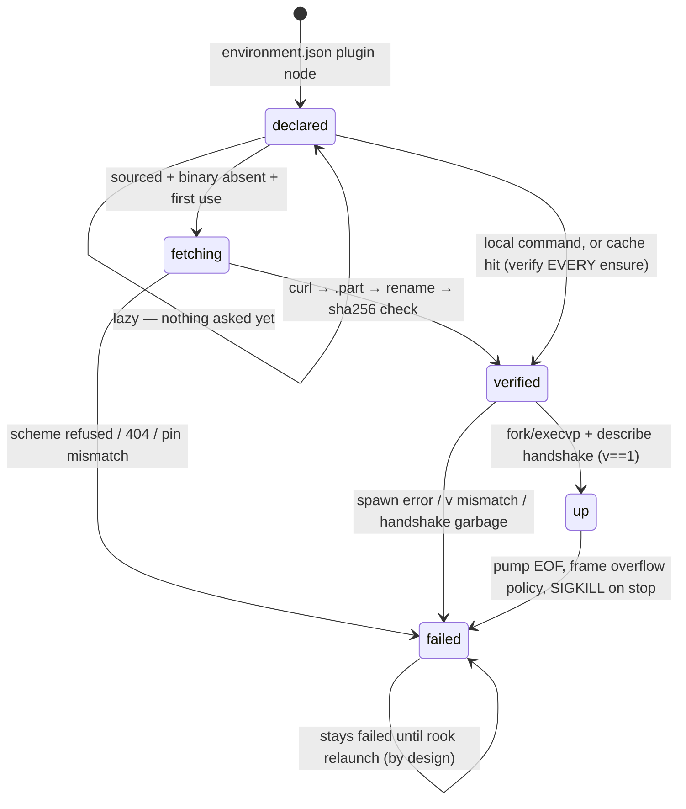
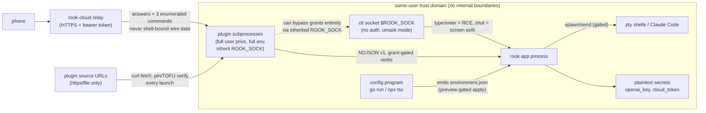

# 03 — Plugins, Providers, IPC, SDKs, and the Security Model

Deep analysis of Rook's extension architecture (plugins, providers, grammars, commands), its
four wire surfaces, the config SDKs, the capability/grant model, and a threat-model treatment
of the trust boundaries. Verified against HEAD of `incantery/rook`, branch `main`, tip
`291f6d0`, 2026-08-07. All file/line references are to that revision; several were re-opened
and spot-checked directly during this write-up (marked where relevant).

Companion documents in this series cover architecture/lifecycle (01), terminal/editor
internals (02), and agents/cloud (04); this document owns the extension seams and the
security story, including the config-as-compiled-program angle.

---

## 1. The taxonomy as implemented (not as documented)

Rook's vocabulary — "plugin", "provider", "command", "grammar", "service" — corresponds to
real, distinct mechanisms in code. Getting this taxonomy right matters because the docs
(`docs/plugins/VOCABULARY.md`) are partially stale and describe a larger design than exists.

| term | what it is at HEAD | mechanism | status |
|---|---|---|---|
| **Plugin** | subprocess speaking NDJSON v1 over stdin/stdout, **bidirectional**, capability-granted per-op | `app/src/plugins.zig` (~1,945 lines, the whole host end) + inbound verb dispatch in `app/src/macos.zig — App.pluginInbound` (~7341) | **Implemented**, live, six first-party plugins in the bundle |
| **Provider** | subprocess speaking NDJSON v1, **unidirectional** (host asks, provider answers) | `sdk/provider` (own Go module: `provider.go`, `serve.go`, `client.go`) + `providers/{github,linear}` | **Scaffolded/orphaned**: builds, tested, versioned — but **nothing at HEAD spawns one** (verified: `grep -rn "sdk/provider\|rook-provider" app/src/` → no matches). The Go core that consumed it was deleted 2026-07-31 |
| **Grammar** | tree-sitter dylib `dlopen`ed in-process on the frame budget | `app/src/grammar.zig`; **reuses** `plugins.fetch`/`plugins.hashFile` (grammar.zig:363–375) so the pin/TOFU discipline is shared | **Implemented** — the one extension class that cannot be a subprocess |
| **Command** | in-app action in the compiled-in registry; **not an extension point** | `app/src/registry.zig` ("A command is NOT registered until it does something", registry.zig:13–16) | **Implemented**; plugins cannot add commands. The one compiled-in door is `plugin.open` (a "pick a plugin" palette entry, registry.zig:125–128) |
| **Service** | not a code concept at HEAD | `test-config/zinit/services/` is a vendored test fixture, unrelated | **Absent** |

Two more things get called "SDK" and are easy to conflate:

- **Config SDKs** (`sdk/rook` Go, `sdk/ts` TypeScript): apply-time programs that emit the
  environment-graph IR. They speak no runtime protocol; a plugin *declaration*
  (name/argv/source/sha256/load/grants) is just a node in the graph they emit.
- **Plugin-author SDK**: deliberately **not in this repo**. `app/src/plugins.zig:4–6`
  (verified): "The protocol, its SDK and the demos live in incantery/rook-demos; this is the
  host end." Every in-repo plugin hand-rolls the protocol; the e2e fixture is a 9-line POSIX
  sh script, proving no SDK is required.

**Inference (well supported):** the plugin protocol is the strip's payoff. After the Go core
was deleted (07-31), every subsequent feature — the agent membrane, the phone/cloud bridge,
the entire LSP language catalog (`dc4fcec`, 08-06: "languages become declarations") — landed
as plugin ops rather than core code. The system's direction is "make it a plugin op."

---

## 2. Plugin architecture end-to-end

### 2.1 The three-way trust model (the design center)

The header of `app/src/plugins.zig` (lines 8–21, verified verbatim) states the load-bearing
distinction, and the code follows it:

- **Config says a plugin EXISTS** — a `plugin` node in the environment graph; an undeclared
  plugin never runs. There is no auto-discovery, no plugin directory scanning.
- **Config says what it MAY do** — `grants`, a flat list of op names.
- **The plugin says what it WANTS** — `describe.capabilities`, recorded verbatim including
  capabilities *not* granted.

The gap between granted and wanted is "the trust surface"; `ctl plugins` (ctl.zig:659–701)
prints all three as separate facts per plugin (`name  load  state  grants=…  wants=…  v=…`),
plus `sha256=` for a running, sourced, unpinned plugin, plus the failure reason for a dead
one. The gap is *rendered, never reconciled away* — unusually good design.

### 2.2 Discovery and loading

- `Registry.load` (plugins.zig:1626–1632) reads the raw `environment.json` bytes via
  `cfgpkg.envData` (config.zig:777–780). Path resolution: `--config DIR`, else
  `$XDG_CONFIG_HOME/rook/environment.json`, else `~/.config/rook/environment.json`.
- `loadFromJson` (plugins.zig:1644–1699) parses **node by node, leniently**: the file is
  parsed as `{nodes: []std.json.Value}` and each node is *attempted* as the plugin shape;
  non-matches are skipped. This replaced a whole-file typed parse that threw on the first
  keybind node (whose `command` is a string, not an argv array) and silently loaded **zero
  plugins for any mixed config** — and the e2e suite stayed green because every fixture graph
  was plugin-only ("vacuously green"; fixed in `c10d64c`, 08-03, regression test at
  plugins.zig:1714–1731). The same failure class independently hit `config.zig`'s
  `WireNode.command` typing (see §8.4). The resulting repo-wide rule: *each consumer of
  environment.json picks its nodes out leniently and never owns another consumer's parse*.
- `Spec` (plugins.zig:142–165): `name`, `argv`, `load` (lazy default / eager), `grants`
  (exact string match in `granted()` — prefix does **not** grant, pinned by a test at
  1733–1739), `source` (URL), `sha256` (hex pin). Validation: needs a name; needs exactly one
  of command/source. Unknown `load` values fall back to lazy on purpose ("an old app meeting
  a new graph must still run").
- Wiring: `macos.zig:1041` loads the registry at app init; `macos.zig:1250–1251` sets the
  host callback and starts eager plugins.

### 2.3 Process model and lifecycle

**Implemented.** Raw C syscalls (`pipe/fork/execvp/dup2/…`, plugins.zig:71–86, verified),
using `os_unfair_lock` throughout because this Zig's std has no Mutex (88–99, verified).

`spawn` (plugins.zig:539–616) creates **four pipe pairs**: stdin, stdout, a *wake pipe* (to
interrupt the pump's `poll` without closing an fd another thread is polling — an fd-reuse
race, same trick as lsp.zig), and a *reply pipe* (pump→caller doorbell, chosen over a condvar
because poll already enforces every deadline). In the child: dup2 stdio; **stderr →
`/dev/null`** ("a plugin's stderr is its log and belongs to whoever is watching — which is
not rook's window. /dev/null until there is somewhere to put it", 590–594); close every fd ≥3
up to `getdtablesize()` (prevents leaked ctl connections, pty masters, and other plugins'
pipes into the child); `execvp` (PATH-resolved, argv straight from config, **no shell
interpretation**); `_exit(127)` on failure. argv is NUL-terminated before fork ("allocating
in the child is not safe").

Lifecycle states: `declared → up | failed` (plugins.zig:167). `ensure()` is idempotent and
**a plugin that failed once stays failed until rook relaunches** — "a crash loop that
respawns on every keystroke is worse than a dead panel" (366–368). There is no restart verb
at HEAD. This deliberately contrasts with the provider generation, whose client is
restartable per call. Stop is: quit flag, wake byte, join pump, close six fds, SIGKILL +
waitpid; the plugin-side convention is exit-on-stdin-EOF, but rook's own stop is SIGKILL.

Lazy loading is real: nothing spawns until something asks (a panel open, a granted call, an
lsp.resolve). Eager exists for watchers ("a watcher that loads lazily watches nothing" —
the SDK's first-party bundles default to eager, sdk/rook `eagerUnless`).

### 2.4 Wire protocol v1

**Implemented.** `pub const version = 1` (plugins.zig:116, verified). Newline-delimited JSON
frames, max 1 MiB (`max_frame = 1 << 20`, plugins.zig:131, verified); an oversize frame is
dropped with the stream resyncing at the next newline (`FrameReader`, sans-io, unit-tested
for split frames / multiple frames per read / oversize+resync).

- Request: `{"v":1,"id":N,"op":"items.list","deadlineMs":9750,"params":{…}}`. The deadline
  handed to the plugin is the caller's minus `grace_ms = 250` (plugins.zig:118–126, verified)
  so a cooperative plugin answering exactly at its deadline doesn't race the host's timer —
  the comment explicitly credits "rook's old provider client found this the hard way; the
  value is the same" (and `sdk/provider/client.go` indeed carries `graceMS = 250`).
  Institutional memory surviving a full rewrite across languages.
- Reply: `{"v":1,"id":N,"ok":true,"result":{…}}` / `{"v":1,"id":N,"ok":false,"error":"why"}`.
- **Demux rule**: a frame containing top-level `"op"` is a request *from* the plugin; without
  one it's a reply (`route`, plugins.zig:447–464). This is deliberately a **substring check**
  (`frameHas(frame, "\"op\"")`) — full-parsing megabyte item lists to answer one yes/no was
  judged "the wrong trade". Consequence and risk: a *reply* whose result JSON contains the
  literal key `"op"` anywhere would be mis-routed as a request and refused, and the real
  reply lost to timeout. The code acknowledges the substring trade generally but not this
  exact case. Low likelihood; real class of bug; becomes more pressing if reply payloads grow
  adversarial (third-party plugins). See §10 Q5.
- `frameParams` (plugins.zig:862–899) slices the params object *verbatim* with a real
  string/escape-aware depth counter — the host never learns per-verb schemas; each verb's
  owner parses its own params. Tested against
  `{"command":["sh","-c","echo }{"],"cwd":"/tmp/a\"b"}`.
- Concurrency: `call_mu` serializes **one in-flight host→plugin call per plugin**; `write_mu`
  guards the pipe (the pump may answer inbound requests while a caller is mid-send); the
  waiter registers its id *before* writing (the e2e fixture answers in microseconds — the
  race is not theoretical). The echoed-id check is kept even though only one call is in
  flight, "because that is what will make this safe to widen later."
- A per-plugin **pump thread** (`pumpLoop`, 412–439) owns `from_child` and is the entire
  mechanism enabling *unsolicited* plugin→host frames. The header names the hazard a naive
  client would hit: a plugin may raise attention *while* answering `items.act`, and a
  next-frame-is-my-response reader "would take the request for an answer, fail the id check,
  and kill a plugin that did nothing wrong." VOCABULARY.md identifies the pump as "the cost
  the old edge protocol never paid, and why it could not become a provider."

### 2.5 The op vocabulary at HEAD

Host → plugin: `describe` (handshake; strict v check; name/version/caps into fixed buffers),
`items.list` (root = focused pane's repo root; caps 128 items / 6 fields / 6 actions /
children flattened to depth 1), `items.act` (with optional `input` payload for `INPUT_TEXT`
actions; reply may carry the updated item so the host repaints one row), `lsp.resolve` (the
resolver seam: params `{language, root, dir}` where `dir` is a rook-named, plugin-written
server prefix `$XDG_DATA_HOME/rook/servers/<lang>`; result `{command, settings, error,
note}` — `note` is the resolver's one-line account of what it chose, because "with the answer
computed in another process, 'why is my server this one' is otherwise unanswerable"). Asked
once per (language, root) — lspmgr caches keyed that way, with a test titled against the
resolver-as-fork-bomb failure mode (lspmgr.zig:1217–1240).

Plugin → rook (dispatched synchronously on the pump thread in `App.pluginInbound`,
macos.zig:7341–7353):

| verb | behavior | gates beyond the grant |
|---|---|---|
| `attention.raise` | ring of 16 raises + macOS notification + dock bounce; `ctl attention` lists them | **provenance is server-assigned** — `from` is the declaration's name, never a param ("a plugin that could name someone else as the source of an interruption is a plugin that can blame someone else for it") |
| `session.spawn` | opens a pane running `command` (shell-interpreted: `shell -l -c`, session.zig:496–498) in `cwd`, **never steals focus** | none — the code candidly notes it is "Not a privilege escalation: the plugin is already a process rook forked, so it could run this itself. What the verb buys is that the command runs WHERE THE HUMAN CAN SEE IT" (macos.zig, verified verbatim) |
| `session.send` | types ≤8 KiB into a pane's pty as bracketed paste `ESC[200~…ESC[201~\r` | **two hard gates** (verified in `sessionSend`, macos.zig ~7483–7516): (1) the pane's foreground must *be* Claude — basename `== "claude"` or path contains `"claude"`; "`node` is deliberately NOT enough… a REPL eats typed text as code too"; (2) a human keystroke in that pane within 5 s refuses with "a human is typing there" |
| `clipboard.set` | replaces the system pasteboard, ≤256 KiB | grant only; OSC 52's clipboard-write knob cited as precedent that "writing the pasteboard is a permission, not a given" |
| `panes.activity` | per-pane `{id, outMs, inMs, outBytes, fg, path, cwd}` — the first inbound verb returning data | grant only; same producer as `ctl activity` via a comptime `as_json` flag (one producer, two encodings, zero drift) |

Granted-but-unknown verb → "rook does not know that verb", framed as forward compatibility
(a config naming a verb from a newer rook), not misbehavior. `notify` from VOCABULARY.md is
**documented only** ("still schema").

Grants are enforced **in both directions in plugins.zig**, the one place that knows them:
outbound, `Plugin.call` refuses ungranted ops *before sending* (plugins.zig:709, verified —
"a plugin should never learn it was asked for something it is not allowed to do"); inbound,
`inbound()` refuses **by name** — `"not granted: session.spawn"` (plugins.zig:495–501,
verified) — because "'refused' sends them into their own code looking for a bug." One flat
list covers both directions: "the direction is inherent to the verb, and one list is what a
human can actually read" (header, 55–59, verified).

### 2.6 Distribution: fetch, TOFU, pins

**Implemented, and one of the best-designed subsystems in the repo.**

- A `source` declaration caches the binary at `$XDG_DATA_HOME/rook/plugins/<name>` —
  deliberately *not* the config dir ("a downloaded binary is not configuration… a config
  directory you can copy between machines should not carry executables", plugins.zig:958–962).
- Fetch is **via `curl -fsSL --max-time 60`** as a forked child (macOS ships curl; a TLS
  stack is "a large thing to carry for an operation that happens once per plugin"; `-f` so a
  404 fails instead of caching an HTML error page). **Scheme allowlist: `https://` and
  `file://` only** (`file://` exists so e2e needs no network); `http://`, `ftp://`, bare
  paths are refused *before curl runs* (test at 1936–1944). Download goes to `<dest>.part`
  then atomic `rename()` + chmod 0755 — an interrupted fetch cannot leave a runnable
  half-binary. Fetch is lazy: first *use*, not launch ("a launch that downloads things is a
  launch that waits on someone else's server").
- `verify()` runs on **every ensure, not just after download** (389–396): with a config
  `sha256` pin, mismatch = refusal; without one, **trust-on-first-use** — first hash written
  to a `<binary>.sha256` sidecar, later mismatch refuses with "changed since it was
  downloaded — delete it to accept the new one." A mismatch **never re-downloads** ("silently
  replacing a binary that stopped matching is the failure this exists to prevent").
- **Pin ergonomics** (unusually good): the running binary's hash is recorded on the handle;
  `ctl plugins` prints `sha256=` for an up+sourced+unpinned plugin; and the panel's `y` key
  (`copyPluginPin`, macos.zig:8283–8327) copies a **ready-to-paste pinned declaration in
  whichever language the user's config is written in** — it sniffs the config source and
  emits either `rook.Plugin{Source: "…", SHA256: "…", Grants: …}` (Go) or
  `e.pluginPinned("…", "…", […])` (TS). The rationale comment: "'here is the information,
  you do the rest' … means nobody does the rest." `hashFile` is pinned against
  `shasum -a 256` output in a test ("a hash rook agrees with only itself on is a hash nobody
  can pin").

**Honest limitation, stated in code:** TOFU only protects machines that already fetched; a
fresh machine with an unpinned source trusts whatever the URL serves the first time
(plugins.zig:157–159). Pinning is the mitigation and is optional.

There is **no version negotiation beyond `v == 1`, no update channel, no uninstall verb**.
Update = change the pin in config and delete the cache file.

### 2.7 UI extension points

A plugin **can** render: rows in the single side-panel **List** surface (item + up to 6
typed fields (key/kind/value; NUMBER/TEXT/PERCENT observed) + up to 6 actions (plain /
confirm / one-line `INPUT_TEXT`) + one level of children — parents clip to one line, children
wrap as prose, non-selected groups fold to `▸+N`); attention banners; new panes/tabs
(`session.spawn`); typed text into agent panes (`session.send`); the pasteboard. Item states
are semantic strings ("blocked", "running"), never colors — theme belongs to core, enforced
structurally by the fixed `Item` shape having no style fields.

A plugin **cannot** (at HEAD): draw pixels; use the Tree/Table/Detail/Form/Series/Decoration
surfaces (all still design-only in VOCABULARY.md — the `surfaces` field first-party plugins
send in `describe` is **silently ignored** by the host); add commands, palette entries,
keybindings, status-bar segments, or editor decorations. The panel is single-tenant (one
plugin shown at a time), fetched on a worker thread with a name-match guard so a stale fetch
can't paint under another plugin's name; selection follows item *id* across refreshes, not
row number. Render-side snapshots are fixed-buffer copies (title widened 96→256 bytes for
the agent plugin's prose bullets) because "the draw path must not hold a borrowed slice into
a JSON arena, and it must not allocate."

**Undisclosed contract:** the caps (128 items, 6 fields, 6 actions, per-field byte sizes)
silently truncate plugin data at intake, and nothing in `describe` negotiates or reveals
them to authors.

### 2.8 First-party plugins (the protocol's real users)

All Go, built by `make plugins` into `app/zig-out/bin/rook-plugin-<name>` and staged into the
app bundle at `Contents/MacOS/`. Each **hand-implements** the protocol with its own ~80-line
`conn` type (mu / nextID / pending-channel demux); three copies already drift slightly
(agent's `call` returns only error, cloud's returns raw bytes) — a live maintenance risk in
lieu of the exiled SDK.

- `plugins/claude` (398 lines): watches `~/.claude/projects/*.jsonl` transcript tails via the
  shared `plugins/internal/transcript` scanner; sessions as items; turns state *transitions*
  into `attention.raise` with a baseline pass, min-turn filter, and presence suppression;
  fuses transcript state with `panes.activity` (a still-redrawing pane keeps a quiet
  transcript "working").
- `plugins/agent` (639 + 351 lines): the membrane — finished turns get one OpenAI-compatible
  completion call → digest (headline+bullets), journaled to a `digestlog` jsonl; panel
  actions `dismiss` / `draft`/`expand` (async INPUT_TEXT) / `copy` (outbound
  `clipboard.set`, and it *waits for rook's verdict* because "'copied' on a missing grant
  would be the panel lying about the pasteboard").
- `plugins/cloud` (1,106 lines): the phone bridge — see §8.6 for the full authorization
  chain.
- `plugins/lang-{zig,python,typescript}`: single-op `lsp.resolve` resolvers (zls
  version-matched to the project's `zig version`; TS installs servers into rook's prefix,
  "never into your project"). Evidence the protocol scales *down* as well as up.

`examples/hello-plugin` is a 1.3 KB POSIX sh plugin (describe + items.list with `expr`
parsing) — the "writable in any language" claim proven literally.

---

## 3. The provider generation — a published protocol with zero callers

**Scaffolded/orphaned.** `sdk/provider` is a standalone Go module ("depends on nothing"),
tagged `sdk/provider/vX.Y.Z`; the root go.mod requires it via `replace` so "a plugin author
depends on the protocol alone. rook consumes it like anyone else would" — except at HEAD
*nothing consumes it* (verified by grep over `app/src/`). The Go core that called
`provider.Client` died in the 07-31 strip; the two surviving providers (`providers/github` —
delegates auth to the `gh` CLI; `providers/linear` — keychain-read API key) build and are
tested for a caller that does not exist. `docs/OWED.md` §1 records the fork in the road
explicitly: a provider speaks `sdk/provider`, not the plugin protocol, "so either the two
grow a shim or a provider becomes a plugin. That is a decision, not a port."

The protocol itself: identical envelope to the plugin protocol (`v/id/op/deadlineMs/params`
→ `v/id/ok/result/error`), `Version = 1`, ops `describe` / `issues.list` / `pulls.status`
(the last has had zero callers even before the strip and is kept as "a published capability
is a promise to plugin authors"). Design decisions that differ from plugins, worth keeping:

- **Restartable**: lazy spawn, respawned by the next call (plugins: failed-stays-failed).
- **Deadline-fatal**: a timeout **kills** the provider rather than resyncing a
  one-frame-behind pipe — "every later answer would be off by one" (client.go).
- **stderr forwarded**, prefixed `provider <name>:` — richer than the plugin host's
  `/dev/null`; the plugin generation *lost* this.
- `Issue` deliberately has **no Task/prompt field**: "a provider cannot decide what an agent
  is told to do — data in, prompt out, and the prompt is the host's." Same authority split
  as the (deleted) edge protocol's no-ExecuteShell rule.
- Config via env `ROOK_PROVIDER_<NAME>_<KEY>`; **credentials explicitly excluded** — "a
  provider fetches its own, so a secret never passes through rook's address space at all."

`providers/boundary_test.go` (`go list -deps`, fail on any transitive `incantery/rook/internal/`
import) is candid that Go's `internal` rule can't enforce the boundary within one module —
"the test IS the boundary." At HEAD there is no `internal/` tree left, so the test is a
tautology guarding against regression.

**Inference:** the plugin protocol is a strict superset (same frames, plus pump, inbound
verbs, grants, distribution), and the strip commit's own message says the issue-queue
consumer is owed back "as the vocabulary's List over the item model" — the likely resolution
of OWED §1 is *providers become plugin backends*, not a protocol merge.

---

## 4. The four wire surfaces and their versioning philosophies

| surface | transport | framing | versioning | consumers |
|---|---|---|---|---|
| **ctl socket** | unix stream socket, `$ROOK_SOCK` (default `/tmp/rook.sock`) | text lines, verb-first; reply streams until close | **unversioned** — "the server answers or it doesn't"; the CLI carries no verb table | `rook` CLI, e2e harness, the installed Claude skill, humans with `nc -U` |
| **plugin protocol v1** | child stdin/stdout pipes | NDJSON, `{"v":1,…}` | `v:1`, **refuse on mismatch** | six first-party plugins + external rook-demos SDK |
| **provider protocol v1** | child stdin/stdout pipes | NDJSON, same envelope | `Version = 1`, refuse on mismatch | orphaned (no host caller) |
| **environment IR v1** | a file: `environment.json` | one JSON doc `{"rookEnvironment":1,"nodes":[…]}` | version int, **fail open** — unknown kind/key/type skipped silently | five independent in-app consumers (config, plugins, workspaces, language, grammar) + both SDKs as producers |

The versioning asymmetry is doctrine, written at three separate sites with the same
rationale: **config fails open** (a misread knob leaves a default; "an old app meeting a new
graph must still run"), while **frames refuse on mismatch** ("unlike config, where failing
open is right, acting on a misread frame would ACT" — plugins.zig:113–116 verified;
`sdk/provider/provider.go` and `serve.go` carry the same doctrine). All frame parsing uses
`ignore_unknown_fields` on both sides, so additive evolution is free; a semantic change is a
v-bump that bricks every plugin at handshake. Fine at n≈6 first-party plugins; there is **no
negotiation mechanism** for the day third-party plugins meet a v2 host.

### 4.1 The ctl socket in brief (details in doc 05/ipc notes; security treatment in §8.1)

`app/src/ctl.zig` (1,396 lines) serves ~52 verbs over an unauthenticated same-user unix
socket. Points that matter for this document:

- **No auth, no peer check**: `accept(fd, null, null)`; no `getpeereid`/`SO_PEERCRED`, no
  token. **No `chmod`/`fchmod` anywhere in ctl.zig** (verified by grep). Authorization is
  purely filesystem permission on the socket path, at whatever mode the umask yields.
- `sun_path` is a fixed `[104]u8` (ctl.zig:30, verified); an over-long socket path makes
  `serve` **return silently** (ctl.zig:92, verified: bare `return`) and the client `_exit(1)`
  equally silently — a trap the project's own memory documents, still unmessaged on both
  ends.
- **Refuse-to-steal-a-live-socket** (`socketIsLive()`, ctl.zig:57–66; the refusal it guards is
  the NEVER-STEAL comment plus `if (socketIsLive(path))` block at ctl.zig:71–85, inside `serve`
  at :68): rook will not
  unlink-and-rebind a live socket; only a stale inode (connect refused) is removed. The
  comment records the field incident (second launch orphaned the first instance's listener
  within an hour of cutover). Security-adjacent correctness: prevents cross-instance command
  misrouting (a `quit` meant for another instance).
- The **grant check is duplicated at the ctl door**: `ctl plugin <name> <op>` raw
  passthrough refuses ungranted ops before the plugin is told (ctl.zig:721–726), so the raw
  proving seam has the same policy as the internal path.
- `--config=DIR` is the sanctioned isolation lever: one directory holds config, applied
  graph, socket (`ROOK_SOCK=DIR/rook.sock`), and plugin cache (`XDG_DATA_HOME`), exported
  no-overwrite so explicit env wins. A throwaway/dangerous instance is one deletable
  directory off the daily-driver socket.

---

## 5. Config SDKs, codegen, and cross-language parity

### 5.1 `sdk/rook` (Go) — the flagship

**Implemented; redesigned 08-03** (`c8c0fe9`) from a fluent builder to a declaration list:
`rook.Main(decls ...Node)` emits canonical IR JSON. The redesign's motivating incident is
recorded in the package: the old fluent example bound `"workspace.manager"` and
`"explorer.toggle"` — *neither exists* — and nothing noticed. The fix is **codegen**:
`scripts/gen-cmds.sh` (a ~30-line grep of `.id = "…"` out of `app/src/registry.zig`) writes
typed `Cmd` constants into `sdk/rook/cmds.go`. A keybind to a dead command now **fails to
compile**. Fragile-looking (grep as compiler contract), and — the important caveat — **it has
drifted, because the pin is a comment and not a job**: 27 generated constants
(`grep -c '= "' sdk/rook/cmds.go` = 27) against 29 canonical registry ids
(`grep -o '\.id = "[a-z0-9.-]*"' app/src/registry.zig | sort -u | wc -l` = 29, from 37 raw
occurrences before de-duplication and aliases). The two missing ids are `editor.format`
(registry.zig:143) and `monitor.open` (:149) — an SDK author cannot name either. The
`make gen-cmds && git diff --exit-code` line the script header and Makefile:97 both advertise
is never run by `ci.yml` (verified: the string `gen-cmds` appears nowhere in the workflow,
whose `zig` job runs `zig build` / `zig build test` / `zig build e2e-check` and whose `go` job
runs golangci-lint, `go test ./...` and the sdk/provider test); see doc 05 §1.5, doc 07 Fork 9
and doc 09 §2.1. Split the labels precisely: the **generator is Implemented** and does produce
`cmds.go`; the **CI drift check is Documented only**, and the compile-time promise the 08-03
redesign was built on is therefore one generation stale rather than enforced.

Plugin-relevant SDK surface:

- `Plugin{Name, Command, Source, SHA256, Load, Grants}` — Source XOR Command enforced with
  `os.Exit(1)`; nil Grants → `[]` (never null: "absent and empty mean the same thing, and a
  reader handling both shapes will get one wrong").
- Op-name constants are "convenience, not an enum. The vocabulary is open — a plugin may
  define its own ops."
- **Typed first-party bundles** `rook.Claude{}` / `rook.Agent{}` / `rook.Cloud{}` lower to
  plain `Plugin` nodes with argv pointing at
  `bundleBin = "/Applications/rook.app/Contents/MacOS/"` (rook.go:822, verified — a
  hardcoded absolute path; a `make dev` / non-/Applications install gets "could not spawn").
  Their **default grants are each plugin's full working set** — an explicit, documented
  two-tier trust stance: first-party bundles get defaults ("choosing rook.Agent{} is
  choosing the agent, and the grants it runs on are shown in the apply diff where consent
  actually happens; narrow with Grants, stage inert with `Grants: []string{}`"), third-party
  `Plugin{}` defaults to no grants. Their default Load is **eager** (inverted from Plugin's
  lazy default).
- Language/grammar declarations carry the same pin discipline as plugins ("rook loads code
  it did not compile, and where that code came from should be a thing you wrote down") —
  grammar dylibs reuse `plugins.fetch`/`hashFile` on the load side.

**Unverified-by-anything gap worth flagging:** first-party plugins' `describe` capability
lists and the SDK's default-grant sets are maintained by hand in two places (each plugin's
Go source, and `grantsOr` defaults in rook.go). Nothing enforces they match.

### 5.2 `sdk/ts` — byte-parity, one generation behind

**Partially implemented.** A 232-line fluent `Env` class whose emitted bytes must equal the
Go writer's ("Key order is the canon… parity is a byte diff"), pinned by sharing literal
golden strings between `sdk/rook/rook_test.go` and `sdk/ts/rook.test.ts`, plus the e2e
`presetparity` scenario diffing two live instances' `ctl statusbar` output. It has
`plugin()` / `pluginFrom()` (**https-only** sources: "executing something downloaded over
plain http is not a thing to make easy") / `pluginPinned()` and a `table()` the Go SDK
lacks. It **lacks**: the declaration-list design, typed command constants (binds take raw
strings — the *exact* failure mode the Go redesign was for; a TS config binding a dead
command is silently skipped at load), language/grammar nodes, and the first-party plugin
bundles. Nothing in the repo notes this asymmetry.

The TS SDK is **embedded in the app binary** (`@embedFile("ts_sdk")` ←
`app/build.zig:79`) and written out beside `config.ts` at onboarding, because the package
isn't on npm — the starter cannot drift from the rook that wrote it, works offline… and TS
SDK improvements now require an app release. Clever and consequential.

Canonical-bytes discipline (both SDKs): compact JSON, fixed field order per kind, sorted
entries keys, integral floats as integers, no HTML escaping, arrays never null; Go uses a
hand-rolled writer (encoding/json's HTML escaping and map ordering "are both wrong for
this"); TS leans on `JSON.stringify` agreeing given insertion-order keys — a softer
guarantee held together by the byte-pin tests. Doc drift: `docs/man/rook-plugin.7`'s
declaring example uses id `plugin.hello`; the canon both SDKs pin is `plugin:hello`.

### 5.3 Python and the stale fixtures

**Obsolete/dead:** `sdk/rook/example/main.py` / `bench.py` are July's cross-language parity
probes "kept as history." `test-config/main.go` (gitignored scratch) still uses the deleted
fluent API and would not compile — the repo moves faster than its fixtures.

---

## 6. Multi-language plugin feasibility — the assessment

The question: can this protocol support third-party, multi-language plugins without becoming
IPC-fragile? Evidence says **yes, with named limits**.

For:
- The protocol is provably language-free: the e2e fixture is POSIX sh with `expr` "parsing";
  the shipped hello-plugin is 1.3 KB of sh; first-party plugins are stdlib-Go.
- Robustness is engineered at the framing layer, not assumed: sans-io FrameReader with
  oversize drop+resync; ids echoed and checked; escaping tested against
  hostile-looking-but-honest names (branch names as item ids); refusals **by name** in both
  directions; deadline grace on both generations; per-plugin failure containment (a dead
  plugin is a missing panel, never a broken launch — e2e asserts the app survives a missing
  binary).
- Version discipline: v checked and refused at describe in both generations; unknown
  ops/verbs get named refusals; unknown config fields fail open.
- Fixed-buffer render snapshots fully decouple plugin output from the draw path.

Fragility risks, all visible in code:
1. The substring `"op"` demux (§2.4) — safe today, a real mis-route class once reply
   payloads carry arbitrary third-party content.
2. One in-flight call per plugin with a 10 s deadline: a slow `items.list` head-of-line
   blocks `lsp.resolve` on the same plugin (moot while resolvers are separate binaries; not
   moot for a future kitchen-sink plugin). The id machinery is explicitly kept ready for
   widening.
3. No shared conn library in-repo → three hand-rolled Go demux loops already drifting; every
   new language re-derives the "inbound request while awaiting my reply" hazard.
4. 1 MiB frame cap: a plugin exceeding it loses the frame and, from its own side, learns
   only via timeout.
5. stderr → `/dev/null`: multi-language debugging is strictly worse than the provider
   generation's tagged forwarding — a regression across generations the code itself flags
   ("until there is somewhere to put it").
6. The render caps (§2.7) are an undisclosed contract.

---

## 7. Versioning and compatibility — what is actually stable

- **Grant strings, op names, IR node kinds, and registry command ids are the real long-term
  API surface.** All are open vocabularies with named-refusal or fail-open behavior on skew.
- **ctl output formats are a de facto frozen API with no version marker** — the e2e suite
  and the installed Claude skill both parse them; the implicit rule is append-only fields
  (stated in the `panes` verb's comment), but nothing enforces or documents it as policy.
- **Internal details already leaking into the API**, hard to change later:
  - **Pane ids** are the addressing scheme for ctl `@id`, `panes.activity`, and
    `session.send{pane}` — process-lifetime, not stable across relaunch. A phone-initiated
    send races a restart today (delivery is at-most-once via journal, but the id namespace
    resets).
  - `session.send`'s agent detection is the literal string `"claude"` in the foreground
    name/path (verified) — a product policy hard-coded at a protocol boundary; supporting a
    second agent TUI requires an app release.
  - The line protocol's inability to carry raw newlines has forced three different escape
    mini-languages onto one surface (`nskey` escapes, `paste` `\n`, `key` hex).
- The repo shipped and killed, within ~5 weeks: an HTTP daemon wire, webview host wire
  v2/v3, and a full proto3/ConnectRPC "edge" protocol (`d3499be` 07-27 → `abf0e50` 07-31,
  "stripped from core, and kept on a tag"). Protobuf is absent from HEAD but was not
  *rejected* — it was shipped and amputated in four days. Two survivors: the unversioned
  text line protocol and the v1 NDJSON frame protocol. Ideas from the edge protocol
  reincarnated in the plugin layer: journal-before-ack (`plugins/internal/cmdjournal`), the
  no-generic-string-executor rule ("There is deliberately no ExecuteShell … a generic string
  executor would erase the entire policy boundary"), and the pump (the capability the edge
  protocol lacked, per VOCABULARY.md, that kept it from becoming a provider).

---

## 8. Threat model

### 8.0 Posture in one sentence

**Rook is a single-user, local-trust native app**: everything that runs as the user is
trusted; the two things that get real gates are (1) remote input arriving from the cloud and
(2) a program's ability to type into panes / write the clipboard. The findings below are
classified per the four buckets the analysis calls for.

The diagram's most important edge is the dotted one: **the grant model is not a sandbox**,
and a plugin can sidestep it entirely through the ctl socket it inherits (§8.3).

### 8.1 Intentional local-trust behavior (not vulnerabilities, but the boundary to name)

- **The ctl socket is unauthenticated same-user full control.** `type`+`enter` into a shell
  pane = arbitrary command execution; `key <hex>` = raw byte injection; `shot <path>` writes
  a PNG of rook's own Metal drawable anywhere the user can write, working occluded and
  without screen-recording permission (that is the feature); `dump` reads any pane; `edit`
  opens any file; `quit` kills the app. `run <name>` is *not* a shell escape (registry-name
  resolution only). Classification: this **is** the automation surface — the CLI, the e2e
  harness, and the installed Claude skill are its intended clients. But the boundary is
  worth naming precisely: **any process running as the user — a downloaded npm dependency, a
  compromised plugin, a `curl | sh`, or Claude Code itself — can connect to `$ROOK_SOCK` and
  get keystroke-level control of every pane.** No capability scoping exists on the socket; a
  client is all-or-nothing.
- **Destructive-but-guarded local capability.** The verb list above is all code-execution and
  read primitives; two capabilities *destroy data* rather than execute it, and the boundary is
  only stated precisely once both are named.
  - `ctl worktree add|remove <workspace> <name>` (ctl.zig:297–314) runs git **inline on the
    serial accept thread** — the comment says so and accepts the head-of-line block ("the
    caller asked for git to run"). `remove` refuses on unmerged commits via rook's own
    `git rev-list --count HEAD..<name>` check (workspaces.zig:342), then runs
    `git worktree remove` (:351) and `git branch -d` (:354), quoting git's own refusal
    verbatim when git says no and reporting `ok removed (branch kept)` when only the branch
    delete fails. So an unauthenticated same-user client can delete a checkout and a branch.
  - The **monitor's disk reclaim** deletes directory trees, and it is the only feature in rook
    that removes user files. It is *not* a ctl verb, but it is reachable by driving the
    monitor pane's confirm through synthetic `key`/`press` — which this section has already
    established as an intended capability, and which is the honest way to state it. Its guards
    are real and worth reading as a model: `startReclaim` (macos.zig:6860) **re-derives the
    classification from the path** rather than trusting what the view staged ("a stale
    category on a re-scanned tree is exactly how a `keep` directory would end up deleted",
    :6866–6876), refuses any category whose `Reclaim` is not `deletable()` (diskscan.zig:93,
    with a test asserting no `keep` class is ever deletable, diskscan.zig:726), single-flights
    on the `reclaiming` atomic (:6878), and never interpolates a scanned path into a shell
    string — the `sh -c` branch runs only compiled-in category commands (`go clean -modcache`,
    `brew cleanup --prune=all`, `docker system prune -a`… from `diskscan.categories`) through
    `runTool` (macos.zig:9543–9560), which no plugin and no wire input can reach; a reclaim
    that needs a path takes the `deleteTree` branch instead, which never goes near a shell.
    See doc 02 §7.1 for the subsystem itself.
- **Config is code execution by design** (§8.4 below).
- **OSC 52 clipboard**: writes honored by default (`clipboard-write = allow|deny` knob);
  **reads are never forwarded** — `effectClipboardWrite` handles writes only
  (session.zig:820–855). The correct asymmetry: read would be the exfil primitive; write is
  the annoying-but-useful direction, on by default with an opt-out and a size cap.
- **Workspace = anchor, not fence.** There is no filesystem allowlist in the Zig app; the
  editor reads/writes arbitrary paths, `session.spawn` runs in any cwd. `workspace-allow`
  was a rook-host-era key; `config.zig`'s header still mentions it but nothing reads it.
  Deliberate stance (memory-confirmed: "the workspace is an ANCHOR not a fence").
- **PTY children inherit rook's full env** (rook only adds TERM/COLORTERM, and `ROOK_SOCK`
  no-overwrite) — normal for a terminal.

### 8.2 Genuinely good security design (implemented)

- **The `session.send` double gate** is the sharpest security reasoning in the codebase
  (verified verbatim in `sessionSend`): the target's foreground must positively identify as
  Claude (`node` explicitly insufficient — "a REPL eats typed text as code too"; the
  path-contains check exists because Claude's versioned install runs as a binary named
  `2.1.220`), and a human keystroke within 5 s wins. Most terminals never consider "who is
  the pane's foreground process" an authorization input.
- **Provenance is taken, not accepted**: `attention.raise`'s `from` is server-assigned from
  the declaration — a plugin cannot blame another plugin for an interruption.
- **Grant-check placement**: outbound refusals happen before the plugin is told; inbound
  refusals name the missing grant; the ctl raw door duplicates the check. Three small
  decisions that make the trust story coherent end-to-end.
- **Binary provenance**: scheme allowlist enforced pre-curl, atomic `.part`+rename,
  verify-on-every-launch, pin-or-TOFU-sidecar, refuse-don't-redownload, and pin hand-off in
  the user's own config language. Threat-model-aware *ergonomics* ("a pin nobody can read is
  a pin nobody sets").
- **fd hygiene**: every fork (plugins, pty, config emitter) closes fds above stdio —
  prevents ctl connections, pty masters, and other plugins' pipes leaking into children.
- **Refuse-to-steal-a-live-socket** (§4.1).
- **Provider-side secret isolation** (currently dormant with the providers): token read by
  the provider process from the keychain / delegated to `gh`; "at no point does a Linear
  token exist in rook's memory" (providers/linear/main.go:190, verified:
  `security find-generic-password -s rook -a linear -w`).
- The agent summarizer sends **no** Authorization header at all when keyless (test-pinned) —
  no malformed bearer leaks to a proxy.

### 8.3 Unfinished / inconsistent security architecture

- **The grant model gates the protocol, not the process — and the code says so out loud.**
  A plugin is a full-privilege user process that inherits rook's complete environment
  (**inference from absence**: no `environ` manipulation exists in `Plugin.spawn`),
  including `ROOK_SOCK` and any exported API keys. A plugin denied `session.spawn` by grants
  can connect to the ctl socket and `type` into any pane. `session.spawn`'s own doc concedes
  the point ("Not a privilege escalation: the plugin … could run this itself" — verified).
  So grants are best understood as **consent bookkeeping and honest-plugin discipline**, not
  containment. This is coherent for first-party plugins; it is the single biggest gap for a
  third-party plugin ecosystem. Options visible but unbuilt: env scrubbing before exec,
  per-plugin socket scoping, or an actual sandbox profile.
- **Secrets split-brain**: providers use the macOS keychain / delegated CLI auth; plugins
  use plaintext dotfiles — `~/.config/rook/openai_key` (plugins/agent/main.go:75, verified)
  and `~/.config/rook/cloud_token` (plugins/cloud/main.go:81, verified), sent as bearer
  tokens over HTTPS. Plaintext token files are the CLI-tool norm (`~/.aws/credentials`),
  and the files are within the same same-user trust boundary as everything else — but the
  *asymmetry* is a coherence gap, not a taste one: the keychain machinery demonstrably
  existed (richer still in the deleted Go core: `3ca5a96`, `00a18d1`, `022c390`) and was
  kept only on the orphaned provider side.
- **Socket mode**: nothing sets it; observed 0755 under a default umask (other users can't
  connect — unix sockets require write permission — but a permissive umask would widen it;
  an explicit `fchmod(fd, 0600)` before `listen` does not exist).
- **First-fetch TOFU**: an unpinned `source` on a fresh machine trusts the URL once,
  silently. No warn-on-unpinned posture exists.
- **Grants delta at preview**: the apply diff shows a changed plugin node as a generic
  one-key line (`describe` renders only the FIRST differing key per node,
  envapply.zig:195–216) — so a grants widening can hide behind, e.g., a changed argv in the
  same node. The consent surface the SDK's default-grants stance leans on ("shown in the
  apply diff where consent actually happens") is real but **not capability-aware**.
  This is the most concrete unfinished piece of the trust story.
- **Filesystem scoping**: none at app level; would need building before any "less-trusted
  agent" story.
- **Plugin stderr to /dev/null**: an observability regression with security relevance (a
  misbehaving plugin's own account of itself is discarded).

### 8.4 Config-as-compiled-program: the trust root

**Implemented, and the foundation everything else sits on.** Config is a program: rook
itself detects source edits at 1 Hz, then runs `go run . --out <tmp>` or
`npx tsx <file> --out <tmp>` from the config directory (`envapply.zig — run()/runArgv`,
fork/execvp verified at envapply.zig:498/548), plus `go mod tidy` during onboarding. The
apply flow is genuinely consent-shaped — candidate diffed by node id against the applied
graph, preview panel opens *unfocused*, nothing lands until the human confirms, and the e2e
`apply` scenario's stated reason for existing is "a preview must not apply itself" — **but
the gate is on applying the emitted graph, not on running the emitter.** A malicious
`main.go`/`config.ts` in the config directory executes with full user privileges the moment
rook evaluates it, before any diff is shown.

Consequences worth stating plainly:

1. A config directory synced from a repo or between machines carries **executable trust**.
2. Plugin `argv` and `source`/`sha256` come from this graph — config controls what binaries
   get fetched and exec'd, so the entire plugin-provenance model (pins, TOFU, scheme
   allowlists) reduces to "you trust your own config program." The pins protect against a
   *remote changing under you*, not against a config you didn't audit.
3. The IR being canonical-bytes, diffed-by-node-id, with `environment.json` doubling as the
   applied state ("no way for the two to disagree") makes the *output* reviewable in a way
   most dotfiles never are — the config *change* is gated even though the config *program*
   is not. This is a reasonable, clearly-chosen stance for a personal dev tool; it should be
   revisited before any "share config packages" future (VISION.md's package-sharing idea
   would make the emitter a supply-chain vector).

### 8.5 Vulnerability-shaped findings (small, concrete)

Nothing here is remotely exploitable across a privilege boundary — the same-user model
absorbs almost everything — but within the design's own terms:

- **`session.spawn`'s command is shell-interpreted** (`shell -l -c`, session.zig:496–498).
  Any *caller* supplying the command string must sanitize; the host does not. The cloud
  plugin knows this and defends (`shellSafeID`, §8.6); a naive third-party plugin
  concatenating remote data into `session.spawn` would be a command-injection bug *in the
  plugin* that the host happily executes. The verb's contract does not warn about this
  anywhere machine-visible.
- **The `"op"`-substring demux mis-route** (§2.4): a correctness bug today, a potential
  reply-suppression / spurious-refusal vector for adversarial plugin payloads later.
- **The silent 104-byte `sun_path` failure** on both ends (bare `return` server-side,
  `_exit(1)` client-side, both verified) — an availability footgun the project's own memory
  documents, still silent.
- **Inbound host-reply truncation**: the fixed 8 KiB inbound-result buffer truncates a
  too-large host answer to a plugin (sized for `panes.activity`'s "worst honest day") — a
  plugin on a machine with very many panes gets silently clipped JSON. Edge-case, real.

### 8.6 The remote-input chain (future-risk centerpiece)

**Implemented, and genuinely careful.** The cloud bridge (`plugins/cloud`) is the one place
where input *not authored on this machine* reaches local panes. The authorization chain, all
verified against `plugins/cloud/main.go` by the source-notes pass and spot-checks:

1. Identity = a bearer machine token (plaintext file, §8.3) over HTTPS to
   `https://api.rookide.com` (overridable).
2. The cloud can deliver **answers** and exactly **three enumerated command kinds**
   (`compact`, `resume`, `spawn`) — no generic executor, the edge-protocol lesson kept.
3. **Nothing from the wire ever reaches a shell** (the header comment's invariant, and
   implemented): `compact` types the literal `/compact`; `resume` spawns
   `claude --resume <id>` where the id comes from **this machine's transcript filename,
   never the wire**, and is charset-checked by `shellSafeID` (`[A-Za-z0-9._-]` only) —
   the explicit defense against `session.spawn`'s shell interpretation; `spawn` runs the
   literal string `claude` and the phone's free-text prompt goes in afterward as **typed
   text through `session.send`'s gates** (agent-TUI + 5 s human lockout). A workspace name
   from the phone maps to a directory only through this machine's own sessions — "the phone
   can only name what the machine showed it."
4. **At-most-once at the keyboard**: `plugins/internal/cmdjournal` records the effect
   *before* the ack — a crash in the gap costs a redundant ack, never a second thing typed.
   Answers are re-verified as the session's *current* ask; stale answers are acked away,
   never typed.

The phrase the code repeats — "the cloud requests, this machine decides" — is implemented,
not just asserted.

**Residual/future risk**: the chain rests on token secrecy and on rook-cloud not being
malicious. A compromised relay cannot run shell commands and cannot touch a pane a human
just used, but it **can** spawn `claude` panes in any workspace it saw in status pushes and
feed them arbitrary prompts — "drive your local coding agent" is the honest blast radius,
and for an agentic setup with file-editing tools that is close to code execution by
persuasion. Status pushes also exfiltrate metadata by design (workspace names, session
titles, cwds, usage) to a third-party service. This is the sharpest growth-coupled risk in
the system.

### 8.7 Supply-chain notes

- Plugin binaries: §2.6's pin/TOFU regime, resting on the config trust root (§8.4).
- Grammars: see the dedicated subsection below — the pin discipline covers only one of the two
  materialization paths, and the product of both is loaded **in-process**.
- The terminal parser: HEAD (`291f6d0`) moved the ghostty-vt pin from a fork to upstream
  main — rook now tracks an external upstream for the code that parses every byte a child
  process emits.
- Fetch depends on system curl; onboarding depends on `go`/`npx` toolchains — all
  PATH-resolved, all same-user trust.

#### Grammars are the privileged path

**Implemented, and the asymmetry is unremarked in the repo.** Every other extension class runs
out-of-process: plugins, providers, LSP servers and config emitters are all forks whose only
reach into rook is a pipe rook chose to read. Grammars are the exception the architecture
names out loud (doc 01 §3.1 item 2: "the single exception is tree-sitter grammar tables,
because parsing happens on the frame budget"), and the security consequence follows from the
mechanism rather than from any decision anyone wrote down.

`grammar.Registry.get` materializes a grammar two ways:

1. **Prebuilt dylib by `Source` URL** — through the shared `plugins.fetch` / `plugins.hashFile`
   machinery (grammar.zig:363–375), so it inherits the whole regime §2.6 praises: scheme
   allowlist, `.part`+rename, sha256 pin or TOFU sidecar, re-verified on **every** launch,
   refuse-don't-redownload.
2. **Build from a repo** — `buildFromRepo` (grammar.zig:463–520). With a pinned `rev`:
   `git clone --quiet <repo> <tmp>` then `git checkout --quiet <rev>` (:474–476). Without one:
   `git clone --quiet --depth 1 <repo> <tmp>` — i.e. **whatever the upstream default branch's
   HEAD contains right now**. Then `cc -shared -fPIC -O2 -I <src> -o <dylib> parser.c
   [scanner.c]` (:506–508), forked through grammar.zig's own fork/execvp helper (:538–550,
   which does close fds ≥3 and redirect stdout/stderr to `/dev/null`, and is deliberately not
   a shell: "every argument here is a path or a URL out of config, and a shell would give a
   semicolon in one of them a meaning").

Path 2 has **no content verification of any kind** — no sha256, no signature, no record of
what was compiled. And per §5.1's own note, the SDK's `Grammars{"go","zig"}` convenience table
is unpinned on purpose ("someone who wants a pin wants their OWN pin"), so **the default
ergonomic path is path 2 without a rev**. The resulting dylib is `dlopen`ed into rook's own
address space (grammar.zig:395–411) and called on the render path.

The three-way asymmetry, stated plainly:

| | process | verification | refusal surface |
|---|---|---|---|
| plugins / providers | out-of-process, grant-gated per op | pin **or** TOFU, checked every launch | grants; a refused op names the missing grant |
| LSP servers, config emitters | out-of-process | none (they are user-chosen programs) | none needed — no rook capability is exposed to them |
| **grammars** | **in-process (dlopen)** | pin on the dylib path; **nothing** on the repo path | **none** |

dlopen'd code inherits everything the process has: the ctl socket fd, every pty master, the
plaintext `cloud_token`/`openai_key` contents once read, and the grant tables themselves. There
is no verb it must ask for and no gate it can be refused by, because it is not a peer — it is
rook. The `min_abi`/`max_abi` 13–15 gate (grammar.zig:74–75, enforced :410–411) is a
*compatibility* check that reads the first u32 of the language table before handing it to the
parser so that "your grammar is four years old" and "newer than rook" get different sentences;
it is not a trust check and does not claim to be. Likewise the failed-lookup cache (a retry
per frame "would fork a subprocess on the render path forever") is a robustness guard, not a
trust guard.

To be fair to the design: this is a single-user local-trust app (§8.0), the config that names
a grammar repo is already a trust root that runs arbitrary code at apply time (§8.4), and a
user who declares `tree-sitter-go` has made a supply-chain choice the same way they make one
with `go get`. The finding is not that this is a vulnerability; it is that **the document's
own praise for the pin/TOFU regime does not cover the path most users will take**, and that
"we load code we did not compile, and where it came from should be a thing you wrote down"
(the SDK's own words, §5.1) is unenforced exactly where the code runs with the most privilege.
See doc 09 §7.3 for the question this raises about generalizing dlopen-with-pin as a class.

---

## 9. Cross-cutting judgment

What is unusually good here, beyond individual features: **the trust story is written down
where it is enforced.** Nearly every gate carries a comment deriving the threat it answers
(`session.send`'s "text typed into a shell EXECUTES"; provenance "a plugin that can blame
someone else"; TOFU "the failure this exists to prevent"), and the declared/granted/wanted
triple survives from config node to wire to `ctl plugins` output without ever being
collapsed. The failure modes are honest by construction: named refusals, distinct
broken-vs-empty states, wanted-vs-granted rendered rather than reconciled.

The structural weaknesses are equally identifiable and mostly *known to the authors*:
grants-are-not-a-sandbox (stated in code), stderr discarded ("until there is somewhere to
put it"), the provider fork-in-the-road (OWED §1, "a decision, not a port"), the two-tier
secrets story, and the not-capability-aware apply diff. The one weakness the code does
*not* seem aware of in its own terms is the demux substring's mis-route case, and the one
place where documentation actively misleads is VOCABULARY.md's header ("Status: design,
nothing implemented") contradicting both its own dated "Landed" annotations and the code.

---

## 10. The most consequential unresolved questions

Ordered by how much architecture hangs on the answer:

1. **Providers: shim, convert, or retire?** A published, versioned protocol with zero
   callers is a standing liability *and* a standing promise. The plugin protocol is a strict
   superset; every signal (the strip commit's "List over the item model", the plugin-first
   trajectory) points to providers becoming plugin backends — but the "published capability
   is a promise" language suggests reluctance to break the wire. Until decided, github/
   linear rot and the keychain-secrets model rots with them.
2. **Is the grant model ever meant to become containment?** Today a plugin inherits
   `ROOK_SOCK` and full env, so grants are consent bookkeeping, not a sandbox. Env
   scrubbing, socket scoping, or sandbox profiles are all buildable; none exist. The answer
   determines whether third-party plugins can ever be less-trusted than first-party ones —
   which in turn determines whether the two-tier default-grants stance in sdk/rook is a
   permanent policy or a stopgap.
3. **Where does the consent surface actually live once grants change?** The SDK's stance
   says "the apply diff is where consent happens," but the diff renders one key per changed
   node — a grants widening can hide behind an argv change. A dedicated capability-delta
   line at preview (and/or a panel surface for the wanted-vs-granted gap, which today only
   `ctl plugins` shows) is the missing half of the trust model's own argument.
4. **What is the third-party plugin compatibility story?** No negotiation beyond `v==1`,
   undisclosed render caps, hand-rolled conns drifting in-repo, the SDK exiled to
   rook-demos with unverifiable currency (its coverage of session.send/clipboard.set/
   panes.activity/INPUT_TEXT could not be inspected from this repo). Fine at n=6
   first-party; the pressure arrives with the first external author.
5. **When does the one-in-flight limit widen, and does the `"op"` substring demux get
   replaced first?** The id machinery is deliberately ready; the demux is deliberately
   cheap. Widening concurrency and admitting third-party reply payloads both raise the
   mis-route risk from theoretical to real. Sequencing matters.
6. **Config emitters as a supply chain**: is running `go run`/`npx tsx` ungated forever the
   stance, or does a confirm/sandbox appear before any config-package-sharing future? The
   preview/apply gate protects the graph, not the emitter — fine for one author, not for
   shared packages.
7. **Cloud threat model**: is defending against a *malicious* relay (vs a buggy one) an
   explicit goal? The current design bounds the blast radius to agent-prompt injection —
   already substantial for an agentic setup — and rests on a plaintext token. Second agent
   TUIs also force the question of the hard-coded `"claude"` gate: config list,
   plugin-declared allowlist, or app releases forever?
8. **bundleBin and the failed-stays-failed lifecycle**: the SDK hard-codes
   `/Applications/rook.app/Contents/MacOS/`, and a failed plugin has no restart short of
   relaunching rook — two small facts that jointly make first-party plugin failure on
   non-standard installs both likely and sticky. Is a bundle-relative argv resolution and a
   `plugin-restart` verb (or apply-clears-failure) planned?
