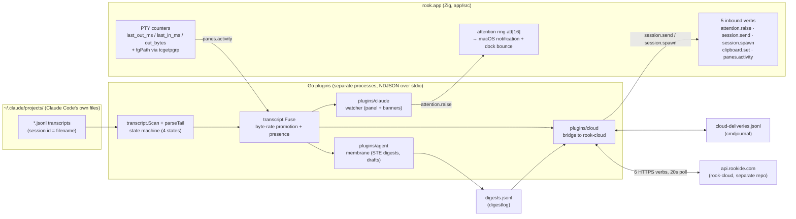
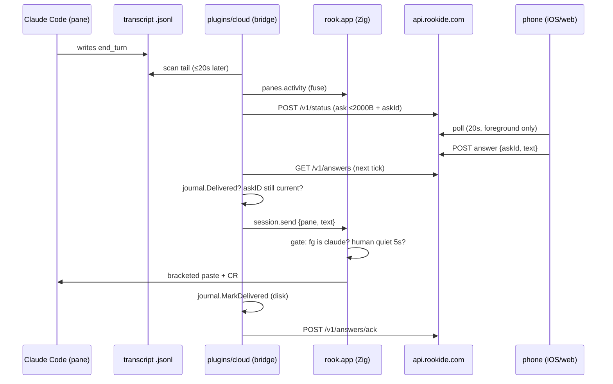

# 04 — Agents, Claude Code, Cloud, Remote, Mobile, Multi-Device

Repo: `/Users/sethlowie/go/src/github.com/incantery/rook` @ `291f6d0` (2026-08-07).
All paths repo-relative unless absolute. Every load-bearing claim below was verified against
the implementation at HEAD (files opened, lines read); claims resting on evidence *outside*
this repo (the sibling `rook-cloud` repo, the user's live `~/.config/rook/`) are explicitly
labeled as such and should be treated as second-hand.

---

## 1. The headline question: is "agent" a first-class abstraction?

**Answer: No — "agent" is emergent, and the repo's own history shows this is a deliberate
decision, not an omission.**

The evidence, in order of strength:

1. **There is no `Agent` type anywhere in the Zig core** (`app/src/`). A grep for `Agent`
   across `app/src/*.zig` finds only prose in comments ("target is not an agent TUI",
   "on an agent box…") and the `agent-transcripts` disk-scan classification. The core's
   entire vocabulary is: panes/sessions (PTYs), plugins, five inbound host verbs, and a
   16-slot attention ring.
2. **What the core does provide is agent-*legible* substrate**: three atomic activity
   counters per PTY — `last_out_ms`, `last_in_ms`, `out_bytes` (`app/src/session.zig:286-292`,
   updated in the read loop) — and a per-call foreground-program query via
   `tcgetpgrp(pty.master)` + `proc_pidpath` (`session.zig` — `fgPath`; "two syscalls, no
   allocation, no cache to go stale"). These are exposed to plugins as the `panes.activity`
   verb (`app/src/macos.zig` — `App.activityReport`, ~7362) and as `ctl activity` — one
   producer, two encodings via a comptime flag.
3. **Everything "agent" is assembled outside the core, in three Go plugins**
   (`plugins/claude`, `plugins/agent`, `plugins/cloud`), from two evidence streams: Claude
   Code's own transcript files (`~/.claude/projects/<munged-cwd>/<session>.jsonl`) and the
   PTY telemetry above. The only struct named anything like "agent" on a wire is `wireAgent`
   in `plugins/cloud/main.go:339-349` — and that is the *cloud schema's* vocabulary
   (`state ∈ working|needs_input|quiet`, `Model: "claude"` hard-coded), a projection of
   `transcript.Session`, not a core type.
4. **A previous in-core agent layer existed and was deleted.** `docs/agent.md` (status
   2026-07-31, self-declared historical) records that the Go-host era had agentwatch,
   transcript reading, claim/bind correlation, and a drafter — all stripped with the Go core
   (commits `5b50b93`, `e502bd4`). `STATUS.md` §"What does not work" item 1 (verified at
   HEAD) says the agent layer is "mostly still absent **by choice**: it comes back as plugins
   over the item model," and names `plugins/claude` and `plugins/agent` as the first two
   returned pieces.

So: rook-the-core is an agent-agnostic terminal substrate; "agent" is a *derived view*
computed out-of-process over files plus byte-rates, actuated through five grant-gated verbs.
This is one of the strongest design moves in the repo (see §9).

One important asymmetry to keep in mind throughout: **the pipeline is provider-neutral in
architecture but Claude-Code-shaped in every constant** — transcript directory layout,
`--claude-names` defaults, the string `"claude"` in the send gate, `/compact`,
`claude --resume`. `docs/agent/acp-brief.md` (08-07) sketches a `plugins/acp` that would
generalize this; **no ACP code exists at HEAD** (Documented only).

---

## 2. How rook knows an agent exists — the detection pipeline

Three independent channels, fused in a shared library, `plugins/internal/transcript`
(~508 lines), which all three agent-facing plugins stand on.



### 2a. Transcript watching (identity + state) — **Implemented**

`transcript.Scanner{Dir, Window, Idle, Quiet, Max}` scans one directory level under
`~/.claude/projects`; every `*.jsonl` whose mtime is within `Window` (48h) is a session,
and **session ID = the transcript filename minus `.jsonl`** (transcript.go — `Scan`).
Subdirectories (`subagents/`) are deliberately skipped — "a subagent is the session's
business, not the human's."

`parseTail` reads only the **last 256KB** of each file, aligned to a whole line, and replays
lines through tolerant wire structs (every field optional, unparseable lines skipped — the
stated posture is "a wrong 'working' beats a dead panel"). Extracted per session
(`Session` struct): ID, Path, Title (Claude's `aiTitle` meta, with a dir·id-prefix
fallback), last Prompt, Cwd, git Branch, LastText (last assistant text block), State, Mtime,
TurnDur, Present, and **CtxTokens + Model** from the last *non-zero* `usage` line
(input + cache_creation + cache_read + output — a synthetic zero-usage line must not erase
a real reading).

Context meter: `CtxPct` = tokens×100/window; window = 1M if the model id contains `[1m]`,
else 200k; **deliberately uncapped past 100%** — a 140% reading means the window table is
wrong, and "an honest wrong number gets fixed."

### 2b. The waiting-state machine — **Implemented** (verified line-by-line)

Four states with an explicit panel priority (`transcript.go:38-57`):
`needs you` < `blocked?` < `working` < `idle`. The decision procedure, verified at
transcript.go (~:385-402):

```
age > Idle (10m)                                             → idle
last event = assistant AND stop_reason ∈ {end_turn,
  stop_sequence}                                             → needs you
last event = human prompt starting "[Request interrupted"    → needs you
last event = assistant, NOT end_turn, quiet > Quiet (60s),
  AND permissionMode ∉ {auto, bypassPermissions}             → blocked?
else                                                         → working
```

The `blocked?` case is the approval-detection heuristic: a tool_use was issued, nothing has
come back, and the session runs under a prompting permission mode — "the likeliest reading
is an approval box nobody has seen. The '?' is honest — a slow tool looks identical from
here" (verbatim comment, verified). Sidechain (`isSidechain`) lines never count as events;
tool_result user lines are not prompts; `TurnDur` = last-event-time − prompt-time when
needs-you. The state machine is exhaustively unit-tested (`transcript_test.go`:
TestEndTurnNeedsYou, TestPendingToolQuietIsBlocked, TestPendingToolQuietAutoStaysWorking,
TestSidechainDoesNotEndTheTurn, and more).

### 2c. PTY fusion (the substrate correction) — **Implemented** (verified)

`transcript.Fuse` (transcript.go:170–206, read in full) folds `panes.activity` data into
transcript state. Matching key is **cwd + claude-like foreground program**
(`claudeLike`: fg name in `--claude-names`, default `claude,node`, or exec path containing
"claude" — needed because Claude Code's versioned install runs a binary literally named
e.g. `2.1.220`). Two corrections, one per PTY direction:

- **OUTPUT**: a claude-like pane writing at ≥ `busyRate` (200 B/s default) with no keystroke
  within `echoGuardMs=3000` promotes a session from `blocked?`/`idle` → `working`. The
  signal is byte *rate*, not the last-output clock ("an idle TUI's cursor blink also wrote
  'just now', but at a hundredth the rate"). Crucially, only the **freshest transcript per
  cwd** gets promoted — the comment records the bug this fixed: "one working pane promoted
  ten hours of history to 'working' with it" (commit `ced6144`).
- **INPUT**: minimum `inMs` across matching panes < 45s (default) sets `Session.Present` —
  the human is watching; state stands in the panel but banners are suppressed.

Unmatched sessions ("another machine's transcripts, a session run outside rook") keep their
transcript-only state — the multi-machine case is explicitly anticipated in the comment.

### 2d. What is *not* involved

- **No integration API with Claude Code.** Nothing is asked of the agent process: no
  stream-json, no MCP, no ACP, no API session. Identity and state come entirely from files
  Claude Code writes for its own purposes, corrected by byte rates. Even `resume` and
  `compact` from the phone are delivered as *typed keystrokes* (§6). The single point of
  contact with the agent's process is `tcgetpgrp`.
- **`app/src/procmon.zig` / `monitor.zig` play no role** in agent state despite the naming
  gravity — they are the machine-monitor pane (libproc/mach CPU/memory/disk sampling). Their
  only agent link: `diskscan.zig` classifies `~/.claude/projects` as `agent-transcripts`
  with Reclaim=keep — never offered for deletion, with a dedicated test.

---

## 3. The three plugins

All three are separate Go processes spawned by the app, speaking newline-delimited JSON v1
frames on stdin/stdout (`app/src/plugins.zig`), with declared-vs-granted-vs-wanted
capability accounting (§5). Each hand-rolls its own `conn` pump; the wire boilerplate is
copy-pasted three times and the code *says so* ("the third copy should be the one that
writes it" — the shared package is still owed at HEAD).

### 3a. `plugins/claude` — the watcher — **Implemented, actively used**

~398 lines after an 08-03 rewrite (`a19e649`). Serves a panel (`items.list`) of every
session within 48h: title, age·cwd, state, ctx%, branch, with actions `open` (spawns
`$SHELL` at the session's cwd — deliberately *not* `claude --resume`) and `peek` (last
text snippet).

The watch loop (main.go:340-398, read in full) is where waiting-state becomes attention.
Every poll (2s): fetch `panes.activity` (1.5s timeout, degrades to nil — "the grant is the
human's choice"), compute rates, Scan, Fuse, then fire on **state-transition edges only**:

- `→ needs you`: only if the old state was `working`/`blocked?` AND `TurnDur ≥ --min-turn`
  (30s) AND the human is not `Present` → `attention.raise` "{title} is waiting on you" +
  200-char snip of the answer. Rationale verbatim: "a two-second answer the human watched
  happen needs no banner, an interrupt was the human's own hand."
- `→ blocked?`: only from `working` and not Present → "{title} may need an approval".
- **The first pass records a baseline and raises nothing** — "twenty banners at launch
  describing yesterday would teach the human to ignore the twenty-first."

### 3b. `plugins/agent` — the membrane/summarizer — **Implemented, actively used**

Rook's own agent: an OpenAI-compatible `/chat/completions` client (default model
`gpt-5-mini` by flag, but the SDK declaration defaults to **`gpt-5.6-luna`** — "the
2026-08-03 bake-off winner"). Its job (package comment): "compress Claude Code's finished
replies into STE-style digests… the human should read the three bullets first and the eight
paragraphs by choice." Notable, and elevated to principle in `docs/agent/VISION.md`: the
overseer deliberately runs on a *different provider's model* than the worker — "the
overseer must not share the worker's blind spots."

Mechanics worth carrying into second-stage analysis:

- **Trigger** = the same needs-you edge as the watcher, independently computed: fires only
  on transition into `needs you` from working/blocked?, reply ≥ `--min-words` (120), never
  on the baseline pass ("summarizing yesterday at launch would spend real money").
- **Billing defenses are treated as correctness**: digest ID = sessionID + `:` +
  FNV-1a-32(LastText), so a state that flaps back through needs-you cannot bill the same
  reply twice; a `spent()` check consults both the in-memory done-map and the
  journal-restored store (a relaunch must not re-bill); the digest is marked spent **before**
  the API call ("a call that fails lands as an error row, not as a bill that grows by one
  attempt per tick"); unknown models get **no cost shown** ("a made-up number in a MONEY
  field is worse than none"); cost is computed from API-reported usage so "the meter should
  agree with the invoice."
- **Shape contract**: prompt asks 15-word headline / ≤5 bullets / ≤20 words each; the
  deterministic guard allows 25/6/28 (one-word overshoots are not worth a paid retry); one
  retry whose correction names only the limits; then a salvage fallback; only then an error
  row. The STE caps exist because the plugin panel's wire caps are what a digest must fit —
  UI constraints drove the prompt design.
- **Key resolution**: `$OPENAI_API_KEY` beats the default key file
  (`~/.config/rook/openai_key`), but an *explicit* `--key-file` beats the env — precisely so
  `rook.Agent{API: CloudAPI, KeyFile: CloudTokenFile}` (completions proxied through
  rook-cloud on the machine token, fleet pays — commit `b681a54`) doesn't leak an exported
  OpenAI key as the machine bearer. Missing key + default base = a standing panel row, not
  an exit; a non-default base (ollama/LM Studio) needs no key at all.
- **Draft/expand/copy** ("rung 2" of the autonomy ladder): actions on a digest draft the
  reply the user most plausibly wants (≤120 words), expand carries the human's rough words
  ("keep their decisions and intent EXACTLY"), and `copy` places it on the pasteboard via
  the `clipboard.set` verb — flipping to "copied" only *after* the host confirms
  ("'copied' on a missing grant would be the panel lying about the pasteboard"). The agent
  plugin's default grants are **items.list/items.act/clipboard.set only — no
  `session.send`** (sdk/rook/rook.go — Agent): the clipboard is the deliberate rung-2
  hand-off; the human's own ⌘V is the actuator.

### 3c. `plugins/cloud` — the bridge — **Implemented, actively used** (§6 below)

### 3d. The digest journal — `plugins/internal/digestlog` — **Implemented**

"The file is the interface" — the agent plugin writes `digests.jsonl`
(`$XDG_STATE_HOME/rook/` else `~/.local/state/rook/`), the cloud plugin reads it, nobody
holds a socket to anybody. Full-snapshot lines, last-line-per-id wins, `Dismissed:true`
tombstones, torn tail lines skipped, 8MB compaction via temp+rename preserving append
order. Single-writer/multi-reader; the mutex serializes goroutines, not processes — readers
tolerate torn tails instead.

**The privacy boundary lives here and is enforced in code** (verified): `Digest` carries
`Prompt` and `FullText` (raw turn material, kept so drafting doesn't compound a summary's
lossiness) — but the export view `Latest()` (digestlog.go:190-204, read) selects only
presentable digests, and the cloud bridge copies **only Headline/Bullets/At** into
`wireDigest` (cloud/main.go:423-425, verified). "Headline and bullets travel, the raw turn
they compress stays home."

---

## 4. The host side: five verbs and their gates — **Implemented** (all verified)

`app/src/plugins.zig` states the trust doctrine in its header: config says a plugin EXISTS,
config says what it MAY do (grants), the plugin says what it WANTS (`describe.capabilities`);
"the gap between the last two is the trust surface." Grants are exact-match, checked in
*both* directions (outbound refusals happen before the plugin is even told; inbound refusals
name the missing grant: `"not granted: session.spawn"`). Dispatch of inbound verbs is
`App.pluginInbound` (`macos.zig:7340-7353`), synchronous on purpose.

| Verb | Gates and semantics | Reference |
|---|---|---|
| `attention.raise` | Provenance **host-stamped** from the declaration, never from params ("provenance a caller can set is not provenance"); fixed ring of 16 (`att`); posts a real **UNUserNotificationCenter** notification + dock bounce when inactive; readable via `ctl attention`/`ctl notify` | macos.zig:7405-7456, ring at :578-584 |
| `session.send` | **Two non-negotiable gates** (read in full, :7465-7516): (1) target pane's foreground must *be* claude by basename or path — `node` deliberately does NOT pass though the watcher counts it for display, because "text typed into a shell EXECUTES… a REPL eats typed text as code too"; (2) a human keystroke in that pane within 5s refuses delivery ("a plugin… does not get to fight the keyboard for it mid-sentence"). Text ≤8192 bytes, wrapped in bracketed paste `ESC[200~…ESC[201~` + CR | macos.zig — `sessionSend` |
| `session.spawn` | Command ≤4096, cwd ≤1024, optional `where:"tab"`; the new pane is **never focused** ("a plugin gets to put something on your screen; it does not get to take your keystrokes mid-sentence"). Framed honestly as visibility, not privilege: the plugin could exec things itself; the verb buys "runs WHERE THE HUMAN CAN SEE IT" | macos.zig:7537-7591 |
| `clipboard.set` | 256KB cap; comment ties it to the OSC 52 precedent — pasteboard writes are a permission | macos.zig:7518-7535 |
| `panes.activity` | Per pane `{id, outMs, inMs, outBytes, fg, path, cwd}`; full exec path included because the versioned binary name lies | macos.zig:7362-7398 |

Two cross-cutting facts that matter for the scenarios in §7:

- **A failed plugin stays failed.** `Plugin.ensure` (plugins.zig:369-374, verified):
  "a plugin that failed once stays failed until something clears it — a crash loop that
  respawns on every keystroke is worse than a dead panel." No clearFail/retry path exists in
  plugins.zig or macos.zig. If the cloud plugin alone crashes, remote access is gone until
  rook relaunches. (**Partially implemented** failure recovery.)
- **The attention ring has no in-app renderer.** Its only consumers are the macOS
  notification path and `ctl attention`/`ctl notify`. The "banner" language in plugin
  comments means the OS notification today. (**Partially implemented** attention surface;
  `docs/agent/VISION.md`'s "attention fusion" roadmap item — fusing the watcher's banner
  with the membrane's digest — is open.)

---

## 5. The autonomy ladder — status per rung

`docs/agent/VISION.md` (08-04) defines a ladder; this is its implementation status at HEAD:

| Rung | What it is | Status |
|---|---|---|
| 1 — see | Panel + attention on finished turns | **Implemented** (watcher), with the noted gap: banner and digest are raised/journaled by two plugins separately, never fused |
| 2 — compress + draft | STE digests, drafted replies, clipboard hand-off | **Implemented** (agent plugin) |
| 3 — hands | `session.send` typing into the agent's pane | **Substrate implemented and used — but only by the cloud ask rail.** No local "send it" action exists; the agent plugin holds no `session.send` grant at HEAD |
| 4 — verdict ledger | Record accept/edit/reject of drafts to earn autonomy | **Not implemented in this repo.** No ledger line is written anywhere; VISION calls its location an open product decision |
| 5 — policy autonomy / supervisor / DecisionFrames | Temporal control plane | **Not in this repo**; VISION claims it lives in rook-cloud — unverifiable here, treat as Documented only |

One footnote on rung 4, because it is the only rung with archaeology rather than a blank: the
verdict still has no storage anywhere in this repo, but it once had *UI*. `App.queueVerdictLocked`
(app/src/macos.zig:4589-4602) survives as dead code — uncalled, and referencing six `App` fields
that do not exist (`rev`, `rev_sel`, `rev_set`, `rev_set_len`, `rev_set_id`, `rev_wake`; verified,
`grep -n 'rev_' app/src/macos.zig` matches only :4590-4600). It compiles solely because Zig does
not semantically analyze an unreferenced private function. Its body is verdict semantics verbatim
— it stages a state string against the selected finding, advances the selection immediately
("the next finding is where you are going anyway, and waiting for a round trip to advance would
make triaging 52 of them feel like 52 round trips"), and sets a wake flag for something to drain.
That is the review pane that was ported to Zig on 07-29 and deleted 07-31, and it is the strongest
in-code evidence that rung 4 once had a triage surface. It is **not** evidence that anything
persists a verdict: there is no consumer of `rev_wake`, no ledger file, and no ctl verb. Doc 08 §12
tracks it as dead code; doc 09 asks whether it is a seed or a removal.

---

## 6. Cloud / remote / mobile — architecture at HEAD

### 6a. Shape and history

Everything "remote" in this repo is **one Go plugin**: `plugins/cloud/main.go` (~1107
lines) — "the thin line to rook-cloud: this machine, made visible from your phone."
Stateless HTTPS polling to `https://api.rookide.com`; no daemon, no WebSocket, no push
channel into the machine. Governing mantras, verbatim in code: "cloud coordinates, the
machine decides" and "at-least-once from the cloud, at-most-once at the keyboard."

This is the **second build** of remote. The first (Jul 24–27, Go-host era) was strictly more
elaborate — a relay/mailbox for asks (`d865f45`), a proto3/ConnectRPC "edge" command
protocol with cloud signatures, ledger digests, fencing eras, expiry, single-use approvals,
and keychain device keys (`d3499be`) — and was deleted wholesale within days
(`90d2141`…`ab475e1` "asks and the relay leave — **a mailbox is an integration, not a
primitive**", then `e502bd4` stripping the Go core). The rebuild (all nine commits —
`git log -- plugins/cloud plugins/internal/{cmdjournal,digestlog}` runs `6b4bb2a` … `3d18402`,
every one dated **2026-08-04**, untouched since) kept exactly two ideas from the corpse: last-write-wins
snapshots and journal-before-ack. The security model moved from cryptographic (signed
commands) to capability-scoped (bearer token + three safe verbs + local gates) — a
documented judgment call, not drift.

Stray note: the `cloud` and `rookctl` Mach-O binaries at repo root are **untracked local
build debris** (gitignored with explanatory comments; `git ls-files` excludes them), not
products. `rookctl` embeds source paths of directories deleted at `e502bd4`.

### 6b. Device identity and auth — **Implemented**

- Provisioning is manual, once: mint a machine **bearer token** on cloud.rookide.com, write
  it to `~/.config/rook/cloud_token`. `--token-file` selects a *different path*, but
  `$ROOK_CLOUD_TOKEN` beats the file unconditionally — `readToken` (plugins/cloud/main.go:127-136)
  returns the env var first and only falls through to `os.ReadFile(path)` when it is empty. Note
  the asymmetry with the agent plugin, where an explicit `--key-file` **suppresses** the env
  lookup (`apiKey(path, explicit)`, plugins/agent/main.go:134-139) precisely so an exported
  `OPENAI_API_KEY` cannot leak as the machine bearer (§3b): the cloud bridge has no equivalent
  "explicit" flag, so the guard runs in one direction only. No
  keypair, no enrollment, no certificate — deliberate simplification vs. the deleted edge
  protocol.
- Identity check: `GET /v1/whoami` → `{machineId, name}`, retried each tick until it
  answers; pushes start only then (`loop`, main.go:183-199, verified).
- Revocation/recovery — **Partially implemented** (main.go:282-296, verified). A 401 on push
  clears the machine identity, sets the panel row "token revoked — mint a new one at
  cloud.rookide.com and update <path>", and re-reads the token file **once, at that moment**.
  It is *not* re-read per tick, which the code's own comment ("a re-minted token in the same
  file resurrects the bridge") implies and which an earlier draft of this document repeated:
  `readToken` has exactly two callers in the process lifetime — startup (main.go:96) and this
  401 branch (main.go:292) — and the 401 branch has just cleared `machineID` (main.go:287),
  after which `loop` only calls `whoami()` (main.go:186-193) and never reaches `push`, the
  sole post-startup caller of `readToken`. So the bridge spins on `whoami()` forever using
  whichever token was in memory when the 401 fired, and a token re-minted *after* the 401
  requires an app relaunch to be picked up. The comment's promise holds only in the narrow
  race where the file is updated before the single 401 arrives. Symmetrically, an absent or
  empty token at startup means `loop` never starts at all (`if br.token != "" { go br.loop(…) }`,
  main.go:121-123), so writing a token later also needs a relaunch — which is consistent with
  the panel row it produces: no token = a single "not connected" onboarding row, state `off`,
  "connectivity is configuration, not damage."
- Nit (observed live, out-of-repo): `cloud_token` is mode 0644 while the adjacent
  `openai_key` is 0600; the bridge neither chmods nor warns.

### 6c. The wire protocol: six HTTP verbs, all machine-initiated

Cadence: one loop every `--interval` (20s) or on the panel's "push now" doorbell (buffered-1
channel): whoami-if-needed → push → collect answers → execute commands.

1. `GET /v1/whoami` — identity.
2. `POST /v1/status` — the snapshot, last-write-wins ("a retry after a network blip costs
   nothing"); any 2xx accepted (204-on-stored was a fixed bug, `4c1103f`).
3. `GET /v1/answers` → `{answers:[{askId,text}]}` — phone-authored replies outbox.
4. `POST /v1/answers/ack {askId}`.
5. `GET /v1/commands` → `{commands:[{id,kind,sessionId,workspace,prompt}]}` — kinds today:
   `compact`, `resume`, `spawn`; unknown kinds acked away with a note ("an older bridge
   meeting a newer cloud").
6. `POST /v1/commands/ack {id}`.

**Out-of-repo evidence (from the research phase, not re-verified here):** rook-cloud's
server implements exactly these six endpoints, bearer-authed; machines and their
`Answers`/`Commands` arrays live in MongoDB with tokens stored hashed; the fleet renders on
cloud.rookide.com; an iOS SwiftUI app polls every 20s **foreground-only**, with a header
comment that push notifications wait on the paid Apple developer account.

### 6d. What leaves the machine (the privacy line)

`wireStatus` (main.go:326-359 + `statusFrom` :397-454, verified):

- hostname, rook version;
- per workspace: **basename of the cwd only** (never the full path), branch, attention count;
- per agent (≤50, 48h window): transcript session id (this is what phone commands name),
  state (`working|needs_input|quiet`), title (snipped 80), `model:"claude"` (hard-coded —
  the scanner knows the real model id but the fleet never learns it), ctxPct, mtime;
- when `needs_input`: **`ask` = the assistant's actual last message, up to 2000 bytes with
  line structure preserved** (`askText`) — the most substantive content that leaves. The
  2000-byte whole-ask rule replaced a 200-byte snip the same day (`d594765`: "a reply
  written against a tenth of a question is a reply to a different question"). `blocked?`
  maps to `needs_input` with ask `"approval? "+Prompt` — deliberately conservative
  ("exactly what you left the room and want to know about");
- `digest` = headline + bullets + timestamp only (§3d).

Raw transcripts, prompts, file contents, terminal contents never ride the status wire.
Caveat from the SDK: `rook.Agent{API: rook.CloudAPI}` would route the summarizer's
completions — which include full turn text — through api.rookide.com on the machine token;
the user's live config uses the OpenAI key path instead (out-of-repo observation).

### 6e. The ask rail: stale-answer safety by construction — **Implemented**

`askID(s)` = `sessionID:` + FNV-1a-32 of `LastText` (or `"approval:"+Prompt` when blocked)
— main.go:865-876, read in full; the comment calls it "an identity not a defense."
Delivery **re-derives** the askID from the *current* scan: if no session's current askID
matches the answer's, the ask moved on (answered at the desk, or a new turn), and the
answer is acked away with the panel note "dropped a stale answer — the ask moved on"
(`collect`, verified). This makes the old relay era's "both settle, desk wins" rule
*structural*: the desk answering changes the ask text, which invalidates the phone's
answer by construction, with zero coordination state.

### 6f. At-most-once across crashes: `plugins/internal/cmdjournal` — **Implemented**

One jsonl file, `~/.local/state/rook/cloud-deliveries.jsonl`: `Entry{key, delivered,
attempts, at}`, last-line-per-key wins, torn tails skipped, 1MB compaction, 30-day window.
Both rails share it (answers keyed by askID, commands by `"cmd:"+id`) — "two bookkeepers
would be two chances to break it."

**The ordering invariant** (verified verbatim in `collect`): after a successful
`session.send`, *"Typed. Mark BEFORE the ack: a lost ack must re-ack, never re-type — and
the mark is on disk before this returns, so a crash in the gap cannot cost a second round
of typing either."* `Failed(key)` increments-and-returns so the retry bound (`> 5`) is one
expression, and attempts persist so an unlandable answer doesn't get a fresh budget each
relaunch. An unopenable journal degrades to memory-only with an honest panel note ("a crash
could retype an answer"). ~32 unit tests cover the rails against fake HTTP + fake conn
(round-trip-types-once, stale-acked-never-typed, delivery-remembered-across-restart, etc.).

### 6g. The full phone-answer path



End-to-end latency is bounded by two 20s polls — tens of seconds by design, zero idle
traffic. **No push notifications exist anywhere** (see Scenario A).

### 6h. The command rail — **Implemented** (verified at main.go:539-747)

- **compact**: refuses while the session is `working` (bounded retries waiting for the turn
  to end), then types the literal `/compact` via session.send.
- **resume**: spawns `claude --resume <id>` in the session's own cwd. The id comes from the
  **local transcript filename, never the wire**, and `shellSafeID` charset-checks
  `[A-Za-z0-9._-]` besides, because `session.spawn`'s command reaches a shell. Refuses to
  resume a session whose cwd already has a claude pane on the freshest transcript
  ("resuming it twice makes two instances fight over one transcript").
- **spawn** (read in full): the workspace name resolves to a cwd **through this machine's
  own recently-seen sessions** — "the phone can only name what the machine showed it"; the
  spawned command is the literal string `"claude"`; the prompt is delivered afterwards as
  *typed text* through session.send's gates — "cloud words never touch a shell." The spawn
  is journaled + acked **before** the prompt hop ("a redelivered spawn must never open a
  second pane; a prompt that then fails costs a note, not a duplicate"). New-pane discovery
  = diff of pane-id sets, polled 6×2s; a prompt that never lands yields the note
  "type it there."

---

## 7. Scenarios A–E, answered from implementation

### A. User walks away; Claude Code is mid-task; user has only their phone

**Implemented with ~20–40s granularity; the wake-up story is the hole.** While rook runs,
the bridge pushes every 20s: the session shows `working` (byte-rate-fused, so a logging
tool or long think still reads honestly), and when the turn ends the next push carries
`needs_input` + the full ask text + askId + the membrane's digest headline/bullets — so the
phone can show *what happened*, not just that something did. The user answers, or issues
compact/resume/spawn; the bridge lands it within one tick through the gates in §6g/§6h.

**Not implemented:** any push notification. The iOS app (out-of-repo) polls only while
foregrounded and its own header says the real wake-up waits on a paid Apple developer
account. So "walk away" today means "open the phone app and look." Also, per `STATUS.md`
"Accepted regressions" (verified): "Nothing happens while rook is closed" — the bridge is a
child of the rook process; quit rook and the fleet page goes stale (staleness only visible
as "pushed X ago", since status is last-write-wins with no liveness protocol).

### B. The UI crashes with long-running terminal processes inside

**Everything dies; explicitly accepted.** `STATUS.md` (verified verbatim): "Shells die with
the app. rook owns its ptys in-process. Quitting kills every shell in every space." There is
no daemon since the Go strip; the cloud plugin dies with its stdin.

What recovery *is* implemented: Claude Code's transcripts are on disk, so after relaunch
the bridge re-reports every session in the 48h window, and the phone's **resume** command
reopens one (`claude --resume <id>` in its cwd). The cmdjournal survives the crash: an
answer typed-but-unacked before death is re-acked on the next run, never re-typed
(TestDeliveryIsRememberedAcrossARestart). **Hazard (Partially implemented):** if only the
*plugin* crashes, `.failed` sticks with no respawn path (plugins.zig — `ensure`, verified)
— the machine silently drops off the fleet until the app relaunches.

### C. Temporary internet loss

**Implemented gracefully, by design.** The loop never dies: failures record `lastErr`, the
panel row reads "cloud unreachable: …", the next tick retries — "the network coming and
going is weather, not damage." Nothing queues on the machine: status is derived, not
stored, and last-write-wins means the first successful push after the blip is complete.
Answers/commands wait durably on the cloud side; delivery is at-least-once (lost acks cause
redelivery) and the cmdjournal makes the keyboard effect at-most-once. Ack failures are
deliberately ignored — redelivery next tick is absorbed by the journal.

### D. Two machines, same user

**Implemented via per-machine identity.** Each machine mints its own bearer token; answers
and commands are posted to `/machines/{id}/…` and land in that machine's outboxes; each
bridge fetches only its own (the token names the machine). A command aimed at machine A
never types on machine B. (Cloud-side details are out-of-repo evidence.)

**Unhandled edge (Inference, labeled):** if `~/.claude/projects` were synced across
machines, both bridges would report the same sessions under different machine ids —
`Fuse`'s comment explicitly anticipates "another machine's transcripts" and leaves them
transcript-only. An answer routed to the machine without the live pane would retry 5× and
drop with "no agent pane for …". **No cross-machine session handoff exists**, and nothing
in-repo plans one.

### E. Remote command arrives during sensitive local state

**Multiple independent local gates; the cloud never gets a shell.** Enumerated, each
verified in code:

1. **Vocabulary**: the only remote effects are answer-typing, `/compact`,
   `claude --resume <local-id>`, and spawn-`claude`-then-type-prompt. Unknown kinds are
   acked away by name. This plugin holds no file-read, exec, or screen-read verb.
2. **`session.send` refuses any pane whose foreground isn't claude** — remote text cannot
   reach a shell prompt or a REPL (`node` deliberately fails the send gate even though it
   passes the display heuristic — the asymmetry is commented on both sides).
3. **The 5-second human-presence guard**: if you typed in that pane within 5s, delivery is
   refused ("a human is typing there"); the bridge retries next tick, bounded.
4. **Staleness**: answers land only while the askID still matches the live conversation
   state — the desk always wins; `compact` holds while the session is mid-turn.
5. **Shell-reaching strings are constructed locally**: resume ids are local filenames plus
   `shellSafeID`; spawn's command is a literal; workspaces resolve through the machine's own
   vocabulary.
6. **Config-level consent**: every verb is a grant the human wrote (`Cloud.appendTo`,
   sdk/rook/rook.go:946 — defaults `items.list`, `items.act`, `panes.activity`,
   `session.send`, `session.spawn`; notably *not* `attention.raise` or `clipboard.set`).
   Withholding `session.send` removes the phone's ability to **type** — answers
   (plugins/cloud/main.go:509), `/compact` (:606) and `spawn`'s follow-on prompt hop (:725)
   all fail — but it does **not** make the machine read-only. `session.spawn` is a separate
   grant, and it is the actuator for two of the three command kinds: `runResume` calls it with
   `"claude --resume " + target.ID` (main.go:656) and `runSpawn` calls it with the literal
   `"claude"` (main.go:700). With `session.send` withheld, the phone can still open a new
   claude pane in any cwd the machine has shown it and resume any local session — that is
   process spawning, not observation. **Withholding both `session.send` and `session.spawn`**
   is what makes a machine observation-only.
7. Claude Code's own permission prompts still gate whatever the typed text asks it to do.

**One real nit (Inference, unverified as exploitable):** `sessionSend` frames text in
bracketed paste with no filtering of control bytes (macos.zig — the `bufPrint` at the end
of `sessionSend`, verified present). An answer containing the literal bytes `ESC[201~`
would close the paste early and deliver the remainder as raw key input to the claude TUI.
Blast radius is confined to the agent TUI by gate (2), and the author of the text is the
account holder — but a defense-in-depth ESC strip would be cheap. What today's rail *lacks*
versus the deleted edge protocol, stated plainly: **no command expiry, no signatures, no
approval-digest binding** — a command executes whenever the bridge next polls, however old.

---

## 8. Evidence-labeled findings (index)

**Implemented (and actively used):**
- Transcript-tail state machine (4 states, permission-mode awareness, interrupt detection,
  ctx meter) — `plugins/internal/transcript/transcript.go` (state switch verified); ~22 tests.
- PTY fusion: byte-rate promotion, 3s echo guard, 45s presence, freshest-per-cwd —
  `transcript.Fuse` (read in full).
- Watcher: panel + transition-edge attention with min-turn/presence/baseline suppression —
  `plugins/claude/main.go` — `watch` (read in full).
- Membrane: STE digests with deterministic shape guard, one retry, salvage fallback; cost
  metering; draft/expand/copy; spent-before-call — `plugins/agent/{main,summarize}.go`.
- Digest journal with tombstones, compaction, headline-only export —
  `plugins/internal/digestlog` (Latest verified).
- Cloud bridge: status push, whole-ask rail with structural staleness, compact/resume/spawn,
  crash-safe at-most-once — `plugins/cloud/main.go` (loop, collect, runSpawn, 401 path all
  read), `plugins/internal/cmdjournal`; live-deployed per the user's environment.json
  (out-of-repo observation).
- Host verbs with gates: claude-only + 5s-keyboard send gate (macos.zig — `sessionSend`,
  read in full), host-stamped attention provenance, never-focused spawn, exact-match grants
  with named refusals.

**Partially implemented:**
- Attention surface: OS notification + ctl only; no in-app renderer of the `att` ring.
- Autonomy ladder rung 3: `session.send` exists but only the cloud rail uses it; no local
  "send it" action; rung 1's banner/digest fusion missing.
- Plugin failure recovery: `.failed` is terminal until app relaunch (plugins.zig — `ensure`).
- Phone experience: rails and payloads complete; no push notifications, foreground-only
  polling (out-of-repo iOS evidence).

**Documented only (not implemented in this repo):**
- `plugins/acp` (docs/agent/acp-brief.md), agent dashboard (docs/agent/DESIGN.md), voice
  surface, verdict ledger, supervisor/DecisionFrames/Temporal (claimed for rook-cloud —
  unverifiable here), per-prompt git checkpoints (TODO.md).

**Obsolete/dead:**
- The entire Go-era agent layer (agentwatch, drafter, claim/bind — docs/agent.md is
  self-declared historical); the relay/mailbox ask system and the signed edge protocol
  (proto3/ConnectRPC), both deleted Jul 29–31 with the messages quoted in §6a; untracked
  root binaries `cloud`, `rookctl`, `bin/*`.

**Unclear:**
- Whether rook-cloud's outbox arrays are capped or expire (no TTL found in the research
  pass); how much of VISION.md's "decision membrane" actually runs cloud-side; pane-id
  instability across relaunch as an addressing scheme for `session.send` (ids are
  process-lifetime; cmdjournal makes delivery at-most-once but the namespace resets).

---

## 9. Judgments

**Unusually good design, evidence-backed:**
- **Files as interfaces**: transcripts in, digests through, deliveries through — three jsonl
  logs, one idiom (last-line-wins, tombstones, torn-tail tolerance, rename-compaction), no
  sockets between plugins.
- **The both-settle ask rail**: content-addressing the ask (askID = hash of the question)
  makes staleness *structural* — the desk answering changes the ask, which invalidates the
  phone's answer with zero coordination.
- **Journal-before-ack** for the crash window between typing and acking — an unusually
  rigorous delivery guarantee, motivated in a comment by exactly the right failure ("a
  second delivery is a second thing typed into somebody's editor"), and the one idea that
  survived from the deleted edge protocol.
- **`node` is claude-like for display but not for typing** — the same predicate deliberately
  not reused where text would execute; commented on both sides of the boundary.
- **Every heuristic threshold is a flag with a written rationale** (200 B/s, 3s echo, 45s
  presence, 60s quiet, 30s min-turn), and billing/attention suppression rules are all
  argued in place.
- **"The phone can only name what the machine showed it"** — workspace resolution through
  the machine's own session vocabulary is quiet, cheap containment.

**Concrete confusions / debts worth naming:**
- The wire `conn` boilerplate is copy-pasted across three plugins, acknowledged in comments
  both times it happened again; the shared package remains owed.
- `wireAgent.Model` hard-codes `"claude"` while the same struct carries a ctxPct computed
  from the *real* model id — the fleet can size the window but not name the model.
- Provider-neutrality is aspirational: the string `"claude"` sits hard-coded at the
  app-side protocol boundary (`sessionSend`), so a second agent TUI requires an app
  release, not config. The ACP brief exists; the code does not.
- The 0644 `cloud_token` beside the 0600 `openai_key`; and the un-stripped ESC bytes in
  bracketed paste (§7E) — both cheap hardening gaps.
- Pane-matching for delivery picks the *first* claude-like pane in a cwd; with two
  concurrent claude panes in one directory a phone answer could land in the wrong one
  (freshest-per-cwd protects *state*, not *delivery targeting*). No per-session pane
  disambiguation exists at HEAD.
