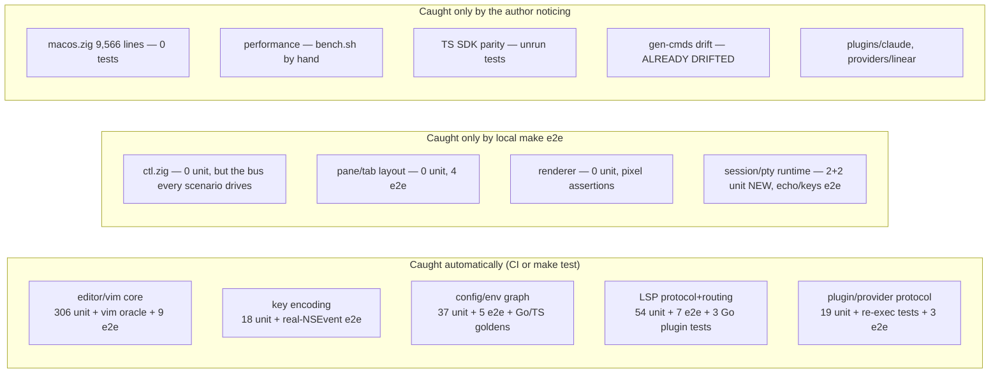
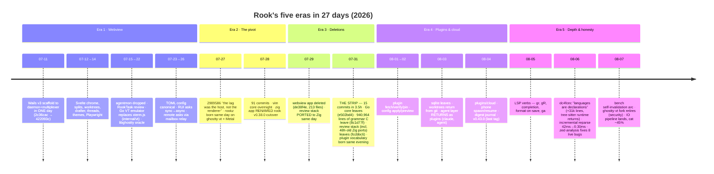

# 05 — Codebase quality and evolution

Analysis date: 2026-08-07 (late evening). Repo: `/Users/sethlowie/go/src/github.com/incantery/rook`, branch `main`.

**A note on HEAD drift, because it matters for this document.** The research-notes phase ran against HEAD `291f6d0` ("vt: the pin moves to upstream main, and the fork retires") with an uncommitted rewrite of the pty read pipeline sitting in the working tree. Between that pass and this writing, the author committed it: HEAD is now **`9ad05f3` "session: the pty is drained while the parser parses"** (2026-08-07 21:49), the working tree is clean, and the repo stands at **668 commits**. Everything below was re-verified against `9ad05f3` where the claim is load-bearing; the pipeline commit itself turns out to be a small but meaningful data point for both the testing story and the trajectory story, and is treated as such throughout.

This document strictly separates **snapshot** (how the repo is at `9ad05f3`) from **trajectory** (where the git record and the roadmap show it moving). Sections 1–4 are snapshot; sections 5–7 are trajectory; section 8 names unusually good design; section 9 lists open questions.

---

## 1. Snapshot: the testing system, layer by layer

Rook's test architecture has five distinct layers, each with a different philosophy, plus one layer that used to exist and is now gone. The overall strategy — visible consistently across all layers, and stated here as an evidence-backed inference — is: **unit-test the pure cores, e2e the composition, bench the performance, and never mock what can be real.**

### 1.1 Zig inline unit tests — 599 across `app/src/*.zig`

Counted at `9ad05f3` (`grep -c '^test'` per file; total re-verified: **599**, up 2 from the notes-phase count of 597 — the two new tests arrived with the pipeline commit, see §1.7). Distribution is extremely lopsided, and the lopsidedness is the story:

| file | tests | file | tests |
|---|---|---|---|
| editor.zig (14,159 LOC) | **306** | search.zig | 8 |
| lsp.zig (3,706 LOC) | 35 | registry.zig | 8 |
| regex.zig | 29 | paste.zig | 7 |
| hoverdoc.zig | 20 | workspaces.zig, unicase.zig, procmon.zig, grammar.zig, docs.zig | 5 each |
| plugins.zig | 19 | git.zig | 4 |
| keyenc.zig | 18 | rope.zig | 3 |
| config.zig, buffer.zig | 17 each | **session.zig** | **2 (new at HEAD)** |
| ui.zig, fuzzy.zig | 14 each | pty.zig, filelist.zig | 2 each |
| monitor.zig, language.zig, envapply.zig | 10 each | root.zig | 1 |
| lspmgr.zig, diskscan.zig | 9 each | | |

**Zero inline tests**: theme.zig, syntax.zig, stats.zig, render.zig, png.zig, panes.zig, main.zig, **macos.zig (9,566 lines)**, **ctl.zig (1,396 lines)**. The suite ran green during the notes phase (`zig build test` exit 0, Debug; `go test ./...` all ok).

Three structural facts about this layer deserve emphasis:

1. **The multi-root gotcha is real and institutionalized.** Zig only collects `test` decls reachable from a test root's import graph. `app/build.zig` wires **23 `addTest` invocations** (verified: `grep -c addTest` = 23 at HEAD), each with an inline comment explaining why that root exists — e.g. the pty root's tests "spawn real [processes]… no pane, no window, no trace but ps" and the lsp root notes libc is linked "for the two tests that DO spawn, which prove the pipe and the teardown." The comments exist because of a documented near-miss: app/build.zig:99-101 records "This hole once let a broken build read as green" — the editor's 300+ tests were once silently invisible to the runner. Note the comment-count drift chain: ci.yml:41 still says "build.zig wires **four** test roots" (verified stale at HEAD), an intermediate build.zig comment era described nine, and the actual count is 23. The mechanism is sound; the prose describing it lags by months of a 27-day project.
2. **The editor is oracle-driven.** editor.zig's tests (starting ~line 8326, i.e. ~41% of the biggest file in the repo is tests) carry real-vim oracle command strings as comments (e.g. editor.zig:9432: `vim -Nu NONE -n -es -c 'normal dW' -c wq f`), plus explicit "vim is not the oracle for this one" annotations where behavior deliberately diverges (editor.zig:1641, 12697). Test doubles for LSP-shaped flows live *inside the production file* (`CplProbe` editor.zig:12791, `FmtProbe` :12971, `ResolveProbe` :13893) — a direct consequence of the monolith structure (§3.1).
3. **The distribution is deliberate, not accidental.** Small pure files get their own roots with one-line justifications ("because ranking bugs read as taste" — fuzzy; "because they're security rules" — paste). The untested files are the impure ones: AppKit glue, Metal, the ctl socket, the layout tree. Whether that is an acceptable trade is the subject of §3.

### 1.2 The e2e suite — 51 sandboxed real-app scenarios (`app/e2e/`)

This is the repo's crown jewel and its answer to the untested impure layer.

- **`harness.zig` (~1,057 lines)** — `Instance.start()` fork/execs the actual rook binary into a per-scenario sandbox (`/tmp/rook-e2e-<pid>-<n>`) with its own ctl socket, config.toml, optional environment.json, state dir, and a pinned `/bin/sh` shell (the author's real zsh+zinit cold bootstrap caused first-run flakes in the deleted webview-era suite — harness.zig:80-86). It uses raw libc (fork/execv/socket) on purpose: "std's process/fs APIs move between Zig releases and this file is not worth re-fixing each time" (harness.zig:23-24).
- **Two kinds of truth** (harness.zig header): `dump` = what the emulator's grid holds; `shot` = a PNG of rook's own pixels, decoded via ImageIO with pixel-level assertions (`pixel(x,y)`, `ink(y0,y1)`, `inkRect`, `maxContrast`, `countColorNear`, `distinctColors` — harness.zig:794-1000). The header records why both exist: "The atlas-flip bug was invisible to the first and obvious in the second." The `pixels` scenario (main.zig:726) asserts ≥3 distinct colors on screen because "a uniform frame is the cheap signature of 'drew nothing at all'."
- **Scenario catalog** (app/e2e/main.zig:29-80, verified 51 `.name =` entries at HEAD): 50 assertion scenarios (boot, echo, splits, tabs, editor, **indent**, vim, wide, grapheme, termglyph, clobber, reload, pixels, commands, whichkey, statusbar, worktrees, cli, filetree, bufline, monitor, excmd, sidepane, quitall, plugins, envgraph, configdir, apply, setup, pluginfetch, claudewatch, chrome, presetparity, filefinder, explorerauto, lsp, lspaction, lspformat, lsppython, lspts, suggest, lsplang, lspretarget, docshare, findfiles, vscodefeel, keys, panedim, panelwrap, panelfold, …) plus one bench-only scenario `startup` (`.bench = true`, run only when named explicitly). Commit `291f6d0`'s body reports the suite at 50/50.
- **Polling, never sleeping**: `waitText`/`waitTextCount` re-query `screen()` every 100ms with a deadline and print the actual screen on timeout (harness.zig:438-465); `waitCtl` exists separately because side panels fill from background threads and are chrome, not the focused pane's grid (harness.zig:476, with a comment saying exactly that).
- **Never mock what can be real, part 1**: `e2e --fake-lsp <mode>` makes the harness binary *re-exec itself as* a stdio language server, injected via `ROOK_LSP_GO`, so the seven lsp* scenarios need no gopls and the suite cannot fail "on a fresh machine for a reason that has nothing to do with rook" (main.zig:2586-2589; harness.zig:103-108).
- **Never mock, part 2**: the `keys` scenario drives a real `NSEvent` through AppKit dispatch via the `nskey` ctl verb — and deliberately passes *wrong* character strings on the event to prove the encoder works from keycodes, because plain `ctl key` "starts downstream of the encoder and downstream of the nav check" and "would prove nothing" (main.zig ~:104).
- **Agent-first ergonomics**: the runner (main.zig:2574-2660) is serial, prints each scenario's name *before* running it ("a scenario that hangs has to have already named itself"), uses no cursor tricks because "the main consumer of this output is an agent reading a pipe," and keeps failing sandboxes on disk for inspection. The harness header states its purpose: so "an AGENT could verify its own UI work instead of asking a human to look."
- **e2e cannot run in CI** — it needs a window server, Metal, and real shells. CI runs `zig build e2e-check` (compile-only) purely to prevent bit-rot, with a comment noting "nothing else in the build graph reaches app/e2e/, so this is the only thing standing between the harness and silent bit-rot."

### 1.3 CI — two jobs, deliberately narrow (.github/workflows/ci.yml)

- `zig` on macos-15: `zig build` (Debug — a comment explains ReleaseFast perf is deliberately NOT a CI concern, it is measured by hand per app/PERF.md), `zig build test`, `zig build e2e-check`. setup-zig pinned `0.16.0` (a comment claims the version is read from build.zig.zon — it is actually hardcoded in the workflow; the values agree today).
- `go` on ubuntu: golangci-lint v2.7.2 over `./...`, `go test ./...`, plus a separate `go test` inside `sdk/provider` because it is its own zero-dependency module unreachable from root `./...` ("Tested here rather than trusted").
- **Not in CI**: e2e execution, TS SDK tests, the gen-cmds drift check (§1.5 — this one has bitten), benchmarks, any release job, any pixel/rendering verification. All of those run only on the author's machine.
- Stale comments (both verified at HEAD): "four test roots" (actual: 23); "./... is providers/, sdk/ and spike/ now" (actual: `plugins/` is the bulk of what runs, and `spike/` contains zero Go files).

### 1.4 Go tests — 16 files, two of them exemplary

- `plugins/agent/{summarize,draft,persist,watch}_test.go` (httptest fake OpenAI server, digest shape guards); `plugins/cloud/{asktext,main}_test.go` (the best-tested Go in the repo, ~941 test lines); `plugins/internal/{cmdjournal,digestlog,transcript}_test.go`; `plugins/lang-{python,typescript,zig}/main_test.go`.
- **`sdk/provider/provider_test.go`** — TestMain re-execs the test binary *as a provider* (the standard Go helper-process trick), so spawn/handshake/env-hand-off/kill paths are the production ones, with failure modes ("crash", "slow") as modes of the same binary.
- **`providers/boundary_test.go`** — "The boundary, enforced rather than described": walks the full transitive import set of every provider and fails if anything reaches beyond the public SDK + stdlib, with an explicit rationale for why Go's `internal` rule cannot do this inside one module. Architecture as a failing test, not a doc.
- **No tests at all**: `plugins/claude` (covered indirectly by e2e `claudewatch`), `providers/linear` (covered by nothing).

### 1.5 Cross-SDK parity guards — and the one guard that has already failed

The persona preset bundles exist **three times**: `config.zig applyPreset` (TOML), `sdk/rook/rook.go` (Go), `sdk/ts/rook.ts` (TS). Each copy is guarded: `TestPresetGoldens` in Go (byte-exact JSON goldens), the *same golden strings byte-for-byte* in `sdk/ts/rook.test.ts` ("that IS the cross-SDK parity check"), and the live e2e `presetparity` scenario diffing TOML expansion vs SDK-emitted graph on a running app. This is managed, documented triplication — drift turns red rather than being prevented, and every copy's guard names the others.

Two failures of the "CI-able but not in CI" pattern, both verified at HEAD:

1. **The gen-cmds drift is real, right now.** `scripts/gen-cmds.sh` generates `sdk/rook/cmds.go` from `app/src/registry.zig` so that configs naming dead commands fail to compile. The two artifacts advertise the guard in subtly different words, and the difference is the whole pattern in miniature: `Makefile:97` says "**CI check**: make gen-cmds && git diff --exit-code sdk/rook/cmds.go", while `scripts/gen-cmds.sh:9` says "**CI-able**: `make gen-cmds && git diff --exit-code`" (both verified verbatim at HEAD). One asserts a job that exists; the other admits it is only a job that *could*. Neither is in `ci.yml` — **and it has drifted**: `registry.zig` contains `editor.format` (registry.zig:143) and `monitor.open` (registry.zig:149); `sdk/rook/cmds.go` contains neither `CmdEditorFormat` nor `CmdMonitorOpen` (verified by grep at `9ad05f3`). An SDK user cannot name two live commands — the exact failure mode the generator exists to prevent, inverted.
2. **The TS SDK tests run nowhere automatically**, and the file's own documented invocation (`node --test sdk/ts/`, rook.test.ts:7) fails under Node v24 (directory arg); `node --test sdk/ts/rook.test.ts` passes 5/5. Even the manual path is broken-as-documented.

(One negative finding worth recording: project memory refers to "TS/Py byte-parity probes," but no Python SDK exists under `sdk/` and none appears in its git log; a Python *example/probe* lives under `sdk/rook/example/`. The Py half of that memory either never landed as an SDK or predates the strip.)

### 1.6 Benchmarks — perf-as-testing, deliberately manual

- **`app/bench.sh`**: ReleaseFast build, own socket, **pinned config** — bench.sh:24 writes `font-family = "Hack Nerd Font Mono"` / `font-size = 18`, and its own comment at :20 scopes the pin to "what the 0.88–0.91s cat band was measured with (Hack 18pt → the 67×42 WM-tile grid)". The pin governs the **cat/throughput band, not every published number**: `app/PERF.md:18` states the 2026-07-27 latency table's conditions as "Grid 67×42 (WM-assigned tile), FiraCode Nerd Font Mono 13pt" — the 15.5/26.4 ms and 8.5/14.4 ms rows quoted elsewhere in this package are that font, not Hack. No rook-host possible (the daemon is deleted; a stale comment block remains), four phases: idle 5s (asserting ~0 frames), 60-keystroke quiet-prompt latency, firehose, 150MB cat. Per-phase off-glass detection because window visibility can change mid-run.
- **`app/src/stats.zig`**: always-on counters — a `Ring` of 1024 µs samples per metric, atomic head, exact percentiles computed cold at query time; serves the in-app HUD and the `ctl stats` verbs bench.sh drives. Zero tests, exercised every run.
- **`app/PERF.md`** is the live scoreboard with rules for adding to it (state grid geometry, pinned config, interleaved A/B, and — as of the 08-07 commits — a mandatory display axis, per-phase self-vouching tripwires, and off-glass runs that announce themselves). `docs/PERF.md` is the *webview era's* scoreboard and carries an explicit supersession banner.
- The methodology's best line, from app/README.md's "Known debts" tail: **"a PERFORMANCE guarantee should be asserted as a COUNT and not a stopwatch"** — counting bytes copied per frame named all four offending callers where wall-clock thresholds would have flaked.
- Cost of this choice: a perf regression merges silently; CI will never catch it. This is explicitly accepted (ci.yml comment) and consistent with a one-machine, one-author project — but it is a bet on the author's discipline, not a property of the system.

### 1.7 What the pipeline commit adds to the testing picture (new at `9ad05f3`)

The gather-thread IO rewrite that was uncommitted during the notes phase landed as `9ad05f3` (+453 lines session.zig, +111 pty.zig, +29 PERF.md; session.zig grew 616→1,057 lines). Two things matter here:

1. **The SPSC ring got unit tests** — session.zig went from zero tests to two, and they are the right two: `"the pipeline delivers every batch, in order, under backpressure"` (session.zig:959) and `"a real shell's stream survives the pipeline end to end"` (session.zig:1010). This answers, at least partially, the open question of whether the concurrency-dense pipeline would ride on e2e alone. It didn't. (The broader concern in §3.3 — three hand-rolled sync vocabularies with comment-only contracts — still stands.)
2. **The commit message is a model of the house style**: it cites ghostty's issue #13209 (macOS caps pty master reads at ~1KiB regardless of buffer size; ghostty instrumented 6,337 reads of exactly 1024 bytes), states the diagnosis ("cat was never parser-bound here; it was architecture-bound"), and lands upstream's follow-up lesson (bb0ac4c72: bridging refill gaps is only free while the parser is busy; an idle parser gets the batch immediately via a self-pipe poke) *with* the fix rather than after it.

### 1.8 What is GONE: the VT conformance oracle

The libghostty differential fuzzer (`FuzzGhosttyOracle`, in the Go core's `internal/host/`) was the only conformance oracle rook ever had for VT behavior. It was deleted whole with the Go core (`e502bd4`, 07-31 — the fuzz corpus is visible in the deletion), and nothing replaced it. Dangling references remain: Makefile:195-203 still documents `make ghostty-lib` + `go test -tags ghostty ./internal/host/` (verified at HEAD — the target references `internal/host/ghostty_term.go`, which does not exist), and `.golangci.yml` errcheck excludes still name `internal/host.Terminal`, `internal/lsp.conn`, creack/pty, and coder/websocket, none of which are dependencies anymore. Additionally, `spike/termdiff/node_modules` — the @xterm/headless package that fed the *earlier* xterm.js oracle — **is still tracked in git** (10 files including a >1MB bundled JS, verified via `git ls-files spike`), with zero consumers.

Terminal-emulation correctness now rests on (a) upstream ghostty-vt's own test suite via the pinned dependency (upstream `ghostty-org/ghostty` main @ `2602886` as of `291f6d0`), and (b) three-ish e2e scenarios (`echo`, `termglyph`, `wide`). Rook's own *integration* with the library — wrap, scrollback, reflow, mode handling around it — has no differential oracle.

---

## 2. Snapshot: confidence map and subsystem maturity

### 2.1 Confidence map — where a regression is caught, and by what

Reading notes on the middle column: **ctl.zig is the most-exercised untested file in the repo** — every e2e scenario drives it, so it is de facto covered but never in isolation, and a failure inside it attributes to whatever scenario happened to trip it. The renderer's pixel coverage is real but acknowledged fragile: app/README.md's debt tail records four failed attempts at one assertion and the resulting rule, "suspect the MEASUREMENT before the feature."

Reading notes on the right column: macos.zig failures attribute worst of anything in the repo — it is view + controller for every feature, its background-thread jobs are hand-rolled, and AppKit-owned behaviors (window geometry) are explicitly non-deterministic to assert on. Performance regressions merge silently by design. The gen-cmds row is not hypothetical — it is red *today* (§1.5).

### 2.2 Subsystem maturity ratings

Ratings are mine; every cell cites the evidence that earned it. "Maturity" here means: how confidently could a stranger change this subsystem and know they hadn't broken it?

| subsystem | maturity | evidence |
|---|---|---|
| Editor / vim core | **High** | 306 tests, real-vim oracle discipline, mutation-tested guarantees (app/README.md lessons), 9+ e2e scenarios; the monolith is contained by its test density |
| Key encoding & paste safety | **High** | keyenc 18 + paste 7 unit tests in dedicated roots; e2e `keys` drives real NSEvents with deliberately-wrong characters |
| Config / environments IR | **High** | 37+ unit tests, five e2e scenarios, triple-guarded preset parity, fail-open versioning stated in code (config.zig:744-748); of the vision's three diffs only preview exists — but what exists is well-guarded |
| LSP client stack (lsp/lspmgr/language) | **High** | **54** unit (lsp.zig 35 + lspmgr.zig 9 + language.zig 10, per §1.1; hoverdoc.zig's 20 are counted separately as the docs/hover layer, which would make 74 if folded in) incl. two real-process spawn tests; seven e2e scenarios on a fake-LSP re-exec; clean three-layer split (sans-io protocol / process+routing / declarations) |
| Plugin protocol & first-party plugins | **Medium-high** | plugins.zig 19 tests + version-refusal discipline + grant gating; cloud plugin best-tested Go in repo; but plugins/claude has zero tests |
| Terminal core (pty/session/vt integration) | **Medium — rising** | Was the weakest-guarded concurrency in the repo (0 session tests at `291f6d0`); the pipeline commit added 2 real tests incl. an end-to-end shell test; VT correctness delegated to upstream ghostty-vt with no rook-side oracle |
| Renderer (render.zig + Metal) | **Medium** | 0 unit tests; guarded by pixel e2e (`pixels`, shot assertions) and always-on latency counters; ProMotion-hold reversal (27c1fe9) shows changes are A/B-measured |
| Pane/tab layout model | **Medium** | panes.zig is deliberately pure/dumb, 0 tests, 4 e2e scenarios; low churn |
| ctl socket / CLI surface | **Medium** | 0 unit tests, but exercised by all 51 e2e scenarios; unversioned by design ("the server answers or it doesn't") |
| macos.zig (AppKit/Metal integrator) | **Low** | 9,566 lines, one `App` struct with ~90 fields, 133 commits, 0 tests, ~10 detached background-thread job patterns, ownership rules in comments only |
| Providers tier (github/linear) | **Low / orphaned** | Built, bundled, boundary-tested — and called by nothing since rookctl died 07-31; OWED.md §1 defers the decision ("a decision, not a port") |
| Agent layer (plugins claude/agent/cloud) | **Medium, young** | Rebuilt 08-03/08-04 on the plugin substrate; core is deliberately agent-agnostic (no Agent type in Zig — a strength); cloud paths depend on an external service, tests local-only |
| Docs-as-status (STATUS.md, OWED.md, READMEs) | **Mixed** | OWED.md tracks debt with "Paid" stamps that verify against code; but STATUS.md is 3 versions stale, OWED §5 reads "owed" for grammars that shipped, app/README.md documents six deleted subsystems in present tense (see §3.5) |
| **Syntax / grammar (tree-sitter)** | **Low-medium** | The most consequential gap in this table, because this is the flagship 08-06 feature. `syntax.zig` 324 LOC / **0 tests**; `grammar.zig` 637 LOC / 5 tests; and **no e2e scenario at all** (verified: the 51-name list at HEAD contains no syntax/grammar/highlight entry). The only structural guard is comptime: queries are `@embedFile`d and joined at compile time (syntax.zig:86-93) so "a query naming a node its grammar lacks fails to COMPILE". Everything at runtime — resolve, fetch-or-`cc`-build, dlopen, the ABI 13–15 gate (grammar.zig:410-411), the seven `Fault` sentences, the failed-lookup cache — is unexercised by the suite. A grammar that loads and produces wrong spans, or an ABI refusal that fires when it shouldn't, would be caught only by the author looking at colored text |
| **Monitor / procmon / diskscan** | **Medium** | 24 unit tests combined (monitor 10, diskscan 9, procmon 5), each with its own build.zig root (:255, :261, :273), and the pure-view-model split (monitor.zig owns no threads and calls no syscalls) is what makes those tests possible without a window. e2e `monitor` asserts live rows, disk classification and **keep-refuses-deletion**. The destructive path itself (`startReclaim`, macos.zig:6860) carries re-classification and `deletable()` guards but has **no test** — it lives in the untested file, and it is the only code in rook that removes user files (doc 02 §7.1) |
| **Workspaces / worktrees** | **Medium** | 5 unit tests + e2e `worktrees`; the derived-not-stored design (worktrees read off `.git/worktrees/*/gitdir` on every read, nothing cached) lowers the stakes considerably — there is no stale state to test. The git-forking half (workspaces.zig:298-354) is covered only by the e2e |
| **Search / filelist / fuzzy / hoverdoc** | **High** | 8 + 2 + 14 + 20 unit tests, all in dedicated build.zig roots (:284, :230, :165, :148), plus e2e `findfiles` and `filefinder`. Ranking and markdown-dialect bugs "read as taste", which is exactly why these got their own roots |
| **The SDKs (sdk/rook, sdk/ts, sdk/provider)** | **Mixed** | `sdk/rook` is well-guarded — byte-level Go goldens plus the e2e `presetparity` scenario diffing two live instances — but its generated `cmds.go` has drifted (§1.5) because the only guard for *that* is a comment. `sdk/ts` asserts byte-parity against the same literal goldens and **runs nowhere automatically**, with a documented invocation that is broken on current Node. `sdk/provider` gets its own CI step precisely because root `./...` cannot reach it ("Tested here rather than trusted") — the one tier whose test story is fully automated, and the one with no callers |
| **The e2e harness itself** | **Medium** | 6,311 lines of test infrastructure guarded only by `zig build e2e-check`, a compile-only step whose CI comment admits it is "the only thing standing between the harness and silent bit-rot." A harness bug that makes an assertion vacuous would not be caught by anything; the repo's own methodology text (§4.1) says a vacuity check can itself be vacuous, and nothing applies that discipline to the harness |
| **Build / install / release tooling** | **Low-medium** | `make build` is CI'd; nothing else is. `install.sh` (sha256 + transactional rename swap) is never exercised in CI, `make release` is a local arm64 build with no release job, `scripts/build-icon.sh`'s no-Xcode fallback is untested, and `make ghostty-lib` references a deleted file. The install path is the one place a failure reaches users who did not run the tests |

**Behaviors with no automated coverage of any kind at HEAD.** Stated explicitly, because a
maturity table reads as a list of things that *are* covered:

- **Terminal copy mode** (macos.zig:2484-2596) — no unit test, no e2e scenario.
- **Scrollback**: limits, the bytes-vs-lines knob split that arrived with the 08-07 pin bump,
  and reflow on resize — no unit test, no e2e scenario. Delegated to ghostty-vt, but rook's
  *integration* (zoom keeping grids, background tabs relaying on activation) is untested.
- **Terminal search** (`runSearchLocked`/`stepSearchLocked`, macos.zig:2561-2596) — neither.
- **Runtime grammar loading end to end** — see the syntax row above.
- **The agent/cloud plugins' live behavior** — `plugins/cloud` has the best Go unit tests in
  the repo (21 test funcs) and `plugins/agent` has its own, but **nothing drives either
  against a running rook**; e2e `claudewatch` covers only the watcher. `plugins/claude` has no
  Go tests at all.

---

## 3. Snapshot: architectural technical debt, ranked by long-term impact

### 3.1 (Highest) The macos.zig god-module — churn and coverage inversely correlated

**macos.zig: 9,566 lines, 133 commits, 0 tests. editor.zig: 14,159 lines, 71 commits, 306 tests.** (Both commit counts verified with `git log --follow` at HEAD.) The two biggest files in the repo have exactly opposite risk profiles. macos.zig owns AppKit window/delegate glue, the event monitor, display-link ticks, pane-tree mutation, *every* panel's drawing and key handling, ~10 detached background-thread jobs with hand-rolled context structs (Thread.spawn sites at 3315, 3693, 4533, 6753, 6847, 6935, 7058, 7166, 7281, 7688), and main-thread marshaling via raw `dispatch_async_f` (macos.zig:66-68). Features land as field families on one struct (`plug_*` ~20 fields, `env_*`, palette state, side panes). Ownership invariants live in comments (e.g. session.zig's hangup: "The thread carries id VALUES, never `self`") and nothing enforces them; the only net under this file is e2e, where failures attribute poorly. **Every new feature adds a few hundred lines here.** There is no visible seam plan (panels? draw fns? the job-spawn pattern?) — whether the single-App-struct shape is a settled decision, as editor.zig's monolith evidently is, is an open question for the author. Long-term this is the file that will make the codebase hard for anyone but its author.

### 3.2 Guards that are comments, not automation — pattern proven harmful

Two guards say "CI check" in their headers and run in no CI; one of them is failing right now (§1.5: `editor.format`/`monitor.open` missing from `sdk/rook/cmds.go`). Both are trivially cheap to wire into ci.yml. The structural risk is the *pattern*: "CI-able" keeps being written where "in CI" was meant, and in a repo whose whole epistemology is "enforced rather than described" (boundary_test.go), these two are described rather than enforced. The drift found proves the pattern bites even at 27 days old and one committer.

### 3.3 Three hand-rolled synchronization vocabularies, contracts in comments

Zig 0.16 retired std.Thread's Mutex/Condition, so the app hand-rolls mac-native primitives in at least three places with three vocabularies: an `os_unfair_lock` wrapper with a documented starvation fix (`snapshot_wanted` atomic — a firehose reader starved the render thread "for hundreds of ms (measured)", session.zig), GCD semaphores driving the new SPSC ring (session.zig `Pipeline`, :91) and plugin pumps (plugins.zig:88, :315), and bare atomics. Each site's invariants ("each stage owns its own index") are correct-by-comment. The pipeline commit's two tests reduce this risk where it was hottest, but the repo still re-derives lock/ownership reasoning per-module with no shared abstraction and no systematic concurrency testing. Second-biggest structural risk after macos.zig, and the two overlap (macos.zig's detached jobs).

### 3.4 The lost conformance oracle, plus its dangling corpse

§1.8 in full: the differential VT fuzzer is gone, the Makefile and .golangci.yml still point at deleted packages, and a tracked `node_modules` survives with zero consumers. Impact is medium-term rather than immediate — upstream ghostty-vt is well-tested — but rook's own wrap/scrollback/reflow/mode integration has only e2e smoke behind it, and the pin now tracks upstream *main* (not releases), which will move under rook quarterly.

### 3.5 Documentation staleness — asymmetric application of a standard the repo itself invented

The repo has a correct pattern for retiring docs — docs/PERF.md's explicit supersession banner ("no number here should be quoted as rook's") — and applies it inconsistently:

- **app/README.md** (77KB, edited as recently as 08-06) still documents six *deleted* subsystems in present tense: `src/review.zig` (:599 — verified: heading present, file absent), `src/threads.zig` (:630), `src/transcript.zig`, `src/agents.zig`, `src/asks.zig`, and the rook-host daemon (:1043). A header disclaimer exists but the 500 stale lines sit between the reader and the genuinely excellent live sections (the vim-oracle method, `:w` safety, the known-debts tail).
- **STATUS.md** — the self-declared authoritative orientation page — says v0.40.0/2026-07-31 while tags reach v0.43.0 (verified: 86 tags, `v0.43.0` latest) and its body describes 08-06 features; **docs lag code in the *conservative* direction** (grammar.zig's full dlopen loader shipped while OWED.md §5 and STATUS.md still call grammars absent/owed). Understating what works is the safe polarity of staleness, but it means no status page can be trusted without reading code.
- **`.claude/skills/verify/SKILL.md`** teaches an architecture ("three binaries around one daemon") deleted 07-31 — actively misleading for the agents this repo optimizes for.

### 3.6 The orphaned provider tier

`providers/github` and `providers/linear` are built, bundled, boundary-tested, and **called by nothing** — their only caller (`rookctl issues`) died in the strip. `sdk/provider/client.go` is imported by nothing in `app/`. STATUS.md admits it; OWED.md §1 frames the fix as "a decision, not a port" (shim providers into the plugin protocol, or rewrite them as plugins). Low urgency, but it is a whole tier of the architecture shipping dead code in the bundle.

### 3.7 Error-handling: fail-open everywhere, with one questionable class

`catch {}` census: ctl.zig 41 (nearly all bounded-writer prints into a fixed reply buffer — deliberate best-effort truncation), editor.zig 26, macos.zig 20. The fail-open posture is institutional (lspmgr.zig header: "Fail open, like everything downstream of it" — the lesson of the webview-era input-brick incident). The one genuinely questionable class: **OOM-swallow on structural mutations** — `t.panes.append(self.gpa, pane) catch {}` at macos.zig:2208/2233/2961/3165 silently drops a pane on allocation failure. Rare in practice, wrong in kind.

### 3.8 Memory discipline: ownership by comment, unenforced and unmeasured

For a 50,000-line manually-memory-managed Zig program this is a first-order quality dimension, and most of it is genuinely good — which is why it belongs here as a *shape* rather than a defect list.

**The pattern that works: an arena per parsed structure.** Anything that is parsed once and read many times owns an arena and frees wholesale — `plugins.Registry` (plugins.zig:1592, initialized :1627), `language.Catalog` (:75), `grammar.Registry` (:151), `diskscan.Scan` (:341), the per-request arenas in `lsp.zig:2182` and `plugins.zig:567`, and the config re-parse at macos.zig:5632. This is the reason the "three parsers over one file" design (doc 01 §10) is cheap rather than expensive: re-reading `environment.json` per consumer costs one arena, and a config reload frees the whole previous generation in one call instead of chasing pointers through a node graph. Strings live in the arena and are "replaced wholesale when config reloads" (grammar.zig's `Spec` comment) — a stated ownership contract, not an accident.

**The second pattern that works: no allocation on the draw path**, made explicit as an ownership rule rather than a perf tip. The plugin render snapshot is fixed buffers copied out of the parse — "the draw path must not hold a borrowed slice into a JSON arena, and it must not allocate: a panel redrawing at 120fps against a heap is a frame budget spent on nothing" (plugins.zig:1105-1114, `max_items`/`max_fields`/`max_actions`); the stats rings are fixed-size (stats.zig:176). Both are lifetime decisions dressed as caps.

**What is not there: any measurement.** The allocator comes from `std.process.Init` (`init.gpa`, threaded into `App.create` at macos.zig:1031) — **Inference:** the shipped ReleaseFast binary therefore runs with no leak detection, no allocation counter, and no per-subsystem accounting; there is no `ctl` verb that reports bytes owned, and `stats.zig`'s `writeReport` prints `maxrss` from `getrusage` (stats.zig:174) and nothing about rook's own heap. Unit tests *do* run under `std.testing.allocator`, which fails a test on any leak — so every leak the suite can catch is caught, but only inside the 23 test roots. And the files with **no** test root are precisely the ones that allocate across thread boundaries: `macos.zig` (the ~10 detached job structs, each `gpa.create`d and `gpa.destroy`ed on the worker), `ctl.zig`, `render.zig`, `panes.zig`. The coverage inversion of §3.1 is also a memory-safety inversion.

**Known holes, each concrete:**
- `catch {}` on structural appends (macos.zig:2208/2233/2961/3165) — §3.7's OOM-swallow class is an allocation-failure class.
- `RenderState` is never deinit'd for a live pane (doc 02 §17.7): upstream ghostty documents high-water retention and recommends periodic release; rook holds the peak for the pane's life. A pane that once saw a 400-column firehose keeps that footprint.
- The `copyFocused` sentinel-slice invalid-free (doc 02 §9) is the one memory bug this repo has visibly *paid for* — it was found and fixed, and it is the kind a leak checker would not have caught anyway.
- Per-session pipeline buffers (4×64KiB ring + the parse batch, ~256KiB per pane, session.zig:91) are allocated per `Session` and **never pooled** — doc 01 §12 and doc 07 Fork 1 both flag the growth coupling; the memory framing is that the cost is per *pane*, and the product direction (agent decks, `session.spawn` from a phone) is toward more panes.

**Conclusion to state plainly:** ownership here is disciplined and unusually well documented — most allocations have a comment naming who frees them and why — but it is enforced by review and by `std.testing.allocator` in the roots that exist, and it is measured nowhere. There is no leak counter, no allocation stat, and no test root over the two files that own the most cross-thread lifetime.

### 3.9 Minor debris

Untracked multi-MB binaries at repo root and in `bin/` (~65MB of pre-strip builds: 13MB `rookctl` from Jul 23 whose source no longer exists, 8.4MB `cloud`, `bin/rook-host`); the tracked `spike/termdiff/node_modules`; `root.zig` (an 18-line Zig-init leftover); live sockets in gitignored `test/`/`test-config/` sandboxes. Cosmetic, but notable in a repo that otherwise deleted "the ten files git rm missed" (`beab934`).

**Dead code inside macos.zig**, which the file-level inventories above cannot see: `queueVerdictLocked` (macos.zig:4589-4602) is uncalled and references six `App` fields that **do not exist** — `rev`, `rev_sel`, `rev_set`, `rev_set_len`, `rev_set_id`, `rev_wake` (verified: `grep -n 'rev_' app/src/macos.zig` matches only :4590-4600). It compiles only because Zig does not semantically analyze an unreferenced private function, which means the compiler is not a debris detector for anything `fn`-shaped and private in a 9,566-line file. Its body carries verdict semantics ("triaging 52 of them"), making it residue of the review pane ported to Zig on 07-29 and deleted 07-31 (doc 04 §5). `openTextPane` (macos.zig:4564) is a `pub` seam with zero in-repo callers, as is `Editor.setDecor` (editor.zig:4170, referenced only by a comment at editor.zig:80). None of these are harmful; they are the measurable cost of having no test root and no dead-code lint over the integrator files.

---

## 4. Snapshot: what is unusually GOOD (and worth stealing)

1. **Codified test epistemology.** app/README.md's "Lessons that will recur" is the best testing-methodology text I have seen inside a repo: a vacuity check must confirm the build succeeded AND the right test failed (grepping a test name alone false-all-cleared twice in one session); "a vacuity check can ITSELF be vacuous, and the tell is a mutation that compiles and changes nothing," with four concrete examples; "a mutation is also the only thing that catches a test you never wrote"; "when a revert produces no failure, the first suspect is the test."
2. **Never mock what can be real** — applied five independent ways: real vim as the editor oracle, the provider test re-execing itself as a provider, e2e re-execing as a fake LSP only where a real one would add machine-dependence, real NSEvents with deliberately-wrong characters, and the refusal to bench in CI because CI hardware isn't the product's hardware.
3. **Enforced boundaries over documented ones**: providers/boundary_test.go walks transitive imports; plugin/provider frames refuse on version mismatch while the config graph fails open — a deliberate, stated asymmetry (old apps must survive new graphs; protocol peers must not guess).
4. **Agent-first verification**: the e2e suite exists so an agent can verify its own UI work (dump + own-pixel screenshots over a ctl socket); runner output is designed for "an agent reading a pipe."
5. **Commit messages as design records** (§5): deletion commits carry proofs of deadness, measured costs, and rejected alternatives. For a second-stage analyst, the git log *is* the architecture-decision-record system, and it is more reliable than the status docs.
6. **docs/OWED.md as a living debt ledger** with shapes-of-return and "Paid" stamps that verify against code — and the returns so far (worktrees, grammars-as-declared-nodes, agent-as-plugins) actually followed the written shape.
7. **Measurement honesty as a workstream**: the 08-07 bench arc made runs self-invalidating (off-glass announces itself, per-phase tripwires, mandatory display axis) — the scoreboard polices its own comparability.

---

## 5. Trajectory: the evolution story from git history

**Headline numbers** (verified at `9ad05f3`): **668 commits, all between 2026-07-11 and 2026-08-07 — the entire project is 27 days old.** One primary author (665 commits under two name spellings of Seth Lowie) plus Joaquin Roca (3 commits, PRs #38/#39). **618 of 668 commits carry a `Co-Authored-By: Claude *` trailer** across five model strings — this is a one-human-plus-Claude build, and the commit bodies (routinely 30–60 lines of prose) are the best archaeology source available. Peak days: 07-12 (83 commits), **07-28 (91 — the cutover day)**, 07-29 and 07-31 (41 each). Merge commits nearly vanish after 07-14 — the project abandoned PR workflow for trunk-based commits (matches the stated workflow). **83 release tags**, v0.1.0 → v0.43.0 (08-04, latest by `git tag --sort=-creatordate | head -1`), plus exactly three named tags — `pre-strip-v1`, `edge-v1`, `sdk/provider/v0.1.0` — for **86 total** (`git tag | wc -l` = 86; `git tag | grep -c '^v'` = 83).

### 5.1 The eras, with the load-bearing details

**Era 1 — Wails/Go/Svelte webview, agent-orchestration buildout (07-11 → 07-26).** Day one went scaffold→product in 33 commits: live shell, PTY over localhost WebSocket, then `422093c` — the rook-host daemon with multiplexing, session tabs, and a command registry, born *hours* after the scaffold. The following two weeks built the original product thesis: agent orchestration primary (attention router, drafter, threads-in-Monaco, RookTask review), editor/terminal secondary. Two sub-arcs matter for what came later: (a) 07-15's `b78b97c` dropped agentmon — "the right tool for a different job" — and rook began reading Claude Code's jsonl transcripts itself, a decision that survives at HEAD in plugin form; (b) 07-20→22's host-integration sub-era replaced xterm.js with a **home-grown Go VT emulator** (`internal/vt`) in three measured phases, stood up the libghostty differential oracle ("16 bugs, 2 answers, 1 oracle" — `a27f644`), and birthed the PERF.md scoreboard culture.

**Era 2 — the ~36-hour pivot (07-27 → 07-28).** The trigger commit `2989586` is the pivotal document of the repo: a four-times-reproducible latency cliff turned out to be a headless-WebKit measurement artifact ("headless cannot measure anything whose cost is pixels"); the real lag was rook-host's 16ms coalescing tick; and the conclusion — the webview compositor is a floor no work above it can move — is written into `docs/render-latency.md`. The same day, `db06fab` created "rookz": libghostty-vt + a real pty + AppKit + CAMetalLayer in pure Zig; by evening it had a live shell, an agent-visible ctl socket with own-pixel screenshots, and a same-machine A/B beating Ghostty 1.3.1 on `cat`. 07-28's 91 commits built vim-on-a-rope overnight ("the Monaco replacement begins"), renamed the Zig app to rook (`5ec74a5`), inverted the daemon relationship (the Zig app becomes rook-host's *parent*, `4dd0654`), and shipped **v0.38.0 "the cutover release"** (`28e921d`). Language evaluation was real: branches `rook/rust` and `rook/swift` are still parked at the 07-27 bake-off.

**Era 3 — the deletions (07-29 → 07-31).** `de38f4e` deleted the webview app (213 files), with `go list -deps` closure in the commit body as proof of deadness and `git show v0.39.0:frontend` named as the escape hatch. Then the sequence that best characterizes this repo: on 07-29 the threads/review/anchor stack was **ported from Go to Zig** (ten commits, ending "PARITY: the diff viewer is done") — and on 07-31, **THE STRIP** (15 `strip:` commits in 3.5 hours, sequenced smallest-to-largest) deleted it anyway: `fccbbc6`'s body reads "I had been pricing these as daily-driver losses, and they are not used at all. rook today is a terminal, a multiplexer, and an editor… Everything else was weight." Sunk cost explicitly overridden 48 hours after the port. The strip also removed: the `edge` cloud-control plane (kept on tag `edge-v1`, with the body recording *why it could not be a provider* — it needs to call INTO core), the asks/relay/mailbox stack ("a mailbox is an integration, not a primitive"), the drafter, inbox, deck, workflow engine — and then `e502bd4`, **"the Go core leaves — rook is one Zig binary"** (10,200 lines), whose body records the daemon was found *already unused*: spawned, health-checked, and killed with zero functional calls in between. `8c1d77f` then discovered via `scc` that **940,964 lines — 93% of the repo at the time — were five tree-sitter grammar parse tables** (4.59MB of a 7.07MB binary), and deleted highlighting outright: "rip first and design the way back properly." The same evening, the replacement architecture was designed from the wreckage: `293a53d` derives the plugin vocabulary from "the five features that refused to fit."

**Era 4 — plugins mature, the agent layer returns, cloud (08-01 → 08-04).** Plugin fetch/verify/pin; config apply/preview/onboarding; 08-03: sqlite leaves the binary (`4038e1c` — workspaces become graph nodes, worktrees derived live from `.git/worktrees/`, honoring OWED §2), the binary becomes its own client (`rook <verb>`), and the agent layer returns *as plugins*: `plugins/claude` (transcript watcher fused with pty telemetry), `plugins/agent` (OpenAI digest summarizer). 08-04: `plugins/cloud` (the phone bridge — status snapshots up, spawn/resume commands down, journaled at-most-once), v0.43.0 — **the last tag; the release cadence paused here while the depth sprint ran on main** (inference, but no tag covers 08-05→08-07).

**Era 5 — depth, competitive research, measurement honesty (08-05 → 08-07).** LSP verbs (references, rename-that-refuses-rather-than-half-does, non-blocking completion, format-on-save that cannot lose a save, code actions). 08-06's `dc4fcec` is the biggest recent architecture commit (+31,060 lines): **"languages are declarations, not a catalog rook ships"** — the compiled-in language enum deleted, resolver plugins introduced, and the tree-sitter *runtime* re-vendored (no grammars — they arrive via the environment graph as dlopen'd dylibs, exactly the shape `8c1d77f` promised). Then 165KB of competitive research landed in `docs/` (zed-analysis 89KB — which found and fixed eight live rook bugs; ghostty-analysis 43KB — which sourced the security-motivated vt bump; agent-landscape 33KB; acp-brief). 08-07: the bench self-invalidation arc, the **fork retirement for security** (`291f6d0` — the old pin force-compiled kitty graphics and would execute file reads/shared-memory/PNG-decode from any program's stdout; upstream hardened 08-05; rook shipped the attack surface pre-hardening until this commit), and finally `9ad05f3` — the IO pipeline.

### 5.2 Renamed and re-homed concepts (a glossary for reading old commits)

| old name / home | new name / home | when |
|---|---|---|
| rookz, `native/` | rook, `app/` | 07-28 (`5ec74a5`, `0178bf2`) |
| xterm.js grid | Go `internal/vt` emulator | 07-21/22 (lived nine days) |
| `internal/vt` | ghostty-vt (fork) | 07-27 |
| `incantery/ghostty` fork | upstream `ghostty-org/ghostty` main | 08-07 (`291f6d0`) |
| Monaco editor | editor.zig vim core | 07-28 |
| rook-host daemon (parent) | app spawns host → **no daemon at all** | 07-28 inversion; 07-31 deletion |
| rookctl (separate binary) | `rook <verb>` via ctl socket; `re` = `rook edit` by argv[0] | 08-03 |
| agentmon | in-repo jsonl reading | 07-15; re-homed to `plugins/claude` 08-03 |
| trackers (in core) | `providers/` tier (now orphaned) | 07-31 |
| asks/mailbox relay | `plugins/cloud` polling `api.rookide.com` | stripped 07-31, returned 08-04 |
| compiled-in grammars | declared graph nodes, dlopen'd dylibs | deleted 07-31, returned 08-06 |
| workspaces in rook.db (sqlite) | workspace nodes in environment.json | 08-03 |
| `lsp` config key (collided bool/table) | `editor-lsp` | 07-31 (`2631764`) |
| threads/review/RookTask | deleted; planned third life as "the review wedge" | 07-31; TODO.md 08-07 |

### 5.3 Abandoned approaches, with their tombstones

Every major abandonment has a recoverable record: the webview app (`git show v0.39.0:frontend`), the edge control plane (tag `edge-v1`), everything pre-strip (tag `pre-strip-v1`), the Rust/Swift candidate apps (parked branches), the Go VT emulator and its oracle (in `e502bd4`'s deletion), the ProMotion continuous-present hold (implemented, A/B-measured at +8.6ms p50, reverted in `27c1fe9` — "loses to its own measurement"). rook-server (the relay's server half) never lived in this repo; its rise and 07-25 deletion happened in a sibling repository.

---

## 6. Trajectory: hot areas and what the last two weeks imply

**Current hot areas by churn since 08-01**: `app/src/` editor/LSP/completion (the 08-05/06 sprint concentrated in editor.zig, lsp.zig, lspmgr.zig, language.zig), `app/src/session.zig`+`pty.zig` (the pipeline), `app/PERF.md`+`bench.sh` (five bench-honesty commits on 08-07 alone), `docs/` (165KB of competitive analysis in two days), and `plugins/` (the 08-03/04 buildout, now quiet).

**The roadmap is real and ordered.** The untracked TODO.md (updated eleven minutes before `291f6d0`) is the live work queue, derived explicitly from the three competitive analyses — and it is being executed in order, fast: item 1 (vt security bump) landed within the hour of being written; item 2 (the IO loop, framed as "land it before Ghostty 1.4 ships so the A/B stays a win") landed the *same evening* as `9ad05f3`, with PERF.md recording the same-day A/B: **`cat` 150MB 0.971s → 0.517–0.557s (−45%), ~280MB/s parse→terminal, past nightly Ghostty's published 0.575s M4 Max number on this M3 Max; quiet-key key_commit p50 −15%** (numbers are the repo's own scoreboard, stated with its conditions; not independently re-run here).

**What the queue implies about direction**, in the roadmap's own order: crash capture v1 ("a crash today kills every shell and leaves no evidence" — the flip side of the no-daemon architecture); LSP `didChangeWatchedFiles` ("`go get` in the next pane silently desyncs gopls today… the gap a switcher hits in their first hour"); incremental didChange + tree-sitter read-callback over rope leaves (editor.zig still flattens the buffer for reparse); an automated vim-oracle in CI (golden `vim -Nu NONE` sessions — which would convert the repo's best manual discipline into automation); **session restore riding ghostty-vt's `vt.snapshot`** (explicitly not a homegrown format; urgency raised because it is "the top-reacted ask on cmux's own tracker"); markdown rendering in the terminal ("the terminal whose thesis is agent transcripts renders markdown plain"); then the agent race re-ordered by the ACP brief — per-prompt git checkpoints, a `plugins/acp` ACP client, and the strategic sentence: **"The review surface is the wedge now"** — i.e. the review stack deleted on 07-31 is planned to return for a *third* life (Go original → Zig port → deleted → rebuilt on the plugin substrate), aimed at beating cmux's comment-pool and re-anchoring mechanisms natively and adding partial approve/classification/verdicts. Finally notarization/signing ("funnel-killer before the thesis is ever seen").

**The meta-pattern, stated once**: the whole 27-day history runs one loop — *measure → build → dogfood → delete what isn't used → write down the shape it returns in* — and the loop is currently in a "depth and honesty" phase (editor/LSP quality, bench self-invalidation, security hygiene, competitive positioning) rather than a feature-breadth phase. Three full architecture generations (xterm.js → Go internal/vt → ghostty-vt; Monaco → Zig editor; Go host + webview → one Zig binary) were each replaced within *days* of a measurement, and each replacement's motivating measurement is preserved in a commit body or a docs/ file. The predictive value for a second-stage analyst: **treat nothing in this repo as sacred except the loop itself and the substrate thesis (native perf + agent legibility)** — any specific subsystem, including ones ported last week, is fair game for deletion the moment dogfooding shows it unused, and any deleted subsystem may return in a different shape if the ledger says it is owed.

---

## 7. Snapshot vs trajectory — the one-table summary

| dimension | snapshot at `9ad05f3` | trajectory (evidence) |
|---|---|---|
| Architecture | One Zig binary; Go only as out-of-process plugins/providers | Stable; plugin substrate absorbing everything (languages 08-06, agents 08-03, cloud 08-04) |
| Terminal perf | cat 0.52–0.56s/150MB, past Ghostty nightly's published number (per own scoreboard) | Bench-honesty arc continuing; "PERF WATCH" on 60Hz-external present_lag unresolved |
| Testing | 599 unit + 51 e2e + goldens; god-module gap; two guards drifted/unwired | Vim-oracle-in-CI is a named roadmap item; pipeline got tests day-one — concurrency test culture improving |
| VT correctness | Delegated to upstream pin; no rook-side oracle | Pin now tracks upstream main; quarterly bump checklist; no oracle replacement planned that I can see |
| Agent layer | Watcher + digests + phone bridge as plugins; core agent-agnostic | ACP plugin + review-wedge v3 + checkpoints queued, in that order |
| Docs | Authoritative pages 3 versions / one feature behind (conservative-direction staleness) | Competitive-analysis docs fresh and driving the roadmap; status pages not being maintained at the same cadence |
| Release | Last tag v0.43.0 (08-04); local `make release`, no CI release, unsigned | Notarization/signing explicitly queued as "funnel-killer" |

---

## 8. Open questions for the author (inherited from the notes, updated)

1. Will the gen-cmds check and TS SDK tests be wired into CI now that the gen-cmds drift has actually occurred (`editor.format`, `monitor.open`)? The single-committer workflow explanation weakens once a guard has failed silently.
2. Is macos.zig's single-App-struct shape a settled decision (as editor.zig's monolith is), or is a seam intended?
3. Will anything replace the deleted ghostty differential oracle for rook's *integration* behaviors (reflow/scrollback/modes), especially now that the pin tracks upstream main?
4. Review-wedge v3: rebuilt from the plugin vocabulary, or resurrecting the deleted Zig ports from pre-strip history?
5. Providers: shim into the plugin protocol, or rewrite as plugins? (OWED §1's deferred decision.)
6. Is `spike/termdiff/node_modules` an intentional keep or a `git rm -r` waiting to happen?
7. Was a Python SDK parity probe ever real, or did only TS land?
8. Release cadence: is the post-v0.43.0 pause deliberate (depth sprint on main) and when does the next tag cut?
