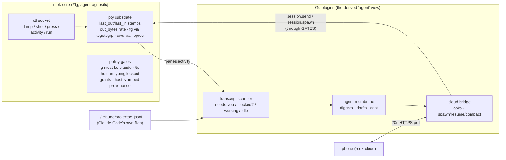

# 06 — Product/Architecture Synthesis: Evaluating Rook's Theses Against Its Implementation

Research date: 2026-08-07. Repo: `/Users/sethlowie/go/src/github.com/incantery/rook`, branch `main`.
Most evidence in this document was gathered at HEAD `291f6d0` ("vt: the pin moves to upstream main");
**during the write-up the working-tree gather/parse pipeline was committed as `9ad05f3`** ("session: the
pty is drained while the parser parses"), so claims below that describe that pipeline as "uncommitted"
in the underlying notes are now committed code. Line numbers are as of `291f6d0` unless stated.

This document evaluates six product theses (A–F) against what the code actually does, then compares
rook architecturally against tmux, Ghostty, Neovim, VS Code, Zed, and JetBrains, and closes with
"emergent architectural capabilities" — things the codebase built for one reason that matter for
another. Evidence labels used throughout: **Implemented**, **Partially implemented**,
**Scaffolded/prototyped**, **Documented only**, **Obsolete/dead**, **Unclear**, **Inference**.

Context that colors everything: the repository is **27 days old** (first commit 2026-07-11), **668
commits, of which 618 carry a `Co-Authored-By: Claude` trailer** — one human plus Claude. (Both
figures are counted at the package baseline `9ad05f3`, matching doc 05 §5; this document's own
reading was done at `291f6d0`, where the counts were 667 and 617.) It has
already shipped and deleted **three complete architecture generations** (Wails/Go/Svelte webview →
Go host + Zig frontend → one Zig binary). Any thesis evaluation must therefore distinguish "the
current code" from "the direction the last two weeks demonstrate," and the repo's own history shows
theses get *tested by deletion*: the review stack was ported to Zig on 07-29 and deleted 07-31 anyway
("they are not used at all" — commit `fccbbc6`).

---

## Thesis A — "Terminal-first IDE": is the terminal/mux genuinely foundational?

**Verdict: yes, structurally and unusually deeply — with one large asterisk (no persistence). The
terminal is foundational in three distinct senses, each verifiable in code.**

### A.1 The terminal is the rendering substrate (Implemented)

Every visible surface in rook is a cell grid drawn by one Metal pipeline:

- Panes are content-agnostic tenants: `Content = union(enum){ term: Term, edit: *Editor, monitor: *Monitor }`
  (app/src/panes.zig:44). The editor is explicitly "a pane whose fill pass comes from a text buffer
  instead of an emulator"; the monitor pane reuses the editor's `RCell`/`fillGrid` contract *by
  design* so "a new pane kind should not mean a new render path" (macos.zig:8823–8829). Three
  content kinds, one GPU path, 16-byte `CellData` per cell (render.zig:67–74).
- Chrome (bars, palette, which-key, completion cards) is "just more quads" on the same pipeline
  (commit `b6ef25b`); floating UI stays inside the cell grid via `flag_no_bg` so it remains visible
  to `ctl dump` and the e2e harness (render.zig:81–89) — i.e., even the *pop-ups* are
  terminal-shaped on purpose, so the automation surface can see them as text.
- The **editor defers to the terminal on text metrics**: grapheme segmentation and width come from
  ghostty-vt's tables (`vt.unicode.graphemeWidth`, editor.zig:1644), so "terminal and editor can
  never disagree about width." The terminal's Unicode model is the authority; the editor is a client
  of it.

### A.2 The mux is the application model — but display-layer only (Implemented, with a structural gap)

The tmux vocabulary is real and in-process: spaces (= tmux sessions), tabs (= windows), a binary
split tree of panes, zoom-as-zero-rect, copy mode, prefix chords (panes.zig; macos.zig relayout).
Takeover semantics (`Pane.under: ?Term` — `rook edit` overlays an editor on a running terminal and
parks the shell; `:q` restores it, panes.zig:58) are a mux-native idea no conventional IDE has.

The asterisk: **rook borrows tmux's model and rejects tmux's architecture**. There is no daemon, no
detach/reattach, no persistence of any kind — a pane dies with its shell, the last shell exiting
calls `_exit(0)` (macos.zig:5168–5171), and ⌘Q SIGHUPs every **captured** process group with an
escalation ladder (`ProcessGroups`/`escalate`/`terminateAll`, pty.zig:152/187/206, reached only from
`App.hangupAllSessions`, macos.zig:2464, on the AppKit terminate path). A hard crash runs no ladder:
the kernel SIGHUPs each pty's foreground group only, so a SIGHUP-trapping or backgrounded job can
orphan (docs 01 §8 and 02 §10) — and **no session state is recoverable either way**. STATUS.md lists this as an accepted regression ("Shells die
with the app… Nothing happens while rook is closed"). So the terminal is foundational as a *surface*
and a *model*, but not yet as a *substrate that outlives the window* — which is precisely the
primitive tmux exists for. Session restore via `vt.snapshot` is on the (untracked) TODO roadmap,
explicitly as snapshot-restore, not as a live broker — **Documented only**.

### A.3 The terminal is the agent integration bus (Implemented — the most distinctive sense)

The entire agent layer is built on terminal substrate telemetry rather than on any agent API:

- Per-pty atomic counters `last_out_ms`, `last_in_ms`, `out_bytes` (session.zig:286–292) — with the
  deliberate rule that only *physical* keystrokes stamp `last_in_ms` ("an agent typing into a pane
  is not a human looking at it").
- Foreground-program identity read from the kernel per keystroke: `tcgetpgrp(master)` +
  `proc_pidpath` (session.zig:897–928); cwd via `proc_pidinfo` — never from OSC sequences or polls.
- These are exported to plugins as `panes.activity` and fused with Claude Code's transcript files to
  derive agent state (`transcript.Fuse`, plugins/internal/transcript/transcript.go:170–206): a pane
  writing ≥200 B/s with a claude-like foreground promotes a quiet transcript to "working."
- Actuation is *typing*: `session.send` delivers phone answers as bracketed paste into a
  positively-identified agent TUI (macos.zig:7483–7516). Even `resume` and `/compact` are
  keystrokes. Nothing is asked of Claude Code itself.

**Inference:** rook's terminal-first claim is best read as "the pty is the sensor/actuator bus."
That is a genuinely foundational role no competitor assigns to its terminal (see the competitive
section). The perf program supports the same reading: the entire measurement culture (key→photon
instrument, 150MB `cat` benchmark, the just-landed ghostty-#13209 gather pipeline in `9ad05f3`) is
terminal-latency-first, benchmarked directly against Ghostty.

---

## Thesis B — "Own everything end-to-end": what rook actually owns vs depends on

**Verdict: ownership is remarkably real *above the VT layer and below the OS layer*. The two large
non-owned pieces — ghostty-vt and Apple's frameworks — are each managed deliberately but constrain
the product in different ways. A third, less-acknowledged dependency class (Claude Code's file
formats and the string `"claude"`) constrains the agent thesis more than either.**

### B.1 What rook genuinely owns (Implemented)

The single binary contains, written from scratch in ~11 days each or less: the Metal cell renderer
with its own CoreText-rasterized glyph atlas and SDF chrome shader (render.zig, 866 lines); key
encoding (keyenc.zig — tables *transcribed* from ghostty, not imported, with ~30 pinning tests);
paste-safety rules (paste.zig); a full vim-core editor on its own rope with its own regex engine,
generated Unicode case tables, macros, visual block (editor.zig 14k lines, 306 tests, real-vim
oracle); a from-scratch sans-io LSP client (lsp.zig 3.7k lines, 35 tests); a plugin host with a
bidirectional NDJSON protocol, grants, sha256 pin/TOFU fetch (plugins.zig); a config compiler
pipeline (envapply.zig runs the user's Go/TS program, diffs by node id, human-gated apply); the CLI
(no verb table — argv shipped raw to the socket, main.zig:14); an e2e harness that drives the real
app; fuzzy matching, markdown layout, a process monitor, disk scanner, PNG writer. Zero JS, zero UI
framework, only two Zig dependencies (ghostty + zig_objc, build.zig.zon). Only ~220 tracked files.

The Go that remains is *outside* the trust core on purpose: plugins/providers are subprocesses;
even HTTPS fetching is a forked `curl`, not a linked TLS stack (plugins.zig:1027 — "not an HTTP
client compiled into rook").

### B.2 The dependencies, ranked by how much they constrain

1. **ghostty-vt — the whole VT engine** (Implemented, actively managed). Rook writes no escape-sequence
   parser; `Terminal`, `TerminalStream`, `RenderState`, scrollback (PageList), search, and the kitty
   keyboard answer all come from the hash-pinned upstream (`ghostty-org/ghostty@2602886`, fork
   retired at `291f6d0`). Constraints observed in code: rook *involuntarily advertises* the kitty
   keyboard protocol because the library answers `CSI ? u` on its behalf (keyenc.zig:149–153); the
   OSC 52 capture buffer is unbounded upstream and rook's 8MB cap is "the only cap in the path"
   (session.zig:71); unexported types force an `EffectArg` reflection workaround (session.zig:51–65);
   and the pin was a live **security surface** — the pre-08-07 pin executed kitty-graphics commands
   (file reads, shm, PNG decode) from any program's stdout, and the bump was pulled forward off the
   quarterly schedule for exactly that reason (commit `291f6d0`). This is the one dependency treated
   as a supply-chain relationship: quarterly review doc (docs/ghostty-analysis.md), measured-constant
   ports with attribution (#13209 pipeline), fork retired the moment upstream absorbed its patch.
2. **AppKit/Metal/CoreText/CoreVideo/ImageIO/UserNotifications** (Implemented, accepted bet). A Linux
   port is a rewrite of the window system, renderer, frame clock, IME, notifications, and the whole
   install/codesign story (arch notes §6); CI states "there is no cross-compile of this to check on
   Linux." macOS-arm64-only, ad-hoc signed, no notarization — TODO calls notarization a
   "funnel-killer." This bounds distribution far more than architecture.
3. **Claude Code's transcript format + the literal string "claude"** (Implemented, unacknowledged as
   a dependency). The agent layer's identity/state machine parses `~/.claude/projects/*.jsonl` — an
   unversioned third-party format — and the `session.send` security gate is
   `fg == "claude" or path contains "claude"` hardcoded in the app (macos.zig:7505). A second agent
   TUI requires an app release, not a config change. `wireAgent.Model` is hardcoded `"claude"`
   (plugins/cloud/main.go:417). The plugins/acp brief (docs/agent/acp-brief.md) is the documented-only
   exit from this coupling.
4. **Toolchains at config time**: `go run` / `npx tsx` execute the user's config (envapply.zig:462+);
   `cc` compiles grammars from repos; `git` runs worktree verbs. All subprocesses, all fail-open, but
   the "config is a program" thesis makes the Go toolchain a de facto runtime dependency of the
   flagship config path.
5. **Zig 0.16 std churn** (constraint on rook's own code): retired `std.Thread.Mutex/Condition`
   forced three hand-rolled sync vocabularies (os_unfair_lock wrapper, GCD semaphores, self-pipes) in
   session.zig/plugins.zig/lsp.zig; CI's `e2e-check` exists purely because std churn silently rotted
   the harness once.

### B.3 Assessment

The ownership thesis is not marketing: rook demonstrably deleted a 940k-line grammar dependency
(`8c1d77f`), a Go daemon, sqlite, and its own webview to get to this shape, and the pattern
"anything not owned is a subprocess or a pinned, audited package" is applied consistently. The
constraint map is honest in-repo about (1) and (2); it is *not* honest about (3) — no doc names
Claude-Code-format coupling as a dependency risk, though TODO's ACP item implies awareness.

---

## Thesis C — "Extreme extensibility": can substantial workflows land without core changes?

**Verdict: partially true, with a sharply visible boundary. "Observe + list + act + spawn + type"
workflows land entirely as plugins — the agent membrane, the phone bridge, and the whole language
catalog did, in days. Anything needing a new *surface*, a new *input path*, or a new *pane kind*
requires core changes. The honest test case — the planned review surface — fails the plugin-only
test today.**

### C.1 What lands without core changes (Implemented, proven by history)

The week of 08-01→08-06 is the proof: three product-defining subsystems shipped as out-of-process Go
plugins over one NDJSON protocol with zero new core surface code beyond the (pre-existing) five
inbound verbs:

- **The agent membrane** (plugins/agent): transcript watching, LLM summarization, drafting,
  cost accounting, journaled persistence.
- **The phone bridge** (plugins/cloud): status push, ask round-trip, spawn/resume/compact command
  rail, crash-safe at-most-once delivery.
- **The language catalog** (plugins/lang-*): `dc4fcec` deleted the compiled-in language list
  entirely — "an unconfigured rook serves *nothing*," and LSP server choice/installation moved into
  single-op resolver plugins.

Equally, *declarations* extend without core changes: plugins, workspaces, grammars, languages,
keybinds, and options are all environment-graph node kinds; since 07-30 every new configurable
subsystem "arrived as a graph node kind with no TOML spelling" (config notes §14). The protocol
scales down to a 9-line POSIX `sh` plugin (e2e fixture) and 1.3KB shell hello-plugin — the
"writable in any language" claim is enforced by making those the only in-repo clients.

### C.2 What must live in core today (Implemented boundaries, verified)

- **Pane content kinds**: the `Content` union is closed (term/edit/monitor). A plugin cannot be a
  pane tenant; the plugin panel is a single side pane, single-tenant (one plugin visible at a time,
  macos.zig `plug_name`).
- **Surfaces**: only the List surface exists (items + ≤6 typed fields + ≤6 actions + one child
  level, hard caps at intake, plugins.zig:1112–1167). Tree/Table/Detail/Form/Series/Decoration are
  **Documented only** (docs/plugins/VOCABULARY.md, whose own header still says "design, nothing
  implemented" — stale against its body). Plugins send a `surfaces` field the host silently ignores.
- **Commands, palette, keybinds, status segments, themes, editor decorations**: all compiled-in.
  The registry is explicit doctrine — "A command is NOT registered until it does something"
  (registry.zig:13–16); plugins cannot add commands. Item states are semantic strings; plugins
  cannot style ("theme belongs to core").
- **Inbound verbs**: exactly five (`attention.raise`, `session.spawn`, `session.send`,
  `clipboard.set`, `panes.activity`), dispatched by a hardcoded chain in `App.pluginInbound`
  (macos.zig:7340–7353). `notify` is schema-only.
- **Product policy in the protocol**: the claude-only gate for `session.send` is core code, not
  configuration.

### C.3 Missing plugin primitives (each cited)

1. **Rich surfaces** — the review-surface plan (TODO: "partial approve, classification, verdicts";
   "threads/reanchor already points here") cannot be expressed in the List vocabulary; the editor's
   decoration seam for exactly this (`Editor.setDecor` + `line_gutter`, editor.zig:4170) survives
   with **zero callers** since the review-stack strip — a live seam waiting for a projection
   primitive that doesn't exist.
2. **Event push to plugins** — plugins poll (transcript files at 2–5s, `panes.activity` per tick).
   There is no subscription: a plugin cannot be told "pane 7's foreground changed" or "a turn ended."
   The pump infrastructure for unsolicited *plugin→host* frames exists; host→plugin push does not.
3. **attention → item linkage** — TODO names it: "attention.raise can't reference the answerable
   item — extend it." A banner today cannot deep-link into the panel row that answers it.
4. **Plugin-defined commands/palette entries** — the one compiled-in door is `plugin.open`
   (registry.zig:125–128).
5. **Operational primitives**: no plugin restart (failed-stays-failed until app relaunch,
   plugins.zig:367–372 — this silences the cloud bridge on a transient crash); stderr → /dev/null
   ("until there is somewhere to put it"; the *previous* provider generation had tagged forwarding
   and the plugin generation lost it); no shared wire SDK in-repo (three hand-rolled Go `conn`
   copies, self-acknowledged as drifting: "the third copy should be the one that writes it").
6. **A second out-of-process class remains orphaned**: providers (sdk/provider + github/linear)
   build, test, and version a published protocol **with zero callers** since the strip
   (docs/OWED.md §1 defers shim-vs-convert). The plugin protocol is a strict superset (same
   envelope + pump + grants), so **Inference:** providers become plugins; but at HEAD it's a fork
   in the road, not a decision.

### C.4 Assessment

"Extreme extensibility" is the direction, demonstrated by three real migrations out of core
(languages, agent, cloud) — but the current vocabulary is deliberately narrow, and the repo's own
next flagship (review) is planned as core work. The distinctive strength is not breadth but the
**trust surface**: declared/granted/wanted as three visible facts, grants enforced in both
directions with named refusals, sha256 pin/TOFU with paste-ready pin hand-off in the user's own
config language (macos.zig copyPluginPin) — a more coherent extension trust model than any editor
compared below ships today.

---

## Thesis D — "Agent-native": what primitives exceed terminal+scripts?

**Verdict: rook already has a small set of genuinely novel agent primitives — all of them
substrate-side (observation, gated actuation, verification). What it lacks is the layer above:
persistence, verdicts, review, and any agent protocol. Structurally better than the alternatives for
agents today in narrow, real ways; the decisive advantages are still Documented only.**

### D.1 Primitives that exceed tmux `send-keys` / `capture-pane` + scripts (Implemented)

The core deliberately contains **no Agent type** (agents notes §0 — verified: no such struct in
app/src). What it contains instead is a sensor/actuator bus with policy:

1. **Identity-gated synthetic input.** `session.send` refuses any pane whose kernel-read foreground
   is not positively an agent TUI, and refuses if a human typed there within 5 seconds
   (macos.zig:7483–7516). tmux `send-keys` will happily type `rm -rf` into whatever pane you name.
   This is the difference between "automation" and "actuation with authorization inputs" — the
   security notes call it the sharpest reasoning in the repo, correctly.
2. **Substrate observability no terminal exposes.** Output *byte-rate* (not just a timestamp —
   "a spinner and a cursor blink differ by an order of magnitude"), human-input recency (physical
   keystrokes only), foreground exec *path* (survives Claude Code's versioned binary named
   `2.1.220`), kernel-truth cwd — per pane, via `panes.activity`/`ctl activity` from one producer
   with two encodings (macos.zig activityReport comptime as_json).
3. **Blind verifiability as a wire-format philosophy.** `dump` (emulator truth) + `shot` (renderer
   truth from rook's own drawable, no screen-recording permission, works occluded) + `press`
   reporting consumed-vs-typed + click coordinates in every statusbar/whichkey dump. The repo's
   convention since the ctl socket's birth commit ("eyes for the agent," `568ba77`) is "no feature
   is done until it is assertable blind" — the e2e suite and the Claude skill are the same consumer.
4. **The agent's manual ships in the binary**: `rook install claude` writes an embedded skill
   (`@embedFile`, build.zig:82) that cannot drift from the binary that wrote it; man pages are the
   canonical verb list, installed on the manpath.
5. **Consent-shaped machine-writable config.** An agent (or human) edits a config *program*; rook
   runs it, diffs by node id, raises attention through the same door a plugin uses, and applies
   nothing until a human says so (envapply.zig; e2e `apply` exists to prove "a preview must not
   apply itself"). This is an agent-proposes/human-approves rail that no compared editor has for its
   own configuration.
6. **Fused state detection without an integration API.** The four-state machine
   (needs-you/blocked?/working/idle) with permission-mode awareness, interrupt detection, context
   occupancy, corrected by pty byte-rates — assembled from files Claude Code writes for its own
   purposes. Zero API surface between rook and the agent (agents notes §1).

### D.2 What would make it *structurally* better than VS Code / Ghostty+tmux / Zed / Neovim

All are currently **Documented only** and named in the repo's own roadmap (TODO.md, ordered by the
ACP brief):

- **Per-prompt git checkpoints** (roadmap item #1 of "the agent race") — undo at agent-turn
  granularity, a substrate-level safety primitive.
- **The review surface as the wedge**: comment-pool → next-prompt, re-anchoring inline comments,
  plus "what nobody has: partial approve, classification, verdicts." The verdict ledger — "the most
  valuable and most personal data rook will ever hold" (docs/agent/VISION.md) — has no code; nothing
  in-repo records edits-to-drafts today.
- **plugins/acp** — an ACP client would break the Claude-Code-only coupling and make the gated
  substrate available to any agent.
- **Persistence** — for agents specifically: today an agent's terminal session dies with the window
  (`_exit(0)`), which caps "run everything from your phone" at "while the Mac app is open."
- **Attention→item linkage and richer surfaces** (§C.3) — the difference between notifying about
  work and *presenting* it.

**Honest comparison note:** VS Code's extension API can express far richer agent UIs than rook's
List panel, and Zed ships in-editor agentic editing rook doesn't attempt. Rook's structural edge is
narrower and lower: nobody else treats the pty as an authorization-bearing sensor/actuator bus, and
nobody else ships renderer-truth observation without OS permissions. Whether that edge matters
depends entirely on whether the D.2 layer gets built.

---

## Thesis E — "Bridge to less-technical users": plausibility

**Verdict: architecturally plausible, currently not executed — and the current execution is
explicitly aimed the other way (Ghostty/Alacritty/Neovim switchers). The persona system is the
right mechanism for a simplified UX without a second product; the phone surface is the actual
less-technical product today; the middle (install, config, provisioning) is expert-only.**

### E.1 Exposed Unix complexity at HEAD (Implemented, enumerated)

- **Config is a compiler toolchain.** The flagship path writes `main.go` + `go.mod` and runs
  `go run .` (envapply.zig); onboarding runs `go mod tidy`. TS needs `npx tsx`. The TOML front end
  exists but is deliberately frozen at the pre-IR option set (no plugin/language/workspace spelling
  in TOML at all) — a non-programmer literally cannot declare a language server.
- **Install is `curl | sh`** with an ad-hoc signature; the installer exists *because* a browser
  download would be Gatekeeper-blocked (install.sh rationale). No notarization (TODO:
  "funnel-killer before the thesis is ever seen" — the repo knows).
- **Secrets are hand-placed files** (`~/.config/rook/openai_key`, `cloud_token` — the latter
  observed 0644); phone provisioning is "mint a bearer token on a web page, paste it into a file."
- **No push notifications**: the phone story bottoms out in a foreground-only 20s poll on both ends
  (iOS AppModel comment: waits on the paid Apple developer account).
- The editor is vim; the mux is leader-chord tmux. Which-key, the palette, and clickable bar hints
  (discoverability memory) soften this but do not remove it.

### E.2 The mechanism that makes the bridge plausible without a second product (Implemented)

The **persona/preset system** is the load-bearing answer, and it is real: `preset = "vscode"`
reshapes chrome (empty top bar, tabs+branch left, cwd+hints right, single-chip **current**-tab
style, always-on buffer line, activity bar, explorer auto-open), sets `theme = "vscode-dark"` and
`editor-mode = insert` (files open in insert mode; Esc still reaches normal) — **nine fields
total**, `config.zig applyPreset` at config.zig:213–228. Worth being exact about the bundle's size,
because two effects often attributed to it are not in it: **click-places-cursor is unconditional**
(the applyPreset comment says of it "that one is everyone's", config.zig:223) and **⌘P/⌘⇧F are
global registry commands and keybinds**, present in every persona. The persona mechanism is chrome,
theme, and edit-mode defaults — one
substrate, "identity is arrangement" (commits `96db57f`/`82a3d05`; preset bundles pinned by goldens
in three places + a live e2e `presetparity`). A "simple mode" is one more preset bundle away — a
configuration, not a fork. Add the environment graph's preview/apply (a guided settings UI could
*emit graph nodes* and reuse the existing consent flow), and the architecture supports a
progressively-disclosed UX with zero second-product cost.

**Inference:** the actual bridge to less-technical users in this codebase is the **phone surface**,
which hides Unix entirely: agent states, asks with preserved numbered choices, digest
headlines/bullets, three enumerated verbs. A person who never opens the terminal can already
supervise work from it (modulo the notification gap). The Mac app is the operator console; the
phone is the consumer surface. If the thesis is "bridge," the phone is the bridge; the terminal
app's job is to be trustworthy underneath it.

### E.3 What falsifies the thesis today

Onboarding (`startSetup` writing Go starters), toolchain-dependent config, token file provisioning,
unsigned install, vim-default editor. None are architectural; all are prioritization. Current
priorities are demonstrably elsewhere (the 08-05→08-07 sprint is LSP depth + latency benchmarking
against Ghostty).

---

## Thesis F — "Rook as runtime, not IDE": could it become an execution/policy layer under other UIs?

**Verdict: the *protocol assets* are runtime-shaped; the *process architecture* is emphatically
IDE-shaped — by recent, explicit, evidence-driven decision. Rook already had the daemon this thesis
requires and deleted it on 07-31 because the frontend had organically stopped calling it. A runtime
future is a third architecture generation, not an incremental step.**

### F.1 Evidence for (what already behaves like a runtime)

- **The control plane is UI-independent in shape.** The ctl socket is a full automation API (52+
  verbs) with no client-side schema; the CLI is a dumb pipe to it. A different frontend could drive
  everything the current one can — the e2e harness and the Claude skill *are* two non-human
  frontends already.
- **Policy is host-enforced, not UI-enforced.** Grants, the claude-gate, the 5s human-presence
  lockout, host-stamped attention provenance, sha256 pin verification — all live below any drawing
  code and apply identically to ctl callers, plugins, and the cloud rail. "The cloud requests, this
  machine decides" is implemented, not asserted (security notes §3).
- **A second UI already exists.** The phone drives real work (answers, spawn/resume/compact) through
  the same verbs, with at-most-once journaling. That is a working proof that rook can be operated
  through a surface it does not render.
- **The agent layer is already out-of-process** over a documented protocol; the "files as
  interfaces" journals (digestlog, cmdjournal, transcripts) are readable by any future service.

### F.2 Evidence against (what binds it to being an app)

- **Lifecycle is the window.** Ptys are children of the AppKit process; the last space closing calls
  `_exit(0)`; there is no server socket for terminals, only for the UI process. The ctl socket
  "controls the UI process; it is not a session server" (terminal-mux notes §10).
- **The policy layer needs the pty.** The fg-identity gate reads `tcgetpgrp` on masters the app
  owns; you cannot lift the policy out without lifting session ownership with it.
- **Addressing is process-lifetime.** Pane ids — the addressing scheme for ctl, `panes.activity`,
  and `session.send` — reset on relaunch; the cloud rail already races restarts (cmdjournal absorbs
  it, but the id namespace is the tell).
- **History’s verdict.** `e502bd4` records that rook-host was "spawned, health-checked, reported on,
  and killed, without one call in between" — the daemon was deleted because separation was paying
  rent and doing no work. Any runtime pitch must answer why the second attempt would be used where
  the first wasn't.

### F.3 What would have to become independent services

In dependency order: (1) a **pty broker** owning sessions + the substrate telemetry + the actuation
gates (this is the tmux-server-shaped piece; the gates must live with the masters); (2) the
**plugin host + grants engine** (already nearly self-contained — plugins.zig imports only
config+std); (3) the **attention/ask rail** and journals (already file-based); (4) the
**environment-graph applier** (already a pure diff engine). The renderer/editor would remain the
"IDE" client. **Inference:** the repo's own "run everything from your phone (execution stays local)"
vision (memory notes; docs/agent/VISION.md) *requires* piece (1) or accepts "only while the app is
open" forever — this is the sharpest unresolved tension between the theses at HEAD, and nothing in
the code or roadmap currently commits to rebuilding the daemon.

---

## Competitive architectural comparison

The question asked: **what primitive does rook combine that these do not?**

| System | Architectural bet | What it has that rook lacks | What rook has that it lacks |
|---|---|---|---|
| **tmux** | client/server mux; sessions outlive clients | detach/reattach, persistence, remote attach, `send-keys`/`capture-pane` scripting ubiquity | GPU renderer with editor tenants; *gated* input (identity + human-presence); byte-rate/fg/cwd telemetry; renderer-truth screenshots; plugin trust model |
| **Ghostty** | best-in-class emulator, per-surface OS windows, libghostty as embeddable engine | broader platform reach, notarized distribution, the VT engine itself (rook consumes it) | in-scene mux, in-process editor/LSP, control socket, agent telemetry, config-as-program with consent diff |
| **Neovim** | editor as a server (msgpack-RPC, embeddable UI, `--headless`); terminal is a buffer | mature RPC/embedding story (closest existing "runtime not IDE"), vast in-process plugin ecosystem, persistence via sessions/daemonizable server | pty *substrate* telemetry (nvim's terminal is a buffer, not a sensed process), out-of-process plugins with grants/pins, native GPU chrome, gated synthetic input, key→photon latency program |
| **VS Code** | extension host over Electron; remote dev server splits UI from workspace | remote development (the UI/execution split rook's thesis F wants, already shipped), the richest extension surface, marketplace, notarized installers everywhere | ownership of the entire stack (latency: rook's whole rewrite exists because the webview compositor was "the floor no work above it can move" — docs/render-latency.md), substrate telemetry, one-binary + no-schema CLI |
| **Zed** | native GPU editor, CRDT collab, WASM extensions, in-editor agents + ACP | collaboration, agentic editing in the buffer, ACP shipping today, cross-platform | the mux/terminal-as-substrate inversion; the measurement culture is comparable (rook literally mines Zed's bug tracker — `9467cc3` fixed eight of Zed's shipped bugs pre-emptively) |
| **JetBrains** | own full semantic model in-process (indexes over LSP), JVM plugin platform | deepest language semantics, refactoring correctness, install base | everything latency/ownership; rook's LSP-client + tree-sitter bet is the opposite wager |

**The answer to "what primitive does rook combine that these do not":** it is not "none yet," but it
is exactly one, and it is narrow:

> **The terminal as an authorization-bearing sensor/actuator bus, exposed as one automation
> surface** — kernel-truth per-pane telemetry (fg identity, human-input recency, output rate) used
> as *inputs to authorization decisions* on synthetic input, combined with renderer-truth
> observation (`dump`/`shot`) that needs no OS permission, all reachable over one unauthenticated
> local socket and one grants-gated plugin protocol.

tmux has the actuation without the gates or telemetry; Neovim has the RPC without the substrate;
VS Code has APIs without kernel truth; Zed and Ghostty have neither the mux nor the bus. Nobody
else asks "who is this pane's foreground process, and did a human touch the keyboard in the last
five seconds?" before typing.

A second, smaller novel combination: **config-as-compiled-program with a preview/apply consent
diff inside the tool itself** (Pulumi semantics for an editor's own configuration, with the diff
raised through the same attention door plugins use). Nix/home-manager users approximate this
outside the editor; no compared editor has it inside.

Everything that would make these combinations *decisive* — verdict ledger, review surface with
partial approve, per-prompt checkpoints, session persistence, ACP — is **Documented only** at HEAD.
The moat today is a foundation, not a product.

---

## Emergent architectural capabilities

Things the codebase built for one purpose whose strategic value likely exceeds the reason they were
built. Only entries with concrete evidence; each states why it could matter.

1. **The ctl socket as a general "Playwright for a native app" (built as e2e eyes).**
   Born in `568ba77` for test visibility, it grew into a complete blind-driving API: real-key-path
   input (`press` reports consumed-vs-typed; `nskey` synthesizes NSEvents with deliberately wrong
   characters to prove the encoder), click coordinates embedded in every chrome dump, dual
   dump/shot truth. Why it matters: this is the exact capability every "agent uses your computer"
   product is trying to bolt onto apps from the outside via accessibility APIs and screenshots.
   Rook has it from the inside, permission-free, for itself — and the pattern (every feature ships
   its assertable-blind verb) is a design discipline that could be productized as "agent-legible
   application" long before any agent thesis ships.

2. **`last_in_ms` from physical events only — a human-presence oracle (built to suppress banners).**
   The deliberate split — physical keystrokes stamp presence, ctl/agent input does not
   (macos.zig:9167–9174) — was built so a watching human doesn't get notified. It is actually the
   primitive every autonomy policy needs: "is a human at this keyboard *right now*" as a queryable,
   per-pane fact. The autonomy ladder (VISION.md rungs 3–5) will stand on this one atomic.

3. **`--config=DIR` whole-instance isolation (built for e2e sandboxes).**
   One flag makes config + socket + data + plugin cache one deletable directory, with `ROOK_SOCK`
   inherited by child shells so nested tooling reaches the right instance (main.zig:55–92). Built
   so tests don't collide; it is a complete multi-instance/profile story — per-project rooks,
   agent-owned throwaway instances, "dangerous mode" instances with different grants — with zero
   additional design needed.

4. **Content-agnostic pane tenancy + zero-rect hiding + `under` parking (built for the takeover editor).**
   The monitor pane proved a third content kind costs no render code; zoom/hide/restore fall out of
   zero-rect encoding by construction (panes.zig:181–192). This is the general mechanism by which
   any future surface — review pane, agent deck, plugin-rendered document — becomes a first-class
   tile of the workspace rather than a floating panel. The IDE-vs-runtime question aside, this is
   the seam that makes "arranged workspace as agent output" cheap.

5. **The jsonl file-as-interface idiom (built to decouple three plugins).**
   digestlog (single-writer/multi-reader, tombstones, compaction-by-rename, torn-tail tolerance),
   cmdjournal (effect-on-disk-before-ack), and the transcript scanner share one idiom: no sockets
   between components, the file *is* the API. Built for plugin decoupling; it is a de facto public,
   local event-sourcing layer that a future daemon, a third-party tool, or another UI could consume
   without any protocol negotiation — the quiet foundation of thesis F if it ever gets built.

6. **Stable node ids + canonical bytes in the environment graph (built for diffing).**
   Byte-identical emission across SDK languages and diff-by-node-id were built so a reordered emit
   reads as "no changes." They are also exactly the substrate provenance and multi-writer semantics
   need: an agent proposing a config change and a human's own edit land on the same consent surface
   with the same identity semantics (config attention already rides the plugin attention door —
   "config is not a special case of 'a human is needed', it is an instance of it"). The
   ownership/provenance half of VISION.md is unwritten, but its data model already ships.

7. **Foreground-process identity as an authorization input (built for ⌃HJKL nav-yield).**
   `tcgetpgrp` + `proc_pidpath` per keystroke was built so ctrl-hjkl yields to vim (nav-yield
   config). The same two syscalls became the security gate on `session.send`. Process identity as a
   cheap, kernel-truth authorization input generalizes: per-program paste policies, per-agent
   actuation allowlists, "this pane is running something I recognize" as a first-class predicate.
   The current hardcoded `"claude"` string is the primitive's least general expression, not its
   ceiling.

8. **The binary as its own registry (built to avoid npm and drift).**
   Embedding the TS SDK and the Claude skill in the executable (`@embedFile`) was an offline/drift
   fix. The emergent property: rook's agent-facing and config-facing contracts are *versioned with
   the binary* — an agent talking to rook vN provably has vN's manual and vN's SDK. As agent
   ecosystems fight contract-drift between tools and their integrations, "the binary ships its own
   integration surface" is a distribution pattern with legs.

---

## Closing synthesis

Rook at HEAD is a **terminal-substrate company** wearing an IDE's clothes: the genuinely novel and
defensible work is at the bottom (pty telemetry, gated actuation, blind verifiability, ownership of
the render path to the photon) and in the trust plumbing (grants, pins, consent diffs, provenance
stamping). The theses rank, by distance between claim and code:

- **A (terminal-first): true now** — foundational as surface, model, and agent bus; missing only
  persistence.
- **B (own everything): true now**, with two managed exceptions (ghostty-vt, Apple) and one
  unmanaged one (Claude Code coupling).
- **C (extreme extensibility): half-true** — proven for observe/act workflows, walled at surfaces
  and input; the trust model is ahead of the vocabulary.
- **D (agent-native): foundation true, product documented-only** — the primitives are real and
  novel; the layer that would win (checkpoints, review, verdicts, ACP) is paper.
- **E (bridge to less-technical users): mechanism exists (personas + phone), execution absent** —
  and current priorities point away from it.
- **F (runtime not IDE): protocols yes, process model no** — and the repo's own history contains
  the strongest argument against the naive version of this thesis (the deleted, unused daemon).

The single most load-bearing open decision, visible from every thesis at once, is **persistence /
session ownership**: it is the missing tmux primitive (A), the cap on the phone story (E), the
precondition for runtime-hood (F), and the difference between "agent work survives" and "agent work
dies with the window" (D). The roadmap's `vt.snapshot` restore is the smallest possible answer;
whether the project re-grows a broker after deleting one is the architectural fork to watch.
