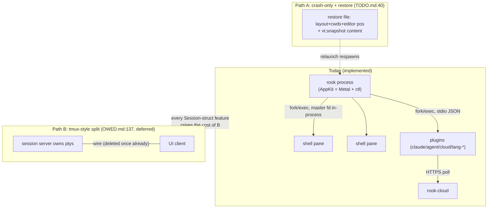

# 07 — Architectural forks and recommendations

Research pass, 2026-08-07, repo `/Users/sethlowie/go/src/github.com/incantery/rook`, HEAD `9ad05f3`
("session: the pty is drained while the parser parses"), clean working tree. The fork analysis was
performed at `291f6d0` — the previous commit, with the gather/parse read pipeline still uncommitted
in the working tree — and re-verified at `9ad05f3` after that work landed (`git show --stat 9ad05f3`
= `app/PERF.md` +29, `app/src/pty.zig` +111, `app/src/session.zig` +453). The forks themselves
survive the rebase unchanged; the pipeline being **committed rather than in flight** strengthens
Fork 1's lock-in argument rather than weakening it.

This document identifies the major architectural decisions that are **not yet locked in but will
become expensive to reverse**, derived from what the code actually shows — not from a generic
checklist. Every fork below is anchored to implementation evidence (file:line at HEAD), labeled per
the evidence taxonomy, and every load-bearing claim was spot-verified against source during this
pass (verification notes inline). Where repo docs and code disagree, that is said explicitly.

Method note on what qualifies as a "fork": a place where (a) the code currently embodies one choice,
(b) at least one alternative is visibly live — named in `TODO.md`/`docs/OWED.md`, half-built, or
implied by an in-repo tension — and (c) ongoing work is actively pouring concrete on the current
choice. Things that are *settled* (macOS-only platform coupling, ghostty-vt as the sole VT engine,
the one-binary CLI-carries-no-schema stance) are deliberately excluded; they are decisions already
made, documented as such, and the code is consistent with them.

---

## Ranking summary

Scored 1–5 (5 = highest). "Difficulty later" = how much harder this gets per month of continued
building on the current direction.

| # | Fork | Urgency | Upside | Cost of wrong | Difficulty later |
|---|---|---|---|---|---|
| 1 | Session ownership, identity & persistence | 5 | 5 | 5 | 5 |
| 2 | Extension-protocol convergence (providers→plugins) + plugin wire freeze | 4 | 4 | 4 | 5 |
| 3 | Agent identity: hardcoded "claude" vs declared/ACP | 4 | 5 | 4 | 4 |
| 4 | Config loading: one decoder vs two hand-kept key lists | 4 | 3 | 3 | 3 |
| 5 | The frame loop as the app's event loop (draw_lock scope) | 3 | 4 | 4 | 5 |
| 6 | Editor text-read model: copy-out rope, full-text LSP sync, flatten tax | 3 | 3 | 3 | 3 |
| 7 | ctl surface: frozen-but-undeclared API | 3 | 3 | 3 | 4 |
| 8 | Cloud command authority: bearer-token capability vs re-armored protocol | 2 | 3 | 5 | 3 |
| 9 | Guards-as-comments vs guards-in-CI | 4 | 3 | 2 | 1 |

The top of the table is dominated by decisions where the *ecosystem* around the choice (plugins
holding pane ids, an embedded Claude skill parsing ctl text, a cloud schema shaped like Claude Code)
locks the choice in faster than the code itself does.

---

## Fork 1 — Session ownership, identity & persistence

**The single most consequential open decision in the repo.**

### Decision
Who owns a terminal session's lifetime, and does anything about it survive the UI process?

### Current direction (what the code implies)
Sessions are child processes of the one Zig app, full stop. **Implemented:** `Session.start`
(`pub fn start(…)`, app/src/session.zig:468, through the reader-thread spawn that ends it at :504)
does openpty + fork/exec with the master fd held by the app; there is
no daemon, no detach, no persistence of layout, scrollback, or undo anywhere in `app/src`
(verified by search — terminal-mux notes §11). Quitting runs a SIGHUP→SIGTERM→SIGKILL escalation
over every process group (pty.zig — `ProcessGroups`, `terminateAll`; macos.zig:2464
`hangupAllSessions`); the last space closing calls `_exit(0)` (macos.zig:5168–5171). The app is
crash-only: ctl `quit` replies `ok` then `_exit(0)` (ctl.zig:1387–1389).

This is documented as a **choice, not an oversight** — STATUS.md:201–203 (verified this pass):
"Shells die with the app. rook owns its ptys in-process… The tmux-style split is still wanted, and
should be Zig when it is built — docs/OWED.md." And docs/OWED.md:137–139 (verified): "The tmux-style
split (ptys that survive the app) is still wanted, and when it is built it should be Zig, designed
for that job, rather than the HTTP host that grew around a webview."

Meanwhile the roadmap commits to a *third* path that is neither daemon nor nothing —
TODO.md:40–48 (gitignored working-tree file, verified this pass): "Session restore, slice one: pane
trees + cwds + editor positions, respawn shells in saved cwds — but the terminal CONTENT half should
ride `vt.snapshot` from the bumped pin, not a JSON format of our own. Boot-id stamp makes crash
restore identical to quit restore… tmux-style detach stays a separate later project."

### Why this is a fork and not a settled choice
Three forces are pulling in different directions, all visible in code:

1. **The product vision needs something to survive the UI.** The cloud bridge
   (plugins/cloud/main.go) exists so a phone can see and drive this machine — but "Nothing happens
   while rook is closed" (STATUS.md:204): the bridge is a child of the app. The "run everything from
   your phone" thesis is structurally capped by in-process ptys.
2. **Every week of feature work deepens in-process assumptions.** The gather/parse read pipeline —
   uncommitted during the notes phase, landed as `9ad05f3` — adds a second thread and 256KB of ring
   buffers *per session*, built as fields on the in-process `Session` struct (`const Pipeline =
   struct {` at app/src/session.zig:91, running to roughly :200). Activity observability
   (`last_out_ms`/`last_in_ms`/`out_bytes`, session.zig:261–292) is atomics on that struct.
   `tcgetpgrp`-based foreground identity (session.zig:897–928) needs the master fd in-process.
   None of this ports to a client/server split without a wire protocol for it — which is exactly
   the wire (internal/vt wire v2/v3) that was built once and deleted (e502bd4, 07-31).
3. **Session *identity* is already leaking into external contracts with process-lifetime scope.**
   Pane ids are the addressing scheme for ctl (`@id` suffix, ctl.zig:177–190), for the plugin verb
   `panes.activity`, and for `session.send{pane}` (verified: macos.zig:7483–7497 looks up
   `p.id == parsed.value.pane` across all spaces/tabs). The cloud plugin holds pane ids between its
   20s polls; ids reset on relaunch. ipc-api notes flag this directly: "any future session-identity
   feature will have to migrate this."

### Alternatives
- **A. Stay crash-only, add snapshot restore (the TODO path).** Layout + cwds + editor positions
  serialized; terminal content via upstream `vt.snapshot`; shells respawned, not preserved. Cheap,
  no daemon, honest about what survives (state, not processes).
- **B. tmux-style detach: a session server owning ptys, the app as a client.** What OWED says is
  "still wanted." Restores the daemon split the strip deleted — but this time for a reason (pty
  survival), not as an accident of the webview era.
- **C. Hybrid: per-session holder processes.** Each pty owned by a tiny forked holder that survives
  the UI; the app reattaches via fd passing over a unix socket. Smaller than a daemon; keeps
  "one binary" true-ish; complicates the escalation ladder and fg-identity code.

### Lock-in point (what makes it irreversible)
- Every plugin/cloud consumer that stores a **pane id** across time hardens the process-lifetime id
  namespace. Once third-party plugins exist (Fork 2), changing the id contract is a breaking wire
  change.
- The read pipeline, activity counters, and `snapshot_wanted` render-priority dance are being tuned
  *for the in-process topology* (measured constants, ghostty #13209 port). A daemon split would
  re-open all of it — the cost grows with each perf commit.
- Session restore slice one (path A) will create a serialization format and a boot-id stamp. If that
  format encodes today's pane-id semantics, it becomes the compatibility surface a later detach
  design must honor.

### Recommendation
**Commit to path A now and explicitly defer B — but pay the identity tax first.** Concretely:

1. Before session-restore slice one lands, introduce a **durable session identity** (a UUID minted
   at `Session.start`, surviving in the restore file, reported alongside the pane id in
   `panes.activity`, `ctl activity`, and accepted by `session.send`). This is a small additive wire
   change today; it is a breaking one after third-party plugins exist. It also fixes the live
   cloud-race (phone answer targeting a pane id across an app relaunch — cmdjournal makes delivery
   at-most-once but the target namespace resets; ipc-api notes §6).
2. Write the B-decision down in OWED.md as *deferred with criteria* (e.g. "detach becomes worth its
   daemon when X"), so the next six weeks of Session-struct work isn't silently foreclosing it.
   The repo's own strip history proves the author can rebuild a split cleanly if the seam is kept
   legible; the danger is not the rewrite cost but discovering the need *after* an ecosystem of
   pane-id consumers exists.
3. Do not rebuild the daemon speculatively. The evidence from e502bd4 (rook-host was "spawned,
   health-checked, and killed without a single call in between") is decisive: a daemon without a
   proven consumer decays into ceremony. The consumer that would justify it — phone-driven work
   while the laptop lid is closed — is real but currently blocked on push notifications
   (cloud-remote notes §4A), not on pty survival.



---

## Fork 2 — Extension-protocol convergence and the plugin wire freeze

### Decision
(a) Do providers become plugins, or does a shim keep two protocols alive? (b) Is plugin protocol v1
frozen *as is* before third parties arrive — including its known soft spots?

### Current direction
Two NDJSON stdio protocols coexist with the same envelope (`v/id/op/deadlineMs/params` //
`v/id/ok/result/error`):

- **Plugin protocol v1** — **Implemented and load-bearing** (app/src/plugins.zig, ~1,945 lines):
  bidirectional (per-plugin pump thread), grant-gated both directions, curl fetch + sha256 pin/TOFU,
  six first-party Go plugins shipping in the bundle. Everything post-strip (agent membrane, cloud
  bridge, LSP resolvers) landed as plugin ops.
- **Provider protocol v1** — **Scaffolded/orphaned**: `sdk/provider` is a published, versioned,
  zero-dep Go module; `providers/github` and `providers/linear` build, are tested, are copied into
  the app bundle — and **nothing at HEAD spawns them** (verified: no `rook-provider` reference in
  app/src; the caller died with `rookctl issues` in e502bd4). docs/OWED.md §1 (verified this pass):
  "a provider speaks `sdk/provider`, not the plugin protocol, so either the two grow a shim or a
  provider becomes a plugin. **That is a decision, not a port.**"

Known soft spots in the plugin wire, all documented in-code as accepted-for-now:
- Request-vs-reply demux is a **substring scan for `"op"`** (verified: plugins.zig:448
  `frameHas(frame, "\"op\"")`, definition at :843). A reply whose result JSON contains a top-level-
  looking `"op"` key gets mis-routed; the comment accepts the trade for the current decision only.
- **One in-flight call per plugin** (`call_mu`), 10s deadline — the echoed-id check is kept
  "because that is what will make this safe to widen later" (plugins.zig:306–309).
- Render caps (128 items, 6 fields/actions, fixed Text sizes) **silently truncate** and are not
  negotiated in `describe` (plugins.zig:1105–1167).
- Plugin stderr → /dev/null (plugins.zig:590–594) — the provider generation had tagged forwarding;
  plugins lost it.
- The **plugin-author SDK is not in this repo** (exiled to incantery/rook-demos), and the three
  in-repo Go plugins each hand-roll the conn loop; two of them carry comments saying "the third copy
  should be the one that writes [the shared wire package]" (agents-claude notes §6). The third copy
  exists; the package still doesn't.

Separately, the **grant model is protocol-gating, not sandboxing**, and the code says so
(macos.zig:7460–7461: "Not a privilege escalation: the plugin is already a process rook forked").
Plugin children inherit rook's full env including `ROOK_SOCK` — a plugin can drive the ctl socket
directly, bypassing grants entirely (security notes §2; no env scrubbing exists in
`Plugin.spawn`, plugins.zig:539–616).

### Alternatives
- **Convert:** github/linear re-issued as plugins (`rook-plugin-issues` wrapping `gh`), provider
  wire retired; `sdk/provider` stays tagged as a historical promise or is folded into a plugin SDK.
- **Shim:** a `rook-plugin-providers` adapter that speaks plugin protocol upward and provider
  protocol downward. Keeps the published provider promise alive at the cost of two protocols
  forever.
- **Wire v2 before freeze:** fix the demux (a `"type":"req"|"res"` field or reserved key), add cap
  negotiation to describe, widen in-flight — then freeze and publish.

### Lock-in point
The moment a third-party plugin exists, the v1 wire — including the substring demux and the
undisclosed caps — becomes compatibility surface. `v` is the only negotiation mechanism; a semantic
change is "a v-bump that bricks every plugin at handshake" (ipc-api notes §3). The plugin fetch/pin
system (sources + sha256 in user configs) makes third-party distribution *easy*, which means the
window is short.

### Recommendation
**Convert, don't shim — and spend one deliberate pass on the wire before publicizing it.**
The repo's own inference (plugins-providers notes) is that the plugin protocol is a strict superset;
the provider protocol's distinctive ideas (restartable lifecycle, deadline-fatal, tagged stderr) are
worth *importing* into the plugin host rather than preserving in a second protocol:
1. Replace the substring demux with an explicit direction marker while zero third-party plugins
   exist (cheap now, breaking later).
2. Adopt the provider generation's tagged stderr forwarding (the better story that got lost).
3. Write the shared Go wire package the plugins keep asking for, and make it the SDK seed —
   three drifting hand-rolled conns is already a bug farm.
4. Decide the sandbox stance *in writing*: either grants are explicitly documented as
   protocol-hygiene-not-security (and the env-inheritance/ROOK_SOCK hole is accepted), or plugin
   children get a scrubbed env (`ROOK_SOCK` dropped unless granted, secrets dropped). The current
   state — a carefully engineered grant model that a plugin can walk around via the inherited ctl
   socket — is the kind of gap that reads as a vulnerability the day rook has users who didn't
   write their own plugins.

---

## Fork 3 — Agent identity: hardcoded "claude" vs declared agents vs ACP

### Decision
Is "an agent" a string compiled into the binary, a declaration in the environment graph, or a
protocol peer?

### Current direction
**Implemented, and deliberately emergent:** there is no Agent type in the Zig core
(agents-claude notes §0). Detection is assembled in Go plugins from Claude Code's transcript files
plus pty telemetry. But the *actuation* boundary hardcodes the product policy into the app binary —
verified this pass at macos.zig:7505:

```zig
if (!std.mem.eql(u8, fg, "claude") and std.mem.indexOf(u8, fg_path, "claude") == null)
```

`session.send` — the only path by which any plugin or the phone can type into a pane — refuses any
pane whose foreground isn't literally named/pathed "claude". The reasoning is excellent ("text typed
into a shell EXECUTES… `node` is deliberately not enough"), but the mechanism means **supporting a
second agent TUI requires an app release, not a config change** (ipc-api notes §6.3). The same
Claude shape runs through the whole stack: the transcript scanner parses Claude Code's jsonl format;
`claudeLike` defaults to `claude,node`; the cloud wire hardcodes `Model: "claude"`
(plugins/cloud/main.go:417); the phone's `resume`/`compact` commands are Claude CLI idioms.

The alternative is already on the roadmap: docs/agent/acp-brief.md (08-07, research only — no ACP
code exists) and TODO.md:59–66 (verified): "the agent race, re-ordered by the ACP brief: per-prompt
git checkpoints FIRST… then plugins/acp… names one protocol gap: attention.raise can't reference the
answerable item — extend it."

### Alternatives
- **Stay Claude-shaped** until a second agent matters; accept app releases as the extension point.
- **Declared agents:** an `agent` node kind (or a field on existing config) declaring
  name/path predicates that the `session.send` gate and the fusion layer consult — the same move
  the repo already made for languages ("declarations, not a catalog rook ships", dc4fcec) and
  grammars.
- **ACP as the agent boundary:** `plugins/acp` speaks Agent Client Protocol; agents become sessions
  rook *hosts* rather than observes. Changes the observation model (transcripts→protocol events)
  and eventually the cloud schema.

### Lock-in point
The cloud schema (`wireAgent`, ask/command kinds) is being consumed by an iOS app and a web fleet
page in the separate rook-cloud repo. Every month of phone-rail growth on the Claude-only shape
makes provider-neutrality a cross-repo migration. Locally, the `session.send` gate string is the
choke point: everything security-critical was correctly funneled through one check — which means one
release can also *fix* it, today.

### Recommendation
**Do the declaration move now; treat ACP as a separate product bet.** The repo has executed
"catalog → declaration" twice (languages, grammars) with a proven pattern (graph node kind, fail-open
loader, actionable fault sentences). An `agent` declaration consumed by the `session.send` gate and
by `--claude-names` costs a day and preserves the security property (the human declares which
foreground programs are agent TUIs; the default ships as `claude`). It decouples the safety gate
from the market question. ACP should stay sequenced behind per-prompt git checkpoints exactly as
TODO.md argues — checkpoints have "higher phone-safety value per line, no protocol dependency."

---

## Fork 4 — Config loading: one decoder or two hand-kept key lists

### Decision
Does TOML get lowered to the IR inside the app (one option decoder), or do the two parallel decoders
persist?

### Current direction
**Implemented, with a documented drift record:** `loadToml` (config.zig:520) and `applyEnvOption`
(config.zig:810) are two hand-maintained switches over the same option vocabulary, plus
`loadKeybindsToml`/`loadKeybindsEnv` (verified this pass: all four functions exist at those sites).
The graph *replaces* TOML wholesale when present (`loadEnv`, config.zig:922), so a key missing from
`applyEnvOption` is silently ignored — not a fallback. This has already bitten three times in one
week (config-env notes §3, §14): the `WireNode.command` typing bug silently disabled the whole graph
for any config with one plugin; the plugins-loader whole-file-parse bug loaded zero plugins on mixed
graphs; `editor-format-on-save` was absent from `applyEnvOption` until 08-06. VISION.md's own
sequencing step 3 ("TOML → IR inside the app; one loader") is explicitly **not done**.

Meanwhile TOML is being frozen by accretion: every post-07-30 subsystem (plugins, workspaces,
grammars, languages) shipped as a graph node kind with **no TOML spelling at all**, and
docs/config.sample.toml is substantially stale (documents host-era keys with no reader — config-env
notes §11).

### Alternatives
- **One loader:** parse TOML into the same node list `loadEnv` consumes; delete `applyEnvOption`'s
  twin; TOML becomes a syntax, not a second semantics.
- **Declare TOML feature-frozen** at the current option set, keep both decoders, add a parity test
  (a generated table of option keys asserted present in both switches).
- **Status quo** — every new option is a two-site edit with a silent failure mode.

### Lock-in point
Low compared to Forks 1–3 — this is internal, no external consumers. The cost is linear: each new
option key widens the drift surface, and each incident (three so far) costs a debugging session that
presents as "my config silently doesn't work." The lock-in is cultural: the longer the accretion
pattern runs, the more the answer defaults to "TOML is legacy" without that ever being decided.

### Recommendation
**Do the one-loader slice; it is the cheapest fork on this list with a proven incident record.**
The repo's own inference (config-env notes) already names the three incidents as "the strongest
internal argument for VISION step 3." Failing that, at minimum add the comptime/CI parity check
between the two key lists — the repo has the exact pattern already in gen-cmds (and see Fork 9 for
why "CI-able" must mean "in CI"). Simultaneously declare TOML's status in STATUS.md: frozen on-ramp
or full peer. The code has already voted (frozen); the docs haven't ratified it.

---

## Fork 5 — The frame loop as the app's event loop

### Decision
Does the CVDisplayLink tick remain the place where *everything* drains, under one global
`draw_lock` — or does rook grow a real event loop before the next tenant moves in?

### Current direction
**Implemented:** `drawFrame` (verified this pass, macos.zig:5207–5219) opens with
`reapExitedLocked(); drainClipboardLocked(); drainSearchLocked(); reconcileViewsLocked();
drainLspLocked(); lspTickLocked(...)` — all under `draw_lock`, on the display-link thread, at up to
120Hz. The ~2Hz HUD tick performs **file IO on the frame path** (an `onDisk()` stat per open editor
pane, config-file hashing — render-perf notes §2, risk #1). The display link never stops
(no `CVDisplayLinkStop` anywhere): idle = zero *frames* but 120 wakeups/s of lock-take + row-dirty
scan. CVDisplayLink itself is deprecated API with the successor named in a comment
(macos.zig:70–71: "swap for CAMetalDisplayLink later"). macos.zig is 9,566 lines, one App struct,
133 commits, zero unit tests — churn and coverage inversely correlated with editor.zig
(testing-quality notes §4.1).

The pattern is coherent and deliberate — "queue under lock, drain after release" is pervasive, and
everything pure got extracted to headless-tested modules (arch-lifecycle notes §5). But the frame
loop is visibly becoming the app's event loop by default: each new subsystem adds a `drain*Locked`
call at the top of `drawFrame`, and every one of them runs on the render thread's budget.

### Alternatives
- **Status quo with discipline:** cap what may run in a drain (no file IO — move the disk-claim poll
  to a worker), keep the list short by review.
- **A dedicated app-event thread:** drains move off the display link; `drawFrame` only snapshots and
  fills. The lock discipline (draw_lock → session mutex) already supports this; the display-link
  deadlock war story (macos.zig:843–860) shows the cost of getting cross-thread wrong here.
- **CAMetalDisplayLink migration** bundled with a pause-when-idle/occluded policy (ghostty and zed
  both pause their frame clocks; rook's own bench discovered macOS throttles occluded windows to
  10Hz — the OS already treats this state specially).

### Lock-in point
Highest difficulty-later score short of Fork 1: every feature that lands as a `drain*Locked` +
App-struct field family (the observed pattern: `plug_*`, `env_*`, `sr_*`) deepens the assumption
that "on the frame tick, under draw_lock" is the app's execution model. The review-surface work
TODO.md plans ("the wedge") will be the biggest UI tenant yet; if it lands in this pattern,
extracting an event loop afterwards means re-auditing every drain for thread affinity.

### Recommendation
**Don't rebuild the loop; ratify its rules before the review surface lands.** Concretely: (1) move
the two file-IO polls (buffer disk-claim, config digest) off the frame path to a worker that posts
results — this is the only *measurable* hazard today (a hung network filesystem stalls all rendering
and input routing); (2) write the drain contract down where the next contributor will see it (the
drawFrame comment block): bounded work, no syscalls that can block, no allocation beyond X; (3)
schedule the CAMetalDisplayLink migration with an idle-pause as one change — deprecated-API removal
risk and the unmeasured idle-power cost (render-perf notes, Inference) share a fix.

---

## Fork 6 — Editor text-read model: copy-out rope, full-text LSP sync, the flatten tax

### Decision
Does the editor's storage stay copy-on-read (and the LSP client full-text-per-change), or do rope
iterators / incremental sync land before more consumers assume copy semantics?

### Current direction
**Implemented:** the rope has no zero-copy iterator — "Reads: `copyRange`/`dupeRange` copy out"
(rope.zig; editor-core notes §1.1), every consumer copies, and the editor's render path copies lines
through one shared `line_buf` (verified: editor.zig:1557, 5721–5737 — the comment itself notes
"`copyRange` walks from the root"). Syntax highlighting is incremental *parsing* since 6d154bd but
still **flattens the entire rope per reparse** — in `Editor.refreshHighlights` (editor.zig:8131):
the guard `if (rope.byteLen() <= 4 << 20)` at :8139, then `rope.dupeRange(gpa, 0, rope.byteLen())`
at :8140, feeding `reparse(self.hl_ctx.?, flat, rec.edits, full)` at :8157 (editor.zig:8139–8157;
render-perf notes §3: "an alloc+copy per keystroke in big files; tree-sitter's
streaming input API is unused"). The LSP client — whose *stated reason for living in-process* was
versioned incremental sync — still sends **full text per didChange** (verified this pass,
lsp.zig:1086–1089: "Full-text sync. Incremental sync is the next step and it is worth taking — it
is the reason this client lives next to the rope — but full text first means the version counter and
the ordering are proven before edit ranges are added on top").

The machinery for the alternative already exists: `Buffer.edits` is a version-tagged, sliced-not-
drained `TreeEdit` log built precisely so multiple consumers (N tree-sitter parsers today, the LSP
client tomorrow) can each request "edits since my version" (buffer.zig:60–71, 375–411). TODO.md
names both halves (verified: line 32 "Kill the flatten tax: incremental didChange from the
TreeEdits… and tree-sitter via read-callback over rope leaves").

### Alternatives
- **Land incremental didChange + read-callback now**, riding the existing edit log.
- **Stay full-text, keep the caps as the strategy** — the 4MB file cap and 4MB line cap are honest
  product bounds today; sub-ms measured costs mean no user is currently hurt.

### Lock-in point
Moderate. The edit log already de-risks the migration (the hard part — multi-consumer version
bookkeeping — is built and bite-tested). What accretes is *consumer assumptions*: `hl_styles`
per-byte visible-range arrays, motions copying whole lines, search reading flattened text. And the
caps quietly become product identity: "rook can't open a 20MB minified bundle" is fine for a
terminal-first tool until the review surface (large diffs) arrives.

### Recommendation
**Take the incremental-didChange half soon; defer rope iterators until a workload demands them.**
The LSP half is low-risk (the version/ordering machinery is "proven" per the code's own comment, and
the edit log is the exact input shape `TextDocumentContentChangeEvent` wants) and pays on every
keystroke in every language with a server. The tree-sitter read-callback is worth bundling with it
since both consume the same log. Full rope iterators are a bigger surgery with no measured pain
behind them yet — the repo's measure-first culture argues for waiting, but *write the 4MB caps into
STATUS.md as bounds* so they are a decision rather than a surprise.

---

## Fork 7 — The ctl surface: a frozen API that hasn't been declared frozen

### Decision
Is the ctl text protocol a stable public contract, and if so, what are its rules?

### Current direction
**Implemented:** 52 verbs on an unversioned newline text protocol (ctl.zig), consumed by three
classes of client that all parse output formats: the e2e suite (51 scenarios), the **embedded Claude
skill** (`rook install claude` writes `@embedFile`d docs/claude/rook-skill.md into
`~/.claude/skills/` — main.zig:285–337; the skill ships inside every released binary), and humans/
agents with `nc -U`. The implicit compat rule is append-only fields (the `panes` verb comment says
so), but it is habit, not doctrine (ipc-api notes §6). Known sharp edges, all verified in the ipc
pass: the 104-byte `sun_path` failure is silent on both ends (ctl.zig:92 bare `return`; main.zig:415
`_exit(1)`); the accept loop is fully serial (ctl.zig:106 — one connection to completion; a
`worktree add` blocks every other client on git); the socket gets no explicit chmod (verified this
pass: no chmod/fchmod in ctl.zig — mode is umask-dependent, observed 0755) and no peer check, giving
any same-user process keystroke-level control of every pane plus screenshot exfil (security notes
§1 — intentional trusted-local behavior, but undeclared).

### Alternatives
- **Declare it:** append-only rule written into rook-ctl.7; a capabilities line on the `version`
  verb; the pane-id lifetime documented (feeds Fork 1's durable-id work).
- **Version it:** a protocol version in the banner and negotiated formats — almost certainly
  overkill; the CLI-carries-no-schema stance is one of the repo's best decisions and versioning
  would erode it.
- **Harden it:** `fchmod(fd, 0600)` before listen; a message on the sun_path overflow; optionally a
  bounded accept queue with per-connection threads for slow verbs.

### Lock-in point
The skill embedded in shipped binaries is the ratchet: every installed rook teaches Claude Code a
parse of today's output formats. Once external users run `rook install claude`, format changes break
agents in the field with no version signal. That has effectively already begun (the author's own
machine).

### Recommendation
**Declare, harden, don't version.** Ratify append-only-fields as written contract in rook-ctl.7 (and
fix the one doc gap — `syntax` is missing from the man page the error message calls authoritative).
Add the 0600 chmod and a sun_path error message — three lines total against two documented traps.
Keep the surface unversioned text; its value is exactly that it cannot drift from the server.

---

## Fork 8 — Cloud command authority: capability-scoped bearer token vs re-armoring

### Decision
As the autonomy ladder climbs (VISION.md rungs 3–5) and command kinds multiply, does the current
trust model — bearer token + three enumerated kinds + local gates + at-most-once journal — remain
sufficient, or do expiry/approval-binding return?

### Current direction
**Implemented, deliberately simplified:** the first remote-control build (the edge protocol,
d3499be) had ed25519-signed commands, fencing eras, expiry, single-use approvals, keychain device
keys — and was deleted four days after landing (abf0e50, "kept on a tag"). The replacement keeps two
ideas (last-write-wins snapshots; journal-before-ack) and rests on: plaintext bearer token
(~/.config/rook/cloud_token, observed 0644 vs openai_key's 0600), three command kinds with
wire-data-never-reaches-a-shell construction, the session.send gates, and cmdjournal's crash-safe
at-most-once (cloud-remote notes §3). **Commands have no expiry** — a command sits in the Mongo
array and executes whenever the bridge next polls, however old (cloud-remote notes, open question 4).
A compromised cloud's blast radius is "drive your local Claude Code," not shell RCE — substantial
for an agentic setup.

### Alternatives
- Keep the capability posture; add only cheap hardening (command TTL stamped cloud-side and checked
  bridge-side; chmod the token file; strip ESC bytes inside the bracketed-paste frame to close the
  `\x1b[201~` early-fence nit the cloud pass found).
- Reintroduce approval-digest binding selectively when higher-autonomy verbs land (the deleted edge
  code is on tag `edge-v1` — the shape exists).

### Lock-in point
Cross-repo: the wire is shared with rook-cloud's server and the iOS app; each new command kind added
under the current model is another consumer of "no expiry, bearer-is-enough." The lock-in clock
starts when push notifications land (the current 20s-poll-while-foregrounded phone means a human is
effectively always in the loop; APNs changes that).

### Recommendation
**Hold the capability posture; ratchet, don't re-armor.** The strip's judgment ("a mailbox is an
integration, not a primitive") was correct for slice one and the "cloud words never touch a shell"
invariant is genuinely implemented. But add the three cheap items *before* push notifications or any
rung-3+ verb: command TTL, token file 0600, ESC-strip in sessionSend. And adopt a written rule that
**any new command kind must be expressible as typed-text-through-the-gates or a locally-constructed
literal** — that invariant, currently enforced by convention in plugins/cloud, is the actual
security boundary and deserves to outlive its current author.

---

## Fork 9 — Guards-as-comments vs guards-in-CI

Not an architecture fork in the classic sense, but it gates every other fork's safety, and it is
**currently failing in a verifiable way**.

### The decision
Does verification stay a **personal discipline enforced at authoring time** — comments that name a
command the author is trusted to run — or does the repo apply its own stated doctrine to its own
guards? The doctrine exists and is quoted approvingly elsewhere in this package: `providers/`
carries a `boundary_test.go` whose whole point is that a boundary is *enforced rather than
described*. Every generated or triplicated artifact in the repo (cmds.go, the three preset bundles,
the TS/Go goldens) is currently on the other side of that line.

### Current direction
The repo has superb *local* verification (599 unit tests, 51 e2e scenarios, vim-as-oracle,
revert-to-prove-the-test discipline) and thin *automation*: e2e never runs in CI (compile-only, for
good reasons — window server + Metal), TS SDK tests run nowhere automatically (and their documented
invocation is broken on current Node), and the gen-cmds drift check is a Makefile comment ("CI
check: `make gen-cmds && git diff --exit-code`") that ci.yml never runs.

**Verified live this pass:** `registry.zig` contains `.id = "editor.format"` (line 143) and
`.id = "monitor.open"` (line 149); `sdk/rook/cmds.go` contains neither `CmdEditorFormat` nor
`CmdMonitorOpen`. The one generated-code guard has drifted — a Go config cannot name two shipping
commands, which is *precisely the failure the generator exists to prevent, inverted*.

Note also that the two artifacts advertising the guard do not even agree on its status:
`Makefile:97` says "CI check: make gen-cmds && git diff --exit-code sdk/rook/cmds.go", while
`scripts/gen-cmds.sh:9` says "CI-able: `make gen-cmds && git diff --exit-code`". One claims a job;
the other admits a possibility. Neither is in `ci.yml`.

### Alternatives
(a) **Wire the two checks that already exist** — `make gen-cmds && git diff --exit-code` and
`node --test sdk/ts/rook.test.ts` — into `ci.yml`. Two lines, no new machinery, and it closes a
drift that is live today (`editor.format` registry.zig:143 and `monitor.open` :149 absent from
sdk/rook/cmds.go).
(b) **Build a headless e2e subset** over the windowless paths that already exist: `rook exec
<cmd...>` (main.zig:540 — openpty + spawn + pump into an in-process `vt.Terminal` at 80×24, no
AppKit/Metal/socket), `rook demo` (main.zig:524), and the sans-io layers (lsp.zig `Session`,
config, registry, the rope). This buys real CI coverage of the VT/pty/protocol stacks without a
window server, at the cost of a second harness shape to maintain.
(c) **Accept the status quo and stop claiming otherwise** — delete the words "CI check" from
Makefile:97 and "CI-able" from scripts/gen-cmds.sh, and say plainly that these run when the author
runs them. Cheapest, and it at least makes the documentation true.

### Lock-in point
Mechanically near zero — (a) is two lines at any time, and (c) is a text edit. The lock-in is
**cultural and compounding**: every generated or triplicated artifact added under the current
pattern inherits an unenforced guard, and the guards' credibility ("drift turns red") is already
load-bearing in the codebase's own comments. The drift found here proves the pattern bites at 27
days and one committer; a second contributor makes it bite immediately and repeatedly.

### Recommendation
Wire what exists: gen-cmds diff check and `node --test sdk/ts/rook.test.ts` are two CI lines; commit
the regenerated cmds.go. Then consider alternative (b): a headless e2e subset built on `rook exec`
(main.zig:540 — a real pty pumped into an in-process `vt.Terminal` at 80×24, printing the grid on
exit) and `rook demo` (main.zig:524), plus the sans-io layers, all of which already run windowless. This is the cheapest item on the list and the only one with a
reproducing failure today. The pattern risk the testing pass named — "'CI-able' keeps being written
instead of 'in CI'" — compounds with any second contributor.

---

## Non-forks worth naming (settled, and correctly so)

For a second-stage reader calibrating: these look like forks from the outside but the code shows
them decided, with the decision earning its keep.

- **VT engine:** ghostty-vt upstream, hash-pinned, fork retired (291f6d0). Rook writes no escape
  parser; keyenc/paste transcribe the lineage with test pins. The residual risk (no rook-side
  differential oracle since the strip — testing notes §1.7) is real but is a test-investment
  question, not an architecture fork.
- **Platform:** macOS-only, hard AppKit/Metal coupling, honestly documented ("there is no
  cross-compile of this to check on Linux"). No Linux code paths exist; pretending this is open
  would be false. The existing discipline — every pure subsystem extracted to a headless module —
  is the correct hedge and costs nothing extra.
- **One binary, CLI without a verb table:** main.zig:390–450; anti-drift as architecture. Keep.
- **Config-as-a-program with human-gated apply:** envapply.zig; the consent-shaped apply loop is
  the part of VISION.md that shipped and is e2e-pinned ("a preview must not apply itself").

---

## The five architectural decisions I would make next

Concrete, ordered, each actionable this week with the repo as it stands.

**1. Mint durable session identity before session-restore slice one.**
Add a per-session UUID at `Session.start`, carry it in `panes.activity` / `ctl activity` /
`session.send` (accepting either id during a deprecation window), and make it the key in the restore
file and the cloud wire. This is the cheapest moment it will ever be: zero third-party plugins, one
cloud consumer you also own. It fixes a live race (phone-targeted pane ids across relaunch), and it
is the prerequisite that keeps *both* arms of Fork 1 (snapshot restore now, tmux-style detach later)
open. Then land restore on `vt.snapshot` exactly as TODO.md:40 specifies, and write the
detach-deferral criteria into OWED.md.

**2. Collapse the extension tiers: providers become plugins, and the wire gets one pre-freeze pass.**
Delete the fork OWED §1 defers: re-issue github/linear as plugins wrapping `gh`/keychain (the
provider protocol's better ideas — tagged stderr, restartable lifecycle — move into the plugin
host). In the same pass, before any third party ships a plugin: replace the `frameHas("\"op\"")`
demux with an explicit direction field, surface the render caps in `describe`, and publish the
shared Go wire package the in-repo plugins have asked for twice. Freeze v1 after that pass, not
before.

**3. Make agent identity a declaration.**
Move the `"claude"` literal at macos.zig:7505 (and `--claude-names`) behind an `agent` declaration
in the environment graph — the third run of the proven "catalog → declaration" play (languages
dc4fcec, grammars). Default ships as Claude; the gate's security reasoning is preserved verbatim;
supporting a second agent TUI becomes a config apply instead of an app release. Sequence
`plugins/acp` after per-prompt git checkpoints, per TODO.md's own ordering — this decision is
deliberately *smaller* than ACP and buys most of the optionality.

**4. One config loader, and TOML's status in writing.**
Lower TOML to the node list inside the app and delete `applyEnvOption`'s twin switch (VISION step
3). Three silent-failure incidents in one week is the evidence base; the fix removes the failure
class rather than adding a fourth guard. Simultaneously: state in STATUS.md that TOML is the frozen
no-SDK on-ramp (the code has already decided this by accretion), and rewrite or banner
config.sample.toml, which currently teaches dead host-era keys as "the canonical format."

**5. Wire the guards, and ratify the frame-loop and ctl contracts before the review surface lands.**
Three small, compounding acts of ratification: (a) put gen-cmds and the TS SDK tests in CI today —
the drift is live and verified; (b) write the drawFrame drain contract (no blocking syscalls; move
the two file-IO polls to workers) so the review surface — the largest UI tenant on the roadmap —
lands inside rules instead of setting precedent by accident; (c) declare the ctl surface's
append-only rule in rook-ctl.7 and add the 0600 chmod + sun_path error message. None of these is
glamorous; all of them are the difference between "conventions one author holds in their head" and
an architecture a second contributor (human or agent) can extend without eroding it.

---

## Appendix: evidence-label index for this document's key claims

- **Implemented:** in-process pty ownership + escalation teardown (session.zig:458–540, pty.zig
  ProcessGroups); plugin protocol v1 with grants both directions (plugins.zig); session.send gates
  incl. hardcoded "claude" (macos.zig:7483–7516, literal verified at :7505); two config decoders
  (config.zig:520/810/922, verified); full-text LSP didChange (lsp.zig:1086–1095, verified);
  drawFrame drains under draw_lock (macos.zig:5207–5219, verified); ctl serial accept, no chmod, no
  peer auth (ctl.zig:106, absence of chmod verified); cloud bridge with journal-before-ack and no
  command expiry (plugins/cloud/main.go, cmdjournal); **the gather/parse read pipeline** — landed as
  `9ad05f3`, not in-flight work (`const Pipeline` at session.zig:91, `gatherLoop` :685, the triple
  `readLoopSerial` fallback at :584/:590/:598), carrying two new unit tests (session.zig:959 "the
  pipeline delivers every batch, in order, under backpressure" and :1010 "a real shell's stream
  survives the pipeline end to end" — which partially answers Fork 9's concurrency-coverage worry)
  and two A/B rows in app/PERF.md:401–402 (cat 150MB 0.971 s → 0.517–0.557 s; quiet-key key_commit
  p50 948–1048 µs → 758–847 µs).
- **Partially implemented:** incremental parsing landed (6d154bd) while the flatten remains
  (`Editor.refreshHighlights`, editor.zig:8139–8157).
- **Scaffolded/orphaned:** provider tier — builds, tested, bundled, zero callers (OWED §1 verified:
  "That is a decision, not a port").
- **Documented only:** session restore, tmux-style detach (TODO.md:40–48, OWED.md:137–139, both
  verified); plugins/acp (docs/agent/acp-brief.md, no code); drift diff / ownership / provenance in
  the environments vision.
- **Obsolete/dead:** the edge protocol (deleted abf0e50, kept on tag `edge-v1`); rook-host daemon
  and its wire (e502bd4).
- **Verified drift (live at HEAD):** `editor.format` / `monitor.open` present in
  app/src/registry.zig (:143, :149) and absent from sdk/rook/cmds.go — the gen-cmds guard is not in
  CI and has already failed.
- **Inference (labeled):** that third-party plugin arrival is the practical freeze point for the
  plugin wire; that push notifications are the trigger point for cloud-authority hardening; that
  the review-surface work will land in the drawFrame drain pattern absent a written rule. Each is
  an extrapolation from the observed accretion pattern, not a code fact.
