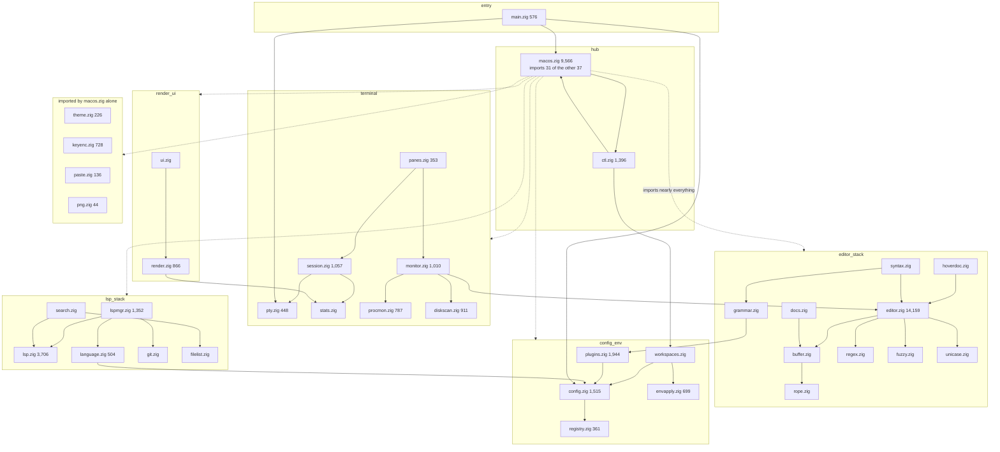

# 08 — Codebase map: a practical navigation guide

Snapshot: 2026-08-07, repo `/Users/sethlowie/go/src/github.com/incantery/rook`, branch `main`,
HEAD `9ad05f3` ("session: the pty is drained while the parser parses"), clean working tree.
Latest release tag **v0.43.0**. 668 commits, all since 2026-07-11. Note the drift trap up
front: `STATUS.md` self-identifies as the orientation page but is pinned at v0.40.0 /
2026-07-31 — **three releases and at least one major feature (runtime grammars) behind the
code**. The repository's own rule ("the repository is the source of truth, not its docs")
applies to its own status pages; this document flags every place where they disagree.

A second timing note: the research notes underlying this package were taken at HEAD `291f6d0`
with an uncommitted gather-thread IO pipeline in the working tree (`pty.zig` +111,
`session.zig` +453). That work has since **landed** as `9ad05f3`. Everything below describes
the committed state at `9ad05f3`; the line counts are `wc -l` of the current tree, re-measured
for this document.

---

## 1. Executive shape — what kind of repository this is

Rook is **one Zig binary** (`app/`, ~50,350 lines of first-party Zig in `app/src/` plus 6,311
lines of e2e harness) that is simultaneously:

- a macOS-native terminal emulator (AppKit + Metal, ghostty-vt for VT emulation),
- a tmux-style multiplexer (splits/tabs/spaces, spatial ⌃HJKL navigation),
- a vim-shaped editor (rope text model, near-complete vim core, tree-sitter syntax),
- an LSP client (three cleanly-layered Zig files, servers resolved by Go plugins),
- and its own CLI (`rook <verb>` forwards over a unix socket; `re` = edit by argv[0]).

Around the binary sit three Go tiers, all newline-JSON-over-stdio subprocesses:

- **`plugins/`** — first-party Go plugins (Claude Code watcher, OpenAI "agent membrane",
  rook-cloud device bridge, three LSP resolver plugins). Spawned and actively called by the app.
- **`providers/`** — GitHub/Linear connectors on a *different* protocol
  (`sdk/provider`). Built, bundled, tested — **and called by nothing** since their caller
  (`rookctl issues`) was deleted 07-31. An orphaned tier, acknowledged in `STATUS.md`.
- **`sdk/`** — the config SDKs: `sdk/rook` (Go, declarative environment graph →
  `environment.json`), `sdk/ts` (same graph in TypeScript, **embedded in the rook binary**),
  `sdk/provider` (its own zero-dependency Go module for provider authors).

The repo carries three archaeological layers, and knowing them explains most of the dead
weight you will encounter:

1. **Wails/Svelte webview era** (07-11 → 07-29, deleted in `de38f4e`) — survives only in
   `docs/superpowers/` specs, `docs/render-latency.md` (the post-mortem that justified the
   rewrite), and stale branches.
2. **Go daemon era** (`rook-host` + `rookctl`, deleted 07-31 in the ~15-commit "strip:"
   series ending `e502bd4`) — survives in `docs/OWED.md` (the strip ledger), orphaned
   `providers/`, a stale `.claude/skills/verify/SKILL.md`, and untracked binary debris.
3. **The current Zig-only app** — started as an experiment in `native/` on 07-27, promoted to
   `app/` and shipped as rook itself on 07-28 (peak commit day: 91 commits).

```
rook/
├── app/                  ← THE PRODUCT: one Zig binary (src/, e2e/, vendor/, bundle/)
├── plugins/              ← Go plugins, spawned by the app (claude, agent, cloud, lang-*)
├── providers/            ← Go providers, ORPHANED (github, linear; no caller since 07-31)
├── sdk/                  ├─ rook/  Go env-graph SDK    ├─ ts/  TS SDK (embedded in binary)
│                         └─ provider/  own Go module for provider authors
├── examples/             ← the wire-format existence proof: hello-plugin, 1.3KB of POSIX sh
├── docs/                 ← mixed: live specs, man pages, design journals, pure history
├── scripts/              ← icon build, registry→SDK codegen, migration helpers
├── spike/                ← mostly dead; contains a TRACKED node_modules (see §12)
├── test-config/          ← untracked scratch config pinned to the v0.40.0 SDK API
├── Makefile, install.sh, go.mod, README.md, STATUS.md, NOTES.md, NEXT.md
└── TODO.md               ← untracked/gitignored — but it is the ACTUAL live roadmap
```

---

## 2. Root directory

| file | size | verdict |
|---|---|---|
| `README.md` | 4.7KB | public-facing intro |
| `STATUS.md` | 14KB | the intended orientation page; honest in tone but **stale**: says v0.40.0 (tags reach v0.43.0) and "no grammars" (`app/src/grammar.zig` implements runtime grammar loading) |
| `NOTES.md` | 14.5KB | historical backlog, mostly webview-era checked items; no longer the live roadmap |
| `NEXT.md` | 7KB | the review-workspace product thesis (attention compression, hunks as atomic unit) — **Documented only**, no code behind it |
| `TODO.md` | 8.3KB, **untracked** | the real current roadmap (post-Zed/Ghostty-analysis work queue). Item 1 (vt security bump) landed as `291f6d0`; item 2 (gather-thread IO loop) landed as `9ad05f3` |
| `Makefile` | ~280 lines | heavily commented. Targets: `build` (CI), `dev`/`prod` (sandboxed: `ROOK_SOCK=/tmp/rook-dev.sock` + own `XDG_STATE_HOME`), `install` (ReleaseFast → `/Applications/rook.app`, ad-hoc codesign, `lsregister`, symlinks `~/.local/bin/{rook,re}`, man pages into the bundle *and* `~/.local/share/man`), `plugins`/`providers` (glob-discovered), `e2e`, `release` (local arm64 + `gh release create`; **no CI release job**), `gen-cmds`. One dead target: `ghostty-lib` references the deleted `internal/host/ghostty_term.go` |
| `install.sh` | 124 lines | curl-pipe installer: resolves latest tag from the GitHub release-page redirect (no API/rate limit), sha256-checks, `ditto` extract, transactional same-filesystem rename swap (`29930ae`: "the old app leaves only after the new one has arrived") |
| `go.mod` | — | root module `github.com/incantery/rook`, go 1.25; single require `sdk/provider` via a `replace ./sdk/provider` |
| `examples/` | 1.3KB, one file | `hello-plugin`: `describe` + `items.list` answered in POSIX sh with `expr`/`printf`. The in-repo proof that **no SDK is required** to write a plugin — the author SDK itself deliberately lives out-of-repo in `incantery/rook-demos` (plugins.zig:4–6). Note the path: this sits at **repo root**, not under `plugins/`; docs 03 §2.8 and 06 §C.1 both rest the "writable in any language" claim on it |
| `.golangci.yml`, `.gitignore`, `LICENSE` | — | housekeeping |

**Untracked debris at root** (correctly gitignored, ~65MB on disk, ships nowhere): `rookctl`
(13MB Mach-O — a local build of the *deleted* Go CLI; `strings` shows buildinfo
`github.com/incantery/rook/cmd/rookctl`), `cloud` (8.4MB — a loose build of the live
`plugins/cloud`), `bin/` (20MB `rook`, 10MB `rook-host`, `rookctl-demo` — all pre-strip
builds from 07-26), `test/` and `test-config/` (live sandboxes with stale sockets;
`test/zinit` is a full zsh-plugin-manager checkout used as a shell fixture), assorted
`.DS_Store`. None of these are checked in; the confusion they cause is purely local-disk.

**`test-config/` resolved** (this was flagged "Unclear" in the research notes): its
`main.go` uses a builder API — `rook.New()`, `e.FontSize(34)`, `e.Run()` — that does **not
exist** in `sdk/rook/rook.go` at HEAD (the only entry point there is `func Main(decls
...Node)` at `sdk/rook/rook.go:63`; `grep 'func New'` over `sdk/rook/*.go` returns nothing).
It compiles anyway (verified: `go build ./...` exits 0) because `test-config/go.mod` requires
the **published module `github.com/incantery/rook v0.40.0`** with no `replace` — it is pinned
to an older, tagged generation of the SDK. Classification: **Obsolete/dead** local scratch
tracking a retired API surface, not a second supported API.

---

## 3. `app/` — the product

### 3.1 Build system

- **`app/build.zig`** (~200+ lines, didactically commented). Exactly two Zig dependencies:
  **ghostty-vt** (terminal emulation; as of `291f6d0` pinned to *upstream ghostty main*
  `2602886` — the incantery fork retired because its one patch, OSC 9/777 notification
  effects, was absorbed upstream; a comment warns ghostty is migrating off GitHub) and
  **zig_objc** (Mitchell Hashimoto's objc bridge). Links
  AppKit/Metal/QuartzCore/CoreVideo/CoreGraphics/CoreText/ImageIO/UserNotifications.
  Compiles the vendored tree-sitter **runtime** (`vendor/tree-sitter/src/lib.c`, C11) —
  runtime only, no grammar tables. Embeds `../sdk/ts/rook.ts` as anonymous import `ts_sdk`
  ("@incantery/rook is not on npm") and `../docs/claude/rook-skill.md` as `claude_skill`
  (so `rook install claude` writes a skill matching the shipped binary). Declares **23 test
  roots** (`grep -c addTest app/build.zig` = 23 at HEAD; the file's own older comment saying
  nine, and `.github/workflows/ci.yml:41`'s "four test roots", are both stale — see doc 05
  §1.1). Roots at build.zig lines 95 (exe), 117 (editor+unicode), 126 (language), 148
  (hoverdoc), 154 (regex), 165 (fuzzy), 174 (unicase), 183 (paste), 196 (pty), 208 (config),
  220 (registry), 230 (filelist), 255 (monitor), 261 (diskscan), 273 (procmon), 284 (search),
  297 (keyenc), 310 (docs), 326 (lsp), 340 (git), 352 (plugins), 363 (envapply), 390 (ui) —
  each with an inline comment naming the silent failure it exists to catch, because test
  decls in files the exe module never imports are invisible to a single `addTest` and "that
  hole silently swallowed the editor's tests once already." `-Dbuild=` / `-Dversion=` stamp
  binary identity.
- **`app/build.zig.zon`** — name `.rook`, `minimum_zig_version = "0.16.0"`.
- **`app/bench.sh`** — the perf-scoreboard runner: ReleaseFast, own socket, pinned config
  (bench.sh:24 writes `font-family = "Hack Nerd Font Mono"` / `font-size = 18`; its comment at :20
  scopes the pin to "what the 0.88–0.91s cat band was measured with", **not** to every published
  number — `app/PERF.md:18` states the July latency table's conditions as "Grid 67×42 (WM-assigned
  tile), FiraCode Nerd Font Mono 13pt"), 150MB base64
  corpus, four phases (idle / quiet-key latency / firehose / cat). Contains a stale comment
  block about the (deleted) rook-host daemon.
- **`app/bundle/`** — hand-rolled `Info.plist` (`com.incantery.rook`, macOS 13.0 minimum,
  both `CFBundleIconName` and `CFBundleIconFile`); `appicon.icon/` is the Icon Composer
  format consumed by `scripts/build-icon.sh` via `actool` with a documented no-Xcode fallback.

### 3.2 `app/src/` file-by-file

Line counts are `wc -l` at `9ad05f3`. "Dependents" derived from a verified grep of
`@import("*.zig")` across all files (see the graph in §3.3).

#### Entry + platform integration

| file | LOC | role |
|---|---|---|
| `main.zig` | 576 | Entry. `pub fn main` at :94; `re` basename → `edit()` (:98); `--version`; `--config=DIR` sets `ROOK_SOCK` + `XDG_DATA_HOME` so a whole instance lives in one deletable dir; subcommands `demo`/`install`/`exec`/`edit`/`win`; **any other verb forwards to the running instance over the ctl socket** (`ctlPass`) — there is deliberately no client-side verb table, so the CLI can never drift from the server. `adoptLoginPath()` (~:186–206): if PATH is launchd's exact skeleton, spawn `$SHELL -l -i`, read PATH over **fd 3** (rc-file chatter would pollute stdout), with a quiet-deadline so a broken zshrc "costs seconds once, never a launch". Mature. |
| `macos.zig` | 9,566 | The whole AppKit/Metal application; second-largest file. `App` struct (~:479) with ~90+ fields: window/layer/device objc handles, `Renderer`, keybinds, plugin-panel state (a `plug_*` family of ~20 fields), env-apply state (`env_diff`, `env_candidate`, `setup_needed` welcome screen), palette (`PalMode`: workspaces/commands/files/plugins/actions), side panes, display-link blocks. Owns the event loop, key dispatch, all chrome drawing (bars, palette, which-key, file tree, plugin panel, completion card), IME, mouse, focus zones, ⌃HJKL nav-yield via `tcgetpgrp` program-name check. Imports 28 sibling modules — the only file that sees nearly the whole tree. **The integration hot-spot**: rook has no UI-framework layer, so macos.zig is view+controller for every feature, which is why features land as `plug_*`/`env_*` field families on one struct. **See the intra-file landmark table below** — this is the only file in the tree where "where is feature X" needs one. |

**macos.zig landmark index.** The file has no table of contents and no tests, and every
feature is reached through it, so navigating it by line is a practical necessity. Verified by
`grep -n '^    fn \|^    pub fn ' app/src/macos.zig` at `9ad05f3`:

| region | lines | what lives there |
|---|---|---|
| ObjC class construction (window delegate, IME `NSTextInputClient` view) | 168–280 | runtime-built ObjC subclasses; `dispatch_async_f` main-queue marshal at :66–68 |
| `App` struct | ~479 | ~90 fields; feature families (`plug_*`, `env_*`, `rev_*`, monitor `sampling`/`scan*`) |
| `create` / `run` | 1030 / 1278 | startup order (§9 of doc 01) and the AppKit run loop |
| mouse: click / drag / wheel | 1537–2013 | separator hit-testing, click-places-cursor, selection |
| pane creation + editor takeover | 2034–2167 | `newEditorLocked`, the `pane.under` park-the-shell model |
| `relayoutLocked` | 2168 | the one place `panes.layout` is applied to live rects |
| split / tab / space | 2196–2283 | structural mutation (note the `catch {}` appends at :2208, :2233) |
| key routing | 2284–2369 | `writeFocused` :2284 → `routeChromeKeyLocked` :2308 → `paneInput` :2369 |
| `hangupAllSessions` | 2464 | the two-pgroup SIGHUP→SIGTERM→SIGKILL quit ladder |
| copy mode | 2484–2596 | terminal selection/yank (no unit tests, no e2e — see doc 05 §2.2) |
| command palette | 2610–2976 | `PalMode` workspaces/commands/files/plugins/actions |
| `dispatch` | 2977 | the registry action switch — the single door for every command id |
| file tree + side panes | 3019–3249 | `TreeRow` rendering (the model is in editor.zig) |
| search panel | 3250–3441 | find-in-files worker at :3315, results panel shared with `gr` |
| syntax + docs attach | 3470–3543 | where `syntax.Highlighter` is bound to the editor's four hl hooks |
| the LSP hook block | 3558–4470 | hover :4035, definition :4046, references :4057, format :4086, code actions :4118, completion :4193, rename :4215, WorkspaceEdit apply :4279 |
| `openTextPane` / `queueVerdictLocked` | 4564 / 4589 | **dead**: a pub seam with no in-repo caller, and an uncalled private function referencing six `App` fields that do not exist (§12) |
| pending drains (open / quit / ex) | 4653–4875 | the "queue under lock, drain after release" pattern |
| focus / zoom / spatial nav | 4921–5074 | ⌃HJKL + focus zones + nav-yield |
| `reapExitedLocked` | 5075 | pane collapse on session exit, on the display-link thread |
| **`drawFrame`** | **5207** | the frame: reap → drain → HUD tick → per-pane snapshot → fill → draw |
| config + buffer polls | 5552–5720 | 1Hz TOML digest reload, `env_src_digest` staleness |
| bells / notifications / clipboard | 5721–5893 | OSC 9/777, OSC 52 write path |
| HUD | 5894 | `ctl stats` / perf overlay |
| bars and segments | 6024–6294 | top-bar / status-left / status-right, shed-off-the-ends |
| which-key | 6295–6399 | the discoverability sheet |
| `tabTitle` | 6400 | reads `term.getTitle()` back out of ghostty-vt — why `title_changed` is a null effect |
| monitor sampler | 6664–6758 | `monitorVisibleLocked` :6673, `startSampler` :6687 (the thread exits when no monitor pane is visible) |
| disk scan + reclaim | 6759–6940 | `startDiskScan` :6759, **`startReclaim` :6860** — the only code path that deletes user files |
| `pluginInbound` and friends | 7340–7591 | `pluginInbound` :7340, `activityReport` :7362, `sessionSend` :7483, `spawnSession` :7537 |
| plugin panel draw + pin copy | 7936 / 8289 | `drawPlugin` :7936 (the List-only surface, §13), `copyPluginPin` :8289 |
| render fills | 8660–9124 | terminal/editor/monitor grid → `CellData` |
| key monitor | 9163 | `monitorCallback` — the NSEvent local monitor (KeyDown only, so key-release is structurally impossible) |
| `displayLinkCallback` / `terminateCallback` | 9493 / 9515 | the two callbacks AppKit/CoreVideo own |
| `runTool` | 9543 | `fork` + `execl("/bin/sh","sh","-c",…)` on a compiled-in reclaim command |
| `inputKick` | 9562 | the key→photon fast path called from the session parse thread |
| `ctl.zig` | 1,396 | The agent/CLI surface: unix socket (default `/tmp/rook.sock`, `ROOK_SOCK` override), line protocol usable from `nc -U`. Verbs (verified in-file): `dump`, `shot` (own-pixels PNG), `type`/`key`/`nskey`/`ime`/`paste`/`enter`/`ctrlc`, `click`/`drag`, `panes` (:226), `focus`, `open`/`edit`, `run`, `palette`(-`open`), `panel`, `plugin`(-`show`)/`plugins`, `monitor`/`disk`/`live`, `lsp`, `env` (:573)/`apply`/`recheck`/`reload`, `syntax`/`syntax reload` (:1152/:1146 — **absent from `docs/man/rook-ctl.7`**, `grep -c syntax docs/man/rook-ctl.7` = 0; the doc gap docs 01 §11 and 07 Fork 7 both cite), `attention`, `activity`, `worktree add|remove` (:297), `docs`, `commands`, `hud`, `fullscreen`, `boottime`, `notify`, `clipboard`, `quit` (:1387). **Never steals a live socket** — connects first, refuses to unlink a socket that answers. Mature, grows with every feature. |
| `ui.zig` | 393 | `Metrics` (cell geometry), `clip`, `WrapIter`, `appKitOwns` (which regions AppKit owns vs the grid). Shared drawing helpers. |
| `render.zig` | 866 | The Metal renderer. `CellData` extern struct (:67) with `flag_glyph`/`flag_color`/`flag_no_bg` (no_bg = the draw-under mechanism for the completion card), `RRUniforms`+`RectStyle` (SDF rounded-rect cards), `GlyphLoc` atlas, `Renderer` (:259). CoreText glyph rasterization via FFI; instanced grid; one pipeline for all panes ("grids are uniforms + a buffer offset"). Mature. |
| `theme.zig` | 226 | `Theme` + 3 builtins (`default`, `nocturne`, `vscode_dark`), `byName`. The webview app had 8 themes + a VS Code importer; only 3 survived the rewrite. |
| `keyenc.zig` | 728 | Rook encodes keystrokes itself: `Mods` packed struct, `Key` enum, kitty-keyboard-protocol flags, `encode`. (shift+Tab is `ESC[Z`; macOS reports 0x19; ghostty's tables are not importable from ghostty-vt.) |
| `paste.zig` | 136 | xterm-rule paste safety: `STRIP` table, `isSafe`, bracketed `encode`. Own test root "because they're security rules". |
| `png.zig` | 44 | `writeBGRA` for `shot`. |
| `stats.zig` | 176 | `Ring`, `Stats`, `global`, `writeReport` — perf HUD / boottime counters. |
| `root.zig` | 18 | Zig-init leftover (`add`, `printAnotherMessage`). **Obsolete/dead.** |

#### Terminal core

| file | LOC | role |
|---|---|---|
| `pty.zig` | 448 | fork/exec into a pty; `Winsize`, ioctls; poll wrappers (`pollOne`/`pollMany`/`makePipeNb` — added by the pipeline commit); teardown escalation SIGHUP→SIGTERM→SIGKILL with its own test root spawning real signal-trapping shells ("an orphaned process has no pane, no trace but ps"). |
| `session.zig` | 1,057 | `Session` = one pty + one `vt.Terminal` + reader thread. `Lock` wraps `os_unfair_lock` with a documented starvation fix (`snapshot_wanted` atomic — a firehose reader starved the render thread "for hundreds of ms (measured)"). Per-field paragraph comments: `kick` (echo-on-keystroke without waiting for the display link, gated to keep firehose coalesced), `notify_pending` (OSC 9/777), `clip_pending` (OSC 52, heap "because a yank is whatever size the yank is"), `search` dropped on alt-screen swap, `last_out_ms`/`last_in_ms`/`out_bytes` (output vs typing as two facts, not a heuristic — this is what the claude plugin's activity fusion consumes). As of `9ad05f3` the read path is a **gather-thread `Pipeline`** ported from Ghostty's ring-buffer loop: SPSC ring (4×64KiB), GCD semaphores (Zig 0.16 retired the condvars), idle self-pipe wake, ~1KiB bridge threshold (macOS caps pty reads at ~1KiB). **The best-commented code in the repo.** |
| `panes.zig` | 353 | The layout model: `Rect`, `Content` union, `Pane`, `Node` split tree, `Tab`, `Space`; pure functions `layout`, `splitAt`, `removeAt`, `hitSeparator`, `navigate` (spatial ⌃HJKL), `collectSeparators`. Deliberately dumb/pure — macos.zig owns the instances. |
| `procmon.zig` | 787 | `proc_pidinfo`/`host_statistics64` FFI (extern structs `ProcTaskInfo`, `RUsageInfoV4`, `VmStatistics64`, `XswUsage`), `Sampler`, `attribute` (charge processes to panes). |
| `monitor.zig` | 1,010 | The resource-monitor pane (live processes + disk), severity coloring; renders via editor `RCell`s. |
| `diskscan.zig` | 911 | du-style scanner with a **reclaim classifier** (`Reclaim` enum, `categories` table: node_modules, zig-cache, DerivedData…), `walk` (max_nodes 200k). e2e `monitor` asserts "keep refuses deletion". |

#### Editor + language intelligence

| file | LOC | role |
|---|---|---|
| `editor.zig` | 14,159 | **The monster** — largest file in the repo; `Editor` struct at :323 is itself ~4k lines. Vim core: modes incl. visual_block (:271), registers (char/line/block), macros, marks, undo groups, `.` repeat via `RepEvent` ("records the result, not the keys"), regex `:s`, completion ring + `CplBox`, LSP `Diag` diagnostics, `HlSpan` styles, `TreeRow` (**the file tree lives inside the editor**), buffer line, `OpenHow` (here/beside/split_right/split_down). Four nullable hl hooks at :738–741 (`hl_reparse`/`hl_spans`/`hl_set_path`/`hl_destroy`) — the seam that let grammars be deleted and later return without touching the editor; headless tests always run hook-less. Probe structs for tests: `CplProbe` :12791, `FmtProbe` :12971, `ResolveProbe` :13893. Imports only buffer/fuzzy/hoverdoc/regex/registry/stats/unicase — **not lsp directly** (macos.zig mediates). Developed oracle-first against real vim (`vim -Nu NONE -c 'normal …'`; testdata under `app/src/testdata/`). |
| `buffer.zig` | 1,032 | `Buffer` over a rope; `DiskState` (mtime/size identity — `:w` refuses to clobber external edits, e2e `clobber`); `Watcher`/`EditFn` (max 16) — how `docs.zig` fans edits to panes and how tree-sitter receives `TreeEdit`s. |
| `rope.zig` | 427 | Classic rope, leaf_max 2048; own big-file test. |
| `docs.zig` | 233 | The Emacs model: one file = one `Buffer` shared by N panes. `Registry` (max_docs 512), refcounted `Entry`. e2e `docshare` proves shared dirty flag / `:w`. |
| `regex.zig` | 1,054 | Backtracking engine ("backtracks on purpose", step budget vs pathological patterns; own test root); `expand` for `:s` replacements. |
| `unicase.zig` | 966 | Generated case tables (`toUpper/toLower/toggle`); vim's own `toupper()` inconsistency documented. |
| `fuzzy.zig` | 464 | One bounded-DP matcher, **two weight tables**: `Weights.ident` (completion: camelCase humps) vs `Weights.path` (⌘P: basename bias); matched-position tracking for highlights. Own test root "because ranking bugs read as taste". |
| `search.zig` | 487 | Find-in-files: caps (2MB/file, 2000 hits, 400 files), `looksBinary`, `atMarks` re-anchoring for stale hits. Feeds the side panel that `gr` (LSP references) reuses. |
| `filelist.zig` | 290 | ⌘P index: max_files 20,000; `IgnoreSet` reads `.gitignore` in **every** directory (the fix for the bug that once indexed 26k vendored files); index sorted for cross-machine determinism. |
| `hoverdoc.zig` | 909 | Markdown → laid-out `Doc` of styled `Run`s; used by both the hover float and the completion doc panel; own test root ("every server writes a different dialect"). |
| `git.zig` | 171 | **No subprocess**: parses `.git/HEAD` and worktree gitfiles directly (`parseHead`, `worktreeHeadPath`, `headBranch`, `repoRootFs`). `470b7b4` killed git-as-a-subprocess. |

#### LSP stack (three layers, cleanly split)

| file | LOC | role |
|---|---|---|
| `lsp.zig` | 3,706 | Sans-io protocol: framing (`parseFrame`, 64MB max frame), UTF-16 column conversion, wire types (`Position`/`Range`/`Diagnostic`/`Location`/`CodeAction`/`Completion`/`TextEdit`/`FileEdits`/`Splice`), `Event` union, `resolveEdits`/`applySplices` (validate-everything-before-touching-anything rename). Pure and testable; imports nothing app-side. |
| `lspmgr.zig` | 1,352 | Process lifetime + routing: `Manager`, per-server `Entry`, `Ask`/`AskKind` (hover/definition/references/rename/completion/completion_resolve/formatting/code_action/code_action_resolve), `Answer` union, per-file diagnostics, `Rig` test harness. Exit waits for the shutdown reply (`2bc1257`). |
| `language.zig` | 504 | **Declarations, not a catalog** (`dc4fcec`): `Spec` (extensions, root markers, command or resolver plugin), `Fault` enum with user-actionable sentences, `rootFor` marker walk, `serversDir` (rook-managed installs — zls matched to the project's Zig version, typescript-language-server into rook's prefix "never into your project"), `resolveArgv`. Own test root. |

#### Syntax (the grammar round-trip)

| file | LOC | role |
|---|---|---|
| `syntax.zig` | 324 | `Highlighter` bridging tree-sitter to the editor's four hl hooks; **queries embedded** at :86–93 (`@embedFile("queries/*.scm")` for zig/go/python/typescript; tsx = ts ++ tsx overlay, joined at comptime so "a query naming a node its grammar lacks fails to COMPILE") while **grammar parse tables are dlopen'd at runtime**. |
| `grammar.zig` | 637 | The native-plugin seam `docs/OWED.md` §5 asked for, **now real**: `Registry.get` → resolve → materialize (cache at `~/.local/share/rook/grammars/<name>.dylib`; fetch by pinned URL via `plugins.fetch`, or build from a repo rev with `cc`) → dlopen + `tree_sitter_<stem>` dlsym; ABI read as the first u32 of the language table and checked against `min_abi 13` / `max_abi 15` (:74–75, enforced :410–411) *before* handing it to the parser, "because 'your grammar is four years old' and 'newer than rook' deserve different words". `Fault` enum (undeclared/unavailable/bad_pin/unloadable/no_symbol/too_old/too_new), each with an actionable sentence. Failed lookups are cached (a retry-per-frame would fork a subprocess on the render path forever). **STATUS.md and the un-annotated OWED.md §5 both predate this file — the code is ahead of the docs.** |
| `queries/*.scm` | 673 total | Highlight queries for the 5 supported languages (zig.scm is 291 of them). |

#### Config / environment graph

| file | LOC | role |
|---|---|---|
| `config.zig` | 1,515 | The TOML half: enums (`Blur` incl. glass, `Bell`, `ClipboardWrite`, `Segment` vocabulary, `TabStyle`, `BufferLine`), `SegList` (top-bar/status-left/status-right, shed-off-the-ends), `applyPreset` (`tmux-neovim`, `vscode` persona bundles), `Config` at :310, `digest` (live-reload change detection at 1Hz), `--config` dir override. Also the environment-graph *loader* (lower half). |
| `envapply.zig` | 699 | **Config is a program**: finds `main.go`/`.ts` in the config dir, runs it, diffs the emitted `environment.json` against last-applied (`Diff` of `Change{add,remove,change}`, max 64), digest-based staleness. Embeds starter templates (`go_mod`, `go_main`, `ts_main`) and the whole TS SDK. Pulumi-preview semantics: e2e `apply` asserts "shows the diff, applies nothing until told". |
| `registry.zig` | 361 | **THE command vocabulary**: `Action` enum, `commands` table at :109 (**29** canonical ids like `pane.split-right`, `config.apply`, `tree.reveal` — `grep -o '\.id = "[a-z0-9.-]*"' app/src/registry.zig | sort -u | wc -l` = 29, from 37 raw occurrences before de-duplication and aliases), aliases, `exName` (`:PaneSplitRight` bridge), `LeaderBind`. `scripts/gen-cmds.sh` generates `sdk/rook/cmds.go` from this file; the drift check is a **Makefile comment only (`Makefile:97`) — `ci.yml` never runs it**, and it has already drifted: `.id = "editor.format"` (:143) and `.id = "monitor.open"` (:149) have no counterpart in the committed `cmds.go` (29 canonical registry ids vs 27 SDK constants). |
| `workspaces.zig` | 428 | Workspaces as graph nodes (post-sqlite): `load` from the environment graph; **worktrees derived live** from `.git/worktrees/` (never stored); `worktreeAdd`/`worktreeRemove` with refusal guards (unmerged = rook's refusal; dirty = git's own error quoted verbatim). |

#### Plugins (out-of-process seam)

| file | LOC | role |
|---|---|---|
| `plugins.zig` | 1,944 | Protocol `version = 1` (:116), newline-JSON frames (1MB max), 10s deadline + 250ms grace then SIGKILL. Outbound rook→plugin (verified call sites): `describe` (:620), `lsp.resolve` (:1277), `items.list` (:1355), `items.act` (:1515). Inbound plugin→rook is **five** verbs: the four named constants at :134–137 (`attention.raise`, `session.spawn`, `session.send`, `clipboard.set`) **plus `panes.activity`**, which `App.pluginInbound` dispatches by literal string (`macos.zig:7346`) rather than by constant — it is the first inbound verb that answers *with data*, which is why it lives outside the constant block. All five **grant-gated per config**. `Spec` (command / lazy-or-eager load / grants), `State` declared/up/failed, `FrameReader`, per-plugin `Host` pump. Also the **shared fetch machinery** (`hashFile` sha256, `cachePath`, `fetch`) reused by `grammar.zig` and exercised by e2e `pluginfetch`. Imports only `config` + std — deliberately independent of the app. |

### 3.3 The intra-app import graph (verified by grep, not from docs)

Derived from `@import("*.zig")` across every file in `app/src/`. Three structural facts:

1. **macos.zig is the hub**: `app/src/` holds **38** first-party Zig files
   (`printf '%s\n' app/src/*.zig | wc -l` = 38 — note that a bare `ls | wc -l` over-counts by one
   under `eza`, which prints a header row), and macos.zig imports **31 of the other 37**
   (`grep -o '@import("[a-zA-Z_0-9]*\.zig")' app/src/macos.zig | sort -u | wc -l` = 31; the six it
   does *not* import are `hoverdoc`, `regex`, `rope`, `unicase`, `main`, and `root`, every one of
   them reached transitively through `editor.zig` or not code at all). Almost nothing else imports
   more than a handful. All cross-subsystem coordination (editor↔LSP, session↔render,
   plugins↔panes) happens *through* it.
2. **The leaves are genuinely pure**: `lsp.zig`, `regex.zig`, `fuzzy.zig`, `rope.zig`,
   `keyenc.zig`, `paste.zig`, `unicase.zig`, `pty.zig`, `procmon.zig`, `envapply.zig`,
   `filelist.zig`, `git.zig`, `theme.zig` import nothing app-side (or only `std`) — this is
   what makes the 23 standalone test roots possible.
3. **`editor.zig` does not import `lsp.zig`** — diagnostics/completions arrive as data via
   macos.zig. Conversely `hoverdoc.zig` imports `editor` (for style types) and `syntax.zig`
   imports `editor` (for the hl-hook types) — small upward edges worth knowing about.



(Note the `ctl.zig ↔ macos.zig` cycle — ctl needs the App to execute verbs, macos starts the
listener. It is the one deliberate cycle in the graph.)

#### 3.3a Reverse index — who breaks if you change this file

The graph above reads top-down; the question a map actually gets asked is the other direction
("what depends on `render.zig`'s `CellData`? on `keyenc.zig`'s `Mods`? on `panes.zig`'s
`Content`?"). Computed for every module by
`grep -ln '@import("<name>.zig")' app/src/*.zig`. **Maturity** is a judgment from three
measurements — inline test count (`grep -c '^test '`), commit count across the `native/`→`app/`
promotion (`git log --follow`), and date of last commit — read as: *Mature* = well-tested and
settled; *Active* = under current churn; *Young* = arrived in the last week; *Dormant* = untouched
for a week or more and not currently a work area.

| module | dependents (who imports it) | tests | commits | last | maturity |
|---|---|---|---|---|---|
| `macos.zig` | ctl, main | 0 | 133 | 08-06 | **Active** — the god-module; every feature lands here |
| `editor.zig` | hoverdoc, monitor, panes, syntax, macos | 306 | 71 | 08-06 | **Active** — heaviest test coverage in the repo, still the churn centre |
| `config.zig` | grammar, language, main, plugins, workspaces, macos | 17 | 55 | 08-06 | **Mature** |
| `registry.zig` | config, ctl, editor, macos | 8 | 24 | 08-06 | **Mature** — but the gen-cmds guard on it has drifted (§3.2) |
| `stats.zig` | ctl, editor, macos, render, session | 0 | 6 | 08-06 | **Mature** — zero tests, exercised every run |
| `buffer.zig` | docs, editor, macos, syntax | 17 | 12 | 08-06 | **Mature** |
| `lsp.zig` | lspmgr, macos, search | 35 | 11 | 08-06 | **Active** — the 08-05/06 LSP sprint |
| `pty.zig` | macos, main, session | 2 | 7 | 08-07 | **Active** — touched by the pipeline commit |
| `session.zig` | macos, panes | 2 | 27 | 08-07 | **Active** — the newest structural rewrite (`9ad05f3`) |
| `panes.zig` | ctl, macos | 0 | 17 | 08-06 | **Mature** — pure, dumb, stable shape |
| `plugins.zig` | grammar, macos | 19 | 17 | 08-06 | **Mature** |
| `ctl.zig` | macos | 0 | 79 | 08-06 | **Active** — grows one verb per feature; no unit tests, e2e only |
| `render.zig` | macos, ui | 0 | 12 | 08-06 | **Mature** — verified by pixel e2e, not units |
| `ui.zig` | macos | 14 | 6 | 08-03 | **Mature** |
| `diskscan.zig` | ctl, monitor, macos | 9 | 1 | 08-06 | **Young** |
| `procmon.zig` | macos, monitor | 5 | 1 | 08-06 | **Young** |
| `monitor.zig` | panes, macos | 10 | 1 | 08-06 | **Young** |
| `git.zig` | lspmgr, macos | 4 | 7 | 07-31 | **Dormant** — subprocess-free rewrite landed and stopped |
| `filelist.zig` | macos, search | 2 | 2 | 07-30 | **Dormant** |
| `fuzzy.zig` | editor, macos | 14 | 1 | 08-06 | **Mature** — own test root, "ranking bugs read as taste" |
| `envapply.zig` | macos, workspaces | 10 | 4 | 08-03 | **Dormant** |
| `workspaces.zig` | ctl, macos | 5 | 9 | 08-03 | **Dormant** |
| `grammar.zig` | macos, syntax | 5 | 1 | 08-06 | **Young** |
| `syntax.zig` | macos | 0 | 8 | 08-06 | **Active** — the hl-hook seam |
| `language.zig` | lspmgr, macos | 10 | 2 | 08-06 | **Young** — `dc4fcec` made it declarations |
| `lspmgr.zig` | macos | 9 | 12 | 08-06 | **Active** |
| `search.zig` | macos | 8 | 2 | 08-05 | **Young** |
| `docs.zig` | macos | 5 | 1 | 07-30 | **Dormant** |
| `theme.zig` | macos | 0 | 6 | 07-30 | **Dormant** — 3 of the webview era's 8 themes survived |
| `keyenc.zig` | macos | 18 | 1 | 07-31 | **Dormant** — landed complete, untouched since |
| `paste.zig` | macos | 7 | 3 | 07-28 | **Dormant** — security rules, own test root |
| `png.zig` | macos | 0 | 2 | 07-28 | **Dormant** |
| `hoverdoc.zig` | editor | 20 | 1 | 08-06 | **Young** |
| `regex.zig` | editor | 29 | 4 | 07-29 | **Dormant** — arrived fully tested |
| `unicase.zig` | editor | 5 | 1 | 07-29 | **Dormant** — generated tables |
| `rope.zig` | buffer | 3 | 2 | 07-28 | **Dormant** — the one leaf everything else stands on |
| `main.zig` | — (entry point) | 0 | 17 | 08-03 | **Mature** |
| `root.zig` | — | 1 | 2 | 07-28 | **Obsolete/dead** (Zig-init leftover) |

Two structural facts this table makes queryable, both load-bearing elsewhere in the package:

- **`editor.zig` does not import `lsp.zig`** (see fact 3 below) — LSP data reaches the editor as
  plain structs through macos.zig, which is why the editor's 306 tests run without a server.
- **`plugins.zig` imports only `config` + std** — nothing app-side depends on it except `macos` and
  `grammar`, and it depends on nothing but the config parser. That is precisely what makes the
  plugin host *liftable* out of the app, which doc 06's thesis F leans on.

### 3.4 `app/e2e/` — the verification story

- **`main.zig`** (5,254) — **51 scenarios** in a table at :29 (counted: 51 `.what =` /
  `.run =` rows; earlier notes said 52 — off by one), each `{name, what, run}`. Representative
  names: `boot`, `echo`, `splits`, `vim`, `wide`, `grapheme`, `clobber`, `pixels`,
  `commands`, `whichkey`, `statusbar`, `worktrees`, `cli`, `filetree`, `bufline`, `monitor`,
  `plugins`, `envgraph`, `configdir`, `apply`, `setup`, `pluginfetch`, `claudewatch`,
  `chrome`, `presetparity` (TOML preset ≡ SDK graph byte-parity), `filefinder`,
  `lsp`/`lspaction`/`lspformat`/`lsppython`/`lspts`/`lsplang`/`lspretarget`, `suggest`,
  `docshare`, `findfiles`, `vscodefeel`, `keys`, `panedim`, `panelwrap`, `panelfold`,
  `startup` (bench=true).
- **`harness.zig`** (1,057) — `Instance` (:115) spawns a sandboxed rook per scenario
  (`/tmp/rook-e2e-<pid>-<n>`, own socket/config/state, `/bin/sh`), drives it over the ctl
  socket, asserts on `dump` text **and** ImageIO-decoded `Shot` pixels (:787).
- **Local-only** (needs a window server + Metal + real shells). CI only *compiles* it
  (`zig build e2e-check`); the CI comment is explicit that this compile step is "the only
  thing standing between the harness and silent bit-rot."

This is unusually good design: every STATUS.md "what works" line maps to a named scenario,
and agents verify UI work with `make e2e` instead of asking the human to look.

### 3.5 `app/vendor/tree-sitter/` — checked-in C

Tree-sitter **runtime** amalgamation (`TREE_SITTER_LANGUAGE_VERSION 15` in
`include/tree_sitter/api.h:29`), ICU-derived unicode headers, wasm stubs that compile to
nothing without the feature flag. ~872KB of runtime — versus the 4.6MB of grammar parse
tables that were deleted in the strip (grammars now arrive at runtime via `grammar.zig`).
Vendored deliberately, not a Zig package.

### 3.6 `app/zig-pkg/` (untracked)

Local Zig package-cache override: ghostty at three pins, libxev, vaxis, zf, z2d, zigimg,
zig_objc, uucode, aro, translate_c, plus content-addressed blobs. Build cache, not source.

### 3.7 The big markdown files inside `app/` — design journals, not docs

| file | size | status |
|---|---|---|
| `app/README.md` | **77KB** | "How the app works." Its own header declares partial staleness ("Written while a Go host still stood behind the app…"). Contains full sections for **files that no longer exist** (`src/review.zig` :599, `src/threads.zig` :630, `src/transcript.zig` :666, `src/agents.zig` :708, `src/asks.zig` :741, "rook-host: the daemon is ours now" :1043). The live sections *do* match code: `:w` cannot lose your file (:287), regex-backtracks-on-purpose (:354), real-vim-as-oracle (:379), draw-under card (:923), fuzzy ranking (:973), command registry (:823), known debts (:1325). Read it as a journal with a stale middle. |
| `app/PARITY.md` | **92KB** | The webview→Zig cutover checklist; STATUS.md labels it "historical, much of it now moot". It is nonetheless the single best record of *why* each cutover decision was made ("the agent layer — this is the actual product", "accepted regressions", "the Go recedes"). |
| `app/PERF.md` | 20KB | The **live** perf scoreboard + the rules for adding to it (stated grid geometry, pinned config, interleaved A/B). Recent commits (`337255d`, `7ee6a6b`, `91e397e`) added a display axis and per-phase self-vouching. |
| `app/NEXT.md` | 21KB | "Zig architecture hypotheses, explicitly not decisions" (STATUS.md's words). |

---

## 4. `plugins/` — first-party Go plugins

All speak the rook-plugin(7) newline-JSON protocol on stdio; discovered by a Makefile glob
over `plugins/*/main.go`; built into the bundle as `Contents/MacOS/rook-plugin-<name>`.

| plugin | LOC | role | maturity |
|---|---|---|---|
| `claude/` | 398 | The Claude Code watcher: scans `~/.claude/projects/*/*.jsonl` via the shared scanner, answers `describe`/`items.list` (sessions as items with honest `State`), calls `panes.activity` back into rook and **fuses** transcript state with pane output-rates (`transcript.Fuse`: spinner-rate output + claude-like program name = working). Raises `attention.raise` when a turn finishes. | **Implemented**, e2e `claudewatch` |
| `agent/` | 639 + 351 | The OpenAI-backed "membrane" worker: `Summarizer.Summarize` compresses finished turns into digests (headline + bullets-as-children + cost), `Draft` for reply drafting; persists via `digestlog` so drafts survive relaunch. API key at `~/.config/rook/openai_key` (Dock launches have no shell env). | **Implemented**, has unit tests |
| `cloud/` | 1,106 + 941 tests | The **device half of rook-cloud** (the service itself is a separate repo at api.rookide.com): bearer-token machine identity, `POST /v1/status` (last-write-wins snapshot: workspaces → agents → states + digest headlines), polls `/v1/commands` (spawn/resume/compact — the phone starts work, executed via grant-gated `session.spawn`/`session.send`) and `/v1/answers`, acked through `cmdjournal` at-most-once delivery. **Best-tested Go in the repo.** | **Implemented** locally; depends on the external service |
| `lang-zig/`, `lang-python/`, `lang-typescript/` | 483/347/274 | LSP **resolver plugins** answering `lsp.resolve` once per project root: zig (find/pin zls matched to `minimum_zig_version`), python (interpreter divination: venv/poetry/uv/pyenv → basedpyright/pyright/pylsp), typescript (local-vs-global server, `tsdk`, auto-install). Refusals become status-row sentences. | **Implemented**, e2e `lsplang`/`lsppython`/`lspts` |
| `internal/` | — | Shared libraries: `transcript/` (508 — the jsonl scanner; `parseTail` reads a bounded tail, not the whole ~1.6MB file), `digestlog/` (204 — append-only jsonl journal, time-window compaction; the seam between agent and cloud), `cmdjournal/` (221 — at-most-once delivery keys). | **Implemented** |
| `../examples/hello-plugin` (repo root, **not** under `plugins/`) | 30 lines of POSIX sh, 1.3KB | Answers `describe` + a fixed `items.list` with `expr`/`printf` — living proof the wire format is simple enough for shell. | demo |

---

## 5. `providers/` — the orphaned tier

- `github/` (224) wraps the `gh` CLI (`issues.list`, `pulls.status`); `linear/` (195) speaks
  GraphQL with an API key from the **macOS keychain** (service `rook`, account `linear` — the
  keychain *writer* died with rookctl; `docs/OWED.md` §4 says add the entry by hand).
- `boundary_test.go` (53) — **enforced architecture**: a `go list -deps` test proving
  providers import only `sdk/provider` + stdlib, with an in-file explanation of why Go's
  `internal` rule cannot express this (same module path). Verified: the comment reads "The
  boundary, enforced rather than described."
- **Status: built, bundled, tested, and called by nothing.** The caller (`rookctl issues`)
  was deleted 07-31. `STATUS.md` "What does not work" admits this. `docs/OWED.md` §1 frames
  the future as "a decision, not a port" (provider→plugin shim vs rewrite-as-plugins).
  Classification: **Scaffolded/orphaned** — live code, dead call path.

---

## 6. `sdk/`

| dir | what | notes |
|---|---|---|
| `sdk/provider/` | Its own Go module with **zero dependencies** (a third-party author's go.sum stays empty), tagged `sdk/provider/v0.1.0`. `provider.go` (Request/Response/Describe + Issue/PullsStatus), `serve.go` (handler-map loop), `client.go` (the caller side that nothing in Zig uses today). Tested by a dedicated CI step because its module is unreachable from root `./...`. |
| `sdk/rook/` | The environments SDK (Go, ~1,274 lines in `rook.go` + tests). Entry point `func Main(decls ...Node)` (`rook.go:63`) → emits `environment.json`. Declarations: `Theme`, `Font`, `Window`, `Seg`/`TopBar`/`StatusLeft`/`StatusRight`, `Leaders`, `Binds`/`EditorBinds`, `Workspace(s)`, `Plugin` (command/load/grants), `Grammar(s)`/`GrammarPath`, `Language` (LSP declarations incl. resolver plugins), presets. `cmds.go` is **generated** from `app/src/registry.zig` by `scripts/gen-cmds.sh` (canonical ids only; aliases stay app-side); the drift check is a Makefile comment (`Makefile:97`), **not a CI step**, and the file has already drifted — `editor.format` and `monitor.open` are in the registry and absent from `cmds.go`. `example/` holds Go/TS/Python parity probes + `bench.py`. There is **no** `rook.New()` builder API at HEAD (see §2, test-config). |
| `sdk/ts/` | `rook.ts` (232) — the same graph as a TS class `Env`; **embedded in the rook binary** (`build.zig` anonymous import) and written out by first-run setup; `rook.test.ts` asserts byte-parity with the Go emitter. |

---

## 7. `docs/` — sorted by liveness

**Live / authoritative:**
- `OWED.md` — the strip ledger with paid-back annotations (§2 worktrees paid 08-03). Caveat:
  §5 grammars is *also* paid (by `grammar.zig`) but the doc still reads as owed — stale entry.
- `plugins/VOCABULARY.md` — the item model. Header still says "design, nothing implemented"
  — stale: the loader / `items.list` / acts landed.
- `environments/IR.md` — IR v1 node kinds (option/leader/keybind/table/plugin/workspace…),
  fail-open rule, canonical ordering. **Doc matches code here** (verified by the config-env
  research pass against the loader).
- `environments/VISION.md` — the substrate thesis.
- `config.sample.toml` — the documented TOML surface (some sections stale per the config-env
  audit).
- `claude/rook-skill.md` — the Claude Code skill; embedded in the binary; installed by
  `rook install claude`.

**Competitive research (fresh, 08-06/07):** `zed-analysis.md` (**89KB**, 15 subsystem
deep-dives; reading Zed surfaced "eleven live bugs" in rook, fixed in `9467cc3`),
`ghostty-analysis.md` (43KB; sourced the vt-pin security bump), `agent-landscape.md` (33KB),
`agent/acp-brief.md` (30KB design brief for a future `plugins/acp` — which does not exist;
references a local `../acp-spec/` checkout outside the repo).

**Agent product docs:** `agent.md` (24KB — header: "none of this is code any more"),
`agent/VISION.md` (membrane / phone / autonomy ladder), `agent/DESIGN.md`.

**Diagnoses / history:** `render-latency.md` (the webview post-mortem justifying the
rewrite), `PERF.md` (superseded by `app/PERF.md`), `vt-spike.md`, `key-repeat.md`,
`parity.md`.

**`docs/man/`** — 5 real roff pages, 1,849 lines: `rook.1`, `re.1`, `rook-config.5`,
`rook-ctl.7`, `rook-plugin.7`. Shipped **inside the app bundle** and copied to
`~/.local/share/man` on install — the Makefile's stated reason: "an agent's first question
about rook has a canonical answer."

**`docs/superpowers/`** — 29 spec/plan files (07-12 → 07-23), all describing **deleted**
webview/Go features. Pure history; the rooktask-review spec (07-17) remains the deepest
statement of the review product `NEXT.md` still points at.

---

## 8. `scripts/`

| script | LOC | role |
|---|---|---|
| `build-icon.sh` | 91 | `actool` icon build with a graceful no-Xcode fallback; `--strict` for releases |
| `gen-cmds.sh` | 33 | `registry.zig` → `sdk/rook/cmds.go` codegen. Its header calls itself "CI-able"; nothing in `ci.yml` runs it (§10) |
| `migrate-workspaces.sh` | 39 | Prints the old sqlite `rook.db` as paste-ready SDK config in both languages, using **system** sqlite3 "so the app never has to link the library again" |
| `rook-migrate.sh` | 214 | Retires webview-era installs; three phases; `--dry-run` |

---

## 9. `spike/` — mostly dead, one hygiene miss

- `spike/termdiff/` — **tracked** (verified via `git ls-files`): a pnpm `node_modules`
  containing `@xterm/headless@6.0.0` (~10 files including a >1MB bundled JS). It was the
  differential-fuzz oracle for the deleted Go VT; the harness that consumed it was deleted in
  `470b7b4`, which relocated the oracle here but left the node_modules tracked.
  **Obsolete/dead weight: a checked-in node_modules with zero consumers** — the one hygiene
  miss in an otherwise aggressively-pruned tree. CI's golangci comment still claims
  "./... is providers/, sdk/ and spike/ now" but spike contains no Go files.
- `spike/termcap/` — untracked scratch (`recipes/longlines.json` etc.).

---

## 10. CI, and the meta-tooling

**`.github/workflows/ci.yml`** — two jobs:
- `zig` on macos-15: build (**Debug on purpose** — a comment explains ReleaseFast perf is
  measured by hand on real hardware, not asserted in CI), `zig build test` (the multiple test
  roots), `zig build e2e-check` (compile-only bit-rot guard for the e2e harness).
- `go` on ubuntu: golangci-lint v2.7.2 + `go test ./...` + a separate `go test` inside
  `sdk/provider` (own module, unreachable from root `./...` — "Tested here rather than
  trusted").
- **No release job.** Releases are local `make release` (arm64 build + `gh release create`).
- **No `gen-cmds` step** (verified: the string does not appear in `ci.yml`). The registry→SDK
  drift check exists only as prose in `Makefile:97` and `scripts/gen-cmds.sh:9`; §3.2 records
  the drift that resulted. Also note the Test step's own comment still says build.zig "wires
  four test roots" (ci.yml:41) against an actual 23.

**`.claude/skills/verify/SKILL.md`** — **Obsolete/dead**: it teaches "three binaries around
one daemon: rook-host, rookctl, and the Wails app" — an architecture deleted 07-31. The live
verification story is the embedded `rook` skill (`docs/claude/rook-skill.md`) plus `make e2e`.

---

## 11. Where to start, by task (navigation recipes)

| you want to… | start at | then |
|---|---|---|
| understand startup / CLI dispatch | `app/src/main.zig:94` | `ctlPass` for verb forwarding; `adoptLoginPath` for the Dock PATH fix |
| add/inspect a `rook <verb>` | `app/src/ctl.zig` (one long verb chain from :192) | the man page `docs/man/rook-ctl.7` |
| touch terminal IO | `app/src/session.zig` (read the field comments first) | `pty.zig`; `9ad05f3` for the pipeline rationale |
| touch layout/splits | `app/src/panes.zig` (pure) | instances + mouse in `macos.zig` |
| touch the editor | `app/src/editor.zig` — but grep the probe structs (`CplProbe` :12791 etc.) and testdata first; changes are expected to come with vim-oracle tests | `buffer.zig`/`docs.zig` for the document model |
| touch LSP | `lsp.zig` (wire) → `lspmgr.zig` (routing) → `language.zig` (declarations) → `plugins/lang-*` (resolvers) | wiring lives in `macos.zig` |
| add a language | declare it via the SDK (`sdk/rook` `Language`/`Grammar`) — **no app code needed** for the common case | `grammar.zig` faults if the grammar pin is wrong |
| write a plugin | `examples/hello-plugin` (30 lines of sh) + `docs/man/rook-plugin.7` | host end: `app/src/plugins.zig` (grants!) |
| change config surface | `config.zig` (TOML) *and* the graph path (`envapply.zig`, SDK emitters, IR.md) — the TOML and graph halves must stay in sync; see the `presetparity` e2e | regenerate `cmds.go` if the registry changed |
| verify UI work as an agent | `make e2e` (51 scenarios, sandboxed instances, pixel asserts) | `rook dump`/`rook shot` against a `--config` sandbox |
| drive the terminal stack **headlessly** (CI-shaped) | `app/src/main.zig:540` — `rook exec <cmd...>`: openpty + spawn + pump into an in-process `vt.Terminal` at 80×24, prints the grid on exit; no AppKit, no Metal, no socket. `rook demo` (:524) is the same without the pty | this is the windowless subset doc 07's Fork 9 recommendation (a headless e2e tier) would build on |
| understand *why* anything is the way it is | `git log` (prose-sentence commit messages form a narrative log), `app/PARITY.md`, the paragraph comments in `session.zig`/`plugins.zig`/`build.zig`/Makefile | `docs/OWED.md` for what the strip owes |

---

## 12. Oddities index (things that will confuse a newcomer)

1. **Checked-in binaries that aren't** — `rookctl` (13MB), `cloud` (8.4MB), `bin/*` at root
   look alarming but are all untracked local builds; `.gitignore` covers them. The one
   genuinely **tracked** binary-adjacent oddity is `spike/termdiff/node_modules` (§9).
2. **Giant single files** — `editor.zig` (14.2k lines) and `macos.zig` (9.6k) are the two
   monsters; both are deliberate (no framework layer; the editor is one subsystem). Expect
   `App` to be a ~90-field struct and features to be field families on it.
3. **Doc files that are really design journals** — `app/README.md` (77KB), `app/PARITY.md`
   (92KB), `docs/zed-analysis.md` (89KB). They are worth reading but must not be trusted as
   behavior descriptions; the README documents five deleted files.
4. **The live roadmap is untracked** — `TODO.md` is gitignored yet drives the current work
   queue (both of its top items landed as the two most recent commits). `NOTES.md` (tracked)
   is historical.
5. **Docs lag code, not the reverse** — grammars are "owed" per OWED.md §5 and absent per
   STATUS.md, yet `grammar.zig` ships a full dlopen loader with ABI gating; STATUS says
   v0.40.0 vs tag v0.43.0; VOCABULARY.md says "nothing implemented" post-implementation.
6. **Two Go protocols** — plugins (newline-JSON, `plugins.zig`, live) and providers
   (`sdk/provider`, orphaned). Same transport shape, different schemas, different fates.
7. **The e2e suite doesn't run in CI** — it needs a window server; CI only compiles it.
   Green CI ≠ green e2e; run `make e2e` locally.
8. **`test-config/` compiles against a ghost API** — pinned to the published v0.40.0 module,
   using a builder API that no longer exists in-tree (§2).
9. **`root.zig`** — 18 lines of zig-init leftovers, referenced by nothing meaningful.
10. **Makefile `ghostty-lib` target** — references a deleted Go file; dead target.
11. **The gen-cmds "CI check" is not in CI** — `Makefile:97` and `scripts/gen-cmds.sh:9` both
    describe `make gen-cmds && git diff --exit-code` as the guard, but `.github/workflows/
    ci.yml` never invokes it, and the generated file has already drifted (§3.2, §6, §13). A
    reader who trusts the comment will believe a keybind to a dead command cannot compile.
12. **Dead code *inside* macos.zig** — the debris inventories elsewhere in this document cover
    files and repo litter; the two monoliths hide their own. `queueVerdictLocked`
    (macos.zig:4589–4602) is uncalled and reads six `App` fields that **do not exist**
    (`rev`, `rev_sel`, `rev_set`, `rev_set_len`, `rev_set_id`, `rev_wake` — verified: `grep -n
    'rev_'` over macos.zig matches only :4590–4600). It compiles solely because Zig does not
    semantically analyze an unreferenced private function. Its body carries verdict semantics
    ("the next finding is where you are going anyway… triaging 52 of them"), making it residue
    of the review pane that was ported to Zig on 07-29 and deleted 07-31 — and the strongest
    in-code evidence that that surface had a verdict rail. `openTextPane` (macos.zig:4564) is
    similarly `pub` with zero in-repo callers, like `Editor.setDecor`.

---

## 13. Evidence-labeled summary

**Implemented (and actively used):**
- One-binary architecture with argv dispatch and socket-forwarded verbs — `app/src/main.zig:94–98` (verified), `ctlPass`.
- Ctl socket as CLI + agent surface with live-socket-steal refusal — `app/src/ctl.zig` (verb chain verified at :192/:226/:297/:573/:1387).
- 51-scenario e2e harness with pixel assertions — `app/e2e/main.zig:29` (count verified: 51 `.what =` rows; earlier notes said 52), `harness.zig:115,787`.
- Runtime grammar loading (dlopen, ABI gate 13–15, actionable fault sentences) — `app/src/grammar.zig:74–75,410–411` (verified). Contradicts OWED.md §5 / STATUS.md.
- Declared-languages LSP + resolver plugins — `app/src/language.zig`, `plugins/lang-*/main.go`, e2e `lsplang`.
- Environment graph with preview-diff apply — `app/src/envapply.zig`, e2e `apply`/`envgraph`/`presetparity`.
- Plugin protocol v1, grant-gated inbound verbs — `app/src/plugins.zig:116,134–137` (constants verified).
- Gather-thread IO pipeline — **landed** as `9ad05f3` (was uncommitted during the research pass).
- Registry→SDK **codegen** — `scripts/gen-cmds.sh` runs and produces `sdk/rook/cmds.go`; the
  generator is implemented, the *CI enforcement* of it is not (see "Documented only" below).
- `plugins/cloud` command rail (compact/resume/spawn — `plugins/cloud/main.go:539–734`) —
  Implemented and unit-tested (21 test funcs in `main_test.go`); the counterpart server is
  out-of-repo and was not inspected.
- Provider import boundary enforced by test — `providers/boundary_test.go` (verified).

**Partially implemented:** the agent layer — watcher + digests + cloud bridge exist as plugins,
**including the phone ask round-trip**, which is fully implemented (`statusFrom` emits `ask`/`askId`
for needs_input sessions, plugins/cloud/main.go:429–443; `askID` content-addresses the question,
:865–876; `collect` re-derives it to drop stale answers before delivery, :462–527 — doc 04 §6e reads
this in full and labels it Implemented). What does **not** exist is the *in-app* ask surface (the
Go-host-era RUI forms and mailbox relay), threads, review, and the attention inbox — all deleted
with the Go core, and the `attention` ctl verb is the inbox's residue. Also partial: themes (3 of
the webview era's 8).

**Scaffolded/orphaned:** `providers/` (live code, no caller).

**Documented only (not implemented):** `docs/plugins/VOCABULARY.md` full item model beyond
List+act; the gen-cmds **CI drift check** (`Makefile:97` and `scripts/gen-cmds.sh:9` call it
"CI-able"; `.github/workflows/ci.yml` never runs it, and `cmds.go` has already drifted —
§3.2/§6/§12); `docs/agent/VISION.md` autonomy ladder **rungs 4–5** (verdict ledger — no ledger
line is written anywhere in this repo; supervisor/DecisionFrames/Temporal, claimed for
rook-cloud and unverifiable here) — rungs 1–2 *are* implemented, as `plugins/claude`
(attention on transition edges, `plugins/claude/main.go:349–397`) and `plugins/agent`
(digests, drafts, clipboard hand-off), and rung 3's substrate (`session.send`) exists but is
used only by the cloud rail (see doc 04 §5); `docs/agent/acp-brief.md` (`plugins/acp` absent);
`NEXT.md` review workspace; OWED.md §1 issues-caller, §3 self-update, §4 keychain writer.

**Obsolete/dead:** `.claude/skills/verify/SKILL.md`; `spike/termdiff/node_modules` (tracked,
consumerless); `test-config/`; `root.zig`; Makefile `ghostty-lib`; the five phantom-file
sections of `app/README.md`; `docs/superpowers/*`, `docs/PERF.md`, `app/PARITY.md`
(explicitly historical); untracked root/`bin/` binaries; parked bake-off branches
(`rook/rust`, `rook/swift`) and a dozen stale webview-era branches.

**Resolved since the notes:** the plugin panel is **List-only**. `Plugin.handshake`
(plugins.zig:618–655) parses `describe` into a Wire struct whose `result` has exactly `name`,
`version` and `capabilities`, with `.ignore_unknown_fields = true` — so the `surfaces` field
first-party plugins send is discarded without a word. The render caps are List-shaped and
fixed: `max_items = 128` (plugins.zig:1112), `max_fields = 6` (:1113), `max_actions = 6`
(:1114), and children are flattened to depth 1 (`fetchItems`, comment at :1330–1333). `grep
-rn surfaces app/src/` finds no host-side surface dispatch at all. See docs 03 §2.7 and 06
§C.2.

**Unclear (not fully verified):** the exact freshness of every `config.sample.toml` section
(the config-env pass found some stale sections; not re-audited here).

**Unusually good design worth copying:**
- Boundaries enforced by tests instead of documented (`boundary_test.go`'s `go list -deps`;
  e2e-check as a bit-rot guard). Note the counter-example in the same family: the cmds.go
  drift check was *designed* as this kind of guard and never wired into CI, and it is the one
  that failed (§12).
- The no-client-verb-table CLI: `rook <anything>` is the server's vocabulary by
  construction — zero drift possible.
- Comment density as architecture documentation: `session.zig`, `plugins.zig`, `build.zig`
  and the Makefile carry measured-failure rationale per field ("starved the render thread
  for hundreds of ms (measured)"; "this hole silently swallowed the editor's tests once").
- The four nullable hl hooks in `editor.zig:738–741` — a seam so clean that the entire
  grammar subsystem was deleted and re-implemented (differently) without touching the editor.
- Sandbox-per-scenario e2e with both text and pixel assertions, driven over the same ctl
  socket agents use.
