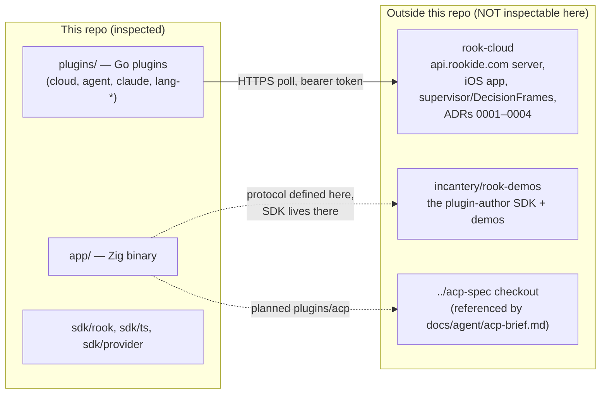

# 09 — Open questions

Questions the code cannot answer. Every investigator in this research package returned a list of
things where the repository provides insufficient evidence for a confident conclusion — intent
questions, cross-repo blind spots, half-states whose direction is unknowable from HEAD, and
"deliberate or oversight?" calls. This document deduplicates and groups them.

**Method and honesty notes:**

- Research baseline was `main @ 291f6d0` (2026-08-07). **HEAD moved during the research pass**:
  the gather/parse read-pipeline that was an uncommitted working-tree diff during investigation
  landed as `9ad05f3` ("session: the pty is drained while the parser parses", 08-07 21:49). The
  working tree is clean at the time of this writing. One aggregated question ("is main
  half-committed?") is therefore *resolved* and recorded as such below; its follow-on questions
  survive.
- Claims below marked **[re-verified]** were spot-checked against the repository during the
  writing of this document (at `9ad05f3`), not merely carried from the notes.
- Each entry states: what is unclear, why it matters, what was inspected, and the precise
  question for the author. Where the honest answer is "we could not check" (external repos,
  the author's intent, un-run experiments), that is stated rather than papered over.
- Cross-references like *(notes: terminal-mux)* point at the sibling research documents in this
  package.

**The external-repo blind spot**, which recurs throughout, in one picture:

Everything VISION.md claims about the "decision membrane" column, everything about push
notifications, Mongo TTLs, and fleet-page rendering, and the currency of the plugin-author SDK
lives on the right side of that diagram and could not be verified.

---

## 1. Source of truth, repo hygiene, and intent of the working tree

### 1.1 Which document is the canonical backlog — and why is it gitignored?

- **Unclear:** `TODO.md` is gitignored (`.gitignore:17` **[re-verified]**) yet is demonstrably the
  *live* roadmap — its top two items (vt pin bump; the IO read loop) both landed within hours of
  its 08-07 update, while tracked `NOTES.md` is a mostly-webview-era checked-items list and
  `NEXT.md` is a stripped product thesis. Meanwhile `STATUS.md`, described in project memory as
  authoritative, still headlines "as of **2026-07-31**, shipping **v0.40.0**" **[re-verified,
  STATUS.md:3]** while its body describes 08-06 features and tags reach v0.43.0.
- **Why it matters:** Second-stage analysis (and any collaborator or agent) needs to know which
  ledger to trust. The repo's own doctrine is "the repository is the source of truth," but the
  most current planning artifact is deliberately excluded from the repository.
- **Evidence inspected:** `.gitignore`, `TODO.md` content vs. commit stream (notes:
  history-trajectory §Era 5), `STATUS.md` header vs. `git describe`, `NOTES.md`, `NEXT.md`,
  `docs/OWED.md` paid/owed stamps.
- **Ask:** Is TODO.md intended as private scratch (and therefore *not* a commitment record),
  or is it the de-facto canonical backlog that happens to be untracked? Is STATUS.md's header
  just an unbumped date line, and when does it get its v0.43+grammars-are-back refresh? Should
  OWED.md §5 be stamped "paid" now that `grammar.zig` exists?

### 1.2 `app/zig-pkg/` — offline mirror, cache residue, or test fixture?

- **Unclear:** ~30 hash-named untracked package directories (two ghostty pins including the
  retired fork snapshot, libxev, vaxis, zigimg, aro, uucode, z2d, zf, translate_c) sit in the
  worktree. Nothing in `app/build.zig` or CI references the directory as a package path
  **[re-verified: `git ls-files app/zig-pkg` is empty]** — but it *is* cited as the .gitignore
  test fixture by `filelist.zig:157` and `app/e2e/main.zig:3154`.
- **Why it matters:** Minor on its own, but it determines whether the old fork snapshot
  (`ghostty-1.3.2-dev-5UdBC7K6…`) is deliberate rollback insurance for the security-motivated
  pin bump, or accidental cache residue — which matters for how reversible the 291f6d0 vt bump
  is considered to be.
- **Evidence inspected:** directory listing, `app/build.zig.zon` (hash selects the upstream pin),
  `app/.gitignore` (`zig-pkg/` ignored), the two fixture citations.
- **Ask:** Is `app/zig-pkg/` a copied global zig cache kept for offline builds, kept only as the
  filelist/e2e fixture, or both? Is the fork-era ghostty snapshot inside it deliberate rollback
  insurance?

### 1.3 Tracked and untracked debris — intentional keeps or oversights?

- **Unclear:** `spike/termdiff/node_modules` (10 tracked files including a >1MB bundled
  `@xterm/headless` **[re-verified via `git ls-files spike`]**) survived two strip passes with no
  consumer; ~65MB of untracked binaries sit at repo root and in `bin/` (`/cloud` 8.4MB,
  `/rookctl` 13MB pre-strip relic, `bin/rook`, `bin/rook-host`); the `make ghostty-lib` Makefile
  target references deleted `internal/host/ghostty_term.go`; `.golangci.yml` errcheck excludes
  name deleted packages; `.claude/skills/verify/SKILL.md` teaches the deleted three-binary
  daemon architecture.
- **Why it matters:** In a repo whose deletion discipline is otherwise forensic (deletion commits
  carry `go list -deps` proofs of deadness), these are either deliberate keeps with unstated
  reasons or the few hygiene misses — the distinction matters for whether a future "oracle
  revival" (xterm-headless as differential reference) is planned.
- **Evidence inspected:** `git ls-files spike`, root `ls`, Makefile:195–203, .golangci.yml vs
  go.mod, `.claude/skills/verify/SKILL.md`.
- **Ask:** Is `spike/termdiff/node_modules` an intentional keep for a future oracle revival or
  removable? Should `.claude/skills/verify` be retired or rewritten for the Zig-only app? Are
  the dead Makefile target and golangci excludes just cleanup items?

### 1.4 `test-config/main.go` and the builder-style SDK API

- **Resolved — this is no longer an open factual question.** The two investigators' readings are
  reconcilable and doc 08 §2 states the answer: `test-config/main.go` (gitignored scratch) uses
  `rook.New()`, `e.FontSize(34)`, `e.Run()`, an API surface that does **not** exist in the tree
  (`sdk/rook/rook.go`'s only entry point is `func Main(decls ...Node)`; `grep 'func New'` over
  `sdk/rook/*.go` returns nothing — the builder was replaced 08-03 by c8c0fe9). It nonetheless
  compiles (`go build ./...` exits 0) because `test-config/go.mod` requires the **published
  module `github.com/incantery/rook v0.40.0` with no `replace`** — it is pinned to an older
  tagged generation of the SDK, not to the working tree. Classification: **Obsolete/dead** local
  scratch tracking a retired API surface, not a second supported API. "Would not compile" was
  wrong about the mechanism; "second supported surface" was wrong about the intent.
- **What remains open is only the forward-looking half:** is the fluent/builder spelling gone for
  good, or is a second supported shape intended to return? The declaration-list redesign's own
  rationale (typed `Cmd` constants that make a dead command a compile error) argues against a
  fluent revival, but nothing states it.
- **Why it matters:** if the builder ever comes back, the SDK has two public shapes to keep in
  parity — and the parity machinery (Go/TS byte goldens, `presetparity`) is built around exactly
  one emitter shape.
- **Evidence inspected:** `test-config/main.go`, `test-config/go.mod`, `sdk/rook/rook.go`, commit
  c8c0fe9, `.gitignore:22`.
- **Ask:** Is the fluent/builder API retired permanently, and should `test-config/` be deleted so
  the first fixture a curious reader finds is not a dead API?

---

## 2. Build, CI, and release process

### 2.1 The gen-cmds drift guard: comment or automation?

- **Unclear:** `scripts/gen-cmds.sh` + Makefile:97 describe a "CI check"
  (`make gen-cmds && git diff --exit-code sdk/rook/cmds.go`), but ci.yml never runs it
  **[re-verified: no `gen-cmds` in ci.yml]** — and it has *actually drifted*: `editor.format`
  and `monitor.open` exist in `registry.zig` but not in the committed `cmds.go`
  **[re-verified by regenerating the id sets: exactly those two ids are missing; 29 registry
  ids vs 27 constants]**.
- **Why it matters:** The generated constants are the whole mechanism behind "a config naming a
  dead command fails to compile." The drift inverts the guarantee: an SDK config *cannot* name
  two live commands. The same pattern (guard-as-comment) covers the TS SDK tests, which run
  nowhere automatically and whose documented invocation fails under current Node.
- **Evidence inspected:** ci.yml (both jobs, all comments), Makefile:95–99, regeneration diff,
  `sdk/ts/rook.test.ts:7` invocation vs Node v24 behavior (notes: testing-quality §1.5).
- **Ask:** Is CI wiring for gen-cmds and the TS SDK tests deliberately omitted (single-committer
  trunk workflow), or just not done? Given real drift was found, do you want them gated? (Also:
  fix the two missing constants.)

### 2.2 Release hygiene: binary size claim, release cadence, mechanical e2e

- **Unclear:** (a) The "2.7MB binary" claim (STATUS.md, README) dates from the 07-31 strip and
  predates the tree-sitter runtime's return (08-06, ~872KB of vendored C) and a week of feature
  growth; no fresh ReleaseFast build was measured in this research pass. (b) Releases paused at
  v0.43.0 (08-04) while the 08-05→08-07 sprint ran on main — it is unknown whether the daily
  driver is the tag or main-from-source. (c) Nothing in the `release` Makefile target runs
  `make e2e`; 164/668 commits mention e2e (`git log --grep='e2e' -i --oneline | wc -l` at the
  package baseline `9ad05f3`) so it is clearly habitual, but no hook or target
  enforces it before a release.
- **Why it matters:** (a) is a public claim that may now be false; (b) determines how much of
  the recent sprint has real dogfood hours behind it; (c) is the difference between a habit and
  a process for a repo whose CI cannot run the e2e suite (no window server on runners).
- **Evidence inspected:** STATUS.md, Makefile release/release-stage targets, tag census,
  ci.yml comments ("e2e cannot run in CI"), commit-message grep for e2e.
- **Ask:** What is the binary size today? Does the daily driver run v0.43.0 or main? Should the
  release target run `make e2e` mechanically?

---

## 3. Terminal, multiplexer, and the read pipeline

### 3.1 The pipeline landed — RESOLVED status, with surviving follow-ons

- **Resolved:** The aggregated question "is main half-committed / does HEAD compile without the
  dirty pty.zig?" is moot: the two-stage gather/parse pipeline committed as `9ad05f3`
  **[re-verified: `git status` clean, commit message cites ghostty #13209's 6,337×1KiB read
  measurement]**. The moment-in-time compile failures the terminal-mux investigator observed were
  mid-edit artifacts, as suspected.
- **Still unclear:** (a) The geometry (4 slots × 64KiB ring, 1ms bridge poll, 3ms budget,
  16-spin) was ported with ghostty's measured constants — has the interleaved A/B that
  `app/PERF.md`'s own rules require run before scoreboard numbers move? (b) The pipeline doubles
  per-session threads (gather + parse) and adds 256KB of buffers per session; nothing pools
  across sessions. (c) The concurrency-densest code in the app (SPSC ring, GCD semaphores,
  self-pipe idle wake) landed **with two inline tests but no dedicated `build.zig` test root**.
  The "session.zig has zero tests" line from the notes snapshot is stale: `grep -c '^test '
  app/src/session.zig` = 2 at HEAD, at session.zig:959 ("the pipeline delivers every batch, in
  order, under backpressure") and :1010 ("a real shell's stream survives the pipeline end to
  end") — and they are the right two. But `grep -n addTest app/build.zig` shows no session.zig
  root among the 23, so those tests run only under the exe module root (build.zig:95), and the
  rest of the session's concurrency surface (the starvation-avoiding `snapshot_wanted` dance,
  the triple serial fallback at :584/:590/:598, the hangup escalation) rides e2e + bench.
- **Why it matters:** (b) interacts directly with the agent direction — `session.spawn`-driven
  pane fleets multiply threads and buffers linearly. (c) is the repo's known pattern of
  comment-only concurrency contracts (three hand-rolled sync vocabularies:
  os_unfair_lock wrapper, GCD semaphores, atomic flags) in the one place a race costs data.
- **Evidence inspected:** the full working-tree diff during investigation (notes: terminal-mux
  §4.4), 9ad05f3 at HEAD, app/build.zig test-root list, PERF.md rules.
- **Ask:** Will the ring/thread cost be pooled if pane counts grow? Does the pipeline get its
  own test root, or is e2e+bench the intended safety net? Has the A/B run, and is the geometry
  final?

### 3.2 Persistence, detach, and crash survival — permanently out of scope?

- **Unclear:** There is no session persistence, no detach/reattach, no layout save anywhere in
  app/src (searched); the last shell exiting calls `_exit(0)`; a hard crash can orphan
  SIGHUP-trapping jobs (the escalation ladder only runs on orderly teardown). STATUS.md lists
  "shells die with the app" as an *accepted* regression — but TODO.md names session restore via
  `vt.snapshot` as a roadmap item ("the top-reacted ask on cmux's own tracker"), and the
  phone/agent direction ("run everything from your phone", nothing happens while rook is
  closed) structurally wants *something* to survive the UI process.
- **Why it matters:** This is the single largest architectural fork ahead: the one-binary
  no-daemon thesis vs. tmux-grade survivability. Everything from pane-id stability (§11.2) to
  crash capture hangs off it.
- **Evidence inspected:** app/src grep for persist/restore/detach, macos.zig:5168–5171
  (`_exit(0)`), pty.zig ProcessGroups, STATUS.md accepted regressions, TODO.md items 3 and 7.
- **Ask:** Is tmux-style survive-the-UI permanently out of scope for the one-binary
  architecture, or does session-restore-via-vt.snapshot (and eventually rook-cloud) reintroduce
  a persistence layer? What is crash capture v1's shape and timing?

### 3.3 Smaller terminal-layer intents (grouped)

Each of these is a small, verified half-state whose *direction* only the author knows:

- **Blocking `searchAll` under the session mutex** **[re-verified: session.zig:363 comment names
  it "the BLOCKING spelling", :380 call site]** — the library offers the incremental tick/feed
  ghostty itself uses; the comment says revisit "the moment someone feels it on a big buffer."
  *Ask: scheduled migration, or wait-for-the-freeze?*
- **`color_scheme` effect hardcodes `.dark`** (session.zig Effects wiring) while a real theme
  engine exists. *Ask: will it track the theme engine, and is a light-theme rook a supported
  configuration at all?*
- **`progress_report` (OSC 9;4, ConEmu progress — what Claude Code emits) declared `null`**
  pending "somewhere to put it" (`.progress_report = null,` at session.zig:572, inside the
  `Effects` vtable initialised from ~:555). *Ask: timing and design of the
  status-row/claude-plugin slice?*
- **`paste.isSafe()` exists but nothing gates on it** (paste.zig:44–51 — "no confirmation modal
  — see PARITY.md §0"). PARITY.md is self-declared historical. *Ask: is the paste-confirm modal
  still planned, or dropped with the parity checklist?*
- **Kitty key-release events are structurally impossible** — the event monitor subscribes
  NSEventMaskKeyDown only; keyenc.zig's header states the gap "plainly rather than discovered
  later." *Ask: permanent documented gap, or will the monitor grow KeyUp when a TUI needs it?*

---

## 4. Rendering and performance

### 4.1 The 08-07 present_lag drift — the un-run discriminating experiment

- **Unclear:** The valid 08-07 on-glass quiet-key run measured 23.0ms p50 vs July's 15.5ms, and
  the entire +7.5ms sits in `present_lag` (13.8→21.6ms; key_commit actually improved). The run
  was confounded: a 60Hz external display attached, loaded machine. PERF.md itself prescribes
  the discriminating rerun (single display, idle) and flags the row unresolved; at HEAD it had
  not run. TODO.md carries it as "PERF WATCH".
- **Why it matters:** The outcome decides whether July's headline latency rows need re-earning —
  i.e., whether rook's core competitive claim (key→photon vs Ghostty/Zed) still holds, or a real
  compositing-path regression crept in during the feature sprint.
- **Evidence inspected:** app/PERF.md 08-07 rows and history discipline, commits
  337255d/19f2eef/7ee6a6b/91e397e (the occlusion/display-axis bench hardening), stats.zig
  present_lag semantics (compositor detector, ~12ms composited vs ~4ms direct).
- **Ask:** Has the single-display idle rerun happened, and what did it say?

### 4.2 Frame-clock intents (grouped)

- **CAMetalDisplayLink migration:** CVDisplayLink is deprecated; macos.zig:70–71 says "swap for
  CAMetalDisplayLink later." PERF.md names present-time targeting ("race the beam") as the lever
  for the remaining ~8ms windowed compositor tax. *Ask: is the migration planned before Apple
  removes the API, and is race-the-beam the intent behind it?*
- **The link never stops:** no `CVDisplayLinkStop` anywhere — an idle rook wakes a thread at
  panel rate (120Hz) forever, takes draw_lock, scans dirty flags, returns. "Idle = 0 frames" is
  true but is a frames metric, not a wakeups/CPU metric; no idle-cpu row exists in the
  scoreboard, and ghostty/zed both pause their clocks. *Ask: should the link pause when
  idle/occluded (power/thermals), especially now the 10Hz occlusion throttle proves macOS
  special-cases occluded windows?*
- **The 64Ki-cell frame cap** silently truncates later panes' rows (macos.zig:5361–5364 clamps
  against `cells_cap`; a 5K fullscreen small-font multi-pane layout can plausibly hit the 1MiB
  slot). No stat counts truncation. *Ask: intended hard bound, or should it track drawable
  size — and should a counter exist either way?*
- **Editor echo waits for the tick:** terminals get the reader-thread `drawNow` kick; editor
  keystrokes set `render_dirty` and wait for the next display-link tick (≤8.3ms at 120Hz, a full
  16.7ms on 60Hz glass). `drawNow` has exactly two callers. *Ask: deliberate
  encode-contention bound (the measured ctl-thread wedge), or just unbuilt?*
- **Wyhash64 cluster-cache keys** (render.zig:418–425) can collide and render a wrong glyph
  forever until an atlas reset; the collision-tolerance is implied by a comment about ownership,
  never documented as a trade. *Ask: accepted trade or oversight?*

---

## 5. Editor core

### 5.1 Cross-view cursor: clamp vs. anchor

- **Unclear:** When another view (or an agent) edits a shared document, marks and jumplists
  shift precisely through the watcher seam, but the *cursor* only clamps
  (`Editor.reconcile`, editor.zig:1846; the comment at :1839 calls making the cursor a real
  anchor "the follow-on").
- **Why it matters:** This is the exact "agent edits under you" scenario the product thesis
  centers on; clamp means your cursor teleports relative to content on every upstream edit.
- **Evidence inspected:** editor.zig:1834–1846, buffer.zig watcher seam, docs.zig registry.
- **Ask:** Is cursor-as-anchor planned, or is clamp considered good enough for the
  agent-edits-under-you case?

### 5.2 Dormant seams and absent persistence (grouped)

- **`setDecor`/`line_gutter` have zero callers** since the review-stack strip (the diff view
  was the producer; grep confirms only tree decor uses line_style — `Editor.setDecor` at
  editor.zig:4170 is referenced by nothing but the comment at editor.zig:80). TODO.md plans the
  review surface's third life. *Ask: does the diff document come back through plugins/host
  projection onto this seam, or should the seam be pruned until then?*
- **The same question, harder, in `macos.zig`.** Two more review-stack residues survive in the
  integrator file, and one of them does not even typecheck: `App.queueVerdictLocked`
  (macos.zig:4589–4602) is uncalled and reads six `App` fields that **do not exist** (`rev`,
  `rev_sel`, `rev_set`, `rev_set_len`, `rev_set_id`, `rev_wake`) — it compiles only because Zig
  skips semantic analysis of unreferenced private functions, so unlike `setDecor` this one
  cannot be revived by adding a caller; it would have to be rewritten against fields someone
  re-adds. Its body is the verdict interaction verbatim (stage a state on the selected finding,
  advance immediately, set a wake flag), which makes it the strongest in-code evidence that the
  deleted Zig review port had a verdict rail (doc 04 §5). `App.openTextPane` (macos.zig:4564) is
  a `pub` seam with no in-repo caller, in the same family. *Ask: are these kept deliberately as
  the seed of review-v3 — in which case the field names are a design record worth a comment
  saying so — or is this simply debris the compiler cannot see, and removable now?*
- **No undo persistence, no session/buffer-list persistence** — undo history and each pane's
  buffer list die with the process; the daily-driver `make install`+relaunch loop makes this a
  recurring real cost. Nothing in the repo suggests plans. *Ask: any intent (undofile-style or
  otherwise)?*
- **Regex dialect floor:** vim-magic subset, ASCII-only classes (`\w`), no `\v`, no lookaround
  beyond `\zs/\ze`. *Ask: deliberate floor or backlog?*
- **`rope.maybeRebuild` has no telemetry** (unlike `line_bytes_copied`, which exists precisely
  to make a claim countable). *Ask: has degenerate height ever been observed in real use, and
  should a counter exist?*
- **The 4MB ceilings** (max_line 4MB, syntax reparse cap 4MB, search 2MB/file): minified
  single-line bundles are effectively out of scope. *Ask: permanent scope decision, or does the
  planned rope read-callback for tree-sitter (TODO item 5) lift the syntax half?*
- **Vim-oracle automation:** the oracle is consulted at authoring time and frozen into ~306
  tests; `vim -Nu NONE` appears only in comments; TODO names "automated vim oracle in CI"
  zed-style. *Ask: was a shell-to-vim-at-test-time harness ever tried, and is the frozen-answer
  method considered sufficient until the CI golden-session item lands?*

---

## 6. LSP and language tooling

### 6.1 Incremental didChange — the stated reason the client exists, still unbuilt

- **Unclear:** lsp.zig's in-process rationale is that document sync is versioned and the editor
  owns the rope/edit stream; the didChange doc comment **[re-verified at lsp.zig:1086–1089]**
  says full-text-first "means the version counter and the ordering are proven before edit
  ranges are added on top." TODO.md lists incremental didChange + tree-sitter read-callback as
  item 5.
- **Why it matters:** A megabyte didChange per keystroke (debounced 150ms) is the current cost
  on large files; the whole "next to the rope" architecture is only cashed in once ranges land.
- **Ask:** Is versioned full-text now considered proven enough to build ranges on, and is the
  incremental slice sequenced before or after didChangeWatchedFiles (TODO item 4)?

### 6.2 The latent `noServer` self-recursion — known?

- **Unclear/bug:** `Editor.noServer` **[re-verified at editor.zig:2663–2667]**:
  `if (self.lsp_explain) |f| { f(...) } else self.noServer();` — infinite recursion/stack
  overflow whenever `lsp_explain` is null. Unreachable in the wired app (the hook is installed
  at editor creation), reachable from any bare Editor (unit test, future embedding) via
  gr/ga/K.
- **Why it matters:** One-line fix; the only obvious latent crash found in the whole pass.
- **Ask:** Known? (Presumably meant to be a `setStatus` fallback.)

### 6.3 Declared-capability half-states (grouped)

- **Semantic tokens:** capability declared in initialize (with the gopls-refuses-without-
  `requests` war story, lsp.zig:902–906 **[re-verified]**), legend parsed and stored — but no
  request kind exists and nothing outside lsp.zig reads the legend. *Ask: headed for a real pass
  over tree-sitter highlighting, or dead weight to remove?*
- **`languageId()`'s compiled-in extension table** (lsp.zig:174) is marked TEMPORARY "until the
  language catalog owns it" — the one acknowledged duplication with declared `ext` lists.
  *Ask: intended shape/timeline for moving it onto language declarations ("packages")?*
- **`settings` delivery:** declared language settings go out via didChangeConfiguration and
  answer `workspace/configuration`, but never ride `initializationOptions` in the initialize
  request. Equivalent for gopls/pyright; a server that only reads initializationOptions would
  miss them. *Ask: sufficient for the intended catalog, or should both be sent?*
- **executeCommand and WorkspaceEdit resource ops** are both refused-with-message
  (command-only code actions shown-and-refused; file create/rename/delete refuses the whole
  edit). gopls organize-imports variants and symbol-owns-file renames hit both. *Ask: which is
  closer to being implemented?*
- **Diagnostics repaint filter** (`Manager.changed`) dedupes by path per publish, not by
  content — a server that republishes identical diagnostics per keystroke (pylsp does) repaints
  every editor showing the path each frame. *Ask: measured non-issue?*

---

## 7. Plugins, providers, and SDKs

### 7.1 The provider fork in the road (OWED §1)

- **Unclear:** `sdk/provider` is a published, versioned module ("a published capability is a
  promise to plugin authors") with two maintained, tested providers — and zero callers since the
  Go core strip. The plugin protocol is a strict envelope superset (same v/id/op/deadlineMs
  frames plus pump, inbound verbs, grants). OWED.md §1 explicitly defers shim-vs-convert as "a
  decision, not a port." The orphaned ops `issues.list`/`pulls.status` have no home.
- **Why it matters:** This decides whether the provider wire survives (a first-party
  `rook-plugin-issues` wrapping sdk/provider clients) or the protocol retires — and every
  investigator independently flagged it, which suggests it is the most legible pending decision
  in the repo.
- **Evidence inspected:** sdk/provider/{provider,serve,client}.go, providers/*,
  boundary_test.go, grep for rook-provider in app/src (nothing), OWED.md §1, e502bd4's message.
- **Ask:** Shim or convert? And which surface gets the issue queue back?

### 7.2 The external plugin SDK (rook-demos) — currency unknown

- **Unclear:** The plugin protocol's SDK and demos live in `incantery/rook-demos` (stated at
  plugins.zig:4–6), not inspectable here. VOCABULARY.md says its Go SDK learned the inbound
  verbs on 07-31 — before session.send, clipboard.set, panes.activity, and INPUT_TEXT landed
  (08-03/04). Meanwhile the three in-repo first-party plugins each hand-roll a ~80-line `conn`
  that already drifts (agent's call returns only error; cloud's returns raw), and two package
  comments acknowledge the shared wire package as owed ("the third copy should be the one that
  writes it") — the third copy now exists and the package still doesn't.
- **Why it matters:** Protocol portability is the plugin story's core claim; a stale external
  SDK plus three drifting internal copies is where that claim erodes first.
- **Ask:** Is rook-demos current with the 08-04 verb set? Will first-party plugins adopt it (or
  a new `plugins/internal/wire`), and was the shared-package deferral deliberate?

### 7.3 Plugin lifecycle and operability gaps (grouped)

- **`bundleBin` hardcode:** sdk/rook emits
  `/Applications/rook.app/Contents/MacOS/rook-plugin-*` argv into graphs. A `make dev` or
  non-standard install gets "could not spawn." *Ask: is a bundle-relative or resolved argv
  planned?*
- **failed-stays-failed:** a plugin that fails once (including a transient spawn failure at
  login) stays failed until app relaunch — no restart verb, no apply-clears-failure (plugins.zig
  ensure(), grep found no clear path). For the eager cloud bridge this silences the fleet.
  *Ask: is a `ctl plugin-restart` / panel retry / apply-clears planned?*
- **One-call-in-flight + substring demux:** `call_mu` serializes; ids are echoed "because that
  is what will make this safe to widen later"; direction is decided by a substring scan for
  `"op"` — a reply whose result JSON contains a top-level-looking `"op"` key would be misrouted
  and the real reply lost. *Ask: when concurrency is widened, does the demux get replaced first?*
- **Plugin stderr → /dev/null** "until there is somewhere to put it" — the provider generation
  had tagged forwarding and lost it in the generation change. *Ask: where does plugin stderr
  land, and when?*
- **dlopen-with-pin as a general class:** grammar.zig implements exactly the native in-process
  plugin class OWED §5 says the vocabulary lacks. *Ask: does dlopen-with-pin generalize beyond
  grammars, or stay grammar-only?* — and note the premise needs auditing before it generalizes,
  because **only one of grammar.zig's two materialization paths is pinned**. The prebuilt-dylib
  `Source` path reuses `plugins.fetch`/`hashFile` and inherits the whole pin/TOFU regime; the
  build-from-repo path (`buildFromRepo`, grammar.zig:463–520) does `git clone --depth 1 <repo>`
  when no `rev` is given, then `cc -shared -fPIC -O2` (:506–508), with **no content
  verification of any kind** — and per the SDK's own note the `Grammars{"go","zig"}` convenience
  table is unpinned on purpose, making that the default ergonomic path. The ABI 13–15 gate
  (grammar.zig:74–75, :410–411) is a compatibility check, not a trust check. *Ask: should
  repo/rev grammars require a pin (or a build sandbox, or at minimum a recorded hash of what was
  compiled) before "dlopen-with-pin" becomes a class name the vocabulary uses? Doc 03 §8.7 sets
  out why this is the most privileged extension path in the system: its product runs in rook's
  address space with the ctl socket, the pty masters and every read secret, and no refusal
  surface.*
- **Grants visibility for humans:** the preview diff shows a changed plugin node as a generic
  one-key line (envapply.zig `describe` shows only the FIRST differing key), so a grants
  widening can hide behind another changed key; and the wanted-vs-granted gap is printed only by
  `ctl plugins`, never rendered in the panel. *Ask: is a dedicated grants-delta rendering at
  preview, and a panel surface for wanted-vs-granted, owed — given the apply diff is named as
  "where consent actually happens"?*
- **Undisclosed wire caps:** max_items=128, 6 fields, 6 actions, fixed Text truncation are
  enforced at intake and invisible to plugin authors (nothing in describe negotiates them; the
  1MiB frame cap loses oversize frames silently from the plugin's perspective). *Ask: do these
  become documented protocol, negotiated in describe, or stay implementation detail?*

---

## 8. Configuration and the environments IR

### 8.1 Is TOML feature-frozen?

- **Unclear:** Since 07-30, every new configurable subsystem (plugins, workspaces, grammars,
  languages) arrived as a graph node kind with *no TOML spelling*; TOML's surface is frozen at
  the pre-IR option set. Nothing states the freeze. Meanwhile VISION step 3 ("TOML → IR inside
  the app; one loader") is not done, and the cost is real: two hand-kept option decoders
  (`loadToml` switch vs `applyEnvOption` switch) have already produced a silent gap
  (editor-format-on-save, patched 08-06) — three same-class incidents in one week
  (plugins whole-file parse, WireNode.command typing, the option gap).
- **Why it matters:** TOML is "the no-SDK on-ramp, forever" per the loader; if it silently can't
  express half of rook, that promise misleads. The parity-test/generator question is the same
  question from the IPC angle.
- **Evidence inspected:** config.zig loadToml/applyEnvOption/loadKeybindsToml/loadKeybindsEnv,
  the comment at config.zig:877–882, docs/environments/VISION.md sequencing, the accretion
  pattern in git history.
- **Ask:** Is TOML feature-frozen until the one-loader slice, and is a parity test or generator
  for the two option key lists planned in the meantime?

### 8.2 IR v2 questions: host-scope nodes, TS SDK convergence, ownership doc

- **Unclear:** (a) `table:host` and `option scope=host` nodes are emitted (TS SDK), carried by
  the Zig WireNode, and consumed by nothing — the host they fed was deleted 07-31. (b) The TS
  SDK is a generation behind Go: fluent API, no typed command constants (raw strings — the exact
  failure the Go redesign was built to prevent), no language/grammar nodes, no first-party
  plugin bundles — and it is the copy *embedded in the binary* that every new TS user receives.
  (c) VISION.md requires an ownership design doc "BEFORE any reconciler code"; no such doc
  exists in docs/.
- **Why it matters:** (a) is dead weight or a rook-cloud reservation — IR v2 needs to know
  which. (b) makes TS config structurally second-class in a way nothing documents. (c) drift
  diff and the reconciler are gated behind a document that may or may not exist elsewhere.
- **Evidence inspected:** sdk/ts/rook.ts full read, config.zig WireNode, docs/ tree search for
  ownership/reconciler, IR.md kinds table (itself stale: missing language/grammar/grammar-path).
- **Ask:** Are host-scope nodes reserved (rook-cloud? providers?) or removable in IR v2? Will
  the TS SDK converge on the declaration-list design with a registry.zig→TS generator? Does the
  ownership doc exist outside this repo?

### 8.3 The mystery `rookconfig` binary and config.sample.toml

- **Unclear:** A 2.7MB compiled `rookconfig` sits in `~/.config/rook`
  **[re-verified: 0755, mtime Aug 6]** — but envapply only ever runs `go run .` (41ms) and never
  executes a prebuilt emitter, while PERF.md measured compiled-Go emit at 2.6ms, suggesting the
  compile-once idea exists. Separately, `docs/config.sample.toml` — "the complete, documented
  surface" and the first file a TOML user finds — documents host-era keys with no reader at
  HEAD for more than half its length (keybind trigger forms, `[lsp]`, `workspace-allow`,
  providers tables, theme names that don't exist).
- **Ask:** Is `rookconfig` an abandoned manual build or the intended future of apply not yet
  wired into envapply? Is config.sample.toml scheduled for a rewrite or deliberately left until
  the one-loader slice?

---

## 9. Agent architecture and Claude Code integration

### 9.1 Delivery targeting with concurrent panes in one cwd

- **Unclear:** `collect`/`runCompact` pick the **first** claude-like pane whose cwd matches the
  session (plugins/cloud/main.go:489–495 and the compact loop) — there is no per-session pane
  disambiguation. `Fuse`'s freshest-per-cwd rule protects *state attribution*, not *delivery
  targeting*. With two concurrent claude panes in one directory, a phone answer can plausibly
  be typed into the wrong session's pane (still gated to a claude TUI, but the wrong
  conversation).
- **Why it matters:** This is the one place the carefully-built ask rail (askID
  content-addressing, journal-before-ack, session.send gates) has a targeting hole; multi-agent-
  per-repo is exactly the workflow the product courts.
- **Evidence inspected:** both delivery loops in cloud/main.go, transcript.Fuse, session.send
  gates in macos.zig.
- **Ask:** Is first-match-in-cwd an accepted simplification, and is a pane↔session binding
  (e.g. via the transcript session id observed in the pane) planned?

### 9.2 The rook-cloud blind spot: membrane, verdicts, ADRs

- **Unclear (unverifiable here):** docs/agent/VISION.md's "decision membrane" column —
  supervisor, DecisionFrames, policy filters, Temporal, ADRs 0001–0004, autonomy rungs 4–5 —
  is claimed to live in rook-cloud, which is not checked out in this environment. Likewise the
  verdict ledger, called "the most valuable and most personal data rook will ever hold": nothing
  in this repo records draft edits or accepted digests today (panel draft edits go to `expand`
  and vanish; no ledger line is written anywhere).
- **Why it matters:** The autonomy thesis (agents earn autonomy via a verdict ledger) has no
  in-repo substrate; whether it exists at all currently depends entirely on the other repo.
- **Ask:** How much of the membrane column actually runs in rook-cloud today? Where will
  verdicts live, and when does the first ledger line get written?

### 9.3 Provider-neutrality vs. the ACP re-ordering

- **Unclear:** Everything agent-shaped is Claude-Code-shaped: transcript format, program-name
  gates (`fg == "claude"`), `/compact`, `--resume`, and `wireAgent.Model` hardcoded to
  `"claude"` **[re-verified at plugins/cloud/main.go:417]** even though the scanner extracts the
  real model id for CtxPct. docs/agent/acp-brief.md (08-07) designs a `plugins/acp`; TODO.md the
  same day re-orders the "agent race" to put per-prompt git checkpoints first and the review
  surface as the wedge — and notes a protocol gap ("attention.raise can't reference the
  answerable item").
- **Ask:** Is plugins/acp still the committed neutrality path given the re-ordering, and will
  the attention.raise item-reference gap be fixed before or with it? Is the Model hardcode an
  intentional floor or an oversight? (Related: what is `session.send`'s extension point when a
  second agent TUI arrives — the "claude"-by-name gate is a product policy compiled into a
  protocol boundary; see §11.3.)

### 9.4 The attention ring has no in-app renderer

- **Unclear:** `attention.raise` feeds a 16-entry ring, a macOS notification, and a dock bounce;
  the ring's only readers are `ctl attention` and the notification path — grep found no
  draw-path consumer. VISION.md's roadmap names "attention fusion" (the watcher's banner and
  the agent's digest are raised separately today).
- **Ask:** Is macOS-notification-only the deliberate endpoint, or a gap awaiting the fusion
  item / a future in-app inbox (the OWED-mourned "attention inbox")?

---

## 10. Cloud, remote, and multi-device

### 10.1 Push notifications: does the account blocker still stand?

- **Unclear (cross-repo evidence):** The entire "walk away with your phone" story bottoms out in
  a foreground-only 20s poll on both ends; the iOS app's own header (rook-cloud, inspected
  out-of-repo by the cloud investigator) says the wake-up that matters is a push notification
  "and that waits on the paid developer account." The digest payload is notification-ready per
  VISION.md.
- **Why it matters:** Identified by the cloud investigator as the single biggest product hole in
  the subsystem — every rail exists except the one that makes the phone buzz.
- **Ask:** Is APNs next, and does the paid-account blocker still stand?

### 10.2 Command rail durability and posture (grouped)

- **No expiry/TTL on commands:** the deleted edge protocol had signatures, fencing eras,
  expiry, and approval-digest binding; the replacement rail executes whatever the bridge next
  polls, however old (no TTL found on rook-cloud's Mongo arrays; ack failures ignored →
  redelivery absorbed by the journal). *Ask: was dropping expiry/approval-binding permanent
  posture ("bearer token + local gates + journal is enough") or slice-one simplification?*
- **`cloud_token` is world-readable** **[re-verified: 0644 vs openai_key's 0600]** — the bridge
  neither chmods nor warns. *Ask: intentional?*
- **Synced `~/.claude/projects` across machines:** transcript.Fuse explicitly anticipates
  foreign transcripts (they stay transcript-only), but two bridges over a synced dir would show
  duplicate sessions under two machine identities, and an answer routed to the wrong machine
  retries 5× then drops. *Ask: supported scenario or explicitly out of scope?*
- **Status snapshot lifecycle cloud-side:** last-write-wins ingest is verified; whether
  snapshots persist historically or only latest, and how the fleet page renders staleness after
  a machine goes dark, was not inspectable. *Ask: what does the fleet show for a dark machine?*
- **Bracketed-paste hygiene:** `sessionSend` frames delivered text in `ESC[200~…ESC[201~` with
  no control-byte filtering — text containing a literal `\x1b[201~` closes the paste early and
  the remainder lands as raw key input to the agent TUI (blast radius bounded by the fg gate,
  author is the account holder). *Ask: cheap defense-in-depth ESC strip worth adding?*

---

## 11. IPC, wire contracts, and API stability

### 11.1 Is the ctl text surface a frozen contract?

- **Unclear:** The ctl line protocol is unversioned by design ("the server answers or it
  doesn't"), yet two external consumer classes parse its output byte-by-byte: the e2e suite and
  the installed Claude skill (embedded in the binary, shipped by `rook install claude`). The
  `panes` verb comment shows the implicit rule (append new fields last), but nothing states it
  as policy; the man page is declared the authoritative verb list and is already missing
  `syntax`.
- **Why it matters:** These formats are a de-facto public API for agents; whether
  append-only-fields is official determines how safely they can evolve.
- **Ask:** Is append-only the official evolution rule for ctl output, and is the man page the
  contract of record (in which case `syntax` needs an entry)?

### 11.2 Pane ids as addresses across process lifetimes

- **Unclear:** Pane ids are process-lifetime, yet they are the addressing scheme for ctl
  (`@id`), `panes.activity`, and `session.send{pane}` — a plugin (and the cloud round trip)
  holds a raw internal id across time; a relaunch resets the namespace mid-delivery (cmdjournal
  makes delivery at-most-once, but the target namespace still resets). VOCABULARY.md frames
  caller-names-target-host-reverifies as deliberate.
- **Ask:** Is a relaunch-stable session identity planned (this interlocks with §3.2
  persistence), or is re-verification-per-delivery the permanent answer?

### 11.3 Hard-coded policy at protocol boundaries

- **Unclear:** `session.send`'s agent-detection is the string "claude" in the foreground
  name/path, compiled into macos.zig — a second agent TUI requires an app release, not config.
- **Ask:** What is the intended extension point — a config list like `nav-yield`, a
  plugin-declared allowlist, or ACP obviating the gate?

---

## 12. Testing and quality

### 12.1 The lost VT conformance oracle

- **Unclear:** The libghostty differential fuzzer (the only conformance oracle rook ever had for
  VT behavior) left with the Go core; only dangling Makefile/.golangci references remain.
  Upstream ghostty-vt's suite covers the engine, but rook's *integration* edges
  (reflow/scrollback/mode handling around the lib) have exactly 3 e2e scenarios.
- **Ask:** Is a replacement oracle planned (the tracked xterm-headless in spike/ hints at one
  once existing), or is upstream's suite + 3 scenarios the settled answer?

### 12.2 macos.zig: settled monolith or awaiting a seam?

- **Unclear:** 9.6k lines, one App struct, ~90+ fields, 133 commits, zero tests — churn and
  coverage are inversely correlated across the repo's two biggest files (editor.zig's monolith
  is defended by 306 tests; macos.zig's is not). Everything pure was consistently extracted;
  what remains is AppKit glue + drawing + ~10 detached-thread job patterns with comment-only
  ownership rules.
- **Why it matters:** Highest-leverage structural debt in the repo: every feature lands a few
  hundred more lines here, and failures attribute to it worst.
- **Ask:** Is the single-App-struct shape a settled decision like editor.zig's, or is there an
  intended seam (panels? draw fns? the job-spawn pattern?) for splitting?

### 12.3 Did a Python byte-parity probe ever exist?

- **Unclear:** Project memory says "TS/Py byte-parity probes"; `sdk/rook/example/main.py` and
  `bench.py` exist as July "parity probes kept as history," but no Python SDK or automated
  parity test was ever found in sdk/ or its git history.
- **Ask:** Was the Python probe ever a real automated check, or a plan only TS reached?

---

## 13. Security posture (intent questions)

The security notes classify most of these as *intentional trusted-local behavior*; the questions
are about whether the posture is permanent.

- **ctl socket peer auth:** any same-user process gets full terminal control (`type`+`enter` =
  arbitrary command execution; `shot` = screen exfil) — no `getpeereid`/`SO_PEERCRED`, no
  token. *Ask: same-user filesystem permission considered sufficient forever?*
- **Socket mode:** `serve()` never chmods **[re-verified: no chmod/fchmod in ctl.zig]**; the
  mode is whatever umask yields (observed 0755 — connect requires write, so other *users* are
  excluded, but a permissive umask isn't defended against). *Ask: fchmod 0600 before listen?*
- **Plugin env scrubbing:** plugin children inherit rook's full environment including
  `ROOK_SOCK` and any exported keys — a plugin can drive the ctl socket directly, sidestepping
  the grant model (the code says so out loud: grants gate the protocol, not the process).
  *Ask: filtered env (drop OPENAI_API_KEY/ROOK_CLOUD_TOKEN, scope ROOK_SOCK) planned, or is the
  non-sandbox nature the accepted contract?*
- **Secrets split-brain:** providers use the keychain / delegate to `gh`; plugins read plaintext
  `~/.config/rook/{openai_key,cloud_token}`. The keychain machinery existed and was kept only on
  the provider side. *Ask: intentional simplification or convergence owed?*
- **Config emitter execution:** `rook` runs `go run`/`npx tsx` from the config dir *before* the
  preview/apply gate — applying is consented, running the emitter is not. *Ask: any appetite to
  sandbox/confirm the emitter run for configs pulled from shared repos?*
- **Malicious-relay threat model:** a compromised rook-cloud cannot reach a shell (verified:
  wire data never reaches one) but *can* drive the local coding agent — spawn claude panes,
  feed arbitrary prompts, resume/compact — which for an agentic setup approaches RCE-adjacent
  capability. *Ask: is defending against a malicious (not just buggy) relay an explicit goal?*
- **First-fetch TOFU:** an unpinned plugin `source` trusts whatever the URL serves the first
  time on a fresh machine (the code admits it; pinning is optional). *Ask: acceptable default,
  or should source-without-sha256 warn/deny in a future posture?*
- **Synthetic input reaches the destructive confirm.** `press`/`key` are explicitly agent-facing
  verbs, and the monitor's reclaim — the only feature in rook that deletes user files — is
  confirmed by a keystroke in the pane (`Monitor.Act.reclaim` → `startReclaim`,
  macos.zig:6860). The actuator's own guards are strong and re-derive everything from the path
  rather than trusting staged state (doc 02 §7.1, doc 03 §8.1), so this is a *channel* question,
  not a bug: every other agent-reachable capability is either non-destructive or, like
  `ctl worktree remove`, gated by a rook-side refusal (unmerged commits) rather than by a
  human's presence. *Ask: should a confirmed reclaim require a channel synthetic input cannot
  drive — a distinct ctl verb with its own grant, or a physical-NSEvent requirement like the one
  `last_in_ms` already uses to distinguish "a human typed here" from "an agent typed here"?*

---

## 14. Priority shortlist

If the author answers only five questions, these have the highest downstream leverage for
second-stage analysis:

1. **Persistence/detach (§3.2)** — the largest unresolved architectural fork; pane-id
   stability, crash capture, and the phone story all hang off it.
2. **rook-cloud ground truth (§9.2, §10)** — how much of the membrane/verdict/push story exists
   at all; nothing in this repo can answer it.
3. **Provider fate (§7.1)** — the most legible deferred decision; determines the extension
   story's final shape.
4. **The present_lag rerun (§4.1)** — decides whether the competitive latency claims still
   hold at HEAD.
5. **CI wiring for the drifted guards (§2.1)** — a found-correctness-cost today, and a
   two-line fix either way.
